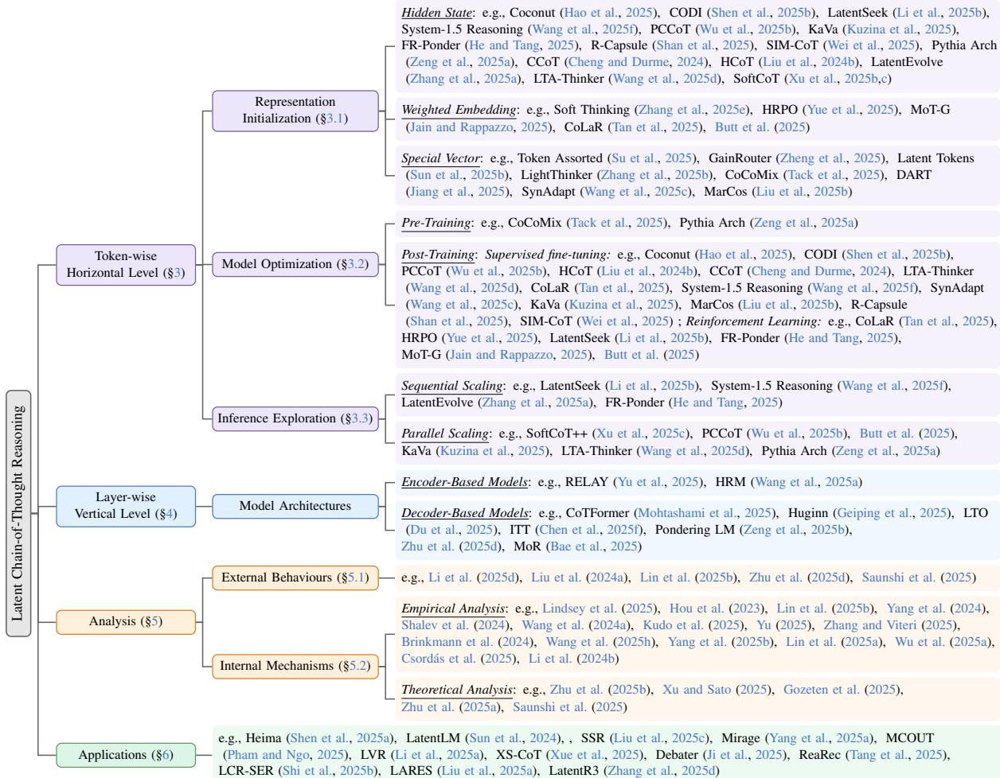
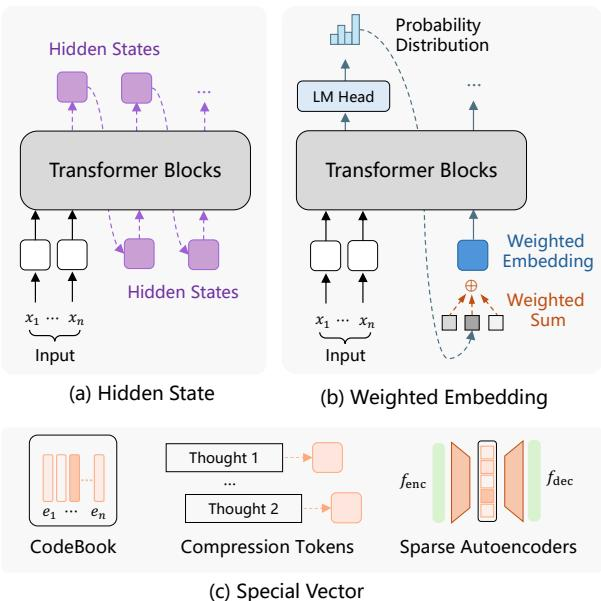
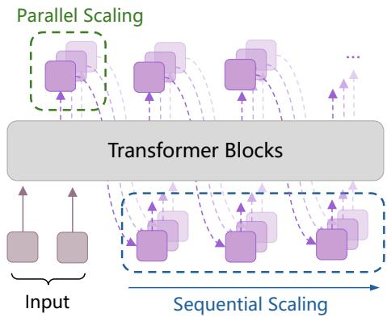
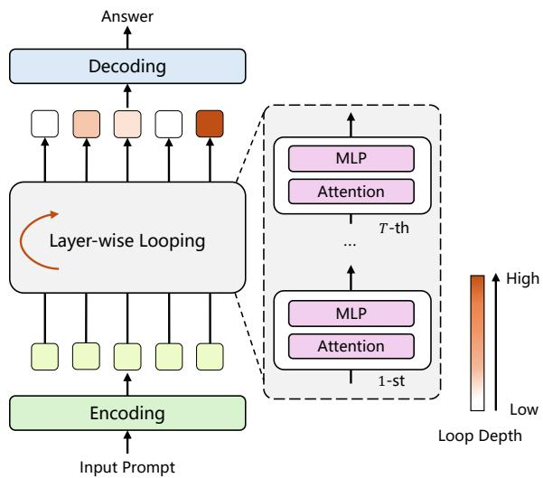

# Reasoning Beyond Language: A Comprehensive Survey on Latent Chain-of-Thought Reasoning

Xinghao Chen $^{1,2*}$ , Anhao Zhao $^{1,2*}$ , Heming Xia $^{1}$ , Xuan Lu $^{2}$ , Hanlin Wang $^{1}$ , Yanjun Chen $^{1,2}$ , Wei Zhang $^{2}$ , Jian Wang $^{1\dagger}$ , Wenjie Li $^{1}$ , Xiaoyu Shen $^{2\dagger}$ $^{1}$ Department of Computing, The Hong Kong Polytechnic University $^{2}$ Ningbo Digital Twin Institute, Eastern Institute of Technology, Ningbo, China

xing-hao.chen@connect.polyu.hk xyshen@eitech.edu.cn 

## Abstract

Large Language Models (LLMs) have shown impressive performance on complex tasks through Chain-of-Thought (CoT) reasoning. However, conventional CoT relies on explicitly verbalized intermediate steps, which constrains its broader applicability, particularly in abstract reasoning tasks beyond language. To address this, there has been growing research interest in latent CoT reasoning, where the reasoning process is embedded within latent spaces. By decoupling reasoning from explicit language generation, latent CoT offers the promise of richer cognitive representations and facilitates more flexible, faster inference. This paper aims to present a comprehensive overview of this emerging paradigm and establish a systematic taxonomy. We analyze recent advances in methods, categorizing them from token-wise horizontal approaches to layer-wise vertical strategies. We then provide in-depth discussions of these methods, highlighting their design principles, applications, and remaining challenges. We hope that our survey provides a structured foundation for advancing this promising direction in LLM reasoning. $^{1}$ 

## 1 Introduction

Whereof one cannot speak, thereof one must be silent. — Ludwig Wittgenstein 

The Chain-of-Thought (CoT) paradigm (Wei et al., 2022), which encourages large language models (LLMs) to articulate their reasoning step by step in natural language, has substantially advanced both interpretability and performance on many tasks (Guo et al., 2025; OpenAI, 2025; Qwen, 2025; Chen et al., 2025b). By verbalizing intermediate steps, CoT provides not only a transparent view of the model's decision process but also a mechanism for human intervention. 

However, the intrinsic constraints in natural language format limits LLM reasoning capabilities. The first is expressive redundancy. Many tokens in a reasoning chain are syntactically necessary but functionally non-essential to the reasoning process (e.g., “so,” “the”), which inflates token usage and slows inference without proportionate gains in reasoning quality (Feng et al., 2025; Sui et al., 2025; Chen et al., 2025d). This redundancy also increases the chance of overfitting to stylistic artifacts rather than genuine reasoning signals (Lippmann and Yang, 2025). The second is a semantic bottleneck. Human cognition often transcends discrete linguistic symbols, involving abstract, continuous, or multi-conceptual representations that resist precise verbalization (Wittgenstein, 1922). $^{2}$ Forcing continuous reasoning dynamics into a linear chain of fixed vocabulary inevitably leads to information loss (Hao et al., 2025). parallel (Butt et al., 2025). 

These intrinsic constraints have driven a growing shift toward latent Chain-of-Thought (latent CoT) reasoning, where models reason not through explicit language tokens but within continuous latent spaces (Zhang et al., 2025a). As illustrated in Figure 1, latent CoT replaces linguistic articulation with dense, high-dimensional representations that serve as a more native substrate for computational reasoning. This “de-linguistified” paradigm offers several advantages: it accelerates inference by reducing token-level computation (Liu et al., 2025b), allows for richer and more compact reasoning representations (Li et al., 2025b; Butt et al., 2025), and enables the parallel exploration of multiple reasoning trajectories (Butt et al., 2025). 

Figure 2: Taxonomy of latent Chain-of-Thought (CoT) reasoning.

Nonetheless, this emerging paradigm presents new challenges, primarily stemming from the unobservable nature of the reasoning process. This creates a significant training and alignment problem, making it difficult to apply direct supervision (Xu et al., 2025b; Ruan et al., 2025; Lindsey et al., 2025). Without proper supervision, latent trajectories may drift, fail to develop structured internal reasoning or ensure ethical controllability. Furthermore, the lack of transparency leads to an evaluation gap: it is unclear whether models are performing genuine reasoning or simply exploiting input–output correlations (Ameisen et al., 2025). 

To address these open questions, research on latent CoT has seen rapid and enthusiastic growth. Recent efforts can be broadly categorized into several directions: some works focus on novel architectural designs (Zhu et al., 2025c) and implicit reasoning (Li et al., 2025c), while others explore latent CoT as a vehicle for efficient or compressed reasoning (Sui et al., 2025; Feng et al., 2025). Given the field's accelerating pace and expanding scope, there is a growing need for a comprehensive and structured overview. This work provides the first in-depth survey of latent CoT, offering a unified taxonomy that organizes the current landscape in terms of methodological foundations, training paradigms, and cognitive implications. 

Our key contributions are threefold: (1) Systematic Taxonomy. We propose the first unified taxonomy that organizes latent CoT studies into two primary methodological categories (Figure 2), clarifying their assumptions, objectives, and innovations. (2) In-depth Discussion. Building on this taxonomy, we conduct a detailed analysis of representative works, comparing training strategies, architectural paradigms, supervision signals, and efficiency trade-offs to provide a consolidated view of the design space. (3) Challenge and Future Directions. We identify critical open problems in latent CoT—such as unsupervised training, evaluation faithfulness, and interpretability—and outline promising directions for future research. 

## 2 Preliminaries

Definitions We begin by formalizing the key concepts central to this survey. A Chain-of-Thought (CoT) is a sequence of intermediate reasoning steps, $c = (c_{1}, c_{2}, \ldots, c_{T})$ , that connects an input query x to its final answer y (Wei et al., 2022). This reasoning process can be instantiated in two primary forms, distinguished by the medium in which the “thoughts” unfold. The first is explicit CoT, where the reasoning is verbalized in natural language. Each step $c_{t}$ is materialized as a sequence of discrete tokens from a vocabulary V (i.e., $c_{t} \in V^{*}$ ). This approach renders the model’s thought process transparent and human-readable. In contrast, Latent CoT represents the reasoning trace in a non-verbal, high-dimensional latent space (Geiping et al., 2025). Here, each step $c_{t}$ corresponds to an compact computational structure, such as a dense vector or a transformation of the model’s hidden states. This approach offers a more compact and potentially more expressive medium for complex cognitive processes, moving beyond the constraints of discrete language (Hao et al., 2025). 

Overview This survey systematically organizes the field of latent CoT reasoning. Our taxonomy (Figure 2) is structured along two primary axes, inspired by the distinction between horizontal and vertical computation in Transformers (Deng et al., 2023). The first axis, the token-wise horizontal level ( $§3$ ), covers methods that generate a sequence of latent thoughts before producing the final answer. Our review of this area is structured around the key stages of representation initialization, optimization, and inference exploration. The second axis, the layer-wise vertical level ( $§4$ ), focuses on methods that deepen reasoning through iterative computation across layers for each token, which we categorize by model architecture. Beyond this methodological core, the survey covers key analyses ( $§5$ ), real-world applications ( $§6$ ), and concludes with challenges and future directions ( $§7$ ). 

## 3 Token-wise Horizontal Level

Methods at the token-wise horizontal level are characterized by the generation of intermediate latent thoughts along the sequence dimension to guide the reasoning process. This approach allows the model to “think ahead” by forming a coherent reasoning plan in a compact, latent format, rather than verbalizing every step. 

The intellectual roots of this paradigm can be traced to two complementary lines of pioneering research. One line explored giving models an explicit budget for extra computation by inserting designated “thinking” or “planning” tokens into the sequence (Goyal et al., 2024; Wang et al., 2024b; Herel and Mikolov, 2024). A parallel thread aimed to internalize this reasoning process, embedding the logic of an explicit CoT directly into the model’s latent representations without extending the visible token sequence (Deng et al., 2023, 2024; Xu et al., 2025a). $^{3}$ Both of these early threads converged on a key insight: the primary benefit stems from enabling a rich computational process within the model, independent of the explicit linguistic content generated at inference time. Following a common conceptualization of Transformer computation which distinguishes horizontal processing along the sequence from vertical processing across layers (Deng et al., 2023), we define methods that generate intermediate latent thoughts to guide the reasoning process before producing the tokens of the final answer as token-wise horizontal level, and we structure our discussion around three key stages: representation initialization, model optimization, and inference exploration. 

## 3.1 Representation Initialization

A crucial first step is determining how the latent thoughts are represented. This Representation Initialization is a foundational design choice, as it dictates the nature of the latent space and strongly influences the model's capacity to reason. As shown in Figure 3, we survey existing works by categorizing it into three main types based on the origin of the latent representation: model's internal hidden states, weighted embedding of existing vocabulary tokens, and newly introduced special vectors. 

Hidden State One of the most direct and efficient strategies for initialization is to derive latent thoughts from the model's hidden states. This approach leverages the rich, contextualized representations that already exist within the model, treating them as a native medium for thought. Current methods can be broadly divided based on whether the hidden states originate from the model itself or an auxiliary model. Within the self-contained approach, a prevalent technique is to establish a sequential state-passing mechanism. Works like Chain of Continuous Thought (Coconut), (Hao et al., 2025), Pythia Arch (Zeng et al., 2025a), KV-cache distillation (KaVa) (Kuzina et al., 2025) and System-1.5 Reasoning (Wang et al., 2025f) take the final hidden state from a given step and re-inject it as the input for the subsequent step, effectively replacing the standard token embedding (Wang et al., 2025g). To better align the output hidden state with the model's input space, some approaches like Continuous Chain-of-Thought via Self-Distillation (CODI) (Shen et al., 2025b), Parallel Continuous Chain-of-Thought (PCCoT) (Wu et al., 2025b) and Supervised IMplicit-CoT (SIM-CoT) (Wei et al., 2025) pass the previous hidden state through a projection network before the next step. Other variations involve using a special token as a trigger (Shan et al., 2025), extracting and refining a full sequence of hidden states (Li et al., 2025b), or applying additive updates to the hidden state (He and Tang, 2025). Alternatively, the auxiliary model approach delegates the generation of the latent thought to a separate model which then provides a guiding hidden state back to the main LLM (Liu et al., 2024b; Cheng and Durme, 2024; Xu et al., 

Figure 3: Illustration of three representative categories for latent representation initialization.

2025b,c; Zhang et al., 2025a; Wang et al., 2025d). 

Weighted Embedding This strategy operates directly in the model's input embedding space rather than its output hidden state space. By keeping the computation within the embedding space, it ensures that latent thoughts remain highly tied to the model's learned vocabulary (Zhang et al., 2025e; Zhuang et al., 2025; Yue et al., 2025; Butt et al., 2025; Jain and Rappazzo, 2025; Shi et al., 2025a; Deng et al., 2025). It creates a superposition of concepts calculated as a weighted average of existing vocabularies, which allows the model to capture uncertainty and nuance beyond a single output. 

Special Vector This type of method initializes latent thoughts using special vector parameters specifically for reasoning. One strategy is to augment the model with an internal, learnable scratchpad. This is implemented as a fixed sequence of placeholder tokens (Jiang et al., 2025; Wang et al., 2025c), a set of new “latent tokens” inserted directly into the input (Sun et al., 2025b), or a more complex learnable state that serves as the starting point for reasoning (Liu et al., 2025b; Zheng et al., 2025; Zhang et al., 2025b). A different strategy offloads this task to an auxiliary model, such as quantizing text into new latent tokens using a VQ-VAE (Su et al., 2025) or extracting concept vectors via a sparse autoencoder (Tack et al., 2025). 

## 3.2 Model Optimization

With latent representation initialized, we shift the focus to model optimization. Since methods vary primarily in computational phases, we organize them into three main paradigms: (1) Pre-Training methods that integrate latent reasoning into the model's pre-training stage, and (2) Post-Training techniques, which fine-tune base models via specialized datasets and objectives. 

## 3.2.1 Pre-Training

The central idea is to modify the standard language modeling objective so that the model must perform an intermediate reasoning computation, within latent space, before producing each token prediction. Recent studies demonstrate that this integration can be achieved along a spectrum of supervision. Pythia Arch (Zeng et al., 2025a) claims that models can learn latent reasoning implicitly, where the intermediate thoughts emerge naturally as a byproduct of optimizing next-token prediction. Continuous Concept Mixing (Cocomix) (Tack et al., 2025) explicitly guided reasoning process by incorporating auxiliary semantic signal. However, such approaches also introduce substantial computational overhead and make it difficult to disentangle whether observed improvements stem from genuine reasoning ability or from additional representational capacity. 

## 3.2.2 Post-Training

Within the dominant Post-Training paradigm, we further distinguish between methods based on Supervised Fine-Tuning (SFT) and those leveraging Reinforcement Learning (RL). SFT-based approaches train the model to produce latent thoughts by providing it with supervision signals. These methods can be categorized by whether the supervision on the latent process is indirect, focusing on the final outcome, or direct, targeting the latent representations themselves. 

Indirect Supervision in SFT. This class of methods optimizes latent reasoning by applying a loss function only to the human-readable output, without providing an direct target for the intermediate latent thoughts, claiming that by learning to predict the correct subsequent text, the model will implicitly form useful latent representations (Hao et al., 2025). A more sophisticated form of indirect guidance is provided through knowledge distillation to constrain certain explicit token's hidden representation and thus align the student model's behavior with that of a teacher model that performs explicit CoT (Shen et al., 2025b; Wu et al., 2025b). Wang et al. (2025d) introduce distributional constraints, using KL divergence to ensure latent thoughts remain semantically close to the question, contrastive learning to focus them on critical reasoning steps, or a VAE-like framework to regularize the latent process by matching a prior distribution to a posterior inferred from the ground-truth text (Liu et al., 2025b). 

Direct Supervision in SFT. In contrast, direct supervision methods provide an explicit “gold” target for the latent representations, typically derived from the content they are intended to replace. This offers greater control over the latent process and can improve training stability. One popular strategy is to train the latent thoughts to reconstruct their corresponding linguistic reasoning steps. This is often implemented via an auxiliary decoder that takes each latent vector as input and is trained with a standard cross-entropy loss to reproduce the original text of that reasoning step or a higher-level textual plan (Wei et al., 2025; He et al., 2025; Shan et al., 2025; He et al., 2025). Another methods use a contrastive loss to pull the representation of a special latent token closer to a pooled representation of the full text it represents (Liu et al., 2024b). More direct approaches use a Mean Squared Error loss to train a student model to generate latent vectors that numerically match the teacher's final hidden states at corresponding steps (Cheng and Durme, 2024; Wang et al., 2025f). The most granular form of this supervision involves providing a dense, stepwise signal by training the student's entire latent KV-cache to mimic a compressed version of the teacher's KV-cache (Kuzina et al., 2025) or supervising a latent head to predict the next compressed embedding in the reasoning chain (Tan et al., 2025). 

Figure 4: Illustration of inference exploration (both parallel and sequential scaling) for latent CoT reasoning.

Reinforcement Learning. RL provides an alternative to SFT that enables models to autonomously discover reasoning strategies. Instead of being guided by ground-truth CoTs, the model is trained to maximize a reward signal that is typically based on the final outcome. A common approach is to first initialize the model with SFT and then fine-tune it using policy gradient algorithms, such as REINFORCE or the more sample-efficient Group Relative Policy Optimization (GRPO) (Tan et al., 2025; Butt et al., 2025; Jain and Rappazzo, 2025; Butt et al., 2025). To ensure training stability, a KL divergence penalty is often used to keep the model from deviating excessively from a reference policy (Yue et al., 2025; Butt et al., 2025). This framework can be extended beyond simple accuracy rewards to incorporate other objectives like computational efficiency (He and Tang, 2025). 

## 3.3 Inference Exploration

Beyond model training, the full potential of latent reasoning models can be further unlocked during inference (Wang et al., 2025e). Following test-time scaling paradigms (Wang et al., 2025b; Zhang et al., 2025c), we divide inference exploration strategies into two types (as illustrated in Figure 4): (1) Sequential Scaling methods, which generate latent thoughts one after another to form a single reasoning chain. They focus on refining a single chain of latent thoughts. These techniques can improve reasoning quality by iteratively optimizing the latent trajectory at test-time (Li et al., 2025b; Zhang et al., 2025a; Ye et al., 2025) or enhance efficiency by adaptively allocating computational resources based on problem difficulty (Wang et al., 2025f; He and Tang, 2025). (2) Parallel Scaling methods, which explore multiple reasoning paths simultaneously to improve solution quality or efficiency (You et al., 2025). This approach boosts performance and robustness by exploring a diverse set of potential solutions, analogous to self-consistency in explicit reasoning (Xu et al., 2025c; Butt et al., 2025; Wu et al., 2025b). These strategies can also be designed to improve inference latency through concurrent processing of reasoning steps (Wang et al., 2025d; Zeng et al., 2025a). 

## 4 Layer-wise Vertical Level

Inspired by findings that human reasoning often involves recurrent neural activity before verbal expression (Goldman-Rakic, 1995), recent studies augment LLMs with looping units that iteratively refine hidden states through layer-wise vertical loops, allowing the model's internal state to consolidate a “thought” before producing the next token, as illustrated in Figure 5. This vertical, loop-driven mechanism is designed to emulate a human-like “think-then-speak” dynamic—preserving the latent-space style of reasoning while still maintaining concise internal traces of intermediate progress—thereby offering a middle ground between fully verbalized CoT and purely silent token-wise reasoning. We categorize existing methods according to the type of architecture: encoder-based versus decoder-based Transformers. 

Encoder-based Models This category refers to approaches that adopt an encoder-only looped Transformer as the core reasoning engine, where the encoder is repeatedly applied to iteratively refine the latent representation through vertical loop 

Figure 5: Illustration of layer-wise vertical-level latent CoT reasoning.

iterations. 

The Hierarchical Reasoning Model (HRM) (Wang et al., 2025a), for instance, employs a two-tier structure to enable coarse-to-fine reasoning across loops without generating explicit thought steps. REasoning through Loop Alignment iteratively (RELAY) (Yu et al., 2025) builds on an encoder-based looped Transformer with strong length generalization by aligning each loop iteration to a CoT step, enabling it to produce reliable long-horizon reasoning chains that are subsequently used to train auto-regressive models. 

Decoder-based Models In contrast to encoder-looped reasoning, these approaches employ a loop-driven decoder that repeatedly reApplies (part of) the decoder stack to refine the hidden state before emitting each output token. Existing methods can be broadly divided into two categories: (i) End-to-end adaptive-depth looping, where the looped decoder is trained end-to-end so that each token dynamically decides how many internal "thinking" steps to take. The central insight is that not all reasoning steps are equally difficult; thus, the model should be able to think longer for complex tokens and proceed quickly for simpler ones. This is achieved through various architectural designs, such as implementing recurrent structures within the decoder (Geiping et al., 2025), using lightweight routers to control recursion depth on a per-token basis (Chen et al., 2025f; Bae et al., 2025), or materializing each loop's output as a latent "thought token" to improve information flow (Mohtashami et al., 2025). (ii) Latent-semantic supervision inside the loop tackles the challenge that latent thinking remains opaque and usually unsupervised, lacking explicit signals to define what constitutes a "good" latent trajectory. To address this, Zeng et al. (2025b) use continuous, probability-weighted embeddings to create smoother intermediate targets. Du et al. (2025) employ a classifier to provide a direct "latent reward" that steers the reasoning trajectory. 

Overall, these approaches demonstrate that reasoning capacity can be strengthened not by enlarging the parameter set but by repeatedly applying the same set of parameters along the vertical axis of the network. By reframing depth as a flexible resource rather than a fixed architectural choice, this line of work establishes a principled "think-then-speak" paradigm that bridges the gap between fully verbalized and silent latent CoT reasoning. 

## 5 Analysis

A deeper understanding of latent CoT reasoning requires moving beyond method design to examine both how latent CoT models behave externally and how their internal computations give rise to reasoning. We organize existing analytical work into two complementary subsections: External Behaviors, which analyzes the output behavior and scaling patterns of models that employ latent CoT; and Internal Mechanisms, which explores how latent CoT arises within the model. 

## 5.1 External Behaviors

This subsection surveys studies that analyzed the external behaviors of latent CoT models—their observable task accuracy, scaling curves, and the form of reasoning traces—without delving into their hidden states. Zhu et al. (2025d), Li et al. (2025d) and Saunshi et al. (2025) showed that repeatedly applying the same set of transformer layers—effectively increasing the model’s computational depth—markedly improved multi-step reasoning, even when the total number of parameters, and thus the amount of stored knowledge, was kept nearly constant. This line of evidence highlighted that reasoning ability could be strengthened by deeper computation rather than by enlarging the model size, thereby providing empirical support for the approach discussed in §4. To investigate whether reasoning steps could be carried out internally rather than explicitly verbalized, Liu et al. (2024a) demonstrated that models could internalize redundant intermediate steps when producing 

CoT, and Lin et al. (2025b) found that shortcut-like implicit reasoning tended to emerge when models were trained on highly regular patterns. These findings suggested that latent CoT could unfold entirely within hidden representations without emitting a full sequence of reasoning tokens, providing empirical support for efforts toward internalized CoT (Deng et al., 2024). By examining such external behaviors, these analyses offered valuable insights that could inform the further development of latent-CoT approaches. 

## 5.2 Internal Mechanisms

Whereas external behaviors describe how latent CoT manifests at the output level, uncovering its internal mechanisms requires examining the model's representational dynamics and its theoretical reasoning capacity. We group existing analyses into two complementary strands: Theoretical Analysis, which compares the reasoning capacity of different latent CoT paradigms against explicit CoT; and Empirical Analysis, which probes hidden-state to study how latent CoT unfolds during inference. 

Theoretical Analysis Zhu et al. (2025b), Gozeten et al. (2025), and Zhu et al. (2025a) analyzed the paradigm introduced in Section 3 and showed that the Token-wise Horizontal Level approach can solve certain structured reasoning problems with significantly fewer steps than explicit CoT. Further, Xu and Sato (2025) and Saunshi et al. (2025) formally analyzed looped transformers ( $§4$ ), showing that the Layer-wise Vertical Level approach not only remains effective across a wide range of reasoning tasks but also supports a degree of parallel computation, making it more efficient than the inherently sequential nature of explicit CoT. These theoretical results provide strong evidence that latent CoT can be more computationally efficient and theoretically advantageous than the mainstream explicit CoT. 

Empirical Analysis This line of work primarily probes hidden states using the logit lens (nostalgebraist, 2020) to investigate whether models engage in latent CoT during inference. Several studies reported evidence that LLMs exhibit such internalized reasoning (Lindsey et al., 2025; Hou et al., 2023; Brinkmann et al., 2024; Yang et al., 2024; Li et al., 2024b; Shalev et al., 2024; Zhang and Viteri, 2025; Wang et al., 2025h; Yang et al., 2025b; Lin et al., 2025a). However, other work challenged this view: Wang et al. (2024a) argued that Transformers developed implicit reasoning only after extended "grokking"-style training far beyond standard overfitting; Kudo et al. (2025) found that models had not derived an answer upon first reading the problem but obtained (sub)answers progressively while generating the reasoning chain; and Yu (2025) showed that prompting alone did not elicit latent CoT, which only emerged after training. Further limits were identified by Lin et al. (2025b), who observed that latent-CoT behavior emerged only under fixed-pattern training data; Csordás et al. (2025), who found no systematic progression toward higher-level reasoning in deeper layers; Wu et al. (2025a), who showed that a single token path could not branch into multiple reasoning threads. Taken together, these studies reveal an ongoing debate: some analyses detect signs of latent CoT within hidden representations, whereas others suggest such reasoning is fragile, highly conditional, or absent in many practical settings. 

## 6 Applications

Latent CoT reasoning has been successfully applied in many domains. Below, we discuss several representative applications. 

Textual Reasoning. Latent CoT methods have been applied in various natural language-based textual reasoning tasks (refer to Appendix B). 

Multimodal Reasoning and Generation. Latent CoT has recently been extended to multimodal domains, where generating step-by-step explanations in natural language becomes both inefficient and semantically brittle. Recent visual approaches (Shen et al., 2025a; Liu et al., 2025c; Li et al., 2025a; Yang et al., 2025a; Pham and Ngo, 2025; Chen et al., 2025a; Sun et al., 2025a) embed intermediate reasoning within latent visual or spatial representations, enhancing depth perception and fine-grained understanding. Latent CoT has also been adapted to speech synthesis (Xue et al., 2025) and unified multimodal generation (Sun et al., 2024). As modalities proliferate, the ability to steer these latent spaces may become the key to controllable, efficient multimodal intelligence. 

Information Retrieval and Recommendation. Latent CoT reasoning has been applied to enhance information retrieval systems (Zhang et al., 2025d), where conventional single-pass encoding methods often fail to capture the complex semantics of documents or the evolving nature of user preferences. 

In dense retrieval, this involves creating richer document embeddings through a chain of deliberation (Ji et al., 2025). In recommendation systems, it allows for a deeper understanding of user interests by recurrently refining the user's interaction history in latent spaces (Tang et al., 2025; Liu et al., 2025a) or by reasoning over noisy cross-domain signals, such as search histories (Shi et al., 2025b). 

## 7 Challenges and Future Directions

In this section, we highlight key challenges of latent CoT reasoning and outline its future directions. 

Challenges (1) Training Instabilities. Current methods still underperform explicit CoT approaches, largely due to the instability of training. Developing effective latent training methods remains a key challenge. (2) Generalization Difficulties. Models trained with latent CoT techniques often struggle with novel problem structures or reasoning patterns not encountered during training (Lin et al., 2025c). This fragility underscores the considerable challenge that remains in developing truly generalizable reasoning capabilities within latent spaces. (3) Interpretability Concerns. Recent studies indicate that models often perform reasoning in their “heads” that is not reflected in their verbalized CoTs, raising concerns about unfaithful or hidden internal processes (Chen et al., 2025e; Lindsey et al., 2025). This shift to latent CoT introduces the challenge for understanding how models draw a particular conclusion. 

Future Directions (1) Alternative Architectures. Beyond conventional Transformer architectures, recurrent Transformer variants, such as looped Transformer (Saunshi et al., 2025), enable reasoning through parameter reuse across multiple steps. Recent work has successfully demonstrated the effectiveness of the integration of diffusion models and latent CoT (Ye et al., 2024; Huang et al., 2025; Kang et al., 2025). (2) Interpretability and Verification. Developing effective methods to probe, interpret, or verify latent representations is crucial for improving transparency and calibrating latent CoT reasoning behavior (Chen et al., 2025c). (3) Training Approaches. Reinforcement learning provides a viable solution for exploring the potential of LLMs to enhance latent CoT reasoning (Guo et al., 2025). Curriculum learning that adopts a simple-to-complex training process is also promising. (4) LLM Agents. These agents often generate lengthy and verbose reasoning sequences, introducing substantial computational overhead (Zhou et al., 2025; Li et al., 2024a; Zhang et al., 2024). With latent CoT reasoning, these agents are expected to perform more compact decision-making and faster planning. (5) Social Intelligence. Latent CoT provides a natural substrate for modeling nested mental states essential to Theory of Mind—the capacity to infer others' beliefs, desires, and intentions (Ma et al., 2023). Embedding latent belief modeling into reasoning pipelines could offer a scalable path toward socially competent AI. 

## 8 Conclusion

This paper presents a comprehensive survey of latent CoT reasoning in LLMs. Moving reasoning beyond surface-level language into the latent space enables more abstract, efficient, and scalable inference. We summarize the key methods, identify major challenges, and highlight promising future directions. The promise of latent CoT extends beyond optimizing inference; it points toward a future where models can reason in ways not strictly confined to language. We hope this survey lays a solid foundation and offers valuable insights to support further exploration in this emerging field. 

## Limitations

While this survey offers a comprehensive review of existing methodologies and analyses of latent Chain-of-Thought (CoT) reasoning with LLMs, a few limitations remain in the areas of interpretability, internal analysis, and alignment. Due to the breadth and rapid evolution of this emerging field, we may have inadvertently omitted other valuable contributions. We highlight several promising future directions, including alternative architectures, training paradigms, and LLM agents. Additionally, as many surveyed works rely on small-scale models or limited benchmarks, there is a need for more up-to-date and rigorous empirical validation. We advocate for continued, in-depth research to provide practitioners with actionable and robust insights into the design and deployment of latent reasoning models. 

## Ethics Statement

This survey is based entirely on publicly available research papers, models, and datasets. All referenced works are properly cited and used in accordance with their respective licenses and intended purposes. While latent reasoning introduces some intrinsic challenges, this survey aims to provide a neutral, structured overview of the field without promoting specific deployments. We emphasize the importance of future work addressing interpretability, safety, and transparency in latent reasoning. 

## References

Emmanuel Ameisen, Jack Lindsey, Adam Pearce, Wes Gurnee, Nicholas L. Turner, Brian Chen, Craig Citro, David Abrahams, Shan Carter, Basil Hosmer, Jonathan Marcus, Michael Sklar, Adly Templeton, Trenton Bricken, Callum McDougall, Hoagy Cunningham, Thomas Henighan, Adam Jermyn, Andy Jones, Andrew Persic, Zhenyi Qi, T. Ben Thompson, Sam Zimmerman, Kelley Rivoire, Thomas Conerly, Chris Olah, and Joshua Batson. 2025. Circuit tracing: Revealing computational graphs in language models. Transformer Circuits Thread. 

Sangmin Bae, Yujin Kim, Reza Bayat, Sungnyun Kim, Jiyoun Ha, Tal Schuster, Adam Fisch, Hrayr Harutyunyan, Ziwei Ji, Aaron Courville, and Se-Young Yun. 2025. Mixture-of-recursions: Learning dynamic recursive depths for adaptive token-level computation. Preprint, arXiv:2507.10524. 

Jannik Brinkmann, Abhay Sheshadri, Victor Levoso, Paul Swoboda, and Christian Bartelt. 2024. A mechanistic analysis of a transformer trained on a symbolic multi-step reasoning task. In Findings of the Association for Computational Linguistics: ACL 2024, pages 4082–4102, Bangkok, Thailand. Association for Computational Linguistics. 

Natasha Butt, Ariel Kwiatkowski, Ismail Labiad, Julia Kempe, and Yann Ollivier. 2025. Soft tokens, hard truths. Preprint, arXiv:2509.19170. 

Chao Chen, Zhixin Ma, Yongqi Li, Yupeng Hu, Yinwei Wei, Wenjie Li, and Liqiang Nie. 2025a. Reasoning in the dark: Interleaved vision-text reasoning in latent space. Preprint, arXiv:2510.12603. 

Qiguang Chen, Libo Qin, Jinhao Liu, Dengyun Peng, Jiannan Guan, Peng Wang, Mengkang Hu, Yuhang Zhou, Te Gao, and Wanxiang Che. 2025b. Towards reasoning era: A survey of long chain-of-thought for reasoning large language models. Preprint, arXiv:2503.09567. 

Runjin Chen, Zhenyu Zhang, Junyuan Hong, Souvik Kundu, and Zhangyang Wang. 2025c. Seal: Steerable reasoning calibration of large language models for free. Preprint, arXiv:2504.07986. 

Xinghao Chen, Zhijing Sun, Guo Wenjin, Miaoran Zhang, Yanjun Chen, Yirong Sun, Hui Su, Yijie Pan, Dietrich Klakow, Wenjie Li, and Xiaoyu Shen. 2025d. Unveiling the key factors for distilling chain-of-thought reasoning. In Findings of the Association for Computational Linguistics: ACL 2025, pages 

15094–15119, Vienna, Austria. Association for Computational Linguistics. 

Yanda Chen, Joe Benton, Ansh Radhakrishnan, Jonathan Uesato, Carson Denison, John Schulman, Arushi Somani, Peter Hase, Misha Wagner, Fabien Roger, Vlad Mikulik, Samuel R. Bowman, Jan Leike, Jared Kaplan, and Ethan Perez. 2025e. Reasoning models don't always say what they think. Preprint, arXiv:2505.05410. 

Yilong Chen, Junyuan Shang, Zhenyu Zhang, Yanxi Xie, Jiawei Sheng, Tingwen Liu, Shuohuan Wang, Yu Sun, Hua Wu, and Haifeng Wang. 2025f. Inner thinking transformer: Leveraging dynamic depth scaling to foster adaptive internal thinking. Preprint, arXiv:2502.13842. 

Jeffrey Cheng and Benjamin Van Durme. 2024. Compressed chain of thought: Efficient reasoning through dense representations. Preprint, arXiv:2412.13171. 

Karl Cobbe, Vineet Kosaraju, Mohammad Bavarian, Mark Chen, Heewoo Jun, Lukasz Kaiser, Matthias Plappert, Jerry Tworek, Jacob Hilton, Reiichiro Nakano, Christopher Hesse, and John Schulman. 2021. Training verifiers to solve math word problems. Preprint, arXiv:2110.14168. 

Róbert Csordás, Christopher D. Manning, and Christopher Potts. 2025. Do language models use their depth efficiently? Preprint, arXiv:2505.13898. 

Jingcheng Deng, Liang Pang, Zihao Wei, Shichen Xu, Zenghao Duan, Kun Xu, Yang Song, Huawei Shen, and Xueqi Cheng. 2025. Latent reasoning in llms as a vocabulary-space superposition. Preprint, arXiv:2510.15522. 

Yuntian Deng, Yejin Choi, and Stuart Shieber. 2024. From explicit cot to implicit cot: Learning to internalize cot step by step. Preprint, arXiv:2405.14838. 

Yuntian Deng, Kiran Prasad, Roland Fernandez, Paul Smolensky, Vishrav Chaudhary, and Stuart Shieber. 2023. Implicit chain of thought reasoning via knowledge distillation. Preprint, arXiv:2311.01460. 

Hanwen Du, Yuxin Dong, and Xia Ning. 2025. Latent thinking optimization: Your latent reasoning language model secretly encodes reward signals in its latent thoughts. Preprint, arXiv:2509.26314. 

Sicheng Feng, Gongfan Fang, Xinyin Ma, and Xinchao Wang. 2025. Efficient reasoning models: A survey. Preprint, arXiv:2504.10903. 

Jonas Geiping, Sean McLeish, Neel Jain, John Kirchenbauer, Siddharth Singh, Brian R. Bartoldson, Bhavya Kailkhura, Abhinav Bhatele, and Tom Goldstein. 2025. Scaling up test-time compute with latent reasoning: A recurrent depth approach. Preprint, arXiv:2502.05171. 

Mor Geva, Daniel Khashabi, Elad Segal, Tushar Khot, Dan Roth, and Jonathan Berant. 2021. Did aristotle use a laptop? a question answering benchmark with implicit reasoning strategies. Transactions of the Association for Computational Linguistics, 9:346–361. 

P.S Goldman-Rakic. 1995. Cellular basis of working memory. Neuron, 14(3):477–485. 

Sachin Goyal, Ziwei Ji, Ankit Singh Rawat, Aditya Krishna Menon, Sanjiv Kumar, and Vaishnavh Nagarajan. 2024. Think before you speak: Training language models with pause tokens. In The Twelfth International Conference on Learning Representations. 

Halil Alperen Gozeten, M. Emrullah Ildiz, Xuechen Zhang, Hrayr Harutyunyan, Ankit Singh Rawat, and Samet Oymak. 2025. Continuous chain of thought enables parallel exploration and reasoning. In ICML 2025 TokShop Workshop. Non-archival workshop paper. 

Daya Guo, Dejian Yang, Haowei Zhang, Junxiao Song, Ruoyu Zhang, Runxin Xu, Qihao Zhu, Shirong Ma, Peiyi Wang, Xiao Bi, et al. 2025. Deepseek-r1: Incentivizing reasoning capability in llms via reinforcement learning. Preprint, arXiv:2501.12948. 

Shibo Hao, Sainbayar Sukhbaatar, DiJia Su, Xian Li, Zhiting Hu, Jason E Weston, and Yuandong Tian. 2025. Training large language models to reason in a continuous latent space. In Second Conference on Language Modeling. 

Yinhan He, Wendy Zheng, Yaochen Zhu, Zaiyi Zheng, Lin Su, Sriram Vasudevan, Qi Guo, Liangjie Hong, and Jundong Li. 2025. Semcot: Accelerating chain-of-thought reasoning through semantically-aligned implicit tokens. Preprint, arXiv:2510.24940. 

Yixin He and Lumingyuan Tang. 2025. Learning to ponder: Adaptive reasoning in latent space. Preprint, arXiv:2509.24238. 

Dan Hendrycks, Collin Burns, Steven Basart, Andy Zou, Mantas Mazeika, Dawn Song, and Jacob Steinhardt. 2021a. Measuring massive multitask language understanding. In International Conference on Learning Representations. 

Dan Hendrycks, Collin Burns, Saurav Kadavath, Akul Arora, Steven Basart, Eric Tang, Dawn Song, and Jacob Steinhardt. 2021b. Measuring mathematical problem solving with the MATH dataset. In Thirty-fifth Conference on Neural Information Processing Systems Datasets and Benchmarks Track (Round 2). 

David Herel and Tomas Mikolov. 2024. Thinking tokens for language modeling. Preprint, arXiv:2405.08644. 

Yifan Hou, Jiaoda Li, Yu Fei, Alessandro Stolfo, Wangchunshu Zhou, Guangtao Zeng, Antoine Bosselut, and Mrinmaya Sachan. 2023. Towards a mechanistic interpretation of multi-step reasoning capabilities of language models. In Proceedings of the 2023 Conference on Empirical Methods in Natural Language Processing, pages 4902–4919, Singapore. Association for Computational Linguistics. 

Zemin Huang, Zhiyang Chen, Zijun Wang, Tiancheng Li, and Guo-Jun Qi. 2025. Reinforcing the diffusion chain of lateral thought with diffusion language models. Preprint, arXiv:2505.10446. 

Adit Jain and Brendan Rappazzo. 2025. Learning to reason with mixture of tokens. Preprint, arXiv:2509.21482. 

Naman Jain, King Han, Alex Gu, Wen-Ding Li, Fanjia Yan, Tianjun Zhang, Sida Wang, Armando Solar-Lezama, Koushik Sen, and Ion Stoica. 2025. Live-codebench: Holistic and contamination free evaluation of large language models for code. In The Thirteenth International Conference on Learning Representations. 

Yifan Ji, Zhipeng Xu, Zhenghao Liu, Yukun Yan, Shi Yu, Yishan Li, Zhiyuan Liu, Yu Gu, Ge Yu, and Maosong Sun. 2025. Learning more effective representations for dense retrieval through deliberate thinking before search. Preprint, arXiv:2502.12974. 

Nan Jiang, Ziming Wu, De-Chuan Zhan, Fuming Lai, and Shaobing Lian. 2025. Dart: Distilling autoregressive reasoning to silent thought. Preprint, arXiv:2506.11752. 

Carlos E Jimenez, John Yang, Alexander Wettig, Shunyu Yao, Kexin Pei, Ofir Press, and Karthik R Narasimhan. 2024. SWE-bench: Can language models resolve real-world github issues? In The Twelfth International Conference on Learning Representations. 

Mingyu Jin, Weidi Luo, Sitao Cheng, Xinyi Wang, Wenyue Hua, Ruixiang Tang, William Yang Wang, and Yongfeng Zhang. 2025. Disentangling memory and reasoning ability in large language models. Preprint, arXiv:2411.13504. 

Haoqiang Kang, Yizhe Zhang, Nikki Lijing Kuang, Nicklas Majamaki, Navdeep Jaitly, Yi-An Ma, and Lianhui Qin. 2025. Ladir: Latent diffusion enhances llms for text reasoning. Preprint, arXiv:2510.04573. 

Keito Kudo, Yoichi Aoki, Tatsuki Kuribayashi, Shusaku Sone, Masaya Taniguchi, Ana Brassard, Keisuke Sakaguchi, and Kentaro Inui. 2025. Think-to-talk or talk-to-think? when llms come up with an answer in multi-step arithmetic reasoning. Preprint, arXiv:2412.01113. 

Anna Kuzina, Maciej Pioro, Paul N. Whatmough, and Babak Ehteshami Bejnordi. 2025. Kava: Latent reasoning via compressed kv-cache distillation. Preprint, arXiv:2510.02312. 

Bangzheng Li, Ximeng Sun, Jiang Liu, Ze Wang, Jialian Wu, Xiaodong Yu, Hao Chen, Emad Barsoum, Muhao Chen, and Zicheng Liu. 2025a. Latent visual reasoning. Preprint, arXiv:2509.24251. 

Hengli Li, Chenxi Li, Tong Wu, Xuekai Zhu, Yuxuan Wang, Zhaoxin Yu, Eric Hanchen Jiang, SongChun Zhu, Zixia Jia, Ying Nian Wu, and Zilong Zheng. 2025b. Seek in the dark: Reasoning via test-time instance-level policy gradient in latent space. Preprint, arXiv:2505.13308. 

Jindong Li, Yali Fu, Li Fan, Jiahong Liu, Yao Shu, Chengwei Qin, Menglin Yang, Irwin King, and Rex Ying. 2025c. Implicit reasoning in large language models: A comprehensive survey. Preprint, arXiv:2509.02350. 

Yuanchun Li, Hao Wen, Weijun Wang, Xiangyu Li, Yizhen Yuan, Guohong Liu, Jiacheng Liu, Wenxing Xu, Xiang Wang, Yi Sun, Rui Kong, Yile Wang, Hanfei Geng, Jian Luan, Xuefeng Jin, Zilong Ye, Guanjing Xiong, Fan Zhang, Xiang Li, Mengwei Xu, Zhijun Li, Peng Li, Yang Liu, Ya-Qin Zhang, and Yunxin Liu. 2024a. Personal llm agents: Insights and survey about the capability, efficiency and security. Preprint, arXiv:2401.05459. 

Zhaoyi Li, Gangwei Jiang, Hong Xie, Linqi Song, Defu Lian, and Ying Wei. 2024b. Understanding and patching compositional reasoning in llms. Preprint, arXiv:2402.14328. 

Ziyue Li, Yang Li, and Tianyi Zhou. 2025d. Skip a layer or loop it? test-time depth adaptation of pretrained llms. Preprint, arXiv:2507.07996. 

Pengxiao Lin, Zheng-An Chen, and Zhi-Qin John Xu. 2025a. Identity bridge: Enabling implicit reasoning via shared latent memory. Preprint, arXiv:2509.24653. 

Tianhe Lin, Jian Xie, Siyu Yuan, and Deqing Yang. 2025b. Implicit reasoning in transformers is reasoning through shortcuts. In Findings of the Association for Computational Linguistics: ACL 2025. 

Tianhe Lin, Jian Xie, Siyu Yuan, and Deqing Yang. 2025c. Implicit reasoning in transformers is reasoning through shortcuts. Preprint, arXiv:2503.07604. 

Jack Lindsey, Wes Gurnee, Emmanuel Ameisen, Brian Chen, Adam Pearce, Nicholas L. Turner, Craig Citro, David Abrahams, Shan Carter, Basil Hosmer, Jonathan Marcus, Michael Sklar, Adly Templeton, Trenton Bricken, Callum McDougall, Hoagy Cunningham, Thomas Henighan, Adam Jermyn, Andy Jones, Andrew Persic, Zhenyi Qi, T. Ben Thompson, Sam Zimmerman, Kelley Rivoire, Thomas Conerly, Chris Olah, and Joshua Batson. 2025. On the biology of a large language model. Transformer Circuits Thread. 

Wang Ling, Dani Yogatama, Chris Dyer, and Phil Blunsom. 2017. Program induction by rationale generation: Learning to solve and explain algebraic 

word problems. In Proceedings of the 55th Annual Meeting of the Association for Computational Linguistics (Volume 1: Long Papers), pages 158–167, Vancouver, Canada. Association for Computational Linguistics. 

Philip Lippmann and Jie Yang. 2025. Style over substance: Distilled language models reason via stylistic replication. COLM. 

Enze Liu, Bowen Zheng, Xiaolei Wang, Wayne Xin Zhao, Jinpeng Wang, Sheng Chen, and Ji-Rong Wen. 2025a. Lares: Latent reasoning for sequential recommendation. Preprint, arXiv:2505.16865. 

Jiayu Liu, Zhenya Huang, Anya Sims, Enhong Chen, Yee Whye Teh, and Ning Miao. 2025b. Marcos: Deep thinking by markov chain of continuous thoughts. Preprint, arXiv:2509.25020. 

Tengxiao Liu, Qipeng Guo, Xiangkun Hu, Cheng Jiayang, Yue Zhang, Xipeng Qiu, and Zheng Zhang. 2024a. Can language models learn to skip steps? In The Thirty-eighth Annual Conference on Neural Information Processing Systems. 

Tianqiao Liu, Zui Chen, Zitao Liu, Mi Tian, and Weiqi Luo. 2024b. Expediting and elevating large language model reasoning via hidden chain-of-thought decoding. Preprint, arXiv:2409.08561. 

Yang Liu, Ming Ma, Xiaomin Yu, Pengxiang Ding, Han Zhao, Mingyang Sun, Siteng Huang, and Donglin Wang. 2025c. Ssr: Enhancing depth perception in vision-language models via rationale-guided spatial reasoning. Preprint, arXiv:2505.12448. 

Ziqiao Ma, Jacob Sansom, Run Peng, and Joyce Chai. 2023. Towards a holistic landscape of situated theory of mind in large language models. In Findings of the Association for Computational Linguistics: EMNLP 2023, pages 1011–1031, Singapore. Association for Computational Linguistics. 

MAA. 2024. American invitational mathematics examination - aime. Accessed in February 2024, from American Invitational Mathematics Examination - AIME 2024. 

Shen-yun Miao, Chao-Chun Liang, and Keh-Yih Su. 2020. A diverse corpus for evaluating and developing English math word problem solvers. In Proceedings of the 58th Annual Meeting of the Association for Computational Linguistics, pages 975–984, Online. Association for Computational Linguistics. 

Amirkeivan Mohtashami, Matteo Pagliardini, and Martin Jaggi. 2025. CoTFormer: A chain of thought driven architecture with budget-adaptive computation cost at inference. In The Thirteenth International Conference on Learning Representations. 

nostalgebraist. 2020. Interpreting gpt: The logit lens. 

OpenAI. 2025. Learning to reason with llms. https://openai.com/index/learning-to-reason-with-llms/. 

Arkil Patel, Satwik Bhattamishra, and Navin Goyal. 2021. Are NLP models really able to solve simple math word problems? In Proceedings of the 2021 Conference of the North American Chapter of the Association for Computational Linguistics: Human Language Technologies, pages 2080–2094, Online. Association for Computational Linguistics. 

Jacob Pfau, William Merrill, and Samuel R. Bowman. 2024. Let's think dot by dot: Hidden computation in transformer language models. In First Conference on Language Modeling. 

Tan-Hanh Pham and Chris Ngo. 2025. Multi-modal chain of continuous thought for latent-space reasoning in vision-language models. Preprint, arXiv:2508.12587. 

Steven Pinker. 1994. The Language Instinct: How the Mind Creates Language. Harper Collins, New York. 

Qwen. 2025. Qwen3: Think deeper, act faster. https://qwenlm.github.io/blog/qwen3/. 

David Rein, Betty Li Hou, Asa Cooper Stickland, Jackson Petty, Richard Yuanzhe Pang, Julien Dirani, Julian Michael, and Samuel R. Bowman. 2024. GPQA: A graduate-level google-proof q&a benchmark. In First Conference on Language Modeling. 

Yangjun Ruan, Neil Band, Chris J. Maddison, and Tatsunori Hashimoto. 2025. Reasoning to learn from latent thoughts. Preprint, arXiv:2503.18866. 

Abulhair Saparov and He He. 2023. Language models are greedy reasoners: A systematic formal analysis of chain-of-thought. In The Eleventh International Conference on Learning Representations. 

Nikunj Saunshi, Nishanth Dikkala, Zhiyuan Li, Sanjiv Kumar, and Sashank J. Reddi. 2025. Reasoning with latent thoughts: On the power of looped transformers. In Proceedings of the International Conference on Learning Representations (ICLR). ICLR 2025. 

Yuval Shalev, Amir Feder, and Ariel Goldstein. 2024. Distributional reasoning in llms: Parallel reasoning processes in multi-hop reasoning. Preprint, arXiv:2406.13858. 

Hongyu Shan, Mingyang Song, Chang Dai, Di Liang, and Han Chen. 2025. R-capsule: Compressing high-level plans for efficient large language model reasoning. Preprint, arXiv:2509.22131. 

Xuan Shen, Yizhou Wang, Xiangxi Shi, Yanzhi Wang, Pu Zhao, and Jiuxiang Gu. 2025a. Efficient reasoning with hidden thinking. Preprint, arXiv:2501.19201. 

Zhenyi Shen, Hanqi Yan, Linhai Zhang, Zhanghao Hu, Yali Du, and Yulan He. 2025b. Codi: Compressing chain-of-thought into continuous space via self-distillation. Preprint, arXiv:2502.21074. 

Dachuan Shi, Abedelkadir Asi, Keying Li, Xiangchi Yuan, Leyan Pan, Wenke Lee, and Wen Xiao. 2025a. Swireasoning: Switch-thinking in latent and explicit for pareto-superior reasoning llms. Preprint, arXiv:2510.05069. 

Teng Shi, Weicong Qin, Weijie Yu, Xiao Zhang, Ming He, Jianping Fan, and Jun Xu. 2025b. Bridging search and recommendation through latent cross reasoning. Preprint, arXiv:2508.04152. 

Zeru Shi, Yingjia Wan, Zhenting Wang, Qifan Wang, Fan Yang, Elisa Kreiss, and Ruixiang Tang. 2025c. Meaningless tokens, meaningful gains: How activation shifts enhance llm reasoning. Preprint, arXiv:2510.01032. 

DiJia Su, Hanlin Zhu, Yingchen Xu, Jiantao Jiao, Yuandong Tian, and Qinqing Zheng. 2025. Token assorted: Mixing latent and text tokens for improved language model reasoning. Preprint, arXiv:2502.03275. 

Yang Sui, Yu-Neng Chuang, Guanchu Wang, Jiamu Zhang, Tianyi Zhang, Jiayi Yuan, Hongyi Liu, Andrew Wen, Shaochen Zhong, Hanjie Chen, and Xia Hu. 2025. Stop overthinking: A survey on efficient reasoning for large language models. Preprint, arXiv:2503.16419. 

Guohao Sun, Hang Hua, Jian Wang, Jiebo Luo, Sohail Dianat, Majid Rabbani, Raghuveer Rao, and Zhiqiang Tao. 2025a. Latent chain-of-thought for visual reasoning. Preprint, arXiv:2510.23925. 

Yuchang Sun, Yanxi Chen, Yaliang Li, and Bolin Ding. 2025b. Enhancing latent computation in transformers with latent tokens. Preprint, arXiv:2505.12629. 

Yutao Sun, Hangbo Bao, Wenhui Wang, Zhiliang Peng, Li Dong, Shaohan Huang, Jianyong Wang, and Furu Wei. 2024. Multimodal latent language modeling with next-token diffusion. Preprint, arXiv:2412.08635. 

Mirac Suzgun, Nathan Scales, Nathanael Schärli, Sebastian Gehrmann, Yi Tay, Hyung Won Chung, Aakanksha Chowdhery, Quoc Le, Ed Chi, Denny Zhou, and Jason Wei. 2023. Challenging BIG-bench tasks and whether chain-of-thought can solve them. In Findings of the Association for Computational Linguistics: ACL 2023, pages 13003–13051, Toronto, Canada. Association for Computational Linguistics. 

Jihoon Tack, Jack Lanchantin, Jane Yu, Andrew Cohen, Ilia Kulikov, Janice Lan, Shibo Hao, Yuandong Tian, Jason Weston, and Xian Li. 2025. Llm pretraining with continuous concepts. Preprint, arXiv:2502.08524. 

Alon Talmor, Jonathan Herzig, Nicholas Lourie, and Jonathan Berant. 2019. CommonsenseQA: A question answering challenge targeting commonsense knowledge. In Proceedings of the 2019 Conference of the North American Chapter of the Association 

for Computational Linguistics: Human Language Technologies, Volume 1 (Long and Short Papers), pages 4149–4158, Minneapolis, Minnesota. Association for Computational Linguistics. 

Wenhui Tan, Jiaze Li, Jianzhong Ju, Zhenbo Luo, Jian Luan, and Ruihua Song. 2025. Think silently, think fast: Dynamic latent compression of llm reasoning chains. Preprint, arXiv:2505.16552. 

Jiakai Tang, Sunhao Dai, Teng Shi, Jun Xu, Xu Chen, Wen Chen, Wu Jian, and Yuning Jiang. 2025. Think before recommend: Unleashing the latent reasoning power for sequential recommendation. Preprint, arXiv:2503.22675. 

Boshi Wang, Xiang Yue, Yu Su, and Huan Sun. 2024a. Grokked transformers are implicit reasoners: A mechanistic journey to the edge of generalization. In Advances in Neural Information Processing Systems. 

Guan Wang, Jin Li, Yuhao Sun, Xing Chen, Changling Liu, Yue Wu, Meng Lu, Sen Song, and Yasin Abbasi Yadkori. 2025a. Hierarchical reasoning model. Preprint, arXiv:2506.21734. 

Jian Wang, Boyan Zhu, Chak Tou Leong, Yongqi Li, and Wenjie Li. 2025b. Scaling over scaling: Exploring test-time scaling plateau in large reasoning models. Preprint, arXiv:2505.20522. 

Jianwei Wang, Ziming Wu, Fuming Lai, Shaobing Lian, and Ziqian Zeng. 2025c. Synadapt: Learning adaptive reasoning in large language models via synthetic continuous chain-of-thought. Preprint, arXiv:2508.00574. 

Jiaqi Wang, Binquan Ji, Haibo Luo, Yiyang Qi, Ruiting Li, Huiyan Wang, Yuantao Han, Cangyi Yang, jiaxu Zhang, and Feiliang Ren. 2025d. Lta-thinker: Latent thought-augmented training framework for large language models on complex reasoning. Preprint, arXiv:2509.12875. 

Minghan Wang, Thuy-Trang Vu, Ehsan Shareghi, and Gholamreza Haffari. 2025e. Towards inference-time scaling for continuous space reasoning. Preprint, arXiv:2510.12167. 

Xiaoqiang Wang, Suyuchen Wang, Yun Zhu, and Bang Liu. 2025f. System-1.5 reasoning: Traversal in language and latent spaces with dynamic shortcuts. Preprint, arXiv:2505.18962. 

Xinyi Wang, Lucas Caccia, Oleksiy Ostapenko, Xingdi Yuan, William Yang Wang, and Alessandro Sordoni. 2024b. Guiding language model reasoning with planning tokens. In First Conference on Language Modeling. 

Xinyuan Wang, Dongjie Wang, Wangyang Ying, Haoyue Bai, Nanxu Gong, Sixun Dong, Kunpeng Liu, and Yanjie Fu. 2025g. Efficient post-training refinement of latent reasoning in large language models. Preprint, arXiv:2506.08552. 

Yiming Wang, Pei Zhang, Baosong Yang, Derek F. Wong, and Rui Wang. 2025h. Latent space chain-of-embedding enables output-free llm self-evaluation. In The Thirteenth International Conference on Learning Representations. 

Jason Wei, Xuezhi Wang, Dale Schuurmans, Maarten Bosma, Fei Xia, Ed Chi, Quoc V Le, Denny Zhou, et al. 2022. Chain-of-thought prompting elicits reasoning in large language models. Advances in neural information processing systems, 35:24824–24837. 

Xilin Wei, Xiaoran Liu, Yuhang Zang, Xiaoyi Dong, Yuhang Cao, Jiaqi Wang, Xipeng Qiu, and Dahua Lin. 2025. Sim-cot: Supervised implicit chain-of-thought. Preprint, arXiv:2509.20317. 

Ludwig Wittgenstein. 1922. Tractatus Logico-Philosophicus. Annalen der Naturphilosophie. 

Chünhung Wu, Jinliang Lu, Zixuan Ren, Gangqiang Hu, Zhi Wu, Dai Dai, and Hua Wu. 2025a. Llms are single-threaded reasoners: Demystifying the working mechanism of soft thinking. Preprint, arXiv:2508.03440. 

Haoyi Wu, Zhihao Teng, and Kewei Tu. 2025b. Parallel continuous chain-of-thought with jacobi iteration. Preprint, arXiv:2506.18582. 

Jingxian Xu, Mengyu Zhou, Weichang Liu, Hanbing Liu, Shi Han, and Dongmei Zhang. 2025a. Twt: Thinking without tokens by habitual reasoning distillation with multi-teachers' guidance. Preprint, arXiv:2503.24198. 

Kevin Xu and Issei Sato. 2025. A formal comparison between chain-of-thought and latent thought. Preprint, arXiv:2509.25239. 

Yige Xu, Xu Guo, Zhiwei Zeng, and Chunyan Miao. 2025b. SoftCoT: Soft chain-of-thought for efficient reasoning with LLMs. In Proceedings of the 63rd Annual Meeting of the Association for Computational Linguistics (Volume 1: Long Papers), pages 23336–23351, Vienna, Austria. Association for Computational Linguistics. 

Yige Xu, Xu Guo, Zhiwei Zeng, and Chunyan Miao. 2025c. Softcot++: Test-time scaling with soft chain-of-thought reasoning. Preprint, arXiv:2505.11484. 

Hongfei Xue, Yufeng Tang, Hexin Liu, Jun Zhang, Xuelong Geng, and Lei Xie. 2025. Enhancing non-core language instruction-following in speech llms via semi-implicit cross-lingual cot reasoning. Preprint, arXiv:2504.20835. 

Sohee Yang, Elena Gribovskaya, Nora Kassner, Mor Geva, and Sebastian Riedel. 2024. Do large language models latently perform multi-hop reasoning? In Proceedings of the 62nd Annual Meeting of the Association for Computational Linguistics (Volume 1: Long Papers), pages 10210–10229, Bangkok, Thailand. Association for Computational Linguistics. 

Zeyuan Yang, Xueyang Yu, Delin Chen, Maohao Shen, and Chuang Gan. 2025a. Machine mental imagery: Empower multimodal reasoning with latent visual tokens. Preprint, arXiv:2506.17218. 

Zhilin Yang, Peng Qi, Saizheng Zhang, Yoshua Bengio, William Cohen, Ruslan Salakhutdinov, and Christopher D. Manning. 2018. HotpotQA: A dataset for diverse, explainable multi-hop question answering. In Proceedings of the 2018 Conference on Empirical Methods in Natural Language Processing, pages 2369–2380, Brussels, Belgium. Association for Computational Linguistics. 

Zhipeng Yang, Junzhuo Li, Siyu Xia, and Xuming Hu. 2025b. Internal chain-of-thought: Empirical evidence for layer-wise subtask scheduling in llms. In Proceedings of the 2025 Conference on Empirical Methods in Natural Language Processing (EMNLP 2025). 

Jiacheng Ye, Shansan Gong, Liheng Chen, Lin Zheng, Jiahui Gao, Han Shi, Chuan Wu, Xin Jiang, Zhenguo Li, Wei Bi, and Lingpeng Kong. 2024. Diffusion of thoughts: Chain-of-thought reasoning in diffusion language models. In Advances in Neural Information Processing Systems. 

Wengao Ye, Yan Liang, and Lianlei Shan. 2025. Thinking on the fly: Test-time reasoning enhancement via latent thought policy optimization. Preprint, arXiv:2510.04182. 

Runyang You, Yongqi Li, Meng Liu, Wenjie Wang, Liqiang Nie, and Wenjie Li. 2025. Parallel test-time scaling for latent reasoning models. Preprint, arXiv:2510.07745. 

Ping Yu, Jing Xu, Jason Weston, and Ilia Kulikov. 2024. Distilling system 2 into system 1. Preprint, arXiv:2407.06023. 

Qifan Yu, Zhenyu He, Sijie Li, Xun Zhou, Jun Zhang, Jingjing Xu, and Di He. 2025. Enhancing autoregressive chain-of-thought through loop-aligned reasoning. Preprint, arXiv:2502.08482. 

Yijiong Yu. 2025. Do llms really think step-by-step in implicit reasoning? Preprint, arXiv:2411.15862. 

Zhenrui Yue, Bowen Jin, Huimin Zeng, Honglei Zhuang, Zhen Qin, Jinsung Yoon, Lanyu Shang, Jiawei Han, and Dong Wang. 2025. Hybrid latent reasoning via reinforcement learning. Preprint, arXiv:2505.18454. 

Boyi Zeng, He Li, Shixiang Song, Yixuan Wang, Ziwei He, Xinbing Wang, and Zhouhan Lin. 2025a. Pretraining llm with latent thoughts in continuous space. Preprint, arXiv:2509.23184. 

Boyi Zeng, Shixiang Song, Siyuan Huang, Yixuan Wang, He Li, Ziwei He, Xinbing Wang, Zhiyu Li, and Zhouhan Lin. 2025b. Pretraining language models to ponder in continuous space. Preprint, arXiv:2505.20674. 

Guibin Zhang, Fanci Meng, Guancheng Wan, Zherui Li, Kun Wang, Zhenfei Yin, Lei Bai, and Shuicheng Yan. 2025a. Latentevolve: Self-evolving test-time scaling in latent space. Preprint, arXiv:2509.24771. 

Jason Zhang and Scott Viteri. 2025. Uncovering latent chain of thought vectors in large language models. In ICLR 2025 Workshop on Weight Space Learning. Poster. 

Jintian Zhang, Yuqi Zhu, Mengshu Sun, Yujie Luo, Shuofei Qiao, Lun Du, Da Zheng, Huajun Chen, and Ningyu Zhang. 2025b. Lightthinker: Thinking step-by-step compression. Preprint, arXiv:2502.15589. 

Qiyuan Zhang, Fuyuan Lyu, Zexu Sun, Lei Wang, Weixu Zhang, Wenyue Hua, Haolun Wu, Zhihan Guo, Yufei Wang, Niklas Muennighoff, Irwin King, Xue Liu, and Chen Ma. 2025c. A survey on test-time scaling in large language models: What, how, where, and how well? Preprint, arXiv:2503.24235. 

Yang Zhang, Wenxin Xu, Xiaoyan Zhao, Wenjie Wang, Fuli Feng, Xiangnan He, and Tat-Seng Chua. 2025d. Reinforced latent reasoning for llm-based recommendation. Preprint, arXiv:2505.19092. 

Yang Zhang, Shixin Yang, Chenjia Bai, Fei Wu, Xiu Li, Zhen Wang, and Xuelong Li. 2024. Towards efficient llm grounding for embodied multi-agent collaboration. Preprint, arXiv:2405.14314. 

Zhen Zhang, Xuehai He, Weixiang Yan, Ao Shen, Chenyang Zhao, Shuohang Wang, Yelong Shen, and Xin Eric Wang. 2025e. Soft thinking: Unlocking the reasoning potential of llms in continuous concept space. Preprint, arXiv:2505.15778. 

Haoyu Zheng, Zhuonan Wang, Yuqian Yuan, Tianwei Lin, Wenqiao Zhang, Zheqi Lv, Juncheng Li, Siliang Tang, Yueting Zhuang, and Hongyang He. 2025. Fast thinking for large language models. Preprint, arXiv:2509.23633. 

Xueyang Zhou, Guiyao Tie, Guowen Zhang, Weidong Wang, Zhigang Zuo, Di Wu, Duanfeng Chu, Pan Zhou, Lichao Sun, and Neil Zhenqiang Gong. 2025. Large reasoning models in agent scenarios: Exploring the necessity of reasoning capabilities. Preprint, arXiv:2503.11074. 

Hanlin Zhu, Shibo Hao, Zhiting Hu, Jiantao Jiao, Stuart Russell, and Yuandong Tian. 2025a. Emergence of superposition: Unveiling the training dynamics of chain of continuous thought. Preprint, arXiv:2509.23365. 

Hanlin Zhu, Shibo Hao, Zhiting Hu, Jiantao Jiao, Stuart Russell, and Yuandong Tian. 2025b. Reasoning by superposition: A theoretical perspective on chain of continuous thought. Preprint, arXiv:2505.12514. 

Rui-Jie Zhu, Tianhao Peng, Tianhao Cheng, Xingwei Qu, Jinfa Huang, Dawei Zhu, Hao Wang, Kaiwen Xue, Xuanliang Zhang, Yong Shan, Tianle Cai, Taylor Kergan, Assel Kembay, Andrew Smith, Chenghua 

Lin, Binh Nguyen, Yuqi Pan, Yuhong Chou, Zefan Cai, Zhenhe Wu, Yongchi Zhao, Tianyu Liu, Jian Yang, Wangchunshu Zhou, Chujie Zheng, Chongxuan Li, Yuyin Zhou, Zhoujun Li, Zhaoxiang Zhang, Jiaheng Liu, Ge Zhang, Wenhao Huang, and Jason Eshraghian. 2025c. A survey on latent reasoning. Preprint, arXiv:2507.06203. 

Ruike Zhu, Hanwen Zhang, Kevin Li, Tianyu Shi, Yiqun Duan, Chi Wang, Tianyi Zhou, Arindam Banerjee, and Zengyi Qin. 2025d. The 4th dimension for scaling model size. Preprint, arXiv:2506.18233. 

Yufan Zhuang, Liyuan Liu, Chandan Singh, Jingbo Shang, and Jianfeng Gao. 2025. Text generation beyond discrete token sampling. arXiv preprint arXiv:2505.14827. 

## Appendix

## A Pioneer Work on Latent CoT

## A.1 Discrete Tokens

Discrete tokens, which serve as symbolic representations of intermediate reasoning steps or cognitive operations, have emerged as a promising paradigm for enhancing the reasoning capabilities of LLMs. They significantly contribute to improved task performance and greater efficiency. 

Early studies in exploring discrete tokens introduced simple markers such as “[pause]” or ellipses (“...”) to segment reasoning steps, which has significantly improved multi-step task performance (Pfau et al. (2024), Herel and Mikolov (2024)). Prior to these efforts, Goyal et al. (2024) proposed adaptive and learnable “pause tokens,” which dynamically allocate computational resources. These tokens enable delayed prediction, allowing models to perform additional internal computation before generating outputs, thereby enhancing accuracy for logic-intensive tasks. Pfau et al. (2024) pointed out that the structural organization of tokens is more critical than their semantic content. Surprisingly, replacing meaningful tokens with neutral placeholders yields negligible performance loss, underscoring the importance of token structure. Subsequent analysis provided a mechanistic explanation for this phenomenon, revealing that the added computation induces a beneficial redistribution of activations within the model’s internal layers, thereby enhancing its representational capacity (Shi et al., 2025c). 

Beyond these pioneering exploration, researchers developed more sophisticated tokens to encode complex reasoning structures. For example, Wang et al. (2024b) introduced “planning tokens” derived from heuristics or variational autoencoders (VAEs) to improve coherence and precision in reasoning. To disentangle cognitive processes and enhance interpretability, Jin et al. (2025) proposed specialized tokens such as “memory” and “reason”, which modularize reasoning by isolating specific cognitive operations. 

Overall, discrete tokens have progressed from simple markers to versatile tools for abstract cognitive modeling. They serve as powerful mechanisms that advances LLM reasoning capabilities, improving both efficiency and interpretability. 

## A.2 Implicit CoT

In addition to the exploration of meaningless token-driven reasoning, another promising avenue involves internalizing explicit CoT directly into the latent representations of LLMs. ICoT (Deng et al., 2023) aligns hidden states between a teacher generating CoT and a student producing direct answers, enabling implicit reasoning through intermediate representation supervision. System 2 Distillation (Yu et al., 2024) introduces a self-supervised method to compile various multi-step reasoning strategies into a standard model, distilling the benefits of System 2 thinking into faster, token-efficient System 1 outputs. Stepwise Internalization (Deng et al., 2024) proposes a staged fine-tuning procedure that gradually removes intermediate reasoning supervision, allowing models to internalize reasoning while improving robustness and efficiency. TwT (Xu et al., 2025a) presents a three-stage habitual reasoning distillation framework using multi-teacher guidance and dual-criteria sampling, compressing explicit reasoning into latent capabilities with minimal inference overhead. Overall, this line of work shows that it is effective to condense reasoning processes into compact and computationally efficient latent structures. 

## B Common Tasks of Textual Reasoning

General tasks of latent CoT reasoning include mathematical reasoning (Cobbe et al., 2021; Deng et al., 2023; Hendrycks et al., 2021b; Miao et al., 2020; Patel et al., 2021; Ling et al., 2017), general commonsense reasoning (Talmor et al., 2019; Suzgun et al., 2023; Rein et al., 2024; Hendrycks et al., 2021a), and logical multi-hop reasoning datasets (Yang et al., 2018; Geva et al., 2021; Saparov and He, 2023; Hao et al., 2025). Recent latent reasoning methods also evaluate on several high-bar reasoning benchmarks that have become standard for assessing Large Reasoning Models (MAA, 2024), and code-centric datasets (Jimenez et al., 2024; Jain et al., 2025). Moreover, there remains a lack of benchmarks that are both aligned with real-world applications and specifically designed to showcase the advantages of latent CoT reasoning. 