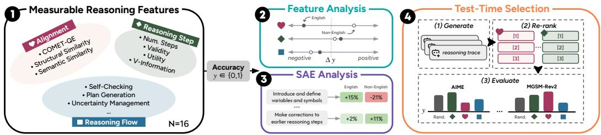
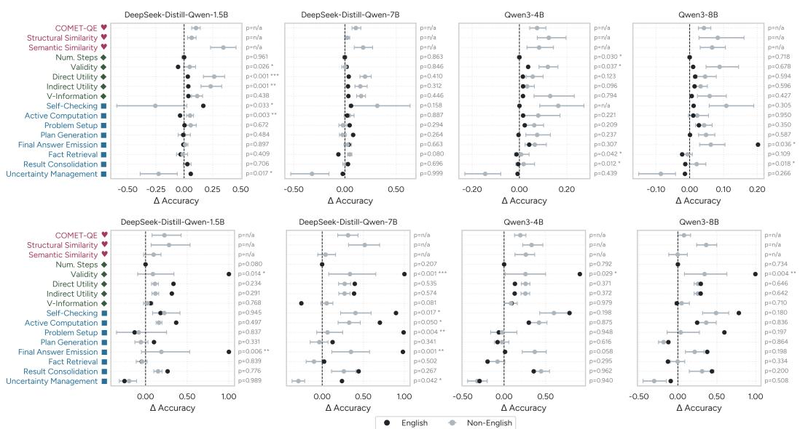
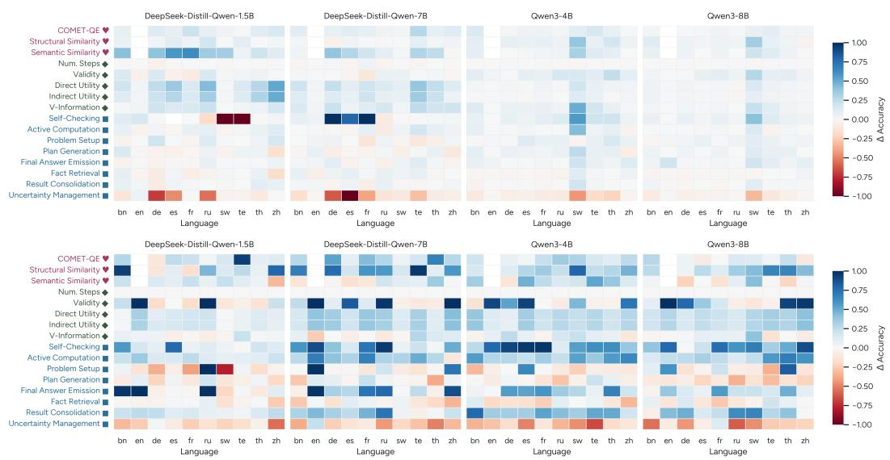
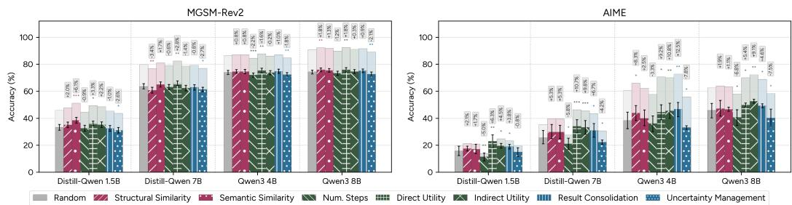
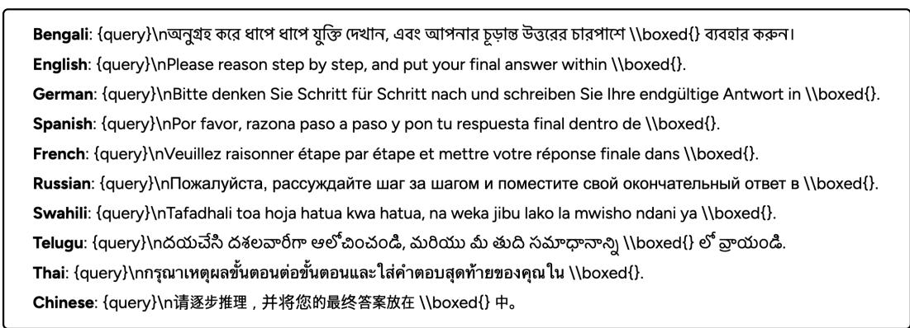
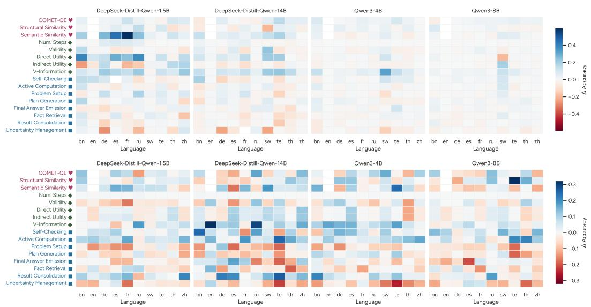
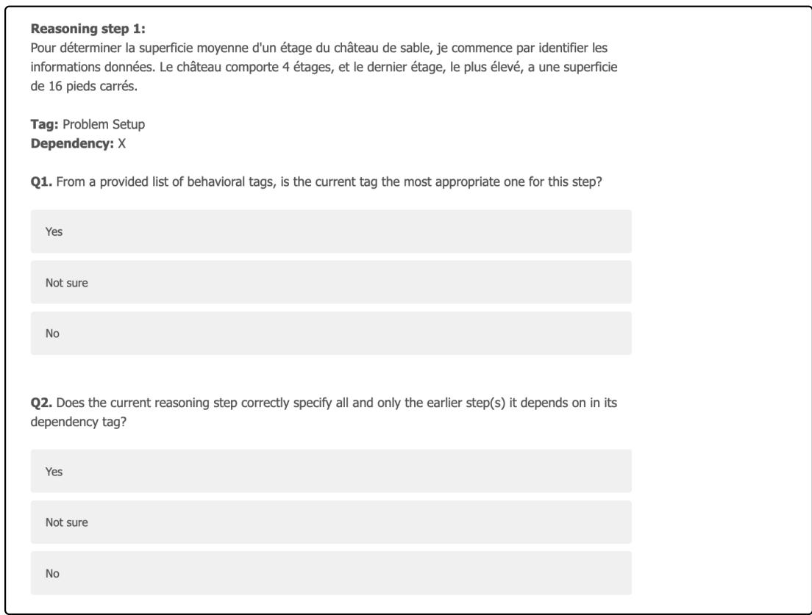

# What Makes Good Multilingual Reasoning? Disentangling Reasoning Traces with Measurable Features

Dayeon Ki $^{¶}$ , Kevin Duh $^{♣}$ , Marine Carpuat $^{¶}$ University of Maryland $^{¶}$ , Johns Hopkins University $^{♣}$ dayeonki@umd.edu

## Abstract

Large Reasoning Models (LRMs) still exhibit large performance gaps between English and other languages, yet much current work assumes these gaps can be closed simply by making reasoning in every language resemble English reasoning. This work challenges this assumption by asking instead: what actually characterizes effective reasoning in multilingual settings, and to what extent do English-derived reasoning features genuinely help in other languages? We first define a suite of measurable reasoning features spanning multilingual alignment, reasoning step, and reasoning flow aspects of reasoning traces, and use logistic regression to quantify how each feature associates with final answer accuracy. We further train sparse autoencoders over multilingual traces to automatically discover latent reasoning concepts that instantiate or extend these features. Finally, we use the features as test-time selection policies to examine whether they can steer models toward stronger multilingual reasoning. Across two mathematical reasoning benchmarks, four LRMs, and 10 languages, we find that most features are positively associated with accuracy, but the strength of association varies considerably across languages and can even reverse in some. Our findings challenge English-centric reward designs and point toward adaptive objectives that accommodate language-specific reasoning patterns, with concrete implications for multilingual benchmark and reward design. $^{1}$

## 1 Introduction

Advancing multilingual reasoning is critical for deploying Large Reasoning Models (LRMs) across diverse languages and improving user experiences worldwide (Shi et al., 2022; Ghosh et al., 2025). Yet substantial performance and behavioral gaps remain when LRMs are queried in languages other than English (Huang et al., 2025; Tam et al., 2025), leading to lower reasoning accuracy (Wang et al., 2025; Luo et al., 2025) and systematic mismatches between reasoning traces and final answers (Ovalle et al., 2026; Reddy et al., 2026).

Recent approaches to closing these gaps often project reasoning in other languages into English space: they translate queries into English (Zhu et al., 2024; Ko et al., 2025; Liu et al., 2026a), or reward traces that are structurally (Lai & Nissim, 2024) or semantically similar to English reasoning (She et al., 2024; Faisal et al., 2025; Zhang et al., 2026; Sutawika et al., 2026). While these methods can reduce accuracy gaps, they implicitly assume that the features signaling “good” reasoning in English transfer unchanged to other languages. This assumption is fragile: emerging evidence suggests models can sometimes reason more effectively in the original language instead of translating to English (Gao et al., 2025), and that traces when queried in other languages may follow distinct but equally valid reasoning trajectories, particularly for typologically distant languages (Tam et al., 2025). Blindly rewarding English-like reasoning therefore risks obscuring or even penalizing language-specific reasoning behaviors that support correct answers.

  
Figure 1: Overview of our method. We define 16 measurable reasoning features spanning multilingual alignment, reasoning step, and reasoning flow. We estimate each feature's effect on accuracy y via regression (Feature Analysis), validate and discover additional features using sparse autoencoders (SAE Analysis), and use these features to select reasoning traces at inference (Test-Time Selection).

This raises a central question: what actually characterizes effective reasoning in multilingual settings, and to what extent do English-derived reasoning features transfer across languages? Answering this requires moving beyond final answer accuracy alone toward a more systematic analysis of reasoning traces themselves. In this work, we take a first step by analyzing multilingual traces through a suite of measurable, human-interpretable features, studying not only how these features relate to accuracy but also whether they can be used at test time to steer models toward higher accuracy.

As illustrated in Figure 1, we first define a set of measurable reasoning features spanning multilingual alignment, reasoning step, and reasoning flow aspects of reasoning traces ( $§3.1$ ). We then quantify how each feature relates to per-language accuracy using univariate logistic regression ( $§3.2$ ). To move beyond this hand-designed set, we train sparse autoencoders (SAEs) over multilingual reasoning traces to automatically discover latent reasoning concepts, testing whether they recover and extend the same patterns ( $§3.3$ ). Finally, we use these features as test-time selection policies: for each language, we generate multiple candidate reasoning traces, re-rank them by each feature value, and measure the resulting accuracy as a probe of whether the feature can steer models toward improved multilingual reasoning performance ( $§3.4$ ).

Across two multilingual mathematical reasoning benchmarks, four LRMs, and 10 languages ( $§4$ ), we find that most features are positively associated with accuracy, but the strength of this association varies considerably and can even reverse in some languages ( $§5.1$ ). SAE-derived latent concepts qualitatively confirm these patterns and reveal additional behaviors not captured by our hand-designed features ( $§5.2$ ). In test-time selection, the conventional choice of semantic similarity to English traces is competitive but not universally best; for some models, alternative features such as utility yield higher accuracy ( $§5.3$ ).

Together, our findings challenge assumptions that uncritically favor English-like traces and instead point toward adaptive objectives that accommodate language-specific reasoning patterns, with concrete implications for multilingual benchmark and reward design ( $§6$ ).

## 2 Related Work

## 2.1 Multilingual Reasoning

A growing body of work documents substantial performance and behavioral gaps across languages in LRMs (Tam et al., 2025; Qi et al., 2025; Wang et al., 2025; Luo et al., 2025). To mitigate these gaps, training-time approaches typically operationalize effective multilingual reasoning through English-centric signals: they translate queries into English before reasoning (Zhu et al., 2024; Ko et al., 2025; Liu et al., 2026a; Huang et al., 2026), or design rewards that favor cross-lingual semantic similarity to English reference traces, via LLM-as-a-judge scores (Zhang et al., 2026; Sutawika et al., 2026) or cosine embedding similarity (Faisal et al., 2025; Liu et al., 2026a). We question this design choice by asking how other properties of multilingual reasoning traces—beyond semantic similarity to English—actually relate to reasoning performance, and aim to provide a more nuanced account of what constitutes effective multilingual reasoning.

<table><tr><td>Feature</td><td>Description</td><td>Range</td></tr><tr><td colspan="3">Multilingual Alignment</td></tr><tr><td>COMET-QE</td><td>Translation quality of non-English queries, measured with COMET-QE (Rei et al., 2020)</td><td>[0,1]</td></tr><tr><td>Structural Similarity</td><td>Structural alignment between English and non-English reasoning traces, measured via Smith-Waterman local sequence alignment algorithm (Smith et al., 1981)</td><td>[0,1]</td></tr><tr><td>Semantic Similarity</td><td>Cosine similarity between English and non-English reasoning traces, using LABSE as the embedding model (Feng et al., 2022)</td><td>[0,1]</td></tr><tr><td colspan="3">Reasoning Step</td></tr><tr><td>Num. Steps</td><td>Number of reasoning steps in the trace, segmented by \n\n (Xu et al., 2025)</td><td>[0,∞)</td></tr><tr><td>Validity</td><td>Logical consistency of a step with respect to its dependencies; proportion of dependency steps that entail the step (zeroed if any step is labeled as “contradiction”) (Prasad et al., 2023; You et al., 2025), measured with an off-the-shelf NLI model (Manakul et al., 2023)</td><td>[0,1]</td></tr><tr><td>Direct Utility</td><td>Degree to which reasoning steps directly contribute to getting the final answer (Lee &amp; Hockenmaier, 2025); proportion of steps lying on a dependency path to the last step labeled “Final Answer Emission” (including the last step itself)</td><td>[0,1]</td></tr><tr><td>Indirect Utility</td><td>Proportion of steps that lie on a dependency path to a direct utility step (i.e., they support steps that directly contribute to the final answer)</td><td>[0,1]</td></tr><tr><td>V-Information</td><td>Extent to which a reasoning trace t increases the model (V)&#x27;s confidence in the gold answer a; defined as VI(t → a) = logpv(a | q, t) - logpv(a | q), where q is the query</td><td>(-∞,∞)</td></tr><tr><td colspan="3">Reasoning Flow</td></tr><tr><td>Self-Checking</td><td>Steps that verify previous steps, check calculations, and re-confirm</td><td>[0,1]</td></tr><tr><td>Active Computation</td><td>Steps that perform algebra, calculations, manipulations toward the answer</td><td>[0,1]</td></tr><tr><td>Problem Setup</td><td>Steps that parse or rephrase the problem (initial reading or comprehension)</td><td>[0,1]</td></tr><tr><td>Plan Generation</td><td>Steps that state or decide on a plan of action (often meta-reasoning)</td><td>[0,1]</td></tr><tr><td>Final Answer Emission</td><td>Steps that explicitly state the final boxed answer or earlier sentences that contain the final answer</td><td>[0,1]</td></tr><tr><td>Fact Retrieval</td><td>Steps that recall facts, formulas, problem details (without immediate computation)</td><td>[0,1]</td></tr><tr><td>Result Consolidation</td><td>Steps that aggregate intermediate results, summarize, or prepare the final answer</td><td>[0,1]</td></tr><tr><td>Uncertainty Management</td><td>Steps that express confusion, re-evaluate, and propose alternative plans (including backtracking)</td><td>[0,1]</td></tr></table>

Table 1: Full list of measurable reasoning features. We group features into Multilingual Alignment, Reasoning Step, and Reasoning Flow dimensions. Reasoning Flow features are adapted from Bogdan et al. (2025). All features are higher is better ( $\uparrow$ ). Implementation details are provided in Appendix A.

## 2.2 Disentangling Reasoning Traces

Recent work decomposes LRM traces into intermediate steps to characterize their structural and behavioral properties (Lanham et al., 2023; Paul et al., 2024). A diverse set of step-level evaluation criteria has been proposed, including factuality (Golovneva et al., 2022), informativeness (Prasad et al., 2023), relevance (Jacovi et al., 2024), utility and validity (Lee & Hockenmaier, 2025), and coherence (Do et al., 2025). Structural analyses further link graph structure (Jiang et al., 2025; Gandhi et al., 2025; Li et al., 2025a) and self-revision patterns (Feng et al., 2025) to performance through correlational methods. Separately, sparse autoencoders (SAEs; Cunningham et al. (2023)) have been used to extract interpretable latent features that both explain reasoning behavior (Galichin et al., 2025) and steer models toward higher performance (Ma et al., 2026). However, this literature is almost entirely confined to English, operating on English datasets and feature spaces, leaving generalization to multilingual settings largely unexplored. Our work bridges this gap by examining how these features transfer across languages and relate to multilingual reasoning performance.

## 3 Method

Our goal is to characterize what constitutes effective reasoning in multilingual settings. To this end, we first independently prompt each LRM with queries in each target language to produce reasoning traces and final answers, which serve as inputs to all subsequent analyses. We then ① define a set of measurable reasoning features ( $\S3.1$ ), quantify how each feature relates to accuracy via ② regression-based feature analysis ( $\S3.2$ ) and ③ SAE analysis ( $\S3.3$ ), and use ④ test-time selection to probe whether features can steer models toward higher accuracy ( $\S3.4$ ), as illustrated in Figure 1. All prompts are provided in Appendix C.

## 3.1 Define Measurable Reasoning Features

We curate a set of 16 reasoning features spanning three dimensions of multilingual reasoning, applied to the traces generated for each query; the full list is provided in Table 1:

\- Multilingual Alignment (N=3): Motivated by prior evidence that query understanding is a key bottleneck in multilingual reasoning (Zhu et al., 2024), and by reward designs that privilege similarity to English traces (Zhang et al., 2026; Sutawika et al., 2026), we define features that capture how faithfully queries and traces in other languages align with their English counterparts, both structurally and semantically.

\- Reasoning Step (N=5): To test whether step quality measures developed for English traces transfer to other languages ( $§2.2$ ), we define step-level features that quantify trace length, logical consistency, informativeness, and usefulness. Dependencies are annotated with GPT-4O (OpenAI et al., 2024) and per-step scores are aggregated by averaging.

\- Reasoning Flow (N=8): Following Bogdan et al. (2025), we annotate eight high-level cognitive-behavioral patterns characterizing the model's reasoning flow (e.g., planning, self-checking, fact retrieval) using GPT-4O. $^{2}$ Each feature is represented as the proportion of steps in the trace assigned that tag.

## 3.2 Feature Analysis

We analyze how each measurable reasoning feature relates to final answer accuracy using univariate logistic regression (Movva et al., 2025a), applied separately per language and feature over the generated traces. For each query, let $y \in \{0,1\}$ denote whether the model's final answer is correct and let $z_{j} \in \mathbb{R}$ denote the value of feature $j$ . We first standardize each continuous feature to zero mean and unit variance within a language:

$$
\tilde {z} _ {j} = \frac {z _ {j} - \mu_ {j}}{\sigma_ {j}}.\tag{1}
$$

For each model and language $\ell$ , we fit a univariate logistic regression for each feature $j:^{3}$

$$
P (y = 1 \mid \tilde {z} _ {j, \ell}) = \sigma (\alpha_ {\ell} + \beta_ {j, \ell} \tilde {z} _ {j, \ell}),\tag{2}
$$

where $\sigma(\cdot)$ is the logistic sigmoid, $\alpha_{\ell}$ is a language-specific intercept, and $\beta_{j,\ell}$ captures the association between feature j and accuracy in language $\ell$ . We summarize the effect of feature j by the discrete change in predicted accuracy when moving from one standard deviation below $(-1)$ to one above $(+1)$ the mean:

$$
\Delta \mathrm{Acc} _ {j, \ell} = \hat {y} _ {j, \ell} | _ {\tilde {z} _ {j, \ell} = + 1} - \hat {y} _ {j, \ell} | _ {\tilde {z} _ {j, \ell} = - 1},\tag{3}
$$

where $\hat{y}_{j,\ell}=P(y=1\mid\tilde{z}_{j,\ell})$ . Intuitively, a positive $\Delta Acc_{j,\ell}$ indicates that higher values of feature j are associated with higher predicted accuracy in language $\ell$ .

To assess whether a feature's effect differs significantly between English and other languages, we fit a pooled interaction logistic regression with an interaction term for each feature $j$ across all languages:

$$
P (y = 1 \mid \tilde {z} _ {j}, \mathrm{en}) = \sigma \big (\alpha + \beta_ {1} \mathrm{en} + \beta_ {2} \tilde {z} _ {j} + \beta_ {3} (\mathrm{en} \cdot \tilde {z} _ {j}) \big),\tag{4}
$$

where $en \in \{0,1\}$ indicates whether the reasoning trace is from English queries. We report Wald-style p-values for the interaction coefficient $\beta_{3}$ , which tests whether the association between feature j and accuracy differs significantly between English and non-English traces.

## 3.3 Sparse Autoencoder (SAE) Analysis

We complement the hand-designed feature analysis with a finer-grained, representation-driven approach by training sparse autoencoders (SAEs) over multilingual reasoning traces. Following recent work using SAEs for hypothesis generation from text (Movva et al., 2025a;b), we treat each reasoning trace as input and final answer accuracy as the target, and learn a set of sparse, interpretable latent concepts that explain variation in accuracy.

For each model and language, we chunk each reasoning trace into segments of up to 400 words, encode each chunk with LABSE embeddings (Feng et al., 2022), and train a Batch TopK SAE (Bussmann et al., 2024) to reconstruct them. Each chunk inherits the accuracy label of its parent trace. We then identify predictive SAE neurons via a correlation-based criterion: for each neuron, we compute the Pearson correlation between its activation vector and the binary accuracy label, and retain the top-20 neurons by absolute correlation.

To interpret each neuron, we prompt GPT-40 with the 10 chunks that most strongly activate it alongside 10 randomly sampled non-activating chunks, and ask for a short natural language description of the distinguishing concept. For each concept, we report its separation score (the difference in accuracy when the concept is present vs. absent) and its prevalence (the fraction of examples in which it appears). Finally, we compare the learned concepts to our features to assess the extent to which SAEs recover the same underlying patterns. $^{4}$

## 3.4 Test-Time Selection

We cast test-time selection as a best-of-n problem (Charniak & Johnson, 2005; Lightman et al., 2024; Wang et al., 2024; Rajaee et al., 2026), using our reasoning features as selection policies to probe whether they can steer models toward better multilingual reasoning at inference time. Specifically, for a fixed model and language, we generate n = 32 candidate reasoning traces per query under the same prompt and decoding setup, drawing 8 independent samples at each temperature $t \in \{0.3, 0.6, 0.8, 1.0\}$ (Feng et al., 2025). Given these 32 candidates, we select a subset of 6 hand-designed features with the most salient negative, neutral, and positive $\Delta$ Acc values as selection policies. For a given feature j, we use its value as a selection score, re-rank all candidates accordingly, and take the top-scoring trace as the final output. We report pass@1, the fraction of queries for which the selected trace yields a correct final answer, and compare against a random-selection baseline to quantify how effectively each feature serves as a test-time selection policy.

## 4 Experiment Setup

Dataset. We evaluate on two multilingual mathematical reasoning benchmarks of varying difficulty: MGSM-Rev2 (Peter et al., 2025) and AIME 2024–25 (Qi et al., 2025). MGSM-Rev2 is a revised version of MGSM (Shi et al., 2022) that corrects translation errors and ambiguities, updating 15.8% of queries on average; it contains human-translated middle-school-level problems. AIME consists of challenging high-school-level competition problems originally written in English and machine-translated into other languages using GPT-4O-MINI. Detailed dataset statistics are provided in Appendix Table 4-5.

Languages. We study ten languages representing diverse resource levels, language families, writing scripts, and linguistic typologies: Bengali (bn), English (en), German (de), Spanish (es), French (fr), Russian (ru), Swahili (sw), Telugu (te), Thai (th), and Chinese (zh). Perlanguage characteristics are detailed in Appendix Table 6.

Models. We use four open-weight LRMs varying in size, degree of multilinguality, and training data: DISTILL-QWEN 1.5B, 7B (DeepSeek-AI, 2025), QWEN-3 4B, and 8B (Yang et al., 2025). Model details are provided in Appendix Table 7.

  
Figure 2: English versus non-English feature analysis results. Top: MGSM-Rev2; bottom: AIME. The y-axis lists each measurable reasoning feature; the x-axis shows its effect on predicted accuracy ( $\Delta$ Acc), where positive values indicate that higher feature values are associated with higher accuracy. We only report non-English values for Multilingual Alignment features. We report p-values for English to non-English difference on the right, using \*: significant with p < 0.05; \*\*: p < 0.01; \*\*\*: p < 0.001; non-marked: not statistically significant.

## 5 Results

We begin by comparing feature analysis results for reasoning traces from English and non-English queries, then examine per-language effects ( $§5.1$ ). We test whether our SAE analysis recovers these findings ( $§5.2$ ) and align them with our test-time selection results ( $§5.3$ ).

## 5.1 RQ1: What Characterize Effective Multilingual Reasoning? [Feature Analysis]

Figure 2 shows the feature analysis results for English versus non-English languages on MGSM-Rev2 and AIME. We highlight several interesting findings below:

Feature analysis recovers patterns from prior work. The number of reasoning steps feature (num. steps) is associated with near-zero $\Delta$ Acc for both English and non-English languages, suggesting that the previously reported weak relationship between trace length and accuracy in English (Vanhoyweghen et al., 2025) extends to other languages. We also find that all Multilingual Alignment features induce positive $\Delta$ Acc: positive COMET-QE values suggest that accurate translation of non-English queries is crucial, consistent with prior findings that query understanding is a key bottleneck in multilingual reasoning (Peter et al., 2025; Kang et al., 2026), and semantic similarity helps explain the accuracy gains from English-similarity-based training objectives (Zhang et al., 2026; Sutawika et al., 2026).

We further find that structural similarity to English traces is similarly important and, in some cases, even more predictive of accuracy. On the more challenging AIME benchmark, structural similarity yields higher $\Delta$ Acc than semantic similarity for all four LRMs, plausibly because AIME traces are much longer on average (275 steps) than MGSM-Rev2 traces (19 steps), making local sequence matching easier than aligning the overall semantics.

Features show near-zero effects for English MGSM-Rev2 traces. As shown in the top panel of Figure 2, English traces on MGSM-Rev2 cluster tightly around near-zero $\Delta$ Acc, indicating that none of our features strongly predicts accuracy. This contrasts with non-English traces on the same dataset and with traces on AIME. A plausible explanation is that

  
Figure 3: Per-language feature analysis results. Top: MGSM-Rev2; bottom: AIME. Raw feature values and accuracies for each language are provided in Appendix D.4.

MGSM-Rev2 queries are easy enough in English that LRMs frequently solve problems via latent reasoning with minimal reliance on explicit trace behaviors. Indeed, this is consistent with prior evidence that models can compute answers directly in their latent representations and then use traces primarily to surface the answer, especially for English and simpler benchmarks like MGSM-Rev2 (Liu et al., 2026b).

Most features share directional effects across English and other languages. All Reasoning Step features, including validity, direct and indirect utility, and V-Information, generally induce positive $\Delta$ Acc for both English and other languages across all models. On MGSM-Rev2, non-English languages typically show larger effect sizes, plausibly because English already benefits from strong latent reasoning. On AIME, the pattern reverses, with validity consistently showing a significantly stronger effect for English.

Reasoning Flow features follow a similar pattern: English and non-English traces largely share the same direction of effect, with variation in magnitude. For instance, traces with more steps performing calculations (active computation) or aggregating intermediate results (result consolidation) are generally associated with positive $\Delta$ Acc, while steps expressing confusion or exploring alternatives (uncertainty management) tend to yield negative $\Delta$ Acc.

Language-level analysis reveals conflicts. Decomposing feature effects by language in Figure 3 reveals patterns that diverge from the aggregate English vs. non-English view. On MGSM-Rev2 (top), while most features behave consistently, several show clear conflicts between English and other specific languages: for instance, more self-checking steps improve $\Delta$ Acc for English but are associated with negative $\Delta$ Acc in Swahili and Telugu. These conflicts are more pronounced on AIME (bottom), where language-level divergences are more frequent: validity is near one for English but can be negatively associated with accuracy in other languages, and more steps explicitly stating the final answer (final answer emission) are beneficial in English yet sometimes harmful in other languages. We show several qualitative examples in Appendix D.5.

Together, our feature analysis shows that most reasoning features have consistent directional effects, but their magnitudes vary substantially and can even conflict across languages.

## 5.2 RQ2: Can We Automatically Discover Reasoning Features? [SAE Analysis]

Table 2 presents a sample of latent reasoning concepts discovered for each dataset, several of which we discuss below:

<table><tr><td>Lang.</td><td>Concept (↑ preferred, ↓ dispreferred)</td><td>Sep.</td><td>Prev.</td></tr><tr><td colspan="4">MGSM-Rev2</td></tr><tr><td>Bengali</td><td>Explicitly questions or re-interprets problem statement for contradiction or inconsistencies</td><td>-39%</td><td>13%</td></tr><tr><td>Bengali</td><td>Discuss potential translation errors in the problem statement</td><td>-28%</td><td>79%</td></tr><tr><td>English</td><td>Engages in self-questioning and reconsideration of problem interpretations</td><td>+24%</td><td>92%</td></tr><tr><td>German</td><td>Repeats the same phrase or reasoning step multiple times verbatim within the trace</td><td>-82%</td><td>13%</td></tr><tr><td>Swahili</td><td>Include formatted final answer statement using “**Final Answer**” with a boxed numeric result</td><td>+10%</td><td>19%</td></tr><tr><td>Telugu</td><td>Translates problem statement from Telugu to English to clarify ambiguous terms</td><td>+2%</td><td>50%</td></tr><tr><td>Thai</td><td>Mixes multiple languages within the reasoning trace</td><td>-36%</td><td>90%</td></tr><tr><td>Chinese</td><td>Breaks down a multi-step into explicitly named sequential parts, with ordinal adverbs such as “first”, “second”, “next” and “finally”</td><td>+31%</td><td>54%</td></tr><tr><td colspan="4">AIME</td></tr><tr><td>Bengali</td><td>Makes repeated corrections to earlier reasoning steps throughout the trace</td><td>-12%</td><td>90%</td></tr><tr><td>English</td><td>Uses iterative reasoning and re-evaluation of previous steps in the calculations</td><td>+14%</td><td>99%</td></tr><tr><td>German</td><td>Explicitly uses logarithmic identities to manipulate equations and solve for variables</td><td>+11%</td><td>18%</td></tr><tr><td>Spanish</td><td>Frequently uses the phrase “Wait” to indicate reconsideration of previous steps</td><td>-17%</td><td>83%</td></tr><tr><td>Chinese</td><td>Uses a series of logical deductions and checks to verify previous calculations</td><td>+38%</td><td>62%</td></tr></table>

Table 2: Example of reasoning concepts discovered in SAE analysis. Sep.: separation score (accuracy difference when the concept is present vs. absent); Prev.: prevalence (how often the concept occurs).

SAE analysis confirms findings from feature analysis. SAEs trained over multilingual reasoning traces largely recover the patterns identified by our hand-designed features. On MGSM-Rev2, concepts associated with uncertainty management, such as “questioning the problem statement” (-39%) or “repeating the same phrase” (-82%), tend to show negative $\Delta$ Acc for most non-English languages, while the corresponding feature is associated only with positive $\Delta$ Acc for English, aligning with the preferred concept “engages in self-questioning and reconsideration of problem interpretations” (+24%). Concepts related to high COMET-QE are similarly consistent: “discussing potential translation errors” (-28%) is dispreferred for non-English traces while “translating the problem into English” (+2%) is preferred. We observe analogous patterns in AIME: behaviors linked to uncertainty management such as “making repeated corrections” (-12%) or “frequently using the wait phrase” (-17%) are likewise dispreferred, consistent with their negative $\Delta$ Acc from feature analysis, while behaviors related to active computation such as “using logarithmic identities” (+11%), are preferred.

SAE analysis discovers new reasoning patterns. Beyond corroborating our feature analysis, SAE also refines and extends it with finer-grained reasoning patterns. For example, while our feature analysis captures the benefits of informative reasoning steps (via validity and utility) likely associated with active computation or result consolidation, SAE reveals how these behaviors concretely manifest in traces, such as “breaking down multi-step reasoning with ordinal adverbs” (+31%) or “using a series of logical deductions” (+38%). It also surfaces behaviors not covered by our hand-designed feature set, including “mixing multiple languages within a single reasoning trace” (-36%), associated with lower accuracy.

## 5.3 RQ3: Can Features Steer Models Toward Higher Accuracy? [Test-Time Selection]

Having identified features associated with higher or lower accuracy through both feature ( $§5.1$ ) and SAE analysis ( $§5.2$ ), we now ask whether these features can steer models toward better multilingual reasoning at inference time. Results are shown in Figure 4.

On MGSM-Rev2 (left), semantic similarity to English traces is a competitive selector over the random baseline, especially for DISTILL-QWEN 1.5B, but does not consistently improve accuracy across other models. Aside from uncertainty management, which consistently yields significantly lower accuracy than the baseline (at most -2.7%), most features achieve similar pass@1 to random selection, consistent with our earlier finding that MGSM-Rev2 shows near-zero effects across features ( $§5.1$ ). This suggests that on relatively easy benchmarks like MGSM-Rev2, feature-based selection offers limited gains over random choice, and that improving multilingual reasoning performance may instead require stronger changes to training objectives or model architectures.

The more challenging AIME benchmark (right) makes these differences more pronounced. While structural and semantic similarity offer modest, non-significant gains, direct utility, indirect utility, and result consolidation consistently yield significantly higher accuracy than the random baseline across all models. Features with neutral or negative $\Delta$ Acc, such as num.steps and uncertainty management, also show correspondingly stronger effects in the direction of lower accuracy. $^{5}$

  
Figure 4: Pass@1 per model using each feature as test-time selection policy. Solid bars show results aggregated over languages other than English; light-shaded bars show English results as reference. For solid bars, error bars show 95% bootstrap confidence intervals and we report p-values of the paired bootstrap test against the random selection baseline, using \*: significant with p < 0.05; \*\*: p < 0.01; \*\*\*: p < 0.001; non-marked: not statistically significant.

Overall, these results confirm that our features can meaningfully steer model behavior, particularly on harder benchmarks: selecting by direct utility alone improves accuracy by up to 10% with a simple inference-time strategy. At the same time, the limited gains from semantic similarity challenge reward designs that uncritically favor English-like traces, and point instead toward objectives that accommodate language-specific reasoning behaviors.

## 6 Discussion & Conclusion

We discuss important implications of our findings for advancing multilingual reasoning.

Reasoning Benchmark Design. (1) The positive $\Delta$ Acc associated with COMET-QE underscores that benchmark queries in languages other than English should be accurately rendered, ideally via human translation (Shi et al., 2022) or human verification on a representative subset (Chen et al., 2024; Wang et al., 2025; Dobler et al., 2026). (2) Our findings suggest that Reasoning Step measures of step-level correctness (Zeng et al., 2025; Li et al., 2025b), originally developed for English meta-reasoning benchmarks (Mirzadeh et al., 2024; Xia et al., 2025; Zheng et al., 2025; Song et al., 2025), transfer well across languages: these features, especially utility-based signals, consistently induce positive $\Delta$ Acc, supporting their use as language-agnostic evaluation tools.

Reward Model Design. (1) Both our feature analysis ( $§5.1$ ) and test-time selection experiments ( $§5.3$ ) show that rewarding semantic similarity to English traces, while competitive, is not a universally effective steering signal. Alternative signals, such as direct and indirect utility or result consolidation, can yield stronger multilingual reasoning performance, especially on challenging benchmarks like AIME. This motivates training objectives that explicitly incorporate these signals rather than relying on semantic similarity alone. (2) As shown in Figure 3, the same feature can induce conflicting effects across languages, highlighting the need to encourage language-specific reasoning patterns. Together with recent work on adaptive reasoning (Wu et al., 2025; Gao et al., 2026), we point toward adaptive reward designs that flexibly decide when to remain in the original language, when to translate, and which feature signals to prioritize.

Overall, we present a systematic study of what characterizes effective reasoning in multilingual settings by decomposing reasoning traces into measurable features and relating them to accuracy. We find mostly consistent directional effects but language-varying, and sometimes conflicting, effect sizes. Test-time selection shows that while rewarding semantic similarity to English traces is often competitive, utility and active computation features can better steer models for higher accuracy in some languages. Our findings challenge English-centric assumptions about what constitutes “good” reasoning, and argue for multilingual benchmarks and adaptive reward designs that explicitly accommodate language-specific reasoning patterns.

## 7 Limitations

Limited scope. Our analysis is constrained to the current experimental setup. First, our hand-designed feature set includes 16 measurable reasoning features, which is necessarily non-exhaustive and does not cover the full space of potentially informative signals for multilingual reasoning. Second, we focus exclusively on mathematical reasoning benchmarks, which offer several advantages: (i) parallel queries across a representative set of languages, (ii) a clear verifiable correctness signal (accuracy), and (iii) typically multi-step problems that make them a natural testbed for our Reasoning Flow features. However, our findings may not directly transfer to non-mathematical domains such as commonsense, legal, or multi-hop QA, where both the nature of reasoning and the most informative feature space may differ. Finally, our experiments are limited to four LRMs, so the observed patterns may not hold for other architectures or training regimes; we view our work as an initial step toward broader investigations.

Reliance on GPT-4O annotation. Many of our core features, including Reasoning Step features such as validity and utility, as well as Reasoning Flow features, rely on GPT-4O-based annotation. This choice is motivated by prior evidence that GPT-4O can reliably perform fine-grained reasoning-trace tagging for mathematical problems in English using the same prompt template in Prompt C.1 (Bogdan et al., 2025). To partially address its generalization to languages other than English, we conduct human verification on a small subset of traces from non-English queries and report high agreement with human judgments in Appendix D.1, yet a comprehensive assessment of multilingual annotation reliability remains future work.

## Acknowledgments

We thank the members of the CLIP lab at the University of Maryland for their valuable feedback and support, with special thanks to Calvin Bao and Hieu Tran for their comments on an earlier draft.

## References

Mislav Balunović, Jasper Dekoninck, Ivo Petrov, Nikola Jovanović, and Martin Vechev. Matharena: Evaluating llms on uncontaminated math competitions, February 2025. URL https://matharena.ai/.

Paul C. Bogdan, Uzay Macar, Neel Nanda, and Arthur Conmy. Thought anchors: Which llm reasoning steps matter?, 2025. URL https://arxiv.org/abs/2506.19143.

Bart Bussmann, Patrick Leask, and Neel Nanda. Batchtopk sparse autoencoders. In NeurIPS 2024 Workshop on Scientific Methods for Understanding Deep Learning, 2024. URL https://openreview.net/forum?id=d4dp0CqybL.

Eugene Charniak and Mark Johnson. Coarse-to-fine n-best parsing and maxent discriminative reranking. In Proceedings of the 43rd Annual Meeting of the Association for Computational Linguistics (ACL'05), pp. 173–180, 2005.

Nuo Chen, Zinan Zheng, Ning Wu, Ming Gong, Dongmei Zhang, and Jia Li. Breaking language barriers in multilingual mathematical reasoning: Insights and observations. In Yaser Al-Onaizan, Mohit Bansal, and Yun-Nung Chen (eds.), Findings of the Association for

Computational Linguistics: EMNLP 2024, pp. 7001–7016, Miami, Florida, USA, November 2024. Association for Computational Linguistics. doi: 10.18653/v1/2024.findings-emnlp.411. URL https://aclanthology.org/2024.findings-emnlp.411/.

Hoagy Cunningham, Aidan Ewart, Logan Riggs, Robert Huben, and Lee Sharkey. Sparse autoencoders find highly interpretable features in language models. arXiv preprint arXiv:2309.08600, 2023.

DeepSeek-AI. Deepseek-r1: Incentivizing reasoning capability in llms via reinforcement learning, 2025. URL https://arxiv.org/abs/2501.12948.

Heejin Do, Jaehui Hwang, Dongyoon Han, Seong Joon Oh, and Sangdoo Yun. What defines good reasoning in llms? dissecting reasoning steps with multi-aspect evaluation, 2025. URL https://arxiv.org/abs/2510.20603.

Konstantin Dobler, Simon Lehnerer, Federico Scozzafava, Jonathan Janke, and Mohamed Ali. Multilingual reasoning gym: Multilingual scaling of procedural reasoning environments, 2026. URL https://arxiv.org/abs/2603.10793.

Fahim Faisal, Kaiqiang Song, Song Wang, Simin Ma, Shujian Liu, Haoyun Deng, and Sathish Reddy Indurthi. Aligning multilingual reasoning with verifiable semantics from a high-resource expert model, 2025. URL https://arxiv.org/abs/2509.25543.

Fangxiaoyu Feng, Yinfei Yang, Daniel Cer, Naveen Arivazhagan, and Wei Wang. Language-agnostic BERT sentence embedding. In Smaranda Muresan, Preslav Nakov, and Aline Villavicencio (eds.), Proceedings of the 60th Annual Meeting of the Association for Computational Linguistics (Volume 1: Long Papers), pp. 878–891, Dublin, Ireland, May 2022. Association for Computational Linguistics. doi: 10.18653/v1/2022.acl-long.62. URL https://aclanthology.org/2022.acl-long.62/.

Yunzhen Feng, Julia Kempe, Cheng Zhang, Parag Jain, and Anthony Hartshorn. What characterizes effective reasoning? revisiting length, review, and structure of cot, 2025. URL https://arxiv.org/abs/2509.19284.

Andrey Galichin, Alexey Dontsov, Polina Druzhinina, Anton Razzhigaev, Oleg Y. Rogov, Elena Tutubalina, and Ivan Oseledets. I have covered all the bases here: Interpreting reasoning features in large language models via sparse autoencoders, 2025. URL https://arxiv.org/abs/2503.18878.

Kanishk Gandhi, Ayush Chakravarthy, Anikait Singh, Nathan Lile, and Noah D Goodman. Cognitive behaviors that enable self-improving reasoners, or, four habits of highly effective stars. arXiv preprint arXiv:2503.01307, 2025.

Changjiang Gao, Xu Huang, Wenhao Zhu, Shujian Huang, Lei Li, and Fei Yuan. Could thinking multilingually empower llm reasoning?, 2025. URL https://arxiv.org/abs/2504.11833.

Changjiang Gao, Zixian Huang, Kaichen Yang, Jiajun Chen, Jixing Li, and Shujian Huang. Explang: Improved exploration and exploitation in llm reasoning with on-policy thinking language selection, 2026. URL https://arxiv.org/abs/2602.21887.

Akash Ghosh, Debayan Datta, Sriparna Saha, and Chirag Agarwal. A survey of multilingual reasoning in language models. In Christos Christodoulopoulos, Tanmoy Chakraborty, Carolyn Rose, and Violet Peng (eds.), Findings of the Association for Computational Linguistics: EMNLP 2025, pp. 8920–8936, Suzhou, China, November 2025. Association for Computational Linguistics. ISBN 979-8-89176-335-7. doi: 10.18653/v1/2025.findings-emnlp.474. URL https://aclanthology.org/2025.findings-emnlp.474/.

Olga Golovneva, Moya Chen, Spencer Poff, Martin Corredor, Luke Zettlemoyer, Maryam Fazel-Zarandi, and Asli Celikyilmaz. Roscoe: A suite of metrics for scoring step-by-step reasoning. arXiv preprint arXiv:2212.07919, 2022.

Xu Huang, Wenhao Zhu, Hanxu Hu, Conghui He, Lei Li, Shujian Huang, and Fei Yuan. BenchMAX: A comprehensive multilingual evaluation suite for large language models. In Christos Christodoulopoulos, Tanmoy Chakraborty, Carolyn Rose, and Violet Peng (eds.), Findings of the Association for Computational Linguistics: EMNLP 2025, pp. 16751–16774, Suzhou, China, November 2025. Association for Computational Linguistics. ISBN 979-8-89176-335-7. doi: 10.18653/v1/2025.findings-emnlp.909. URL https://aclanthology.org/2025.findings-emnlp.909/.

Xu Huang, Zhejian Lai, Zixian Huang, Jiajun Chen, and Shujian Huang. Tapo: Translation augmented policy optimization for multilingual mathematical reasoning, 2026. URL https://arxiv.org/abs/2603.25419.

Alon Jacovi, Yonatan Bitton, Bernd Bohnet, Jonathan Herzig, Or Honovich, Michael Tseng, Michael Collins, Roee Aharoni, and Mor Geva. A chain-of-thought is as strong as its weakest link: A benchmark for verifiers of reasoning chains. In Proceedings of the 62nd Annual Meeting of the Association for Computational Linguistics (Volume 1: Long Papers), pp. 4615–4634, 2024.

Gangwei Jiang, Yahui Liu, Zhaoyi Li, Wei Bi, Fuzheng Zhang, Linqi Song, Ying Wei, and Defu Lian. What makes a good reasoning chain? uncovering structural patterns in long chain-of-thought reasoning. In Christos Christodoulopoulos, Tanmoy Chakraborty, Carolyn Rose, and Violet Peng (eds.), Proceedings of the 2025 Conference on Empirical Methods in Natural Language Processing, pp. 6490–6514, Suzhou, China, November 2025. Association for Computational Linguistics. ISBN 979-8-89176-332-6. doi: 10.18653/v1/2025.emnlp-main.329. URL https://aclanthology.org/2025.emnlp-main.329/.

Deokhyung Kang, Seonjeong Hwang, Daehui Kim, Hyounghun Kim, and Gary Geunbae Lee. Why do multilingual reasoning gaps emerge in reasoning language models?, 2026. URL https://arxiv.org/abs/2510.27269.

Jong Hae Kim. Multicollinearity and misleading statistical results. Korean Journal of Anesthesiology, 72(6):558–569, 2019. doi: 10.4097/kja.19087. URL https://doi.org/10.4097/kja.19087.

Hyunwoo Ko, Guijin Son, and Dasol Choi. Understand, solve and translate: Bridging the multilingual mathematical reasoning gap. In David Ifeoluwa Adelani, Catherine Arnett, Duygu Ataman, Tyler A. Chang, Hila Gonen, Rahul Raja, Fabian Schmidt, David Stap, and Jiayi Wang (eds.), Proceedings of the 5th Workshop on Multilingual Representation Learning (MRL 2025), pp. 78–95, Suzhuo, China, November 2025. Association for Computational Linguistics. ISBN 979-8-89176-345-6. doi: 10.18653/v1/2025.mrl-main.6. URL https://aclanthology.org/2025.mrl-main.6/.

Tom Kocmi and Christian Federmann. Large language models are state-of-the-art evaluators of translation quality. In Mary Nurminen, Judith Brenner, Maarit Koponen, Sirkku Latomaa, Mikhail Mikhailov, Frederike Schierl, Tharindu Ranasinghe, Eva Vanmassenhove, Sergi Alvarez Vidal, Nora Aranberri, Mara Nunziatini, Carla Parra Escartín, Mikel Forcada, Maja Popovic, Carolina Scarton, and Helena Moniz (eds.), Proceedings of the 24th Annual Conference of the European Association for Machine Translation, pp. 193–203, Tampere, Finland, June 2023. European Association for Machine Translation. URL https://aclanthology.org/2023.eamt-1.19/.

Woosuk Kwon, Zhuohan Li, Siyuan Zhuang, Ying Sheng, Lianmin Zheng, Cody Hao Yu, Joseph E. Gonzalez, Hao Zhang, and Ion Stoica. Efficient memory management for large language model serving with pagedattention. In Proceedings of the ACM SIGOPS 29th Symposium on Operating Systems Principles, 2023.

Huiyuan Lai and Malvina Nissim. mCoT: Multilingual instruction tuning for reasoning consistency in language models. In Lun-Wei Ku, Andre Martins, and Vivek Srikumar (eds.), Proceedings of the 62nd Annual Meeting of the Association for Computational Linguistics (Volume 1: Long Papers), pp. 12012–12026, Bangkok, Thailand, August 2024. Association for Computational Linguistics. doi: 10.18653/v1/2024.acl-long.649. URL https://aclanthology.org/2024.acl-long.649/.

Tamera Lanham, Anna Chen, Ansh Radhakrishnan, Benoit Steiner, Carson Denison, Danny Hernandez, Dustin Li, Esin Durmus, Evan Hubinger, Jackson Kernion, et al. Measuring faithfulness in chain-of-thought reasoning. arXiv preprint arXiv:2307.13702, 2023.

Jinu Lee and Julia Hockenmaier. Evaluating step-by-step reasoning traces: A survey. In Christos Christodoulopoulos, Tanmoy Chakraborty, Carolyn Rose, and Violet Peng (eds.), Findings of the Association for Computational Linguistics: EMNLP 2025, pp. 1789–1814, Suzhou, China, November 2025. Association for Computational Linguistics. ISBN 979-8-89176-335-7. doi: 10.18653/v1/2025.findings-emnlp.94. URL https://aclanthology.org/2025.findings-emnlp.94/.

Dacheng Li, Shiyi Cao, Tyler Griggs, Shu Liu, Xiangxi Mo, Eric Tang, Sumanth Hegde, Kourosh Hakhamaneshi, Shishir G Patil, Matei Zaharia, et al. Llms can easily learn to reason from demonstrations structure, not content, is what matters! arXiv preprint arXiv:2502.07374, 2025a.

Zhiyuan Li, Yi Chang, and Yuan Wu. Think-bench: Evaluating thinking efficiency and chain-of-thought quality of large reasoning models, 2025b. URL https://arxiv.org/abs/2505.22113.

Hunter Lightman, Vineet Kosaraju, Yuri Burda, Harrison Edwards, Bowen Baker, Teddy Lee, Jan Leike, John Schulman, Ilya Sutskever, and Karl Cobbe. Let's verify step by step. In The Twelfth International Conference on Learning Representations, 2024. URL https://openreview.net/forum?id=v8L0pN6E0i.

Junxiao Liu, Zhijun Wang, Yixiao Li, Zhejian Lai, Liqian Huang, Xin Huang, Xue Han, Junlan Feng, and Shujian Huang. Self-improving multilingual long reasoning via translation-reasoning integrated training, 2026a. URL https://arxiv.org/abs/2602.05940.

Yihong Liu, Raoyuan Zhao, Hinrich Schütze, and Michael A. Hedderich. Large reasoning models are (not yet) multilingual latent reasoners, 2026b. URL https://arxiv.org/abs/2601.02996.

J. Scott Long and Jeremy Freese. Regression Models for Categorical Dependent Variables Using Stata. Stata Press, 3rd edition, 2014. ISBN 978-1-59718-111-2.

Wenyang Luo, Wayne Xin Zhao, Jing Sha, Shijin Wang, and Ji-Rong Wen. MMATH: A multilingual benchmark for mathematical reasoning. In Christos Christodoulopoulos, Tanmoy Chakraborty, Carolyn Rose, and Violet Peng (eds.), Findings of the Association for Computational Linguistics: EMNLP 2025, pp. 11187–11202, Suzhou, China, November 2025. Association for Computational Linguistics. ISBN 979-8-89176-335-7. doi: 10.18653/v1/2025.findings-emnlp.598. URL https://aclanthology.org/2025.findings-emnlp.598/.

George Ma, Zhongyuan Liang, Irene Y. Chen, and Somayeh Sojoudi. Falsifying sparse autoencoder reasoning features in language models, 2026. URL https://arxiv.org/abs/2601.05679.

Potsawee Manakul, Adian Liusie, and Mark JF Gales. Selfcheckgpt: Zero-resource black-box hallucination detection for generative large language models. arXiv preprint arXiv:2303.08896, 2023.

Iman Mirzadeh, Keivan Alizadeh, Hooman Shahrokhi, Oncel Tuzel, Samy Bengio, and Mehrdad Farajtabar. Gsm-symbolic: Understanding the limitations of mathematical reasoning in large language models. arXiv preprint arXiv:2410.05229, 2024.

Rajiv Movva, Smitha Milli, Sewon Min, and Emma Pierson. What's in my human feedback? learning interpretable descriptions of preference data, 2025a. URL https://arxiv.org/abs/2510.26202.

Rajiv Movva, Kenny Peng, Nikhil Garg, Jon Kleinberg, and Emma Pierson. Sparse autoencoders for hypothesis generation. In Forty-second International Conference on Machine Learning, 2025b. URL https://openreview.net/forum?id=4R0pugRyN5.

Sagnik Mukherjee, Abhinav Chinta, Takyoung Kim, Tarun Anoop Sharma, and Dilek Hakkani Tur. Premise-augmented reasoning chains improve error identification in math reasoning with LLMs. In Forty-second International Conference on Machine Learning, 2025. URL https://openreview.net/forum?id=4tYckHNVXV.

OpenAI, :, Aaron Hurst, Adam Lerer, Adam P. Goucher, Adam Perelman, Aditya Ramesh, Aidan Clark, AJ Ostrow, Akila Welihinda, Alan Hayes, Alec Radford, Aleksander Madry, Alex Baker-Whitcomb, Alex Beutel, Alex Borzunov, Alex Carney, Alex Chow, Alex Kirillov, Alex Nichol, Alex Paino, Alex Renzin, Alex Tachard Passos, Alexander Kirillov, Alexi Christakis, Alexis Conneau, Ali Kamali, Allan Jabri, Allison Moyer, Allison Tam, Amadou Crookes, Amin Tootoochian, Amin Tootoonchian, Ananya Kumar, Andrea Vallone, Andrej Karpathy, Andrew Braunstein, Andrew Cann, Andrew Codispoti, Andrew Galu, Andrew Kondrich, Andrew Tulloch, Andrey Mishchenko, Angela Baek, Angela Jiang, Antoine Pelisse, Antonia Woodford, Anuj Gosalia, Arka Dhar, Ashley Pantuliano, Avi Nayak, Avital Oliver, Barret Zoph, Behrooz Ghorbani, Ben Leimberger, Ben Rossen, Ben Sokolowsky, Ben Wang, Benjamin Zweig, Beth Hoover, Blake Samic, Bob McGrew, Bobby Spero, Bogo Giertler, Bowen Cheng, Brad Lightcap, Brandon Walkin, Brendan Quinn, Brian Guarraci, Brian Hsu, Bright Kellogg, Brydon Eastman, Camillo Lugaresi, Carroll Wainwright, Cary Bassin, Cary Hudson, Casey Chu, Chad Nelson, Chak Li, Chan Jun Shern, Channing Conger, Charlotte Barette, Chelsea Voss, Chen Ding, Cheng Lu, Chong Zhang, Chris Beaumont, Chris Hallacy, Chris Koch, Christian Gibson, Christina Kim, Christine Choi, Christine McLeavey, Christopher Hesse, Claudia Fischer, Clemens Winter, Coley Czarnecki, Colin Jarvis, Colin Wei, Constantin Koumouzelis, Dane Sherburn, Daniel Kappler, Daniel Levin, Daniel Levy, David Carr, David Farhi, David Mely, David Robinson, David Sasaki, Denny Jin, Dev Valladares, Dimitris Tsipras, Doug Li, Duc Phong Nguyen, Duncan Findlay, Edede Oiwoh, Edmund Wong, Ehsan Asdar, Elizabeth Proehl, Elizabeth Yang, Eric Antonow, Eric Kramer, Eric Peterson, Eric Sigler, Eric Wallace, Eugene Brevdo, Evan Mays, Farzad Khorasani, Felipe Petroski Such, Filippo Raso, Francis Zhang, Fred von Lohmann, Freddie Sulit, Gabriel Goh, Gene Oden, Geoff Salmon, Giulio Starace, Greg Brockman, Hadi Salman, Haiming Bao, Haitang Hu, Hannah Wong, Haoyu Wang, Heather Schmidt, Heather Whitney, Heewoo Jun, Hendrik Kirchner, Henrique Ponde de Oliveira Pinto, Hongyu Ren, Huiwen Chang, Hyung Won Chung, Ian Kivlichan, Ian O'Connell, Ian O'Connell, Ian Osband, Ian Silber, Ian Sohl, Ibrahim Okuyucu, Ikai Lan,Ilya Kostrikov,Ilya Sutskever,Ingmar Kanitscheider,Ishaan Gulrajani,Jacob Coxon,Jacob Menick,Jakub Pachocki,James Aung,James Betker,James Crooks,James Lennon,Jamie Kiros,Jan Leike,Jane Park,Jason Kwon,Jason Phang,Jason Teplitz,Jason Wei,Jason Wolfe,Jay Chen,Jeff Harris,Jenia Varavva,Jessica Gan Lee,Jessica Shieh,Ji Lin,Jiahui Yu,Jiayi Weng,Jie Tang,Jieqi YuJoanne Jang,Joaquin Quinonero CandelaJoe Beutler,Joe Landers,Joel Parish,Johannes Heidecke John Schulman.Jonathan Lachman.Jonathan McKay,Jonathan Uesato.Jonathan Ward,Jong Wook Kim,Noost Huizinga,Jordan SitkinJos KraaijeveldJosh Gross,Josh KaplanJosh SnyderJoshua AchiamJoy JiaoJoyce Lee,Juntang Zhuang"Justyn Harriman,Kai Fricke,Kai Hayashi,Karan Singhal,Katy Shi,Kavin Karthik,Kayla Wood,Kendra Rimbach,Kenny Hsu,Kenny Nguyen,Keren Gu-Lemberg,Kevin Button,Kevin Liu,Kiel Howe,Krithika MuthukumarKyle Luther,Lama Ahmad,Larry Kai-Lauren Itow-Lauren Workman-Leher PathakLeo Chen,Li Jing,Lia Guy,Liam Fedus,Liang Zhou,Lien Mamitsuka,Lilian Weng,Lindsay McCallum,Lindsey Held,Long Ouyang,Louis Feuvrier,Lu Zhang,Lukas Kondraciuk,Lukasz Kaiser,Luke Hewitt,Luke Metz,Lyric Doshi,Mada Aflak,Maddie Simens,Madelaine Boyd,Madeleine Thompson,Marat Dukhan,Mark Chen Mark Gray Mark Hudnall,Marin Zhang,Marwan Aljubeh,Mateusz LitwinMatthew Zeng.Max Johnson,Maya Shetty Mayank Gupta,Meghan Shah,Mehmet Yatbaz,Meng Jia Yang,Mengchao Zhong,Mia Glaese,Mianna ChenMichael JannerMichael LampeMichael Petrov,Michael Wu,Michele Wang,Michelle Fradin,Michelle Pokrass,Miguel Castro,Miguel Oom Temudo de Castro,Mikhail Pavlov,Miles Brundage,Miles Wang,Minal Khan,Mira Murati Mo Bavarian,Molly Lin,Murat Yesildal,Nacho Soto,Natalia Gimelshein,Natalie Cone,Natalie Staudacher,Natalie Summers,Natan LaFontaine,Neil Chowdhury,Nick Ryder,Nick Stathas,Nick Turley,Nik Tezak,Niko Felix,Nithanth Kudige,Nitish Keskar,Noah Deutsch,Noel Bundick,Nora Puckett.Ofir Nachum,Ola Okelola,Oleg Boiko,Oleg Murk,Oliver JaffeOlivia Watkins,Olivier Godement,Owen Campbell-Moore,Patrick

Chao, Paul McMillan, Pavel Belov, Peng Su, Peter Bak, Peter Bakkum, Peter Deng, Peter Dolan, Peter Hoeschele, Peter Welinder, Phil Tillet, Philip Pronin, Philippe Tillet, Prafulla Dhariwal, Qiming Yuan, Rachel Dias, Rachel Lim, Rahul Arora, Rajan Troll, Randall Lin, Rapha Gontijo Lopes, Raul Puri, Reah Miyara, Reimar Leike, Renaud Gaubert, Reza Zamani, Ricky Wang, Rob Donnelly, Rob Honsby, Rocky Smith, Rohan Sahai, Rohit Ramchandani, Romain Huet, Rory Carmichael, Rowan Zellers, Roy Chen, Ruby Chen, Ruslan Nigmatullin, Ryan Cheu, Saachi Jain, Sam Altman, Sam Schoenholz, Sam Toizer, Samuel Miserendino, Sandhini Agarwal, Sara Culver, Scott Ethersmith, Scott Gray, Sean Grove, Sean Metzger, Shamez Hermani, Shantanu Jain, Shengjia Zhao, Sherwin Wu, Shino Jomoto, Shirong Wu, Shuaiqi, Xia, Sonia Phene, Spencer Papay, Srinivas Narayanan, Steve Coffey, Steve Lee, Stewart Hall, Suchir Balaji, Tal Broda, Tal Stramer, Tao Xu, Tarun Gogineni, Taya Christianson, Ted Sanders, Tejal Patwardhan, Thomas Cunninghamman, Thomas Degry, Thomas Dimson, Thomas Raoux, Thomas Shadwell, Tianhao Zheng, Todd Underwood, Todor Markov, Toki Sherbakov, Tom Rubin, Tom Stasi, Tomer Kaftan, Tristan Heywood, Troy Peterson, Tyce Walters, Tyna Eloundou, Valerie Qi, Veit Moeller, Vinnie Monaco, Vishal Kuo, Vlad Fomenko, Wayne Chang, Weiyi Zheng, Wenda Zhou, Wesam Manassra, Will Sheu, Wojciech Zaremba, Yash Patil, Yilei Qian, Yongjik Kim, Youlong Cheng, Yu Zhang, Yuchen He, Yuchen Zhang, Yujia Jin, Yunxing Dai, and Yury Malkov. Gpt-4o system card, 2024. URL https://arxiv.org/abs/2410.21276.

Anaelia Ovalle, Candace Ross, Sebastian Ruder, Adina Williams, Karen Ullrich, Mark Ibrahim, and Levent Sagun. Beg to differ: Understanding reasoning-answer misalignment across languages, 2026. URL https://arxiv.org/abs/2512.22712.

Debjit Paul, Robert West, Antoine Bosselut, and Boi Faltings. Making reasoning matter: Measuring and improving faithfulness of chain-of-thought reasoning. In Findings of the Association for Computational Linguistics: EMNLP 2024, pp. 15012–15032, 2024.

Jan-Thorsten Peter, David Vilar, Tobias Domhan, Dan Malkin, and Markus Freitag. Mind the gap... or not? how translation errors and evaluation details skew multilingual results, 2025. URL https://arxiv.org/abs/2511.05162.

Archiki Prasad, Swarnadeep Saha, Xiang Zhou, and Mohit Bansal. ReCEval: Evaluating reasoning chains via correctness and informativeness. In Houda Bouamor, Juan Pino, and Kalika Bali (eds.), Proceedings of the 2023 Conference on Empirical Methods in Natural Language Processing, pp. 10066–10086, Singapore, December 2023. Association for Computational Linguistics. doi: 10.18653/v1/2023.emnlp-main.622. URL https://aclanthology.org/2023.emnlp-main.622/.

Jirui Qi, Shan Chen, Zidi Xiong, Raquel Fernández, Danielle Bitterman, and Arianna Bisazza. When models reason in your language: Controlling thinking language comes at the cost of accuracy. In Christos Christodoulopoulos, Tanmoy Chakraborty, Carolyn Rose, and Violet Peng (eds.), Findings of the Association for Computational Linguistics: EMNLP 2025, pp. 20279–20296, Suzhou, China, November 2025. Association for Computational Linguistics. ISBN 979-8-89176-335-7. doi: 10.18653/v1/2025.findings-emnlp.1103. URL https://aclanthology.org/2025.findings-emnlp.1103/.

Sara Rajaee, Rochelle Choenni, Ekaterina Shutova, and Christof Monz. Best-of-L: Cross-lingual reward modeling for mathematical reasoning. In Vera Demberg, Kentaro Inui, and Lluís Marquez (eds.), Findings of the Association for Computational Linguistics: EACL 2026, pp. 1930–1939, Rabat, Morocco, March 2026. Association for Computational Linguistics. ISBN 979-8-89176-386-9. doi: 10.18653/v1/2026.findings-eacl.99. URL https://aclanthology.org/2026.findings-eacl.99/.

Varshini Reddy, Craig W. Schmidt, Seth Ebner, Adam Wiemerslage, Yuval Pinter, and Chris Tanner. The effect of scripts and formats on llm numeracy, 2026. URL https://arxiv.org/abs/2601.15251.

Ricardo Rei, Craig Stewart, Ana C Farinha, and Alon Lavie. COMET: A neural framework for MT evaluation. In Bonnie Webber, Trevor Cohn, Yulan He, and Yang Liu (eds.), Proceedings of the 2020 Conference on Empirical Methods in Natural Language Processing (EMNLP), pp.

2685–2702, Online, November 2020. Association for Computational Linguistics. doi:10.18653/v1/2020.emnlp-main.213. URL https://aclanthology.org/2020.emnlp-main.213/.

Shuaijie She, Wei Zou, Shujian Huang, Wenhao Zhu, Xiang Liu, Xiang Geng, and Jiajun Chen. MAPO: Advancing multilingual reasoning through multilingual-alignment-as-preference optimization. In Lun-Wei Ku, Andre Martins, and Vivek Srikumar (eds.), Proceedings of the 62nd Annual Meeting of the Association for Computational Linguistics (Volume 1: Long Papers), pp. 10015–10027, Bangkok, Thailand, August 2024. Association for Computational Linguistics. doi: 10.18653/v1/2024.acl-long.539. URL https://aclanthology.org/2024.acl-long.539/.

Freda Shi, Mirac Suzgun, Markus Freitag, Xuezhi Wang, Suraj Srivats, Soroush Vosoughi, Hyung Won Chung, Yi Tay, Sebastian Ruder, Denny Zhou, Dipanjan Das, and Jason Wei. Language models are multilingual chain-of-thought reasoners, 2022. URL https://arxiv.org/abs/2210.03057.

Temple F Smith, Michael S Waterman, et al. Identification of common molecular subsequences. Journal of molecular biology, 147(1):195–197, 1981.

Mingyang Song, Zhaochen Su, Xiaoye Qu, Jiawei Zhou, and Yu Cheng. PRMBench: A fine-grained and challenging benchmark for process-level reward models. In Wanxiang Che, Joyce Nabende, Ekaterina Shutova, and Mohammad Taher Pilehvar (eds.), Proceedings of the 63rd Annual Meeting of the Association for Computational Linguistics (Volume 1: Long Papers), pp. 25299–25346, Vienna, Austria, July 2025. Association for Computational Linguistics. ISBN 979-8-89176-251-0. doi: 10.18653/v1/2025.acl-long.1230. URL https://aclanthology.org/2025.acl-long.1230/.

Lintang Sutawika, Gokul Swamy, Zhiwei Steven Wu, and Graham Neubig. Gained in translation: Privileged pairwise judges enhance multilingual reasoning, 2026. URL https://arxiv.org/abs/2601.18722.

Zhi Rui Tam, Cheng-Kuang Wu, Yu Ying Chiu, Chieh-Yen Lin, Yun-Nung Chen, and Hung yi Lee. Language matters: How do multilingual input and reasoning paths affect large reasoning models?, 2025. URL https://arxiv.org/abs/2505.17407.

Arne Vanhoyweghen, Brecht Verbeken, Andres Algaba, and Vincent Ginis. Lexical hints of accuracy in llm reasoning chains, 2025. URL https://arxiv.org/abs/2508.15842.

Hemish Veeraboina. Aime problem set 1983-2024, 2023. URL https://www.kaggle.com/datasets/hemishveeraboina/aime-problem-set-1983-2024.

Hongyue Wang, Jing Peng, Bokai Wang, Xiang Lu, Julia Z. Zheng, Kejia Wang, Xin M. Tu, and Changyong Feng. Inconsistency between univariate and multiple logistic regressions. Shanghai Archives of Psychiatry, 29(2):124–128, 2017. ISSN 1002-0829. doi: 10.11919/j.issn.1002-0829.217031.

Peiyi Wang, Lei Li, Zhihong Shao, Runxin Xu, Damai Dai, Yifei Li, Deli Chen, Yu Wu, and Zhifang Sui. Math-shepherd: Verify and reinforce LLMs step-by-step without human annotations. In Lun-Wei Ku, Andre Martins, and Vivek Srikumar (eds.), Proceedings of the 62nd Annual Meeting of the Association for Computational Linguistics (Volume 1: Long Papers), pp. 9426–9439, Bangkok, Thailand, August 2024. Association for Computational Linguistics. doi: 10.18653/v1/2024.acl-long.510. URL https://aclanthology.org/2024.acl-long.510/.

Yiming Wang, Pei Zhang, Jialong Tang, Hao-Ran Wei, Baosong Yang, Rui Wang, Chenshu Sun, Feitong Sun, Jiran Zhang, Junxuan Wu, Qiqian Cang, Yichang Zhang, Fei Huang, Junyang Lin, Fei Huang, and Jingren Zhou. Polymath: Evaluating mathematical reasoning in multilingual contexts. In The Thirty-ninth Annual Conference on Neural Information Processing Systems Datasets and Benchmarks Track, 2025. URL https://openreview.net/forum?id=B1vCImy6yI.

Richard Williams. Using the margins command to estimate and interpret adjusted predictions and marginal effects. The Stata Journal: Promoting Communications on Statistics and Stata, 12(2):308–331, 2012.

Siye Wu, Jian Xie, Yikai Zhang, Aili Chen, Kai Zhang, Yu Su, and Yanghua Xiao. ARM: Adaptive reasoning model. In The Thirty-ninth Annual Conference on Neural Information Processing Systems, 2025. URL https://openreview.net/forum?id=z9oeQrcNh9.

Shijie Xia, Xuefeng Li, Yixin Liu, Tongshuang Wu, and Pengfei Liu. Evaluating mathematical reasoning beyond accuracy. In Proceedings of the AAAI Conference on Artificial Intelligence, volume 39, pp. 27723–27730, 2025.

Haolei Xu, Yuchen Yan, Yongliang Shen, Wenqi Zhang, Guiyang Hou, Shengpei Jiang, Kaitao Song, Weiming Lu, Jun Xiao, and Yueting Zhuang. Mind the gap: Bridging thought leap for improved chain-of-thought tuning. In The Thirty-ninth Annual Conference on Neural Information Processing Systems, 2025. URL https://openreview.net/forum?id=2ogTw5ue7v.

An Yang, Anfeng Li, Baosong Yang, Beichen Zhang, Binyuan Hui, Bo Zheng, Bowen Yu, Chang Gao, Chengen Huang, Chenxu Lv, et al. Qwen3 technical report. arXiv preprint arXiv:2505.09388, 2025.

Weiqiu You, Anton Xue, Shreya Havaldar, Delip Rao, Helen Jin, Chris Callison-Burch, and Eric Wong. Probabilistic soundness guarantees in LLM reasoning chains. In Christos Christodoulopoulos, Tanmoy Chakraborty, Carolyn Rose, and Violet Peng (eds.), Proceedings of the 2025 Conference on Empirical Methods in Natural Language Processing, pp. 7506–7525, Suzhou, China, November 2025. Association for Computational Linguistics. ISBN 979-8-89176-332-6. doi: 10.18653/v1/2025.emnlp-main.382. URL https://aclanthology.org/2025.emnlp-main.382/.

Zhongshen Zeng, Pengguang Chen, Shu Liu, Haiyun Jiang, and Jiaya Jia. MR-GSM8k: A meta-reasoning benchmark for large language model evaluation. In The Thirteenth International Conference on Learning Representations, 2025. URL https://openreview.net/forum?id=br4H61L0oI.

Xinyu Zhang, Nandan Thakur, Odunayo Ogundepo, Ehsan Kamalloo, David Alfonso-Hermelo, Xiaoguang Li, Qun Liu, Mehdi Rezagholizadeh, and Jimmy Lin. MIRACL: A multilingual retrieval dataset covering 18 diverse languages. Transactions of the Association for Computational Linguistics, 11:1114–1131, 2023. doi: 10.1162/tacl\_a\_00595. URL https://aclanthology.org/2023.tacl-1.63/.

Xue Zhang, Yunlong Liang, Fandong Meng, Songming Zhang, Kaiyu Huang, Yufeng Chen, Jinan Xu, and Jie Zhou. Think natively: Unlocking multilingual reasoning with consistency-enhanced reinforcement learning, 2026. URL https://arxiv.org/abs/2510.07300.

Chujie Zheng, Zhenru Zhang, Beichen Zhang, Runji Lin, Keming Lu, Bowen Yu, Dayiheng Liu, Jingren Zhou, and Junyang Lin. Processbench: Identifying process errors in mathematical reasoning. In Proceedings of the 63rd Annual Meeting of the Association for Computational Linguistics (Volume 1: Long Papers), pp. 1009–1024, 2025.

Wenhao Zhu, Shujian Huang, Fei Yuan, Shuaijie She, Jiajun Chen, and Alexandra Birch. Question translation training for better multilingual reasoning. In Lun-Wei Ku, Andre Martins, and Vivek Srikumar (eds.), Findings of the Association for Computational Linguistics: ACL 2024, pp. 8411–8423, Bangkok, Thailand, August 2024. Association for Computational Linguistics. doi: 10.18653/v1/2024.findings-acl.498. URL https://aclanthology.org/2024.findings-acl.498/.

## A Measurable Reasoning Feature Details

## A.1 ♥ Multilingual Alignment

Structural Similarity. We define structural similarity as how closely the sequence of Reasoning Flow tags in a non-English trace matches that of its English counterpart. For each query, we annotate every step in both the English and non-English reasoning traces with Reasoning Flow tags using GPT-4O, yielding two tag sequences $S_{en}$ and $S_{non-en}$ . We then compute the Smith–Waterman (Smith et al., 1981) local alignment score between these sequences using a match score of +2 and penalties of -1 for both mismatches and gaps. Finally, we normalize this local alignment score by the maximum possible score $2 \cdot \min(|S_{\text{en}}|, |S_{\text{non-en}}|)$ , yielding a ratio in [0,1], where values near 1 indicate nearly identical reasoning structure and values near 0 indicate no meaningful shared subsequence.

## A.2 ◆ Reasoning Step

For both Reasoning Step and Reasoning Flow features, we use GPT-4O to segment and annotate each step in a reasoning trace with its corresponding dependency relationships and Reasoning Flow tags, following the prompt in Appendix C (Bogdan et al., 2025).

Validity. We quantify step-level validity using an off-the-shelf Natural Language Inference (NLI) model (Manakul et al., 2023). For each step, we treat all prior steps it depends on as premises and the step itself as the hypothesis, run a pre-trained DEBERTA-V3 MNLI classifier $^{6}$ , and count how many dependencies are labeled as entailment, neutral, or contradiction. We then compute the entailment, neutral, and contradiction rates over its dependencies, and define the validity score as 0 if any dependency is a contradiction, and otherwise as the entailment rate (i.e., the proportion of dependencies that entail the step) (Prasad et al., 2023).

Direct/Indirect Utility. We compute both direct and indirect utility from the dependency graph over steps. First, we locate the step tagged as “Final Answer Emission” and collect all its ancestors by recursively following the links labeled as “depends on”. These steps (including the final step itself) are assigned direct utility 1, and all others 0, yielding the direct utility score as the fraction of steps with direct utility (Lee & Hockenmaier, 2025). Next, any step that is a dependency of a direct utility step is assigned indirect utility 1 (supporting steps), and the indirect utility score is the fraction of such steps in the trace.

$\mathcal{V}$ -Information. We measure how much a reasoning trace $t$ increases a model $\mathcal{V}$ 's confidence in the final answer $a$ . Concretely, for each query $q$ , we construct two prompts: one that includes the full reasoning trace inside a <think><\think> block before the final answer, and one that omits the trace and presents only the query. For each LRM, using vLLM with sampling temperature as 0.0, we compute the log-probability of the gold answer tokens under both prompts and define

$$
\mathcal {V} I (t \to a) = \log p _ {\mathcal {V}} (a \mid q, t) - \log p _ {\mathcal {V}} (a \mid q).
$$

Positive values indicate that providing the trace makes the model assign higher probability to the correct answer, while negative values indicate that the trace reduces its confidence.

## A.3 Reasoning Flow

Example for each tag is shown in Table 3.

## B Experiment Setup Details

For all models, we adopt the sampling configuration recommended in their respective technical reports. Using the vLLM setup (Kwon et al., 2023), we set the maximum generation

<div class="mineru-algorithm" style="white-space: pre-wrap; font-family:monospace;">
Tag Examples
Self-Checking Let me verify:  $\pi r^{2} = \pi \times 5^{2} = 25\pi$ . Correct.
Active Computation Substituting  $r = 5 : A = \pi \times 5^{2} = 25\pi$ .
Problem Setup I need to find the area of a circle with radium 5cm.
Plan Generation I'll solve this by applying the area formula.
Final Answer Emission Therefore, the answer is ...
Fact Retrieval The formula for the area of a circle is  $A = \pi r^{2}$ .
Result Consolidation So the area is  $25\pi$  square cm which is approximately ...
Uncertainty Management Wait, I think I made a mistake earlier when substituting r = 5. Let me reconsider ...
</div>

Table 3: Examples of each cognitive-behavioral tag from Bogdan et al. (2025).

length to 32,768 tokens, temperature of 0.6, top-p value of 0.95, top-k value of 20, min-p value of 0.0, presence penalty of 0.0, and generate 3 responses per query to compute accuracy. We use math-verify $^{7}$ for extracting the \\boxed{} answer from the final response. We show prompt templates used for each language in Appendix C.

<table><tr><td>Dataset</td><td># Queries</td><td>Translation</td></tr><tr><td>MGSM-Rev2</td><td>250</td><td>Human-translated by professional translators (Shi et al., 2022)</td></tr><tr><td>AIME</td><td>60 (30+30)</td><td>Machine-translated with GPT-4O-MINI (Qi et al., 2025)</td></tr></table>

Table 4: Detailed statistics of evaluation datasets. We report statistics for MGSM-Rev2 and AIME 2024–25 (Veeraboina, 2023; Balunović et al., 2025).

<table><tr><td>Language</td><td>COMET (AIME)</td><td>COMET (MGSM)</td><td>COMET (Rev2)</td><td>GEMBA (MGSM)</td><td>GEMBA (Rev2)</td><td># Updated (%)</td></tr><tr><td>Bengali</td><td>0.814</td><td>0.872</td><td>0.874</td><td>99.2</td><td>99.4</td><td>46 (18.4%)</td></tr><tr><td>English</td><td>-</td><td>-</td><td>-</td><td>-</td><td>-</td><td>22 (8.80%)</td></tr><tr><td>German</td><td>0.815</td><td>0.846</td><td>0.847</td><td>98.6</td><td>99.2</td><td>35 (14.0%)</td></tr><tr><td>Spanish</td><td>0.820</td><td>0.865</td><td>0.865</td><td>99.3</td><td>99.5</td><td>38 (15.2%)</td></tr><tr><td>French</td><td>0.834</td><td>0.864</td><td>0.864</td><td>98.8</td><td>99.4</td><td>45 (18.0%)</td></tr><tr><td>Russian</td><td>0.822</td><td>0.855</td><td>0.855</td><td>99.2</td><td>99.5</td><td>32 (12.8%)</td></tr><tr><td>Swahili</td><td>0.790</td><td>0.823</td><td>0.825</td><td>97.2</td><td>97.8</td><td>43 (17.2%)</td></tr><tr><td>Telugu</td><td>0.788</td><td>0.848</td><td>0.850</td><td>99.1</td><td>99.4</td><td>52 (20.8%)</td></tr><tr><td>Thai</td><td>0.795</td><td>0.832</td><td>0.833</td><td>98.8</td><td>99.1</td><td>40 (16.0%)</td></tr><tr><td>Chinese</td><td>0.809</td><td>0.848</td><td>0.848</td><td>98.7</td><td>99.3</td><td>43 (17.2%)</td></tr></table>

Table 5: COMET-QE, GEMBA-DA, and # of updated queries per language. COMET-QE scores (Rei et al., 2020) are higher for MGSM-Rev2 than for machine-translated AIME, and both COMET-QE and GEMBA-DA (Kocmi & Federmann, 2023) (with GPT-4o) increase from MGSM to MGSM-Rev2.

<table><tr><td>Language Family</td><td>Language</td><td>Script</td><td>Synthesis</td><td>Word Order</td><td>Resource Level</td><td># Speakers</td><td># Wikipedia Size</td></tr><tr><td rowspan="6">Indo-European</td><td>English</td><td>Latin</td><td>analytic</td><td>SVO</td><td>high</td><td>1,130M</td><td>5,758,285</td></tr><tr><td>French</td><td>Latin</td><td>fusional</td><td>SVO</td><td>high</td><td>398M</td><td>2,325,608</td></tr><tr><td>Spanish</td><td>Latin</td><td>fusional</td><td>SVO</td><td>high</td><td>592M</td><td>1,669,181</td></tr><tr><td>German</td><td>Latin</td><td>fusional</td><td>SVO, SOV</td><td>mid</td><td>178M</td><td>2,651,352</td></tr><tr><td>Russian</td><td>Cyrillic</td><td>fusional</td><td>SVO</td><td>mid</td><td>260M</td><td>1,476,045</td></tr><tr><td>Bengali</td><td>Bengali</td><td>fusional</td><td>SOV</td><td>low</td><td>337M</td><td>63,762</td></tr><tr><td>Sino-Tibetan</td><td>Chinese</td><td>Chinese</td><td>analytic</td><td>SVO</td><td>high</td><td>1,350M</td><td>1,246,389</td></tr><tr><td>Niger-Congo</td><td>Swahili</td><td>Latin</td><td>agglutinative</td><td>SVO</td><td>low</td><td>83M</td><td>47,793</td></tr><tr><td>Dravidian</td><td>Telugu</td><td>Telugu</td><td>agglutinative</td><td>SOV</td><td>low</td><td>96M</td><td>66,353</td></tr><tr><td>Kra-Dai</td><td>Thai</td><td>Thai</td><td>analytic</td><td>SVO</td><td>low</td><td>72M</td><td>128,179</td></tr></table>

Table 6: Characteristics of tested languages. For each language, we show language family, script, linguistic typologies (synthesis and word order), and resource level measured by the number of speakers and Wikipedia articles (Zhang et al., 2023).

<table><tr><td>Model</td><td>Context Length</td><td>Vocab. Size</td><td>HuggingFace Model Identifier</td></tr><tr><td>DISTILL-QWEN 1.5B</td><td>128K</td><td>152K</td><td>deepseek-ai/DeepSeek-R1-Distill-Qwen-1.5B</td></tr><tr><td>DISTILL-QWEN 7B</td><td>128K</td><td>152K</td><td>deepseek-ai/DeepSeek-R1-Distill-Qwen-7B</td></tr><tr><td>QWEN-3 4B</td><td>33K</td><td>152K</td><td>Qwen/Qwen3-4B</td></tr><tr><td>QWEN-3 8B</td><td>33K</td><td>152K</td><td>Qwen/Qwen3-8B</td></tr></table>

Table 7: List of evaluated models. We report the context length, vocabulary size, and HuggingFace model identifiers. We use QWEN-3 series models with enable\_think=True mode.

## C Prompts

We provide the prompt templates used to sample generations for each language in our main experiments in Figure 5. We follow provider-recommended prompting practices to standardize output format (DeepSeek-AI, 2025; Yang et al., 2025).

  
Figure 5: Prompt templates used for sampling generations for each language.

We also show the prompt template used to annotate Reasoning Flow features for each reasoning step with GPT-4O in Prompt C.1. We adapt the prompt from Bogdan et al. (2025). We use a sampling temperature of 0.0.

## D Detailed Results

## D.1 Human Verification of GPT-40 Annotation

We conduct a human verification study of GPT-4O-based annotations on a small subset of reasoning traces in languages other than English. To ensure that annotators can comfortably inspect an entire trace in a single sitting, we sample traces from MGSM-Rev2, whose traces are substantially shorter on average than those from AIME (19 vs. 275). We focus on French, Russian, and Chinese, for which we could reliably recruit native speaker participants online.

We design the survey in Qualtrics $^{8}$ to recruit participants via Prolific $^{9}$ who self-report the target language as their first and primary language and also report fluency in English. We restrict to participants with at least 20 prior submission and a $\geq$ 95% approval rate for quality control. Since annotating even a single reasoning trace is time-consuming, we limit the evaluation to 2 traces per language, selecting one trace with more reasoning steps than the language-specific average and one with fewer. As illustrated in Figure 7, each annotator is asked to judge (1) whether the annotated Reasoning Flow tag is appropriate (Yes/Not sure/No) and (2) whether the dependency path annotation is appropriate (Yes/Not sure/No). We recruit 3 annotators per language and compensate each with 3 USD (equivalent to 18 USD/hour), with a median completion time of 10 minutes.

<table><tr><td rowspan="2">Language</td><td colspan="2">Fleiss&#x27;s κ</td><td colspan="3">Majority Voting</td></tr><tr><td>Q1</td><td>Q2</td><td>Q1</td><td>Q2</td><td>Avg.</td></tr><tr><td>French</td><td>0.455</td><td>0.618</td><td>0.875</td><td>0.875</td><td>0.875</td></tr><tr><td>Russian</td><td>0.671</td><td>0.705</td><td>0.938</td><td>0.875</td><td>0.907</td></tr><tr><td>Chinese</td><td>0.752</td><td>0.733</td><td>1.000</td><td>0.875</td><td>0.938</td></tr></table>

Table 8: Inter-annotator agreement of human verification of GPT-4O annotation. We calculate Fleiss's $\kappa$ for agreement of 3 annotators and use majority voting for agreement with GPT-4O annotation. Q1: Question on Reasoning Flow tag; Q2: Question on premise relationship.

As shown in Table 8, we observe high inter-annotator agreement within each language (measured using Fleiss's $\kappa^{10}$ ), as well as strong agreement between human judgments and GPT-4O annotations (measured using majority voting).

## D.2 Multivariate Logistic Regression

For our feature analysis ( $\S3.2$ ), we fit separate univariate logistic regressions to isolate each feature's marginal relationship to accuracy and avoid multicollinearity between potentially correlated features. For completeness, we also fit a single multivariate logistic regression per model and language using all features jointly.

Let $y \in \{0,1\}$ denote the final answer correctness and let $\mathbf{z} = (z_1, \dots, z_J)^\top \in \mathbb{R}^J$ denote the vector of feature values. As before, we standardize each continuous feature to zero mean and unit variance within each language:

$$
\tilde {z} _ {j} = \frac {z _ {j} - \mu_ {j}}{\sigma_ {j}}.\tag{5}
$$

For each model and language $\ell$ , we fit a multivariate logistic regression over all features jointly:

$$
P (y = 1 \mid \tilde {\mathbf {z}} _ {\ell}) = \sigma (\alpha_ {\ell} + \sum_ {j = 1} ^ {J} \beta_ {j, \ell} \tilde {z} _ {j, \ell}),\tag{6}
$$

where $\sigma(\cdot)$ is the logistic sigmoid, $\alpha_{\ell}$ is a language-specific intercept, and $\beta_{j,\ell}$ captures the association between feature j and accuracy in language $\ell$ after controlling for all other features. We use $L_{2}$ -regularization to stabilize estimation given the number of features relative to per-language sample sizes.

We summarize the effect of feature j by discrete change in predicted accuracy when varying $\tilde{z}_{j,\ell}$ between -1 and +1 while holding all other features at their observed values:

$$
\Delta \mathrm{Acc} _ {j, \ell} ^ {\mathrm{multi}} = \hat {y} _ {j, \ell} | _ {\tilde {z} _ {j, \ell} = + 1, \tilde {\mathbf {z}} _ {\neg j, \ell}} - \hat {y} _ {j, \ell} | _ {\tilde {z} _ {j, \ell} = - 1, \tilde {\mathbf {z}} _ {\neg j, \ell}}\tag{7}
$$

where $\tilde{\mathbf{z}}_{\neg j,\ell}$ denotes all features except $j$ and

$$
\hat {y} _ {\ell} (\tilde {z} _ {j, \ell}, \tilde {\mathbf {z}} _ {\neg j, \ell}) = \sigma (\alpha_ {\ell} + \beta_ {j, \ell} \tilde {z} _ {j, \ell} + \sum_ {k \neq j} \beta_ {k, \ell} \tilde {z} _ {k, \ell}).\tag{8}
$$

As shown in Figure 6, comparing to the per-language univariate results in Figure 3 we observe the following trends:

\- Core patterns are preserved. Features with the strongest positive $\Delta$ Acc in the univariate regression, such as semantic similarity, direct utility, and indirect utility, remain strongly positive in the multivariate setting, while features with negative $\Delta$ Acc, including problem setup and uncertainty management, generally remain negative.

  
Figure 6: Per-language feature analysis results with multivariate logistic regression. Top: MGSM-Rev2; bottom: AIME. We show similar trends as in the univariate logistic regression results.

\- Effect sizes are smaller in magnitude. Per-language effect sizes are typically attenuated under multivariate regression, as coefficients now reflect partial effects conditioned on all other features (Wang et al., 2017).

\- Reasoning flow features show more mixed behavior. Since many Reasoning Flow features co-occur within the same traces, their effects can be partially redistributed across correlated features in the multivariate setting, leading to trends that differ from the univariate analysis.

## D.3 SAE Analysis Ablations

We perform ablation studies to identify the SAE configuration used in our main analysis ( $§5.2$ ). We summarize the configuration space in the HypotheSAEs implementation in Table 11; all options are drawn from Movva et al. (2025b). $^{11}$ We also report our qualitative observations and the rationales behind our final configuration choices.

Batch TopK SAE works as follows: given a batch of size B and sparsity target K, Batch TopK keeps only the largest $B \cdot K$ activations across the batch and sets all others to zero, and at inference time applies a learned global threshold so that each chunk activates on average $K \ll M$ concepts.

## D.4 Feature Values & Accuracy

We provide raw feature values and associated accuracies for each measurable reasoning feature across the four LRMs, with MGSM-Rev2 detailed in Table 12 AIME in Table 13.

## D.5 Qualitative Analysis of Traces

We show side-by-side qualitative examples of reasoning traces from queries in English versus in languages other than English in Table 14. We include (i) pairs where both traces reach the correct final answer but exhibit different reasoning behaviors, and (ii) pairs where one trace is correct and the other incorrect despite displaying similar reasoning behaviors.

For the first example (both √), the English trace begins with explicit plan generation followed by active computation, whereas the Bengali trace immediately performs active computation and follows a different logarithmic route to the correct answer. Similarly for the second example, the English trace contains substantial uncertainty management (14 steps), which ultimately leads the model to re-check its interpretation before emitting the final answer, whereas the French trace reaches the same correct answer without any steps labeled as uncertainty management. In the third example (English X, non-English √), both traces start with problem setup, proceed through active computation and fact retrieval, and solve for the same variable x (the number of 30-minute episodes), but the English trace fails to incorporate the Thursday and Friday information and thus outputs an incorrect answer.

<table><tr><td>Dataset</td><td>Model</td><td>n = 4</td><td>n = 8</td><td>n = 16</td><td>n = 32</td></tr><tr><td rowspan="4">MGSM-Rev2</td><td>DISTILL-QWEN 1.5B</td><td>03:32</td><td>06:15</td><td>08:01</td><td>09:27</td></tr><tr><td>DISTILL-QWEN 7B</td><td>04:38</td><td>05:48</td><td>07:39</td><td>09:25</td></tr><tr><td>QWEN3 4B</td><td>01:35</td><td>04:19</td><td>05:50</td><td>07:11</td></tr><tr><td>QWEN3 8B</td><td>04:20</td><td>07:57</td><td>11:21</td><td>14:46</td></tr><tr><td rowspan="4">AIME</td><td>DISTILL-QWEN 1.5B</td><td>06:32</td><td>14:09</td><td>19:26</td><td>23:58</td></tr><tr><td>DISTILL-QWEN 7B</td><td>19:40</td><td>41:27</td><td>60:03</td><td>77:32</td></tr><tr><td>QWEN3 4B</td><td>11:46</td><td>24:59</td><td>36:16</td><td>47:27</td></tr><tr><td>QWEN3 8B</td><td>26:43</td><td>52:10</td><td>79:07</td><td>106:49</td></tr></table>

Table 9: Computation time (MM:SS) for varying n in test-time selection. We show longer compute time with increasing n for all dataset and models.

## D.6 Test-time Selection Policy Ablations

We set n = 32 in our main test-time selection experiments, sampling 8 independent candidate reasoning traces at each temperature $t \in \{0.3, 0.6, 0.8, 1.0\}$ , following prior work on multi-temperature test-time scaling (Feng et al., 2025). However, in practical deployment scenarios, sampling and re-ranking 32 candidates per query can be computationally expensive. To study the trade-off between compute and performance, we additionally evaluate smaller budgets $n \in \{4, 8, 16, 32\}$ , sampling $\frac{n}{4}$ traces at each temperature t and reporting compute time in Table 9 and pass@1 in Table 10. As n increases, we observe higher computational overhead but also larger pass@1 gains over the random selection baseline, illustrating a compute-performance trade-off.

<table><tr><td>Model</td><td>n</td><td>Random</td><td>Struc.</td><td>Sem.</td><td>Num.</td><td>Direct</td><td>Indirect</td><td>Result</td><td>Uncertainty</td></tr><tr><td colspan="10">MGSM-Rev2</td></tr><tr><td rowspan="4">DISTILL-QWEN 1.5B</td><td>4</td><td>0.366</td><td>0.367</td><td>0.378</td><td>0.367</td><td>0.381</td><td>0.381</td><td>0.360</td><td>0.360</td></tr><tr><td>8</td><td>0.368</td><td>0.367</td><td>0.395</td><td>0.367</td><td>0.387</td><td>0.383</td><td>0.360</td><td>0.349</td></tr><tr><td>16</td><td>0.365</td><td>0.365</td><td>0.402</td><td>0.361</td><td>0.396</td><td>0.387</td><td>0.361</td><td>0.351</td></tr><tr><td>32</td><td>0.369</td><td>0.371</td><td>0.430</td><td>0.360</td><td>0.402</td><td>0.391</td><td>0.368</td><td>0.343</td></tr><tr><td rowspan="4">DISTILL-QWEN 8B</td><td>4</td><td>0.627</td><td>0.623</td><td>0.630</td><td>0.622</td><td>0.633</td><td>0.604</td><td>0.623</td><td>0.633</td></tr><tr><td>8</td><td>0.623</td><td>0.622</td><td>0.626</td><td>0.629</td><td>0.641</td><td>0.612</td><td>0.612</td><td>0.636</td></tr><tr><td>16</td><td>0.625</td><td>0.615</td><td>0.632</td><td>0.632</td><td>0.639</td><td>0.600</td><td>0.626</td><td>0.607</td></tr><tr><td>32</td><td>0.623</td><td>0.589</td><td>0.640</td><td>0.617</td><td>0.651</td><td>0.609</td><td>0.615</td><td>0.596</td></tr><tr><td rowspan="4">QWEN3 4B</td><td>4</td><td>0.747</td><td>0.755</td><td>0.755</td><td>0.734</td><td>0.756</td><td>0.759</td><td>0.755</td><td>0.737</td></tr><tr><td>8</td><td>0.748</td><td>0.756</td><td>0.756</td><td>0.735</td><td>0.746</td><td>0.746</td><td>0.754</td><td>0.732</td></tr><tr><td>16</td><td>0.740</td><td>0.755</td><td>0.758</td><td>0.732</td><td>0.748</td><td>0.747</td><td>0.754</td><td>0.730</td></tr><tr><td>32</td><td>0.745</td><td>0.753</td><td>0.753</td><td>0.723</td><td>0.761</td><td>0.743</td><td>0.746</td><td>0.727</td></tr><tr><td rowspan="4">QWEN3 8B</td><td>4</td><td>0.733</td><td>0.739</td><td>0.746</td><td>0.735</td><td>0.741</td><td>0.736</td><td>0.739</td><td>0.721</td></tr><tr><td>8</td><td>0.732</td><td>0.743</td><td>0.740</td><td>0.738</td><td>0.740</td><td>0.738</td><td>0.741</td><td>0.728</td></tr><tr><td>16</td><td>0.738</td><td>0.741</td><td>0.743</td><td>0.733</td><td>0.749</td><td>0.739</td><td>0.744</td><td>0.721</td></tr><tr><td>32</td><td>0.738</td><td>0.756</td><td>0.751</td><td>0.726</td><td>0.756</td><td>0.741</td><td>0.747</td><td>0.717</td></tr><tr><td colspan="10">AIME</td></tr><tr><td rowspan="4">DISTILL-QWEN 1.5B</td><td>4</td><td>0.181</td><td>0.184</td><td>0.192</td><td>0.136</td><td>0.210</td><td>0.218</td><td>0.202</td><td>0.181</td></tr><tr><td>8</td><td>0.184</td><td>0.181</td><td>0.196</td><td>0.124</td><td>0.221</td><td>0.222</td><td>0.208</td><td>0.183</td></tr><tr><td>16</td><td>0.181</td><td>0.188</td><td>0.199</td><td>0.122</td><td>0.223</td><td>0.224</td><td>0.211</td><td>0.176</td></tr><tr><td>32</td><td>0.183</td><td>0.204</td><td>0.200</td><td>0.133</td><td>0.246</td><td>0.228</td><td>0.221</td><td>0.175</td></tr><tr><td rowspan="4">DISTILL-QWEN 7B</td><td>4</td><td>0.247</td><td>0.272</td><td>0.254</td><td>0.212</td><td>0.324</td><td>0.319</td><td>0.267</td><td>0.245</td></tr><tr><td>8</td><td>0.243</td><td>0.277</td><td>0.257</td><td>0.204</td><td>0.327</td><td>0.325</td><td>0.292</td><td>0.240</td></tr><tr><td>16</td><td>0.241</td><td>0.281</td><td>0.266</td><td>0.201</td><td>0.331</td><td>0.331</td><td>0.295</td><td>0.227</td></tr><tr><td>32</td><td>0.244</td><td>0.297</td><td>0.297</td><td>0.186</td><td>0.351</td><td>0.342</td><td>0.311</td><td>0.202</td></tr><tr><td rowspan="4">QWEN3 4B</td><td>4</td><td>0.402</td><td>0.411</td><td>0.404</td><td>0.411</td><td>0.407</td><td>0.431</td><td>0.410</td><td>0.400</td></tr><tr><td>8</td><td>0.390</td><td>0.418</td><td>0.406</td><td>0.391</td><td>0.425</td><td>0.455</td><td>0.403</td><td>0.367</td></tr><tr><td>16</td><td>0.404</td><td>0.424</td><td>0.411</td><td>0.378</td><td>0.423</td><td>0.483</td><td>0.457</td><td>0.333</td></tr><tr><td>32</td><td>0.397</td><td>0.480</td><td>0.422</td><td>0.364</td><td>0.489</td><td>0.505</td><td>0.523</td><td>0.319</td></tr><tr><td rowspan="4">QWEN3 8B</td><td>4</td><td>0.457</td><td>0.466</td><td>0.459</td><td>0.459</td><td>0.488</td><td>0.488</td><td>0.482</td><td>0.444</td></tr><tr><td>8</td><td>0.460</td><td>0.469</td><td>0.461</td><td>0.455</td><td>0.495</td><td>0.503</td><td>0.489</td><td>0.437</td></tr><tr><td>16</td><td>0.453</td><td>0.471</td><td>0.461</td><td>0.417</td><td>0.504</td><td>0.516</td><td>0.492</td><td>0.441</td></tr><tr><td>32</td><td>0.458</td><td>0.477</td><td>0.469</td><td>0.390</td><td>0.512</td><td>0.549</td><td>0.504</td><td>0.383</td></tr></table>

Table 10: Pass@1 per model with varying n in test-time selection. Struc.: Structural similarity; Sem.: Semantic similarity; Num.: Number of reasoning steps. We show smaller gains for smaller n for our features over the random baseline. We bold the highest pass@1 for each model and feature.

<table><tr><td>Configuration</td><td>Options</td><td>Rationale</td></tr><tr><td>Chunking Method</td><td>{0,250 – 500}</td><td>Following recommendations in Movva et al. (2025b), we split long inputs (reasoning traces) into chunks of roughly 250-500 words for better feature interpretation. We do not use sentence-level tokenization or splitting on our reasoning trace separator (\n\n), as these create many short segments and substantially increase the number of embedding calls. We also avoid using a separate LLM to summarize the input texts, both to preserve as much of the original information as possible and to limit the number of additional LLM calls. In practice, a chunk size of about 400 words (allowing the threshold to fall within a word) was computationally efficient.</td></tr><tr><td>Embedding Model</td><td>{ROBERTA, MODERNBERT, LABSE, OPENAI TEXT-EMBEDDING-3}</td><td>We use LABSE embeddings as our embedding model for three reasons: (i) it is explicitly trained for multilingual sentence representations and covers all languages in our tested datasets, (ii) it provides off-the-shelf embeddings without requiring additional API calls or model fine-tuning, and (iii) in our qualitative observations, it produced more coherent reasoning concepts than the monolingual (ROBERTA/MODERNBERT) alternatives.</td></tr><tr><td>SAE Parameters</td><td>{Vanilla TopK, Matryoshka TopK, Batch TopK}</td><td>We follow the rules of thumb from Movva et al. (2025b), where M (the total number of concepts) and K (the number of active concepts per example) control concept granularity and sparsity. Larger M allows the SAE to represent more fine-grained reasoning patterns across the inputs, while larger K enables each trace to be decomposed into a richer combination of concepts. For our dataset size and chunked trace length, we select M = 256 and K = 8 as a middle ground: this is large enough to separate broad phenomena into distinct concepts without oversplitting into nearly-identical concepts.</td></tr><tr><td>Selection Method</td><td>{Correlation, LASSO, Separation score}</td><td>We use the correlation-based selector, which ranks neurons by the Pearson correlation between their activations and the target label. We find that this method is fast, simplest to implement, and gives relatively good balance of effect size and prevalence. It was suitable for our setting where we need to screen many neurons across 10 languages and 4 models without incurring the additional optimization overhead of LASSO.</td></tr><tr><td>Interpreter Model</td><td>{LLAMA-3.3 70B, GPT-40}</td><td>We test two models for generating interpretations: one open-weight model (LLAMA-3.3 70B) that can be run within our compute budget, and one closed-source model (GPT-40). We use GPT-40 since sampling from LLAMA-3.3 70B was substantially slower and its generated concept descriptions were generally less detailed (e.g., “engages in multi-step reasoning”).</td></tr></table>

Table 11: Summary of the configuration space in SAE analysis. Options: Available settings for each configuration dimension; we bold the option used in our final setup. Rationale: Brief justification for our choice. Note that since our final outputs are natural-language descriptions of latent reasoning concepts, these rationales are primarily guided by our own qualitative observations.

<table><tr><td rowspan="2">Lang.</td><td colspan="3">Alignment</td><td colspan="5">Reasoning Step</td><td colspan="8">Reasoning Flow</td><td rowspan="2">Acc.</td></tr><tr><td>C</td><td>St</td><td>Se</td><td>#</td><td>V</td><td>D</td><td>I</td><td>VI</td><td>S</td><td>A</td><td>P</td><td>Pl</td><td>F</td><td>Fa</td><td>R</td><td>U</td></tr><tr><td colspan="18">DISTILL-QWEN 1.5B</td></tr><tr><td>bn</td><td>0.874</td><td>0.450</td><td>0.744</td><td>41</td><td>0.192</td><td>0.518</td><td>0.440</td><td>-9.49</td><td>0.037</td><td>0.234</td><td>0.237</td><td>0.099</td><td>0.044</td><td>0.083</td><td>0.071</td><td>0.162</td><td>0.240</td></tr><tr><td>de</td><td>0.847</td><td>0.590</td><td>0.801</td><td>4</td><td>0.326</td><td>0.779</td><td>0.578</td><td>2.54</td><td>0.008</td><td>0.344</td><td>0.282</td><td>0.127</td><td>0.031</td><td>0.089</td><td>0.111</td><td>0.007</td><td>0.432</td></tr><tr><td>en</td><td>—</td><td>—</td><td>—</td><td>32</td><td>0.199</td><td>0.802</td><td>0.670</td><td>-6.40</td><td>0.068</td><td>0.309</td><td>0.127</td><td>0.152</td><td>0.041</td><td>0.087</td><td>0.127</td><td>0.084</td><td>0.876</td></tr><tr><td>es</td><td>0.865</td><td>0.571</td><td>0.832</td><td>5</td><td>0.300</td><td>0.874</td><td>0.674</td><td>-2.10</td><td>0.000</td><td>0.357</td><td>0.273</td><td>0.094</td><td>0.038</td><td>0.140</td><td>0.094</td><td>0.004</td><td>0.592</td></tr><tr><td>fr</td><td>0.864</td><td>0.600</td><td>0.831</td><td>5</td><td>0.332</td><td>0.770</td><td>0.579</td><td>-2.34</td><td>0.020</td><td>0.309</td><td>0.244</td><td>0.185</td><td>0.041</td><td>0.093</td><td>0.095</td><td>0.014</td><td>0.496</td></tr><tr><td>ru</td><td>0.855</td><td>0.543</td><td>0.796</td><td>13</td><td>0.292</td><td>0.734</td><td>0.593</td><td>-8.84</td><td>0.019</td><td>0.303</td><td>0.225</td><td>0.140</td><td>0.064</td><td>0.118</td><td>0.092</td><td>0.036</td><td>0.524</td></tr><tr><td>sw</td><td>0.825</td><td>0.424</td><td>0.653</td><td>24</td><td>0.210</td><td>0.216</td><td>0.178</td><td>7.29</td><td>0.005</td><td>0.136</td><td>0.398</td><td>0.076</td><td>0.042</td><td>0.059</td><td>0.051</td><td>0.137</td><td>0.024</td></tr><tr><td>te</td><td>0.850</td><td>0.495</td><td>0.678</td><td>41</td><td>0.222</td><td>0.264</td><td>0.209</td><td>-6.44</td><td>0.002</td><td>0.201</td><td>0.344</td><td>0.092</td><td>0.044</td><td>0.109</td><td>0.077</td><td>0.056</td><td>0.056</td></tr><tr><td>th</td><td>0.833</td><td>0.467</td><td>0.578</td><td>27</td><td>0.203</td><td>0.236</td><td>0.175</td><td>-1.19</td><td>0.007</td><td>0.170</td><td>0.286</td><td>0.073</td><td>0.074</td><td>0.061</td><td>0.054</td><td>0.016</td><td>0.124</td></tr><tr><td>zh</td><td>0.848</td><td>0.557</td><td>0.824</td><td>27</td><td>0.236</td><td>0.821</td><td>0.658</td><td>-12.6</td><td>0.039</td><td>0.344</td><td>0.197</td><td>0.082</td><td>0.044</td><td>0.109</td><td>0.119</td><td>0.062</td><td>0.680</td></tr><tr><td colspan="18">DISTILL-QWEN 7B</td></tr><tr><td>bn</td><td>0.874</td><td>0.604</td><td>0.737</td><td>5</td><td>0.388</td><td>0.791</td><td>0.591</td><td>-9.66</td><td>0.003</td><td>0.261</td><td>0.371</td><td>0.070</td><td>0.052</td><td>0.102</td><td>0.103</td><td>0.028</td><td>0.540</td></tr><tr><td>de</td><td>0.847</td><td>0.559</td><td>0.794</td><td>5</td><td>0.355</td><td>0.878</td><td>0.654</td><td>-6.59</td><td>0.002</td><td>0.329</td><td>0.248</td><td>0.133</td><td>0.026</td><td>0.131</td><td>0.129</td><td>0.002</td><td>0.764</td></tr><tr><td>en</td><td>—</td><td>—</td><td>—</td><td>29</td><td>0.089</td><td>0.760</td><td>0.702</td><td>-5.31</td><td>0.150</td><td>0.239</td><td>0.087</td><td>0.106</td><td>0.054</td><td>0.092</td><td>0.139</td><td>0.130</td><td>0.956</td></tr><tr><td>es</td><td>0.865</td><td>0.597</td><td>0.816</td><td>5</td><td>0.289</td><td>0.892</td><td>0.679</td><td>-3.57</td><td>0.001</td><td>0.403</td><td>0.268</td><td>0.096</td><td>0.039</td><td>0.109</td><td>0.082</td><td>0.003</td><td>0.824</td></tr><tr><td>fr</td><td>0.864</td><td>0.564</td><td>0.816</td><td>5</td><td>0.322</td><td>0.815</td><td>0.638</td><td>-5.13</td><td>0.001</td><td>0.345</td><td>0.191</td><td>0.150</td><td>0.037</td><td>0.184</td><td>0.091</td><td>0.002</td><td>0.804</td></tr><tr><td>ru</td><td>0.855</td><td>0.575</td><td>0.787</td><td>5</td><td>0.325</td><td>0.897</td><td>0.673</td><td>-5.55</td><td>0.003</td><td>0.374</td><td>0.244</td><td>0.117</td><td>0.033</td><td>0.084</td><td>0.138</td><td>0.006</td><td>0.816</td></tr><tr><td>sw</td><td>0.825</td><td>0.526</td><td>0.669</td><td>10</td><td>0.300</td><td>0.378</td><td>0.296</td><td>-11.4</td><td>0.009</td><td>0.182</td><td>0.399</td><td>0.065</td><td>0.024</td><td>0.113</td><td>0.086</td><td>0.032</td><td>0.108</td></tr><tr><td>te</td><td>0.850</td><td>0.515</td><td>0.759</td><td>10</td><td>0.314</td><td>0.589</td><td>0.451</td><td>-9.20</td><td>0.007</td><td>0.258</td><td>0.332</td><td>0.092</td><td>0.034</td><td>0.133</td><td>0.084</td><td>0.041</td><td>0.288</td></tr><tr><td>th</td><td>0.833</td><td>0.550</td><td>0.734</td><td>8</td><td>0.322</td><td>0.624</td><td>0.496</td><td>-8.59</td><td>0.020</td><td>0.244</td><td>0.302</td><td>0.136</td><td>0.037</td><td>0.157</td><td>0.072</td><td>0.026</td><td>0.608</td></tr><tr><td>zh</td><td>0.848</td><td>0.551</td><td>0.802</td><td>9</td><td>0.278</td><td>0.920</td><td>0.721</td><td>-4.85</td><td>0.025</td><td>0.377</td><td>0.233</td><td>0.068</td><td>0.046</td><td>0.106</td><td>0.116</td><td>0.028</td><td>0.824</td></tr><tr><td colspan="18">QWEN-3 8B</td></tr><tr><td>bn</td><td>0.874</td><td>0.425</td><td>0.914</td><td>25</td><td>0.106</td><td>0.760</td><td>0.686</td><td>-6.47</td><td>0.128</td><td>0.201</td><td>0.149</td><td>0.111</td><td>0.043</td><td>0.090</td><td>0.060</td><td>0.218</td><td>0.900</td></tr><tr><td>de</td><td>0.847</td><td>0.487</td><td>0.940</td><td>13</td><td>0.162</td><td>0.823</td><td>0.698</td><td>-4.25</td><td>0.158</td><td>0.215</td><td>0.191</td><td>0.144</td><td>0.032</td><td>0.098</td><td>0.041</td><td>0.121</td><td>0.968</td></tr><tr><td>en</td><td>—</td><td>—</td><td>—</td><td>26</td><td>0.090</td><td>0.748</td><td>0.687</td><td>-4.69</td><td>0.145</td><td>0.194</td><td>0.090</td><td>0.095</td><td>0.062</td><td>0.086</td><td>0.089</td><td>0.238</td><td>0.988</td></tr><tr><td>es</td><td>0.865</td><td>0.492</td><td>0.940</td><td>14</td><td>0.149</td><td>0.837</td><td>0.722</td><td>-4.52</td><td>0.144</td><td>0.224</td><td>0.175</td><td>0.135</td><td>0.035</td><td>0.088</td><td>0.045</td><td>0.155</td><td>0.968</td></tr><tr><td>fr</td><td>0.864</td><td>0.487</td><td>0.935</td><td>15</td><td>0.135</td><td>0.824</td><td>0.716</td><td>-5.58</td><td>0.156</td><td>0.219</td><td>0.179</td><td>0.141</td><td>0.034</td><td>0.081</td><td>0.050</td><td>0.140</td><td>0.956</td></tr><tr><td>ru</td><td>0.855</td><td>0.449</td><td>0.865</td><td>20</td><td>0.110</td><td>0.794</td><td>0.709</td><td>-7.26</td><td>0.166</td><td>0.238</td><td>0.130</td><td>0.118</td><td>0.059</td><td>0.081</td><td>0.060</td><td>0.148</td><td>0.956</td></tr><tr><td>sw</td><td>0.825</td><td>0.340</td><td>0.837</td><td>41</td><td>0.098</td><td>0.744</td><td>0.691</td><td>-9.22</td><td>0.048</td><td>0.138</td><td>0.203</td><td>0.076</td><td>0.032</td><td>0.082</td><td>0.028</td><td>0.391</td><td>0.372</td></tr><tr><td>te</td><td>0.850</td><td>0.435</td><td>0.907</td><td>20</td><td>0.150</td><td>0.767</td><td>0.666</td><td>-6.90</td><td>0.112</td><td>0.197</td><td>0.211</td><td>0.106</td><td>0.028</td><td>0.092</td><td>0.044</td><td>0.209</td><td>0.840</td></tr><tr><td>th</td><td>0.833</td><td>0.453</td><td>0.924</td><td>18</td><td>0.133</td><td>0.834</td><td>0.736</td><td>-11.1</td><td>0.127</td><td>0.198</td><td>0.164</td><td>0.130</td><td>0.040</td><td>0.106</td><td>0.050</td><td>0.186</td><td>0.900</td></tr><tr><td>zh</td><td>0.848</td><td>0.394</td><td>0.851</td><td>26</td><td>0.074</td><td>0.695</td><td>0.636</td><td>-2.76</td><td>0.140</td><td>0.185</td><td>0.084</td><td>0.092</td><td>0.062</td><td>0.085</td><td>0.069</td><td>0.283</td><td>0.964</td></tr><tr><td colspan="18">QWEN-3 14B</td></tr><tr><td>bn</td><td>0.874</td><td>0.440</td><td>0.925</td><td>20</td><td>0.119</td><td>0.765</td><td>0.677</td><td>-5.98</td><td>0.136</td><td>0.231</td><td>0.164</td><td>0.120</td><td>0.044</td><td>0.091</td><td>0.058</td><td>0.156</td><td>0.940</td></tr><tr><td>de</td><td>0.847</td><td>0.455</td><td>0.941</td><td>17</td><td>0.126</td><td>0.783</td><td>0.693</td><td>-3.97</td><td>0.162</td><td>0.196</td><td>0.139</td><td>0.118</td><td>0.053</td><td>0.113</td><td>0.055</td><td>0.163</td><td>0.968</td></tr><tr><td>en</td><td>—</td><td>—</td><td>—</td><td>33</td><td>0.089</td><td>0.697</td><td>0.648</td><td>-0.51</td><td>0.149</td><td>0.198</td><td>0.085</td><td>0.091</td><td>0.056</td><td>0.091</td><td>0.108</td><td>0.222</td><td>0.984</td></tr><tr><td>es</td><td>0.865</td><td>0.487</td><td>0.941</td><td>16</td><td>0.139</td><td>0.823</td><td>0.716</td><td>-5.16</td><td>0.157</td><td>0.225</td><td>0.158</td><td>0.120</td><td>0.042</td><td>0.102</td><td>0.059</td><td>0.136</td><td>0.984</td></tr><tr><td>fr</td><td>0.864</td><td>0.484</td><td>0.934</td><td>16</td><td>0.136</td><td>0.833</td><td>0.724</td><td>-5.32</td><td>0.157</td><td>0.212</td><td>0.174</td><td>0.116</td><td>0.038</td><td>0.086</td><td>0.057</td><td>0.159</td><td>0.968</td></tr><tr><td>ru</td><td>0.855</td><td>0.447</td><td>0.938</td><td>21</td><td>0.109</td><td>0.788</td><td>0.708</td><td>-5.59</td><td>0.159</td><td>0.215</td><td>0.120</td><td>0.115</td><td>0.059</td><td>0.091</td><td>0.070</td><td>0.172</td><td>0.984</td></tr><tr><td>sw</td><td>0.825</td><td>0.381</td><td>0.875</td><td>34</td><td>0.111</td><td>0.738</td><td>0.668</td><td>-8.01</td><td>0.084</td><td>0.169</td><td>0.166</td><td>0.103</td><td>0.037</td><td>0.108</td><td>0.047</td><td>0.281</td><td>0.644</td></tr><tr><td>te</td><td>0.850</td><td>0.416</td><td>0.918</td><td>25</td><td>0.113</td><td>0.725</td><td>0.652</td><td>-5.68</td><td>0.120</td><td>0.206</td><td>0.147</td><td>0.111</td><td>0.051</td><td>0.105</td><td>0.066</td><td>0.194</td><td>0.908</td></tr><tr><td>th</td><td>0.833</td><td>0.432</td><td>0.930</td><td>23</td><td>0.113</td><td>0.773</td><td>0.690</td><td>-2.48</td><td>0.132</td><td>0.196</td><td>0.133</td><td>0.125</td><td>0.047</td><td>0.119</td><td>0.064</td><td>0.184</td><td>0.960</td></tr><tr><td>zh</td><td>0.848</td><td>0.381</td><td>0.852</td><td>38</td><td>0.064</td><td>0.586</td><td>0.544</td><td>-1.35</td><td>0.151</td><td>0.195</td><td>0.064</td><td>0.081</td><td>0.053</td><td>0.082</td><td>0.101</td><td>0.271</td><td>0.972</td></tr><tr><td>bn</td><td>0.814</td><td>0.282</td><td>0.865</td><td>354</td><td>0.018</td><td>0.674</td><td>0.668</td><td>-1.86</td><td>0.020</td><td>0.264</td><td>0.030</td><td>0.100</td><td>0.009</td><td>0.133</td><td>0.083</td><td>0.204</td><td>0.167</td></tr><tr><td>de</td><td>0.815</td><td>0.491</td><td>0.825</td><td>181</td><td>0.088</td><td>0.624</td><td>0.575</td><td>20.9</td><td>0.023</td><td>0.317</td><td>0.117</td><td>0.171</td><td>0.024</td><td>0.152</td><td>0.073</td><td>0.064</td><td>0.117</td></tr><tr><td>en</td><td>—</td><td>—</td><td>—</td><td>424</td><td>0.008</td><td>0.565</td><td>0.562</td><td>1.81</td><td>0.049</td><td>0.227</td><td>0.019</td><td>0.096</td><td>0.006</td><td>0.172</td><td>0.080</td><td>0.086</td><td>0.233</td></tr><tr><td>es</td><td>0.820</td><td>0.424</td><td>0.865</td><td>303</td><td>0.056</td><td>0.542</td><td>0.511</td><td>10.6</td><td>0.009</td><td>0.232</td><td>0.095</td><td>0.118</td><td>0.019</td><td>0.123</td><td>0.083</td><td>0.091</td><td>0.117</td></tr><tr><td>fr</td><td>0.834</td><td>0.407</td><td>0.864</td><td>208</td><td>0.101</td><td>0.625</td><td>0.598</td><td>14.5</td><td>0.053</td><td>0.269</td><td>0.102</td><td>0.171</td><td>0.026</td><td>0.127</td><td>0.096</td><td>0.098</td><td>0.167</td></tr><tr><td>ru</td><td>0.822</td><td>0.339</td><td>0.827</td><td>275</td><td>0.008</td><td>0.370</td><td>0.367</td><td>0.54</td><td>0.037</td><td>0.228</td><td>0.015</td><td>0.095</td><td>0.009</td><td>0.145</td><td>0.064</td><td>0.110</td><td>0.100</td></tr><tr><td>sw</td><td>0.790</td><td>0.340</td><td>0.853</td><td>256</td><td>0.079</td><td>0.485</td><td>0.468</td><td>10.3</td><td>0.024</td><td>0.220</td><td>0.089</td><td>0.105</td><td>0.008</td><td>0.128</td><td>0.083</td><td>0.197</td><td>0.067</td></tr><tr><td>te</td><td>0.788</td><td>0.310</td><td>0.851</td><td>262</td><td>0.043</td><td>0.473</td><td>0.466</td><td>-4.51</td><td>0.016</td><td>0.237</td><td>0.085</td><td>0.089</td><td>0.011</td><td>0.091</td><td>0.074</td><td>0.235</td><td>0.050</td></tr><tr><td>th</td><td>0.795</td><td>0.350</td><td>0.761</td><td>147</td><td>0.085</td><td>0.340</td><td>0.316</td><td>14.4</td><td>0.019</td><td>0.245</td><td>0.161</td><td>0.109</td><td>0.061</td><td>0.095</td><td>0.043</td><td>0.127</td><td>0.067</td></tr><tr><td>zh</td><td>0.809</td><td>0.284</td><td>0.854</td><td>203</td><td>0.019</td><td>0.525</td><td>0.519</td><td>3.72</td><td>0.067</td><td>0.286</td><td>0.024</td><td>0.141</td><td>0.016</td><td>0.147</td><td>0.097</td><td>0.159</td><td>0.200</td></tr><tr><td colspan="18">DISTILL-QWEN 7B</td></tr><tr><td>bn</td><td>0.814</td><td>0.303</td><td>0.903</td><td>258</td><td>0.018</td><td>0.683</td><td>0.672</td><td>-10.1</td><td>0.043</td><td>0.307</td><td>0.041</td><td>0.130</td><td>0.014</td><td>0.130</td><td>0.086</td><td>0.138</td><td>0.300</td></tr><tr><td>de</td><td>0.815</td><td>0.390</td><td>0.866</td><td>263</td><td>0.039</td><td>0.610</td><td>0.594</td><td>-7.92</td><td>0.033</td><td>0.333</td><td>0.038</td><td>0.110</td><td>0.016</td><td>0.156</td><td>0.097</td><td>0.066</td><td>0.333</td></tr><tr><td>en</td><td>—</td><td>—</td><td>—</td><td>395</td><td>0.012</td><td>0.526</td><td>0.522</td><td>-7.30</td><td>0.045</td><td>0.271</td><td>0.013</td><td>0.101</td><td>0.007</td><td>0.131</td><td>0.104</td><td>0.064</td><td>0.433</td></tr><tr><td>es</td><td>0.820</td><td>0.334</td><td>0.903</td><td>350</td><td>0.015</td><td>0.657</td><td>0.650</td><td>-7.98</td><td>0.032</td><td>0.273</td><td>0.039</td><td>0.123</td><td>0.010</td><td>0.155</td><td>0.095</td><td>0.073</td><td>0.367</td></tr><tr><td>fr</td><td>0.834</td><td>0.362</td><td>0.895</td><td>331</td><td>0.030</td><td>0.588</td><td>0.581</td><td>-10.2</td><td>0.037</td><td>0.300</td><td>0.039</td><td>0.105</td><td>0.009</td><td>0.110</td><td>0.093</td><td>0.091</td><td>0.433</td></tr><tr><td>ru</td><td>0.822</td><td>0.377</td><td>0.837</td><td>276</td><td>0.017</td><td>0.472</td><td>0.464</td><td>-6.18</td><td>0.026</td><td>0.322</td><td>0.041</td><td>0.118</td><td>0.011</td><td>0.152</td><td>0.072</td><td>0.084</td><td>0.283</td></tr><tr><td>sw</td><td>0.790</td><td>0.309</td><td>0.846</td><td>276</td><td>0.054</td><td>0.653</td><td>0.639</td><td>-12.5</td><td>0.026</td><td>0.252</td><td>0.064</td><td>0.095</td><td>0.011</td><td>0.154</td><td>0.066</td><td>0.149</td><td>0.117</td></tr><tr><td>te</td><td>0.788</td><td>0.342</td><td>0.876</td><td>300</td><td>0.029</td><td>0.611</td><td>0.604</td><td>-12.3</td><td>0.025</td><td>0.333</td><td>0.044</td><td>0.114</td><td>0.010</td><td>0.139</td><td>0.091</td><td>0.136</td><td>0.250</td></tr><tr><td>th</td><td>0.795</td><td>0.375</td><td>0.856</td><td>171</td><td>0.031</td><td>0.534</td><td>0.520</td><td>-11.5</td><td>0.061</td><td>0.319</td><td>0.037</td><td>0.163</td><td>0.017</td><td>0.138</td><td>0.083</td><td>0.139</td><td>0.300</td></tr><tr><td>zh</td><td>0.809</td><td>0.337</td><td>0.859</td><td>202</td><td>0.012</td><td>0.580</td><td>0.574</td><td>-9.80</td><td>0.057</td><td>0.328</td><td>0.023</td><td>0.145</td><td>0.012</td><td>0.152</td><td>0.102</td><td>0.121</td><td>0.333</td></tr><tr><td colspan="18">QWEN-3 8B</td></tr><tr><td>bn</td><td>0.814</td><td>0.310</td><td>0.901</td><td>258</td><td>0.025</td><td>0.663</td><td>0.657</td><td>-11.0</td><td>0.057</td><td>0.290</td><td>0.027</td><td>0.147</td><td>0.011</td><td>0.156</td><td>0.071</td><td>0.152</td><td>0.500</td></tr><tr><td>de</td><td>0.815</td><td>0.320</td><td>0.931</td><td>284</td><td>0.021</td><td>0.721</td><td>0.716</td><td>-8.85</td><td>0.038</td><td>0.309</td><td>0.016</td><td>0.123</td><td>0.009</td><td>0.232</td><td>0.073</td><td>0.147</td><td>0.617</td></tr><tr><td>en</td><td>—</td><td>—</td><td>—</td><td>257</td><td>0.023</td><td>0.712</td><td>0.705</td><td>-8.40</td><td>0.073</td><td>0.312</td><td>0.019</td><td>0.164</td><td>0.012</td><td>0.164</td><td>0.080</td><td>0.105</td><td>0.700</td></tr><tr><td>es</td><td>0.820</td><td>0.349</td><td>0.941</td><td>269</td><td>0.013</td><td>0.724</td><td>0.718</td><td>-8.92</td><td>0.057</td><td>0.331</td><td>0.016</td><td>0.164</td><td>0.010</td><td>0.157</td><td>0.074</td><td>0.085</td><td>0.683</td></tr><tr><td>fr</td><td>0.834</td><td>0.318</td><td>0.931</td><td>266</td><td>0.017</td><td>0.807</td><td>0.801</td><td>-8.43</td><td>0.071</td><td>0.334</td><td>0.032</td><td>0.156</td><td>0.010</td><td>0.174</td><td>0.071</td><td>0.099</td><td>0.667</td></tr><tr><td>ru</td><td>0.822</td><td>0.313</td><td>0.860</td><td>237</td><td>0.020</td><td>0.716</td><td>0.711</td><td>-6.25</td><td>0.108</td><td>0.319</td><td>0.018</td><td>0.159</td><td>0.009</td><td>0.157</td><td>0.088</td><td>0.123</td><td>0.583</td></tr><tr><td>sw</td><td>0.790</td><td>0.292</td><td>0.893</td><td>278</td><td>0.016</td><td>0.688</td><td>0.683</td><td>-14.0</td><td>0.041</td><td>0.285</td><td>0.036</td><td>0.117</td><td>0.007</td><td>0.134</td><td>0.061</td><td>0.212</td><td>0.317</td></tr><tr><td>te</td><td>0.788</td><td>0.308</td><td>0.903</td><td>255</td><td>0.041</td><td>0.665</td><td>0.657</td><td>-11.3</td><td>0.056</td><td>0.294</td><td>0.035</td><td>0.113</td><td>0.012</td><td>0.152</td><td>0.066</td><td>0.186</td><td>0.383</td></tr><tr><td>th</td><td>0.795</td><td>0.308</td><td>0.917</td><td>314</td><td>0.022</td><td>0.655</td><td>0.650</td><td>-14.2</td><td>0.048</td><td>0.253</td><td>0.036</td><td>0.111</td><td>0.008</td><td>0.193</td><td>0.079</td><td>0.152</td><td>0.567</td></tr><tr><td>zh</td><td>0.809</td><td>0.248</td><td>0.859</td><td>288</td><td>0.009</td><td>0.645</td><td>0.642</td><td>-16.3</td><td>0.053</td><td>0.260</td><td>0.020</td><td>0.159</td><td>0.012</td><td>0.188</td><td>0.076</td><td>0.214</td><td>0.533</td></tr><tr><td colspan="18">QWEN-3 14B</td></tr><tr><td>bn</td><td>0.814</td><td>0.329</td><td>0.904</td><td>298</td><td>0.019</td><td>0.744</td><td>0.738</td><td>-5.17</td><td>0.047</td><td>0.360</td><td>0.024</td><td>0.131</td><td>0.010</td><td>0.162</td><td>0.089</td><td>0.092</td><td>0.567</td></tr><tr><td>de</td><td>0.815</td><td>0.340</td><td>0.927</td><td>285</td><td>0.016</td><td>0.708</td><td>0.703</td><td>-6.76</td><td>0.050</td><td>0.339</td><td>0.033</td><td>0.128</td><td>0.009</td><td>0.162</td><td>0.078</td><td>0.095</td><td>0.650</td></tr><tr><td>en</td><td>—</td><td>—</td><td>—</td><td>262</td><td>0.015</td><td>0.692</td><td>0.688</td><td>-2.49</td><td>0.106</td><td>0.320</td><td>0.014</td><td>0.133</td><td>0.008</td><td>0.146</td><td>0.078</td><td>0.081</td><td>0.667</td></tr><tr><td>es</td><td>0.820</td><td>0.357</td><td>0.937</td><td>277</td><td>0.015</td><td>0.819</td><td>0.814</td><td>-5.16</td><td>0.062</td><td>0.357</td><td>0.036</td><td>0.117</td><td>0.009</td><td>0.179</td><td>0.065</td><td>0.107</td><td>0.717</td></tr><tr><td>fr</td><td>0.834</td><td>0.358</td><td>0.937</td><td>285</td><td>0.024</td><td>0.750</td><td>0.744</td><td>-5.38</td><td>0.063</td><td>0.339</td><td>0.024</td><td>0.159</td><td>0.008</td><td>0.137</td><td>0.094</td><td>0.106</td><td>0.733</td></tr><tr><td>ru</td><td>0.822</td><td>0.334</td><td>0.900</td><td>247</td><td>0.024</td><td>0.713</td><td>0.707</td><td>-7.13</td><td>0.060</td><td>0.400</td><td>0.025</td><td>0.168</td><td>0.010</td><td>0.119</td><td>0.080</td><td>0.102</td><td>0.617</td></tr><tr><td>sw</td><td>0.790</td><td>0.284</td><td>0.897</td><td>302</td><td>0.032</td><td>0.710</td><td>0.705</td><td>-8.36</td><td>0.041</td><td>0.319</td><td>0.023</td><td>0.131</td><td>0.008</td><td>0.172</td><td>0.066</td><td>0.152</td><td>0.417</td></tr><tr><td>te</td><td>0.788</td><td>0.292</td><td>0.898</td><td>286</td><td>0.023</td><td>0.646</td><td>0.641</td><td>-8.38</td><td>0.067</td><td>0.283</td><td>0.025</td><td>0.153</td><td>0.008</td><td>0.144</td><td>0.074</td><td>0.175</td><td>0.483</td></tr><tr><td>th</td><td>0.795</td><td>0.310</td><td>0.914</td><td>321</td><td>0.015</td><td>0.716</td><td>0.711</td><td>-1.92</td><td>0.049</td><td>0.298</td><td>0.016</td><td>0.146</td><td>0.008</td><td>0.178</td><td>0.076</td><td>0.125</td><td>0.583</td></tr><tr><td>zh</td><td>0.809</td><td>0.287</td><td>0.858</td><td>339</td><td>0.008</td><td>0.649</td><td>0.646</td><td>-8.57</td><td>0.041</td><td>0.255</td><td>0.022</td><td>0.152</td><td>0.011</td><td>0.157</td><td>0.096</td><td>0.167</td><td>0.533</td></tr></table>

Table 12: Raw feature values and accuracies for each model and language in MGSM-Rev2. Each column maps back to the features in Table 1. For Multilingual Alignment features, C: COMET-QE; St: Structural similarity; Se: Semantic similarity. For Reasoning Step features, #: Num. Steps; V: Validity; D: Direct utility; I: Indirect utility; VI: V-Information. For Reasoning Flow features, S: Self-Checking, A: Active Computation, P: Problem Setup, Pl: Plan Generation; F: Final Answer Emission; Fa: Fact Retrieval; R: Result Consolidation; U: Uncertainty Management.

Table 13: Raw feature values and accuracies for each model and language in AIME. Each column maps back to the features in Table 1. For Multilingual Alignment features, C: COMET-QE; St: Structural similarity; Se: Semantic similarity. For Reasoning Step features, #: Num. Steps; V: Validity; D: Direct utility; I: Indirect utility; VI: V-Information. For Reasoning Flow features, S: Self-Checking, A: Active Computation, P: Problem Setup, Pl: Plan Generation; F: Final Answer Emission; Fa: Fact Retrieval; R: Result Consolidation; U: Uncertainty Management.

<table><tr><td>Model / Language</td><td>Query</td><td>Reasoning trace (English)</td><td>Reasoning trace (Non-English)</td></tr><tr><td colspan="4">Correct answers, Different reasoning</td></tr><tr><td>DISTILL-QWEN 7B(Bengali)</td><td>Lloyd has an egg farm. His chickens produce 252 eggs per day and he sells them for $2 per dozen. How much does Lloyd make on eggs per week?</td><td>First, determine how many eggs Lloyd sells each week. He has 252 eggs per day, and there are 7 days in a week, so multiplying 252 by 7 gives the total number of eggs per week. Next, since eggs are sold by the dozen, divide the total number of eggs by 12 to find out how many dozens of eggs are sold each week. Finally, multiply the number of dozens by the selling price per dozen, which is $2, to calculate the total earnings per week. √</td><td>The number of eggs they produce per day is 252. Eggs are sold at 2 dollars per dozen. One dozen contains 12 eggs. Therefore, the selling price per egg is 2 dollars ÷ 12 = 1/6 dollar. So, if 252 eggs are sold per day, the income is 252 × (1/6) = 42 dollars. There are 7 days in a week, so the total weekly income is 42 × 7 = 294 dollars. √</td></tr><tr><td>QWEN3 4B (French)</td><td>Janet buys a brooch for her daughter. She pays $500 for the material to make it and then another $800 for the jeweler to construct it. After that, she pays 10% of that to get it insured. How much did she pay?</td><td>Okay, let me try to figure out how much Janet paid in total for the brooch. So, the problem says she buys a brooch for her daughter. She pays $500 for the material, then another $800 for the jeweler to construct it. Then she pays 10% of that to get it insured. The question is asking how much she paid altogether. First, I need to make sure I understand all the parts of the problem. Let me break it down step by step. First expense is the material, which is $500. Then the construction cost is $800. So, those are two separate costs. Then, after that, she pays 10% of &#x27;that&#x27; to get it insured. Wait, &#x27;that&#x27; – does that refer to the total of the material and construction costs, or just one of them? The wording says &#x27;10% of that to get it insured.&#x27; The &#x27;that&#x27; is probably referring to the total amount she paid for the material and the jeweler. Let me check the original sentence again: &#x27;She pays $500 for the material to make it and then another $800 for the jeweler to construct it. After that, she pays 10% of that to get it insured.&#x27;So &#x27;that&#x27; is referring to the previous total. So the &#x27;that&#x27; is the total of the material and the construction. So, $500 + $800 = $1300. Then 10% of that is 10% of $1300. So, the insurance cost is 10% of $1300. Then, the total amount she paid would be the sum of the material, construction, and insurance.Alternatively, maybe &#x27;that&#x27; refers to the construction cost? But the wording is &#x27;after that,&#x27; which would refer to the previous two payments. So, after paying for the material and the jeweler, she pays 10% of that total. So, that makes sense. So, the insurance is 10% of the total of the material and construction. So, let me compute that. First, the material is $500, construction is $800. So total of those two is 500 + 800 = 1300. Then, 10% of 1300 is 0.10 * 1300 = 130. So, the insurance is $130. Therefore, total amount paid is 500 + 800 + 130 = 1430. Wait, but let me check again. [...] Alternatively, maybe the problem is trying to trick me? [...] Therefore, the answer is \\boxed{1430}. √</td><td>Okay, let me try to figure out how much Janet spent in total. So, the problem says she buys a brooch for her daughter. First, she spends $500 on materials for the crafting. Then, she spends an additional $800 for the jewelry maker to do the work. After that, she spends 10% of that total amount on insurance. The question is asking for the total amount she spent. Hmm, let me break this down step by step. First, the initial costs: $500 for materials and $800 for the jewelry maker. So, adding those together, that would be 500 + 800. Let me calculate that: 500 + 800 is 1300. So, the first two parts total $1300. Then, she spends 10% of this sum on insurance. Wait, the problem says &quot;10% de cette somme&quot;, which translates to 10% of this amount. The &quot;cette somme&quot; here refers to the total of the first two expenses, right? So, 10% of $1300. Let me compute that. 10% of 1300 is 0.10 * 1300, which equals 130. So, she spends an additional $130 on insurance. Now, to find the total amount spent, I need to add the initial $1300 to the insurance cost of $130. That would be 1300 + 130. Let me add those numbers: 1300 + 130 is 1430. So, the total amount Janet spent is $1430. Wait, let me double-check to make sure I didn&#x27;t make a mistake. The first two expenses are definitely 500 + 800 = 1300. Then 10% of 1300 is 130. Adding them together gives 1300 + 130 = 1430. Yeah, that seems right. The insurance is 10% of the total of the materials and the jewelry work, not 10% of each separately. So, the answer should be $1430. √</td></tr><tr><td colspan="4">Different answers, Similar reasoning</td></tr><tr><td>QWEN3 8B (Chinese)</td><td>Frankie watches TV after he finishes his homework every night. On Monday and Tuesday, he watched a 1-hour episode of his favorite show each night. On Wednesday, he watched a few episodes of a 30-minute show. On Thursday, he finished homework early and watched a 1-hour episode and a 30-minute show. On Friday, he got to stay up late for the weekend, so he watched two 1-hour episodes. If he watched 7 hours of TV in all, how many 30-minute episodes did he watch on Wednesday?</td><td>First, I&#x27;ll calculate the total TV time Frankie spent on each day. On Monday and Tuesday, he watched a 1-hour episode each night, which totals 2 hours. On Wednesday, he watched either a few 30-minute episodes or a combination of 1-hour and 30-minute shows. Since the total TV time is 7 hours, I&#x27;ll subtract the known time from Wednesday to find out how much time was spent on Wednesday. Subtracting the known time (1 hour for the 1-hour episode) from the total, we have 6 hours remaining for Wednesday. Let (x) represent the number of 30-minute episodes Frankie watched on Wednesday. Each 30-minute episode is 0.5 hours, so the time spent on 30-minute episodes is 0.5x hours. The equation becomes: 0.5x + 1 = 6. Solving for x: 0.5x = 6 - 1, 0.5x = 5, x = 10. Therefore, Frankie watched 10 episodes of the 30-minute show on Wednesday. ✗</td><td>First, let&#x27;s assume he watched x episodes of 30-minute programs on Wednesday. On Monday and Tuesday, he watched 1 episode each day, for a total of 1 hour each day, or 2 hours in total. On Wednesday, he watched x episodes, each 30 minutes long, for a total of 0.5x hours. On Thursday, he watched one 1-hour episode and one 30-minute episode, for a total of 1.5 hours. On Friday, he watched 2 episodes, each 1 hour long, for a total of 2 hours. Adding all the times together gives a total of 7 hours: 2 + 0.5x + 1.5 + 2 = 7. Solving the equation: 0.5x = 7 - 2 - 1.5 - 2, 0.5x = 1.5, x = 3. Therefore, on Wednesday he watched 3 episodes, each 30 minutes long. √</td></tr></table>

Table 14: Qualitative examples of reasoning traces from English versus non-English queries. For ease of interpretation, we translate reasoning traces from non-English queries into English using the Google Translate API.

## Task Overview

In this study, you will review 2 French reasoning traces produced by Artificial Intelligence (AI) models when answering questions.

A reasoning trace is the step-by-step sequence of intermediate thoughts or operations that an AI model produces on the way to its final answer.

Each reasoning trace is broken down into several reasoning steps, where each step

corresponds to a single operation in the reasoning process.

For every step in a reasoning trace, you will answer two questions:

1. From a provided list of behavioral tags, is the current tag the most appropriate one for this step? (Answer: Yes / Not sure / No)

2. Does the current reasoning step correctly specify all and only the earlier step(s) it depends on in its dependency tag? (Answer: Yes / Not sure / No)

## Important Notes

\- Please complete the tasks on your own and do not use outside help or tools (e.g., ChatGPT or Google). Your payment might be affected if you violate this rule.

\- Please complete the study in one sitting and avoid reloading the website.

\- Once you move to the next page, you won't be able to go back, so take your time and choose your answers carefully.

• Estimated completion time: about 10-15 minutes.

## Example 1 / 2

## Question:

Luc passe du temps à construire des châteaux de sable sur la plage. Il remarque que chaque étage d'un château de sable a la moitié de la surface de l'étage inférieur. Quelle est la superficie moyenne d'un étage, sachant que le château de sable en compte 4 et que l'étage le plus élevé a une superficie de 16 pieds carrés ?

## Reasoning trace:

Pour déterminer la superficie moyenne d'un étage du château de sable, je commence par identifier les informations données. Le château comporte 4 étages, et le dernier étage, le plus élevé, a une superficie de 16 pieds carrés. Sachant que chaque étage a la moitié de la surface de l'étage en dessous, je peux déduire que chaque étage a une surface moindre que l'étage ci-bas. Cela forme une suite géométrique où chaque terme est la moitié du terme précédent. Je note la surface de l'étage le plus haut (l'étage 4) comme $S_4 = 16$ pieds carrés. Ensuite, je calcule les surfaces des étages en remontant de cette progression géométrique. L'étage 3 aura donc une surface de $S_3 = 2 \times S_4 = 32$ pieds carrés. L'étage 2 aura $S_2 = 2 \times S_3 = 64$ pieds carrés, et enfin, l'étage 1 aura $S_1 = 2 \times S_2 = 128$ pieds carrés. Pour trouver la superficie moyenne, je calcule la somme des surfaces de tous les étages et divise par le nombre d'étages. La somme totale est $16 + 32 + 64 + 128 = 240$ pieds carrés. Dividé par 4, cela donne une superficie moyenne de 60 pieds carrés.

## Available behavioral tags:

<table><tr><td>Tag Name</td><td>Description</td></tr><tr><td>Self-Checking</td><td>Steps that verify previous steps, check calculations, and re-confirm</td></tr><tr><td>Active Computation</td><td>Steps that perform algebra, calculations, manipulations toward the answer</td></tr><tr><td>Problem Setup</td><td>Steps that parse or rephrase the problem (initial reading or comprehension)</td></tr><tr><td>Plan Generation</td><td>Steps that state or decide on a plan of action (often meta-reasoning)</td></tr><tr><td>Final Answer Emission</td><td>Steps that explicitly state the final boxed answer or earlier sentences that contain the final answer</td></tr><tr><td>Fact Retrieval</td><td>Steps that recall facts, formulas, problem details (without immediate computation)</td></tr><tr><td>Result Consolidation</td><td>Steps that aggregate intermediate results, summarize, or prepare the final answer</td></tr><tr><td>Uncertainty Management</td><td>Steps that express confusion, re-evaluate, and propose alternative plans (including backtracking)</td></tr></table>

  
Figure 7: Screenshots of task instructions provided to human annotators. For each example, we show the question, the full reasoning trace, and an explanation of the available behavioral tags. For every reasoning step, annotators answer two questions (Q1 and Q2) about the assigned behavioral tag and the annotated premise relationship.

Return a dictionary with one entry per sentence, where each entry has:

<table><tr><td>- If sentence 9 performs a computation based on a plan in sentence 4 and a recalled rule in sentence 5, then depends on: [4, 5]</td></tr></table>

- Try to be as comprehensive as possible.

```txt
Here is the expected format: { "1": { "function tags": ["problem setup"], "depends on": [] }, "4": { "function tags": ["plan generation"], "depends on": ["3"] }, "5": { "function tags": ["fact retrieval"], "depends on": [] }, "9": { "function tags": ["active computation"], "depends on": ["4", "5"] }, "24": { "function tags": ["uncertainty management"], "depends on": ["23"] }, "32": { "function tags": ["final answer emission"], "depends on": ["9", "30", "32"] }, ... }
```  
3. fact retrieval: Recalling facts, formulas, problem details (without immediate computation).  
4. active computation: Performing algebra, calculations, manipulations toward the answer.

## Prompt C.1. Reasoning Flow Annotation Prompt

Instruction: You are an expert in interpreting how Large Language Models solve {language} math problems using multi-step reasoning. Your task is to analyze a chain-of-thought reasoning trace, broken into discrete text sentences, and label each sentence with:

1. function tags: One or more labels that describe what this sentence is doing functionally in the reasoning process.

2. depends on: A list of earlier sentence indices that this sentence directly depends on, e.g., uses information, results, or logic introduced in earlier sentences.

This annotation will be used to build a dependency graph and perform causal analysis, so please be precise and conservative: only mark a sentence as dependent on another if its reasoning clearly uses a previous sentence's result or idea.

## Function Tags:

1. problem setup: Parsing or rephrasing the problem (initial reading or comprehension).

## Dependencies:

\- If there's no clear dependency use an empty list: []

## Important Notes:

\- Make sure to include all dependencies for each sentence.

\- Include both long-range and short-range dependencies.

- Do NOT forget about long-range dependencies.

- Make sure there is a path from earlier sentences to the final answer.

## Output Format:

\- the sentence index (as the key, converted to a string),

\- a dictionary with:

Here is the math problem in English: {English query}

Here is the math problem in {language}: {Non-English query}

Here is the full chain-of-thought, broken into sentences: {reasoning steps}

Now label each sentence with function tags and dependencies.