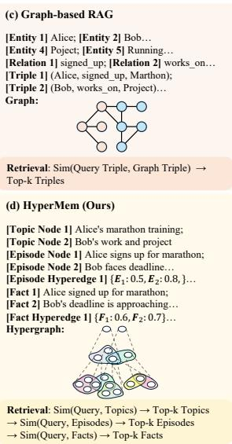
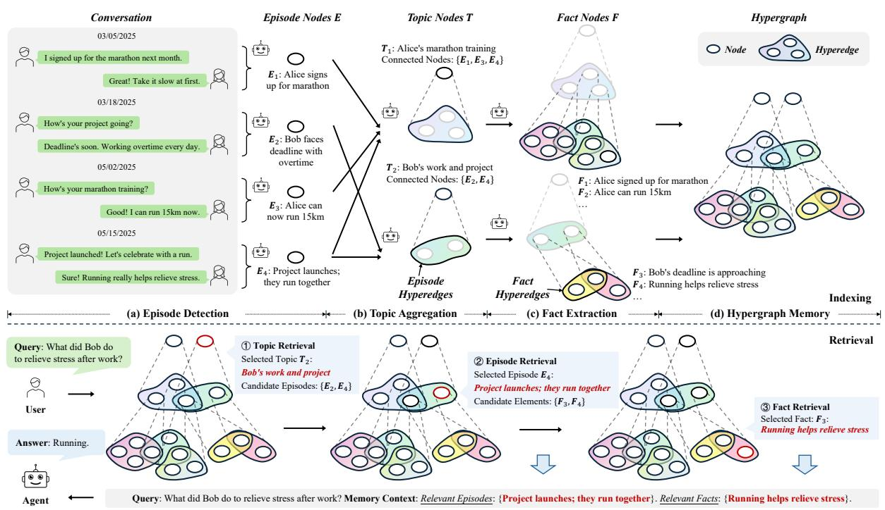
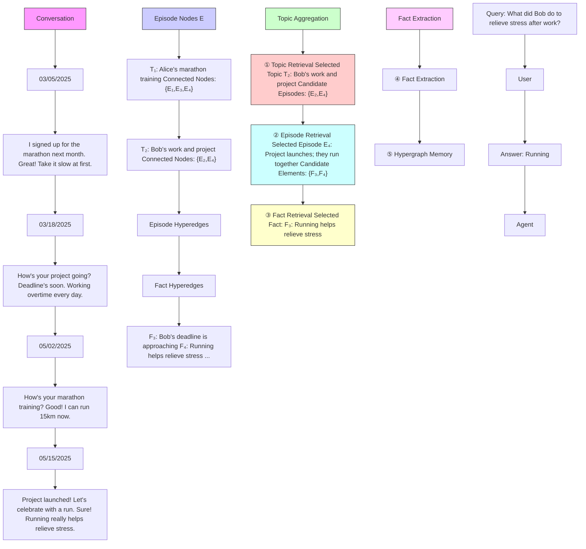
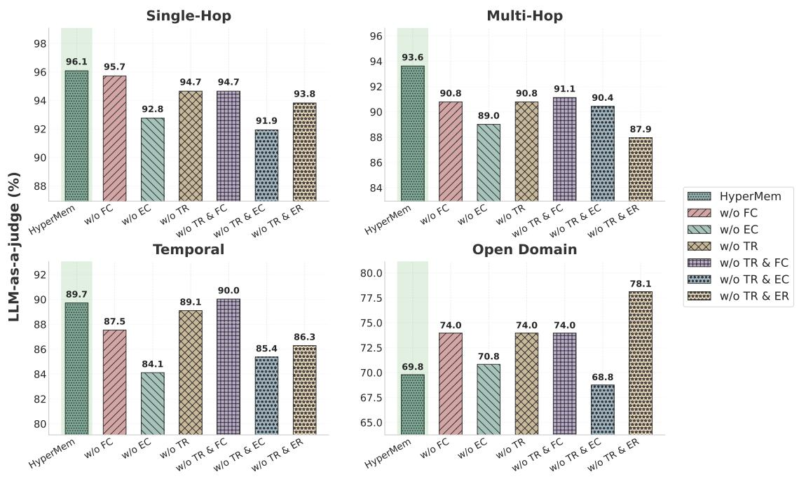
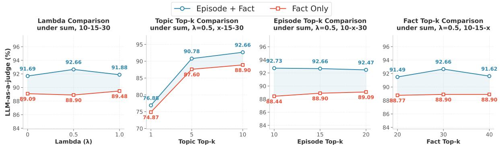
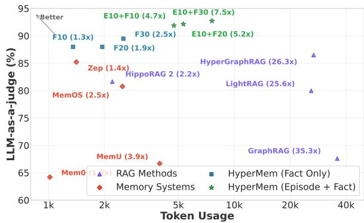

# HyperMem: Hypergraph Memory for Long-Term Conversations

# Juwei Yue\*1,2,3, Chuanrui Hu\*3, Jiawei Sheng†1,2, Zuyi Zhou3, Wenyuan Zhang1,2, Tingwen Liu1,2, Li Guo1,2, Yafeng Deng†3

1Institute of Information Engineering, Chinese Academy of Sciences 2School of Cyber Security, University of Chinese Academy of Science 3EverMind AI

{yuejuwei, shengjiawei}@iie.ac.cn, {chuanrui.hu, dengyafeng}@shanda.com

# Abstract

Long-term memory is essential for conversational agents to maintain coherence, track persistent tasks, and provide personalized interactions across extended dialogues. However, existing approaches as Retrieval-Augmented Generation (RAG) and graph-based memory mostly rely on pairwise relations, which can hardly capture high-order associations, i.e., joint dependencies among multiple elements, causing fragmented retrieval. To this end, we propose HyperMem, a hypergraph-based hierarchical memory architecture that explicitly models such associations using hyperedges. Particularly, HyperMem structures memory into three levels: topics, episodes, and facts, and groups related episodes and their facts via hyperedges, unifying scattered content into coherent units. Leveraging this structure, we design a hybrid lexical-semantic index and a coarse-to-fine retrieval strategy, supporting accurate and efficient retrieval of high-order associations. Experiments on the LoCoMo benchmark show that HyperMem achieves state-of-the-art performance with 92.73% LLM-as-a-judge accuracy, demonstrating the effectiveness of HyperMem for long-term conversations.

# 1 Introduction

Conversational agents (Zhang et al., 2025e) increasingly serve as long-term companions, requiring coherent multi-hop reasoning, persistent task tracking, and personalized interactions across extended dialogues. However, their fixed context windows render historical experiences inaccessible as conversations grow, necessitating effective and efficient long-term memory management (Li et al., 2025b; Hu et al., 2026; Zhang et al., 2026).

Existing approaches such as Retrieval-Augmented Generation (RAG) (Gao et al., 2023; Fan et al., 2024) and graph-based memory (Zhang et al., 2025a; Rasmussen et al., 2025) retrieve external stored related information to enrich the context in response to user queries. However, both paradigms fundamentally rely on pairwise relationships, which inherently fail to capture high-order associations, i.e., joint dependencies among three or more related content elements. As shown in Figure 1(a), a conversation may cover multiple topics such as sport and work. Episodes 1, 3, and 4 are jointly associated under the sport topic and involve multiple facts scattered throughout the dialogue. Conventional methods, as shown in Figure 1(b) and (c), can hardly model the holistic coherence among episodes and facts, leading to fragmented retrieval.

text_image

(a) Conversation
03/05/2025
I signed up for the marathon next month.
① Topic: sport
Great! Take it slow at first.
03/18/2025
How's your project going?
Deadline's soon. Working overtime every day.
② Topic: work
05/02/2025
How's your marathon training?
Good! I can run 15km now.
③ Topic: sport
Project launched! Let's celebrate with a run.
Sure! Running really helps relieve stress.
④ Topic: sport, work
05/15/2025
Project launched!
Sure!
⑤ Topic: sport, work
(b) Chunk-based RAG
[Chunk 1] Alice: I signed... Bob: Great! Take...
[Chunk 2] Alice: How's... Bob: Deadline's...
[Chunk 3] Bob: How's... Alice: Good! I...
[Chunk 4] Bob: Project... Alice: Sure! Running...
C1 C2 C3 C4
Retrieval: Sim(Query, Chunks) → Top-k Chunks

text_image

(c) Graph-based RAG
[Entity 1] Alice; [Entity 2] Bob...
[Entity 4] Poject; [Entity 5] Running...
[Relation 1] signed_up; [Relation 2] works_on...
[Triple 1] (Alice, signed_up, Marthon);
[Triple 2] (Bob, works_on, Project)...
Graph:
Retrieval: Sim(Query Triple, Graph Triple) → Top-k Triples
(d) HyperMem (Ours)
[Topic Node 1] Alice's marathon training;
[Topic Node 2] Bob's work and project
[Episode Node 1] Alice signs up for marathon;
[Episode Node 2] Bob faces deadline...
[Episode Hyperedge 1] {E₁: 0.5, E₂: 0.8,}...
[Fact 1] Alice signed up for marathon;
[Fact 2] Bob's deadline is approaching...
[Fact Hyperedge 1] {F₁: 0.6, F₂: 0.7}...
Hypergraph:
Retrieval: Sim(Query, Topics) → Top-k Topics
→ Sim(Query, Episodes) → Top-k Episodes
→ Sim(Query, Facts) → Top-k Facts

Figure 1: Memory structure comparison across Chunkbased RAG, Graph-based RAG, and our HyperMem.

To explicitly capture the above high-order associations, we model long-term memory as a hypergraph (Figure 1(d)). Unlike conventional graphs with pairwise edges, hypergraphs support hyperedges that connect arbitrary node sets, making them uniquely capable of modeling joint dependencies in dialogue. Our architecture, namely HyperMem, organizes a three-level memory hierarchy: (i) Topic nodes, representing key conversation themes; (ii) Episode nodes, denoting temporally contiguous dialogue segments centered on a single topic; and (iii) Fact nodes, encoding fine-grained details extracted from episodes. Thereafter, we use hyperedges to explicitly group all episodes sharing the same topic, as well as all facts belonging to the same episode. These hyperedges may naturally overlap across episodes and facts, reflecting the multifaceted nature of conversational content while preserving semantic coherence within each group. As a result, semantically scattered information is unified into coherent units, enabling complete and efficient retrieval of high-order associations.

To construct HyperMem, we first detect episode boundaries from the dialogue stream, then aggregate topically related episodes into shared topics using hyperedges, and finally extract fine-grained facts from each episode content. For indexing, we leverage lexical cues and exploit dense semantics with hypergraph embedding propagation. This enables semantically related memories, even if temporally distant, to derive aligned embeddings, thereby facilitating the retrieval of high-order associations. At retrieval time, HyperMem performs a coarse-tofine search: it first identifies relevant topics, then expands to their constituent episodes, and finally selects the most pertinent facts to construct a focused context for response generation. Our contributions are summarized as follows:

• We propose HyperMem, a pioneering three-level hypergraph memory architecture that explicitly models high-order associations via hyperedges, overcoming the limitations of pairwise relation methods to capture holistic coherence.   
• We leverage the HyperMem structure to derive accurate lexical and semantical indexing, and design a coarse-to-fine retrieval strategy to enable efficient early pruning of irrelevant context.   
• Experiments on the LoCoMo benchmark achieve state-of-the-art performance with 92.73% LLMas-a-judge accuracy, demonstrating the effectiveness of HyperMem for long-term conversations.

# 2 Related works

# 2.1 Retrieval-Augmented Generation

RAG has proven effective in mitigating hallucinations (Ayala and Béchard, 2024) and improving reliability (Xia et al., 2025; Asai et al., 2024), and also serve as a foundation for long-term memory in LLM-powered agents (Gutierrez et al., 2024; Gutiérrez et al., 2025; Lin et al., 2025).

Vanilla methods retrieve relevant fragments from external sources and use them as context for more grounded responses (Lewis et al., 2020; Kulkarni et al., 2024). To enrich relational structures, GraphRAG (Edge et al., 2024) pioneered knowledge graph construction, inspiring works (He et al., 2024; Hu et al., 2025b; Luo et al., 2024; Dong et al., 2024; Chen et al., 2025; Guo et al., 2025; Fan et al., 2025; Li et al., 2025a) that leverage graph topology for structure-aware reasoning and multihop retrieval. For hierarchical modeling, RAP-TOR (Sarthi et al., 2024), SiReRAG (Zhang et al., 2025c), and HiRAG (Huang et al., 2025) build tree-structured indices for multi-granular evidence integration. However, these methods rely on pairwise edges that cannot explicitly group multiple scattered yet semantically related memories.

Recent works (Luo et al., 2025; Feng et al., 2025; Sharma et al., 2024; Hu et al., 2025a) preliminarily explore hypergraphs to model multi-entity relations with hyperedges. However, these approaches are designed for static knowledge bases with determinate corpora, where agentic memory continuously evolves with ongoing dialogues. Besides, they lack a hierarchical retrieval mechanism capable of preserving semantic coherence across extended dialogues. Our work pioneers the hypergraph in structuring agentic memory, which has quite different problem settings and technical designs.

# 2.2 Memory System of Agents

Recent agents have used RAG to model long-term memory, where MemoryBank (Zhong et al., 2024), A-Mem (Xu et al., 2025), Mem0 (Chhikara et al., 2025), and Zep (Rasmussen et al., 2025) build structured or graph-based representations for persistence between sessions and tracking of the evolution of facts. G-Memory (Zhang et al., 2025a) and Light-Mem (Fang et al., 2025) further explore hierarchical structures and compression for efficiency.

In parallel, several approaches eschew explicit retrieval. MemGPT (Packer et al., 2023) and MemOS (Li et al., 2025b) draw on abstractions from operating systems with hierarchical memory and modular scheduling. MIRIX (Wang and Chen, 2025) coordinates multi-agent states via shared memory spaces, while Nemori (Nan et al., 2025) and MemGen (Zhang et al., 2025b) form compressible or generative latent representations. MemInsight (Salama et al., 2025), Mem1 (Zhou et al., 2025), Memory-R1 (Yan et al., 2025), and Mem-α (Wang et al., 2025) employ reinforcement learning to autonomously optimize memory storage and retrieval policies. In contrast, HyperMem explicitly groups topically related memories via hyperedges and employs topic-guided hierarchical retrieval to ensure relevance across temporal gaps.

flowchart

Figure 2: Framework of HyperMem. The indexing detects episode boundaries, aggregates topics via hyperedges, and extracts facts. The retrieval performs coarse-to-fine search from topics to episodes to facts.

# 3 Approach

In this section, we present the HyperMem architecture for long-term conversational agents, including hypergraph memory structure, hypergraph construction from dialogue streams, and hypergraphguided retrieval for response generation.

# 3.1 Hypergraph Memory Structure

To capture higher-order associations among related elements, we model memories with hypergraphs. Unlike conventional graphs limited to pairwise relations, hypergraphs connect multiple nodes via a single hyperedge. This enables richer relational modeling and naturally reflects the associative nature of human memory (Anderson and Bower, 2014).

To effectively organize this memory, we design a three-level hypergraph architecture, where hyperedges link nodes within each level:

• Topic-level: Captures dialogues sharing a common theme across long-term interactions, facilitating long-range topical associations.   
• Episode-level: Represents temporally contiguous dialogue segments that describe a coherent event or sub-conversation.   
• Fact-level: Encodes atomic facts extracted from episodes, serving as precise retrieval targets for query-based access.

Formally, given an input dialogue stream $X =$ $\{ x _ { t } \} _ { t = 1 } ^ { T }$ , we construct the memory hypergraph as:

$$
\mathcal {H} = (\mathcal {V} ^ {T} \cup \mathcal {V} ^ {E} \cup \mathcal {V} ^ {F},   \mathcal {E} ^ {E} \cup \mathcal {E} ^ {F}), \tag {1}
$$

where $\nu ^ { T } , \nu ^ { E } , \nu ^ { F }$ denote the topic, episode, and fact nodes, respectively. Here, hyperedges ${ \mathcal { E } } ^ { E }$ connect all episode nodes within the same topic along with each node weight $w ^ { E } \in [ 0 , 1 ]$ , while hyperedges $\mathcal { E } ^ { F }$ connect all fact nodes belonging to the same episode with the node weight $w ^ { F } \in [ 0 , 1 ]$ .

# 3.2 Hypergraph Memory Construction

To construct the hypergraph memory, we employ a three-stage process. We first detect episodes by segmenting the raw dialogue stream into atomic sequences, then aggregate topically related episodes into topics, and finally extract queryable informative facts grounded in their context.

# 3.2.1 Episode Detection

A dialogue stream often interweaves multiple events and shifts topics over time. Storing it as a monolithic block would obscure event boundaries and entangle events of interest with irrelevant context. To address this, we introduce Episode to enable precise event boundary preservation and isolate irrelevant content from dialogue context.

Method. To derive episodes, we design an LLMdriven streaming boundary detection mechanism. Consider an incoming dialogue stream $\begin{array} { r l } { X } & { { } = } \end{array}$ $\{ x _ { t } \} _ { t = 1 } ^ { T }$ . We employ a buffer H to pend the history, and determine if the incoming dialogue completes a coherent episode. Specifically, for each incoming $x _ { t } .$ , we add it to $\mathcal { H } _ { < t }$ and invoke an LLM-based boundary detector that evaluates: (1) semantic completeness of current buffer $\mathcal { H } _ { \leq t } , ( 2 )$ the time gap between consecutive dialogues, and (3) linguistic signals indicating topic transition or completion.

The detector outputs two signals: should\_end, i.e., the buffer forms a semantically complete event, and should\_wait, i.e., the event is still unfolding and requires further input. If should\_end is $\mathrm { i . e . , } v ^ { E } = ( v _ { \mathrm { d i a l o g u e } } ^ { E } , v _ { \mathrm { t i t l e } } ^ { E } , v _ { \mathrm { e p i s o d e } } ^ { E } )$ vEtitle, vEepisode) e Episo, where vEdialogue $v _ { \mathrm { d i a l o g u e } } ^ { E }$ stores the raw conversation turns, vEtitle $v _ { \mathrm { t i t l e } } ^ { E }$ abstracts a concise subject, and vE $v _ { \mathrm { e p i s o d e } } ^ { E }$ episode offers a brief narrative summary. The buffer is then cleared, and processing continues with subsequent dialogues. For the algorithm and prompt, see Algo. 1 and Figure 6.

Remark. In this way, we process dialogue streams incrementally and segment them into semantically coherent memory units. This reduces irrelevant context and also improves the convenience of topic organization and retrieval.

# 3.2.2 Topic Aggregation

Episodes capture event-level fragments within contiguous temporal windows. However, as shown in Figure 1, real-world narratives about a specific topic can also be temporally dispersed. Existing designs (Chhikara et al., 2025; Luo et al., 2025) usually isolate such correlated associations, making it difficult to retrieve the full narrative. To address this, we devise Topic to aggregate scattered episodes, and leverage hyperedges to connect multiple episodes that belong to the same topic.

Method. Practically, we design an LLM-driven streaming topic aggregation mechanism. Given the current target episode vEcur, $v _ { \mathrm { c u r } } ^ { E }$ Ucur， we retrieve historical similar episodes ${ \mathcal { C } } ^ { E }$ using lexical and semantic similarity (detailed in § 3.3.1). By comparing $v _ { \mathrm { c u r } } ^ { E }$ r with $\mathcal { C } ^ { E }$ , there are three cases to handle:

1. Topic Initialization. If $\cdot \mathcal { C } ^ { E } = \emptyset$ , we create a new topic $v ^ { T } = ( v _ { \mathrm { t i t l e } } ^ { T } , v _ { \mathrm { s u m m a r y } } ^ { T } )$ for $v _ { \mathrm { c u r } } ^ { E }$ . Here, $v _ { \mathrm { t i t l e } } ^ { T }$ e vTsummary and ing t $v _ { \mathrm { s u m m a r y } } ^ { T }$ are the title and summary ac-nerated by the LLM. $v _ { \mathrm { c u r } } ^ { E }$   
2. Topic Creation. If $\mathcal { C } ^ { E } \neq \emptyset$ but the potential topic of $v _ { \mathrm { c u r } } ^ { E }$ is different from the existing topics $\mathcal { C } ^ { E }$ create a new to, by comparing $v ^ { \star } =$ $( v _ { \mathrm { t i t l e } } ^ { T } , v _ { \mathrm { s u m m a r y } } ^ { T } )$ $v _ { \mathrm { c u r } } ^ { E } ,$ $v _ { \mathrm { c u r } } ^ { E }$ all episodes in ${ \mathcal { C } } ^ { E }$ by the LLM.   
3. Topic Update. If $\mathcal { C } ^ { E } \neq \emptyset$ and the potential topic of $v _ { \mathrm { c u r } } ^ { E }$ existed in $\mathcal { C } ^ { E }$ , we update each ating its metadata matched topic incorporating vEcur $v ^ { \hat { T } } = ( v _ { \mathrm { t i t l e } } ^ { T } , v _ { \mathrm { s u m m a r y } } ^ { T } )$ $v _ { \mathrm { c u t } } ^ { E }$ egener-.

After this process, we construct a hyperedge $e _ { t } ^ { E } \in$ ${ \mathcal { E } } ^ { E }$ linking the topic to all its constituent episodes, and the LLM assigns an importance weight $w _ { e , v } ^ { E } \in$ $[ 0 , 1 ]$ to each episode based on its contribution to the topic. For the algorithm and prompt, see Algo. 1 and Figure 7.

Remark. In this way, the resulting topic nodes act as semantic anchors of episodes potentially spanning weeks or months. This also enables comprehensive retrieval of entire narratives by query matching, regardless of temporal fragmentation.

# 3.2.3 Fact Extraction

Episodes preserve rich narrative context but often contain verbose dialogue that is inefficient for direct query answering. To enable query-oriented retrieval, we extract Facts with language expressions, the compact assertion grounded in episode context, as fine-grained memory units.

Method. Given a topic t and its associated episodes $\mathcal { V } _ { t } ^ { E }$ , we use an LLM to identify salient factual assertions, using the full topical context to avoid redundant or trivial extractions. $( v _ { \mathrm { c o n t e n t } } ^ { F } , v _ { \mathrm { p o t e n t i a l } } ^ { F } , v _ { \mathrm { k e y w o r d s } } ^ { F } )$ s form, where $v _ { \mathrm { c o n t e n t } } ^ { F }$ $v ^ { F }$ =ords potential keythe factual assertion, v lists query patterns $v _ { \mathrm { p o t e n t i a l } } ^ { F }$ tive alignment with user’s potential intents, and $v _ { \mathrm { k e y w o r d s } } ^ { F }$ captures representative terms to facilitate keyword-based retrieval. To maintain provenance, each fact is explicitly anchored to the original episode(s). For each episode $v ^ { E }$ , we construct a fact hyperedge $e ^ { F } \in \mathcal { E } ^ { F }$ that connects all the facts involved, with the LLM assigning an importance weight $w _ { e , v } ^ { F } \in [ 0 , 1 ]$ to reflect the relative importance of each fact. For the algorithm and prompt, see Algo. 1 and Figure 8.

Remark. In this way, the resulting fact nodes serve as atomic query-targeted units. Unlike raw dialogue for retrieval, vFpot $v _ { \mathrm { p o t e n t i a l } } ^ { F }$ ential anticipates relevant queries while $v _ { \mathrm { k e y w o r d s } } ^ { F }$ supports lexical search, alevidence rather than verbose transcripts.

# 3.3 Hypergraph Memory Retrieval

To respond to the user’s query, the agent retrieves relevant memories through a coarse-to-fine process that traverses from topic to episode to fact. This combines an offline indexing phase with an online retrieval strategy for practical usage.

# 3.3.1 Offline Index Construction

User queries often exhibit both lexical cues and semantic intent, which are crucial to accurately retrieve relevant memories. To fully leverage both signals, we construct dual indices for all node types, including topic, episode and fact: a sparse keyword-based index using BM25 (Robertson and Zaragoza, 2009), and a dense semantic index powered by Qwen3-Embedding-4B (Zhang et al., 2025d). Specifically, each node is first converted into a textual document for BM25 indexing to support exact keyword matching, and then encoded into a dense vector via the embedding model to capture deeper semantic similarity.

Hypergraph Embedding Propagation. The nodes linked by the same hyperedge share a common topical context, and are expected to acquire similar representations. To this end, we propose a lightweight embedding propagation process that enriches node embeddings by aggregating information from their incident hyperedges. First, we compute a hyperedge embedding as a weighted aggregation of its constituent node embeddings:

$$
\boldsymbol {h} _ {e} = \sum_ {v \in \mathcal {V} (e)} \alpha_ {e, v} \boldsymbol {h} _ {v},
$$

$$
\alpha_ {e, v} = \frac {\exp (w _ {e , v})}{\sum_ {u \in \mathcal {V} (e)} \exp (w _ {e , u})}, \tag {2}
$$

where $h _ { v }$ denotes the initial (dense) embedding of node $v ,$ and $w _ { e , v } \in [ 0 , 1 ]$ is the importance weight assigned during topic aggregation, e.g., by an LLM based on narrative contribution.

Next, we refine the representation of each node by aggregating the embeddings of all hyperedges in which it participates:

$$
\boldsymbol {h} _ {v} ^ {\prime} = \boldsymbol {h} _ {v} + \lambda \cdot \operatorname{Agg} _ {e \in \mathcal {N} (v)} (\boldsymbol {h} _ {e}), \tag {3}
$$

where $\mathcal { N } ( v )$ denotes the set of hyperedges incident to $v , \lambda \geq 0$ is a hyperparameter to control the strength of propagation, and Agg is an aggregation function, e.g., summation. See Algo. 2 for the algorithm.

Remark. This propagation mechanism is inspired by hypergraph neural networks (Feng et al., 2019), yet remains lightweight without large-scale fine-tuning. Empirical studies demonstrate its effectiveness. Besides, it enables semantically related memories to acquire aligned embeddings, which derive more informative embeddings and also facilitate high-order associations during retrieval.

# 3.3.2 Online Retrieval Strategy

Given a user query q, retrieval proceeds as a structured coarse-to-fine traversal with progressive topk selection at each level.

Stage 1: Topic Retrieval. We retrieve from the topic-level to establish the topical context. All topic nodes $\mathcal { V } ^ { T }$ are scored using both keyword and vector indices, with rankings fused via Reciprocal Rank Fusion (RRF):

$$
\mathrm{RRF} (d) = \sum_ {m = 1} ^ {M} \frac {1}{k + \operatorname{rank} _ {m} (d)} \tag {4}
$$

where m indexes individual rankers and k is a smoothing constant. The RRF-ranked candidates are then refined by a reranker model, which computes fine-grained query-document relevance scores to improve ranking precision. We select the $\mathrm { t o p } { - } k ^ { T }$ topic nodes as candidates, which filters out most irrelevant topical contexts.

Stage 2: Episode Retrieval. For each selected topic t, we expand to its constituent episodes $\mathcal { V } _ { t } ^ { E }$ via the episode-hyperedge $e _ { t } ^ { E }$ . Following Stage 1, the expanded episodes are scored via RRF and then refined by the reranker. We retain the $\mathrm { t o p } \cdot k ^ { E }$ episodes as the results. This stage ensures that only the query-relevant temporal segments within each topic are preserved.

Stage 3: Fact Retrieval. Finally, each retained episode e is expanded to its supporting facts $\mathcal { V } _ { e } ^ { F }$ through the fact hyperedge $e _ { e } ^ { F }$ . Following the same RRF-then-rerank pipeline, we select the top- $. k ^ { F }$ facts as the final retrieval result.

Final Response Generation. Instead of using verbose raw dialogue text, we construct the response context from the content fields of retrieved facts, optionally augmented with the summary fields of their sourced upper-level episodes for narrative context. This design significantly reduces token consumption while preserving answerable information. The constructed response context is input into the conversational agent, and the response is returned as the answer to the user query. See Algo. 3 for the algorithm.

# 4 Experiments

In this section, we conduct experiments to evaluate the effectiveness of our HyperMem.

# 4.1 Experimental Setup

Benchmark. LoCoMo (Maharana et al., 2024) is a benchmark dataset designed to evaluate longterm memory capabilities in conversational AI systems. It contains multi-session dialogues spanning several months, with four categories of questions: single-hop (direct fact retrieval), multi-hop (reasoning across multiple dialogue turns), temporal reasoning (time-related queries), and Open Domain (open-ended questions requiring broader context understanding).

Baselines. We compare our approach against representative methods from RAG and memory system. (1) RAG methods: RAG, GraphRAG (Edge et al., 2024), LightRAG (Guo et al., 2025), HippoRAG 2 (Gutiérrez et al., 2025), and HyperGraphRAG (Luo et al., 2025). (2) Memory system methods: OpenAI 1, LangMen 2 Zep (Rasmussen et al., 2025), A-Mem (Xu et al., 2025), Mem0 (Chhikara et al., 2025), Mem-Graph (Chhikara et al., 2025), MIRIX (Wang and Chen, 2025), Memobase 3, MemU 4, MemOS (Li et al., 2025b).

Implementation Details. We implement Hyper-Mem using Qwen3-Embedding-4B for semantic encoding and Qwen3-Reranker-4B for reranking. For answer generation, we employ GPT-4.1-mini with chain-of-thought prompting. In hierarchical retrieval, we first retrieve 100 initial candidates, then select top-10 Topics, top-10 Episodes, and top-30 Facts as the final context. Node embeddings are updated with a propagation weight λ = 0.5 to incorporate hyperedge information. For evaluation, we use GPT-4o-mini as the LLM judge and report the average scores across 3 independent runs.

# 4.2 Main Results

Table 1 presents the main results. HyperMem achieves the best overall accuracy of 92.73%, outperforming the strongest RAG method Hyper-GraphRAG (86.49%) by 6.24% and the best memory system MIRIX (85.38%) by 7.35%.

Regarding category-wise performance, HyperMem excels on reasoning-intensive tasks. On Single-hop questions, HyperMem achieves 96.08%, surpassing HyperGraphRAG by 5.47%, as the structured fact layer enables precise retrieval of atomic information. On Multi-hop questions requiring evidence aggregation across multiple dialogue segments, HyperMem reaches 93.62%, outperforming LightRAG by 9.58%, demonstrating that hyperedges effectively bind topically related episodes scattered across time for comprehensive evidence collection. On Temporal questions requiring cross-session reasoning, HyperMem attains 89.72%, benefiting from the episode layer’s preservation of temporal anchors and the hierarchical structure’s ability to trace event progression. Open Domain remains challenging for all methods due to broader knowledge requirements beyond the conversation history.

These improvements stem from two key designs. Hyperedges explicitly group topically related episodes, ensuring complete evidence retrieval for multi-hop reasoning. Meanwhile, topicguided hierarchical retrieval progressively narrows the candidate pool, filtering irrelevant context while preserving temporal coherence.

# 4.3 Ablation Study

As shown in Table 2 and Figure 3, we conduct ablation study to evaluate the contribution of each component in HyperMem. The results reveal that Episode context is the most critical component, as removing it (w/o EC) causes the largest performance drop (-3.76% overall), particularly affecting Temporal reasoning (-5.61%). The hierarchical retrieval mechanism also proves essential. Bypassing Topic retrieval (w/o TR) shows moderate impact, but completely flattening the hierarchy to Fact-only retrieval (w/o TR & ER) significantly degrades Multi-Hop performance (-5.68%), demonstrating that the hierarchical structure effectively maintains coherent information flow across granularity levels. Fact context primarily benefits Multi-Hop reasoning (-2.84% when removed). These findings validate that our three-level memory architecture and hierarchical retrieval strategy work synergistically to achieve optimal performance across diverse question types.

<table><tr><td>Methods</td><td>Single-hop</td><td>Multi-hop</td><td>Temporal</td><td>Open Domain</td><td>Overall</td></tr><tr><td>GraphRAG (Edge et al., 2024)</td><td>79.55</td><td>54.96</td><td>50.16</td><td>58.33</td><td>67.60</td></tr><tr><td>LightRAG (Guo et al., 2025)</td><td>86.68</td><td>84.04</td><td>60.75</td><td>71.88</td><td>79.87</td></tr><tr><td>HippoRAG 2 (Gutiérrez et al., 2025)</td><td>86.44</td><td>75.89</td><td>78.50</td><td>66.67</td><td>81.62</td></tr><tr><td>HyperGraphRAG (Luo et al., 2025)</td><td>90.61</td><td>80.85</td><td>85.36</td><td>70.83</td><td>86.49</td></tr><tr><td> $OpenAI^1$ </td><td>63.79</td><td>42.92</td><td>21.71</td><td>62.29</td><td>52.90</td></tr><tr><td> $LangMem^2$ </td><td>62.23</td><td>47.92</td><td>23.43</td><td>71.12</td><td>58.10</td></tr><tr><td>Zep (Rasmussen et al., 2025)</td><td>61.70</td><td>41.35</td><td>49.31</td><td>76.60</td><td>65.99</td></tr><tr><td>A-Mem (Xu et al., 2025)</td><td>39.79</td><td>18.85</td><td>49.91</td><td>54.05</td><td>48.38</td></tr><tr><td>Mem0 (Chhikara et al., 2025)</td><td>67.13</td><td>51.15</td><td>55.51</td><td>72.93</td><td>66.88</td></tr><tr><td> $Mem0^g$ (Chhikara et al., 2025)</td><td>65.71</td><td>47.19</td><td>58.13</td><td>75.71</td><td>68.44</td></tr><tr><td>MIRIX (Wang and Chen, 2025) $^†$ </td><td>85.11</td><td>83.70</td><td>88.39</td><td>65.62</td><td>85.38</td></tr><tr><td> $Memobase^3$ </td><td>73.12</td><td>64.65</td><td>81.20</td><td>53.12</td><td>72.01</td></tr><tr><td> $MemU^4$ </td><td>66.34</td><td>63.12</td><td>27.10</td><td>50.01</td><td>56.55</td></tr><tr><td>MemOS (Li et al., 2025b)</td><td>81.09</td><td>67.49</td><td>75.18</td><td>55.90</td><td>75.80</td></tr><tr><td>HyperMem (Ours)</td><td>96.08</td><td>93.62</td><td>89.72</td><td>70.83</td><td>92.73</td></tr></table>

Table 1: Comparison of HyperMem with RAG-based and memory system methods on the LoCoMo benchmark. Evaluation metric is LLM-as-a-judge accuracy (%) scored by GPT-4o-mini. † indicates results obtained using GPT-4.1-mini. Results for RAG-based methods are reproduced using their official implementations. Results for memory systems are primarily sourced from Chhikara et al. (2025); Wang and Chen (2025); Li et al. (2025b).

  
Figure 3: Ablation study across four question categories. FC: Fact context. EC: Episode context. TR: Topic-level retrieval. ER: Episode-level retrieval. The shaded region highlights the full HyperMem configuration.

# 4.4 Hyperparameter Analysis

We investigate the sensitivity of HyperMem to key hyperparameters across four dimensions. First, the fusion coefficient α = 0.5 achieves optimal performance (92.66%), indicating that balanced integration of semantic similarity and structural retrieval yields the best results. Second, topic top-k exhibits the most significant impact: increasing from k=1 to k=10 improves accuracy from 76.88% to 92.66% (+15.78%), demonstrating that adequate topical coverage is crucial for capturing relevant context. In contrast, episode top-k shows minimal sensitivity (92.73% at k=10 vs. 92.47% at k=20), suggesting the system is robust to this parameter. Fact top-k peaks at k=30 (92.66%) with slight degradation at higher values, indicating potential noise introduction from excessive fact retrieval. Notably, the “Fact + Episode” configuration consistently outperforms “Fact Only” by 3-4% across all settings, further validating the importance of episode-level context in our framework.

  
Figure 4: Hyperparameter sensitivity analysis on LoCoMo. We evaluate the impact of embedding fusion weight α and Top-k selection at each hierarchical level (Topic, Episode, Fact) on retrieval performance.

<table><tr><td>Configuration</td><td>Overall (%)</td><td> $\Delta$ </td></tr><tr><td>HyperMem</td><td>92.66</td><td>-</td></tr><tr><td>w/o FC</td><td>91.75</td><td>0.91  $\downarrow$ </td></tr><tr><td>w/o EC</td><td>88.90</td><td>3.76  $\downarrow$ </td></tr><tr><td>w/o TR</td><td>91.94</td><td>0.72  $\downarrow$ </td></tr><tr><td>w/o TR &amp; FC</td><td>91.75</td><td>0.91  $\downarrow$ </td></tr><tr><td>w/o TR &amp; EC</td><td>88.83</td><td>3.83  $\downarrow$ </td></tr><tr><td>w/o TR &amp; ER</td><td>90.19</td><td>2.47  $\downarrow$ </td></tr></table>

Table 2: Ablation study. FC: Fact Context, EC: Episode Context, TR: Topic Retrieval, ER: Episode Retrieval.

# 4.5 Efficient Analysis

Figure 5 shows the efficiency-accuracy trade-off. HyperMem achieves optimal 92.73% accuracy at 7.5x tokens with the “Episode + Fact” configuration, while the “Fact Only” configuration already reaches 89.48% at merely 2.5x tokens, both substantially outperforming RAG-based methods that require 25-35x tokens for lower accuracy (GraphRAG: 67.60% at 35.3x, HyperGraphRAG: 86.49% at 26.3x). The “Episode + Fact” configuration consistently outperforms “Fact Only” by 3-4%, demonstrating that episode summaries provide crucial semantic guidance that cannot be compensated by retrieving more facts.

scatter

| Model | Token Usage | LLM-as-a-judge (%) | Method |
|-------|-------------|---------------------|--------|
| Mem0 | 1k | 65 | Memory Systems |
| MemU | 2k | 67 | Memory Systems |
| MemOS | 2.5x | 80 | Memory Systems |
| Zep | 1.4x | 85 | Memory Systems |
| F10 | 1.3x | 88 | HyperMem (Fact Only) |
| F20 | 1.9x | 88 | HyperMem (Fact Only) |
| HippoRAG 2 | 2.2x | 81 | HyperMem (Fact Only) |
| F30 | 2.5x | 90 | HyperMem (Fact Only) |
| E10+F10 | 4.7x | 91 | HyperMem (Episode + Fact) |
| E10+F20 | 5.2x | 92 | HyperMem (Episode + Fact) |
| LightRAG | 25.6x | 80 | RAG Methods |
| GraphRAG | 35.3x | 68 | RAG Methods |
| HyperGraphRAG | 26.3x | 85 | RAG Methods |
| Better | - | - | HyperMem (Episode + Fact) |

Figure 5: Token usage vs. accuracy comparison. The x-axis shows relative token usage (Mem0 as 1.0× baseline), and the y-axis shows LLM-as-a-judge accuracy.

# 5 Conclusion

In this paper, we propose a hypergraph-based agentic memory architecture, namely HyperMem. It explicitly models high-order associations among topics, episodes, and facts, overcoming the pairwise limitations of existing RAG and graph-based methods. By organizing memory hierarchically and linking related elements via hyperedges, Hyper-Mem unifies scattered dialogue content into coherent units. This enables effective lexical-semantic indexing with hypergraph embedding propagation and efficient coarse-to-fine retrieval. On the Lo-CoMo benchmark, HyperMem achieves state-ofthe-art 92.73% LLM-as-a-judge accuracy, demonstrating its strength in long-term conversations. 5

# Limitations

The current design assumes a single-user scenario, and extending to multi-user or multi-agent settings presents challenges in access control and memory isolation. Additionally, Open Domain questions remain challenging as they often require external knowledge beyond the conversation history, suggesting opportunities for integrating external knowledge bases.

# References

John R Anderson and Gordon H Bower. 2014. Human associative memory. Psychology press.   
Akari Asai, Zeqiu Wu, Yizhong Wang, Avirup Sil, and Hannaneh Hajishirzi. 2024. Self-rag: Learning to retrieve, generate, and critique through self-reflection. In The Twelfth International Conference on Learning Representations, ICLR 2024, Vienna, Austria, May 7-11, 2024. OpenReview.net.   
Orlando Ayala and Patrice Béchard. 2024. Reducing hallucination in structured outputs via retrievalaugmented generation. In Proceedings of the 2024 Conference of the North American Chapter of the Association for Computational Linguistics: Human Language Technologies: Industry Track, NAACL 2024, Mexico City, Mexico, June 16-21, 2024, pages 228–238. Association for Computational Linguistics.   
Boyu Chen, Zirui Guo, Zidan Yang, Yuluo Chen, Junze Chen, Zhenghao Liu, Chuan Shi, and Cheng Yang. 2025. Pathrag: Pruning graph-based retrieval augmented generation with relational paths. CoRR, abs/2502.14902.   
Prateek Chhikara, Dev Khant, Saket Aryan, Taranjeet Singh, and Deshraj Yadav. 2025. Mem0: Building production-ready AI agents with scalable long-term memory. CoRR, abs/2504.19413.   
Jialin Dong, Bahare Fatemi, Bryan Perozzi, Lin F. Yang, and Anton Tsitsulin. 2024. Don’t forget to connect! improving RAG with graph-based reranking. CoRR, abs/2405.18414.   
Darren Edge, Ha Trinh, Newman Cheng, Joshua Bradley, Alex Chao, Apurva Mody, Steven Truitt, and Jonathan Larson. 2024. From local to global: A graph RAG approach to query-focused summarization. CoRR, abs/2404.16130.   
Tianyu Fan, Jingyuan Wang, Xubin Ren, and Chao Huang. 2025. Minirag: Towards extremely simple retrieval-augmented generation. CoRR, abs/2501.06713.   
Wenqi Fan, Yujuan Ding, Liangbo Ning, Shijie Wang, Hengyun Li, Dawei Yin, Tat-Seng Chua, and Qing Li. 2024. A survey on RAG meeting llms: Towards

retrieval-augmented large language models. In Proceedings of the 30th ACM SIGKDD Conference on Knowledge Discovery and Data Mining, KDD 2024, Barcelona, Spain, August 25-29, 2024, pages 6491– 6501. ACM.   
Jizhan Fang, Xinle Deng, Haoming Xu, Ziyan Jiang, Yuqi Tang, Ziwen Xu, Shumin Deng, Yunzhi Yao, Mengru Wang, Shuofei Qiao, Huajun Chen, and Ningyu Zhang. 2025. Lightmem: Lightweight and efficient memory-augmented generation. CoRR, abs/2510.18866.   
Yifan Feng, Hao Hu, Xingliang Hou, Shiquan Liu, Shihui Ying, Shaoyi Du, Han Hu, and Yue Gao. 2025. Hyper-rag: Combating LLM hallucinations using hypergraph-driven retrieval-augmented generation. CoRR, abs/2504.08758.   
Yifan Feng, Haoxuan You, Zizhao Zhang, Rongrong Ji, and Yue Gao. 2019. Hypergraph neural networks. In Proceedings of the AAAI conference on artificial intelligence, volume 33, pages 3558–3565.   
Yunfan Gao, Yun Xiong, Xinyu Gao, Kangxiang Jia, Jinliu Pan, Yuxi Bi, Yi Dai, Jiawei Sun, Qianyu Guo, Meng Wang, and Haofen Wang. 2023. Retrievalaugmented generation for large language models: A survey. CoRR, abs/2312.10997.   
Zirui Guo, Lianghao Xia, Yanhua Yu, Tu Ao, and Chao Huang. 2025. LightRAG: Simple and fast retrievalaugmented generation. In Findings of the Association for Computational Linguistics: EMNLP 2025, pages 10746–10761, Suzhou, China. Association for Computational Linguistics.   
Bernal Jimenez Gutierrez, Yiheng Shu, Yu Gu, Michihiro Yasunaga, and Yu Su. 2024. Hipporag: Neurobiologically inspired long-term memory for large language models. In Advances in Neural Information Processing Systems 38: Annual Conference on Neural Information Processing Systems 2024, NeurIPS 2024, Vancouver, BC, Canada, December 10 - 15, 2024.   
Bernal Jiménez Gutiérrez, Yiheng Shu, Weijian Qi, Sizhe Zhou, and Yu Su. 2025. From RAG to memory: Non-parametric continual learning for large language models. In Forty-second International Conference on Machine Learning, ICML 2025, Vancouver, BC, Canada, July 13-19, 2025. OpenReview.net.   
Xiaoxin He, Yijun Tian, Yifei Sun, Nitesh V. Chawla, Thomas Laurent, Yann LeCun, Xavier Bresson, and Bryan Hooi. 2024. G-retriever: Retrieval-augmented generation for textual graph understanding and question answering. In Advances in Neural Information Processing Systems 38: Annual Conference on Neural Information Processing Systems 2024, NeurIPS 2024, Vancouver, BC, Canada, December 10 - 15, 2024.   
Chuanrui Hu, Xingze Gao, Zuyi Zhou, Dannong Xu, Yi Bai, Xintong Li, Hui Zhang, Tong Li, Chong

Zhang, Lidong Bing, and Yafeng Deng. 2026. Evermemos: A self-organizing memory operating system for structured long-horizon reasoning. CoRR, abs/2601.02163.   
Hao Hu, Yifan Feng, Ruoxue Li, Rundong Xue, Xingliang Hou, Zhiqiang Tian, Yue Gao, and Shaoyi Du. 2025a. Cog-rag: Cognitive-inspired dual-hypergraph with theme alignment retrievalaugmented generation. CoRR, abs/2511.13201.   
Yuntong Hu, Zhihan Lei, Zheng Zhang, Bo Pan, Chen Ling, and Liang Zhao. 2025b. GRAG: graph retrieval-augmented generation. In Findings of the Association for Computational Linguistics: NAACL 2025, Albuquerque, New Mexico, USA, April 29 - May 4, 2025, pages 4145–4157. Association for Computational Linguistics.   
Haoyu Huang, Yongfeng Huang, Junjie Yang, Zhenyu Pan, Yongqiang Chen, Kaili Ma, Hongzhi Chen, and James Cheng. 2025. Retrieval-augmented generation with hierarchical knowledge. CoRR, abs/2503.10150.   
Mandar Kulkarni, Praveen Tangarajan, Kyung Kim, and Anusua Trivedi. 2024. Reinforcement learning for optimizing RAG for domain chatbots. CoRR, abs/2401.06800.   
Patrick Lewis, Ethan Perez, Aleksandra Piktus, Fabio Petroni, Vladimir Karpukhin, Naman Goyal, Heinrich Küttler, Mike Lewis, Wen-tau Yih, Tim Rocktäschel, Sebastian Riedel, and Douwe Kiela. 2020. Retrieval-augmented generation for knowledgeintensive NLP tasks. In Advances in Neural Information Processing Systems 33: Annual Conference on Neural Information Processing Systems 2020, NeurIPS 2020, December 6-12, 2020, virtual.   
Mufei Li, Siqi Miao, and Pan Li. 2025a. Simple is effective: The roles of graphs and large language models in knowledge-graph-based retrieval-augmented generation. In The Thirteenth International Conference on Learning Representations, ICLR 2025, Singapore, April 24-28, 2025. OpenReview.net.   
Zhiyu Li, Shichao Song, Chenyang Xi, Hanyu Wang, Chen Tang, Simin Niu, Ding Chen, Jiawei Yang, Chunyu Li, Qingchen Yu, Jihao Zhao, Yezhaohui Wang, Peng Liu, Zehao Lin, Pengyuan Wang, Jiahao Huo, Tianyi Chen, Kai Chen, Kehang Li, and 20 others. 2025b. Memos: A memory OS for AI system. CoRR, abs/2507.03724.   
Xiaoqiang Lin, Aritra Ghosh, Bryan Kian Hsiang Low, Anshumali Shrivastava, and Vijai Mohan. 2025. RE-FRAG: rethinking RAG based decoding. CoRR, abs/2509.01092.   
Haoran Luo, Haihong E, Guanting Chen, Yandan Zheng, Xiaobao Wu, Yikai Guo, Qika Lin, Yu Feng, Ze-min Kuang, Meina Song, Yifan Zhu, and Luu Anh Tuan. 2025. Hypergraphrag: Retrieval-augmented generation with hypergraph-structured knowledge representation. CoRR, abs/2503.21322.

Linhao Luo, Yuan-Fang Li, Gholamreza Haffari, and Shirui Pan. 2024. Reasoning on graphs: Faithful and interpretable large language model reasoning. In The Twelfth International Conference on Learning Representations, ICLR 2024, Vienna, Austria, May 7-11, 2024. OpenReview.net.   
Adyasha Maharana, Dong-Ho Lee, Sergey Tulyakov, Mohit Bansal, Francesco Barbieri, and Yuwei Fang. 2024. Evaluating very long-term conversational memory of LLM agents. In Proceedings of the 62nd Annual Meeting of the Association for Computational Linguistics (Volume 1: Long Papers), ACL 2024, Bangkok, Thailand, August 11-16, 2024, pages 13851–13870. Association for Computational Linguistics.   
Jiayan Nan, Wenquan Ma, Wenlong Wu, and Yize Chen. 2025. Nemori: Self-organizing agent memory inspired by cognitive science. CoRR, abs/2508.03341.   
Charles Packer, Vivian Fang, Shishir G. Patil, Kevin Lin, Sarah Wooders, and Joseph E. Gonzalez. 2023. Memgpt: Towards llms as operating systems. CoRR, abs/2310.08560.   
Preston Rasmussen, Pavlo Paliychuk, Travis Beauvais, Jack Ryan, and Daniel Chalef. 2025. Zep: A temporal knowledge graph architecture for agent memory. CoRR, abs/2501.13956.   
Stephen E. Robertson and Hugo Zaragoza. 2009. The probabilistic relevance framework: BM25 and beyond. Found. Trends Inf. Retr., 3(4):333–389.   
Rana Salama, Jason Cai, Michelle Yuan, Anna Currey, Monica Sunkara, Yi Zhang, and Yassine Benajiba. 2025. Meminsight: Autonomous memory augmentation for LLM agents. CoRR, abs/2503.21760.   
Parth Sarthi, Salman Abdullah, Aditi Tuli, Shubh Khanna, Anna Goldie, and Christopher D. Manning. 2024. RAPTOR: recursive abstractive processing for tree-organized retrieval. In The Twelfth International Conference on Learning Representations, ICLR 2024, Vienna, Austria, May 7-11, 2024. OpenReview.net.   
Kartik Sharma, Peeyush Kumar, and Yunqing Li. 2024. OG-RAG: ontology-grounded retrieval-augmented generation for large language models. CoRR, abs/2412.15235.   
Yu Wang and Xi Chen. 2025. MIRIX: multi-agent memory system for llm-based agents. CoRR, abs/2507.07957.   
Yu Wang, Ryuichi Takanobu, Zhiqi Liang, Yuzhen Mao, Yuanzhe Hu, Julian J. McAuley, and Xiaojian Wu. 2025. Mem-α: Learning memory construction via reinforcement learning. CoRR, abs/2509.25911.   
Yuan Xia, Jingbo Zhou, Zhenhui Shi, Jun Chen, and Haifeng Huang. 2025. Improving retrieval augmented language model with self-reasoning. In AAAI-25, Sponsored by the Association for the Advancement of Artificial Intelligence, February 25 -

March 4, 2025, Philadelphia, PA, USA, pages 25534– 25542. AAAI Press.   
Wujiang Xu, Zujie Liang, Kai Mei, Hang Gao, Juntao Tan, and Yongfeng Zhang. 2025. A-MEM: agentic memory for LLM agents. CoRR, abs/2502.12110.   
Sikuan Yan, Xiufeng Yang, Zuchao Huang, Ercong Nie, Zifeng Ding, Zonggen Li, Xiaowen Ma, Hinrich Schütze, Volker Tresp, and Yunpu Ma. 2025. Memory-r1: Enhancing large language model agents to manage and utilize memories via reinforcement learning. CoRR, abs/2508.19828.   
Guibin Zhang, Muxin Fu, Guancheng Wan, Miao Yu, Kun Wang, and Shuicheng Yan. 2025a. G-memory: Tracing hierarchical memory for multi-agent systems. CoRR, abs/2506.07398.   
Guibin Zhang, Muxin Fu, and Shuicheng Yan. 2025b. Memgen: Weaving generative latent memory for selfevolving agents. CoRR, abs/2509.24704.   
Nan Zhang, Prafulla Kumar Choubey, Alexander R. Fabbri, Gabriel Bernadett-Shapiro, Rui Zhang, Prasenjit Mitra, Caiming Xiong, and Chien-Sheng Wu. 2025c. Sirerag: Indexing similar and related information for multihop reasoning. In The Thirteenth International Conference on Learning Representations, ICLR 2025, Singapore, April 24-28, 2025. OpenReview.net.   
Wenyuan Zhang, Xinghua Zhang, Haiyang Yu, Shuaiyi Nie, Bingli Wu, Juwei Yue, Tingwen Liu, and Yongbin Li. 2026. Expseek: Self-triggered experience seeking for web agents. Preprint, arXiv:2601.08605.   
Yanzhao Zhang, Mingxin Li, Dingkun Long, Xin Zhang, Huan Lin, Baosong Yang, Pengjun Xie, An Yang, Dayiheng Liu, Junyang Lin, Fei Huang, and Jingren Zhou. 2025d. Qwen3 embedding: Advancing text embedding and reranking through foundation models. CoRR, abs/2506.05176.   
Zeyu Zhang, Quanyu Dai, Xiaohe Bo, Chen Ma, Rui Li, Xu Chen, Jieming Zhu, Zhenhua Dong, and Ji-Rong Wen. 2025e. A survey on the memory mechanism of large language model-based agents. ACM Trans. Inf. Syst., 43(6):155:1–155:47.   
Wanjun Zhong, Lianghong Guo, Qiqi Gao, He Ye, and Yanlin Wang. 2024. Memorybank: Enhancing large language models with long-term memory. In Thirty-Eighth AAAI Conference on Artificial Intelligence, AAAI 2024, Thirty-Sixth Conference on Innovative Applications of Artificial Intelligence, IAAI 2024, Fourteenth Symposium on Educational Advances in Artificial Intelligence, EAAI 2014, February 20-27, 2024, Vancouver, Canada, pages 19724– 19731. AAAI Press.   
Zijian Zhou, Ao Qu, Zhaoxuan Wu, Sunghwan Kim, Alok Prakash, Daniela Rus, Jinhua Zhao, Bryan Kian Hsiang Low, and Paul Pu Liang. 2025. MEM1: learning to synergize memory and reasoning for efficient long-horizon agents. CoRR, abs/2506.15841.

# A Algorithm

As shown in Algorithm 1, 2, and 3, we provide detailed pseudocode for HyperMem’s core procedures.

# B Prompt Templates

We present the key prompt templates used in HyperMem. Figure 6 shows the episode boundary detection prompt. Figure 7 describes the topic aggregation prompt for linking related episodes. Figure 8 presents the fact extraction prompt for distilling key information from episodes.

# C Case Study

We present four representative cases from the Lo-CoMo benchmark to illustrate how HyperMem addresses different query types where baselines fail.

Single-Hop Task (Figure 9). This case asks “What new activity did Maria start recently, as mentioned on 3 June, 2023?” GraphRAG confuses “dog shelter” with “homeless shelter,” while Hyper-GraphRAG retrieves “aerial yoga” from a different time period. HyperMem’s hierarchical retrieval navigates through Topic and Episode layers to retrieve the exact Fact containing “volunteering at a local dog shelter,” directly matching the golden answer.

Multi-Hop Task (Figure 10). Answering “How many tournaments has Nate won?” requires aggregating evidence from 7 sessions spanning 10 months. GraphRAG only identifies “at least two” due to its pairwise edge structure fragmenting related memories across time. HyperMem’s Topic hyperedge groups all tournament-related Episodes under a unified thematic anchor, correctly answering “seven tournaments” with precise dates for each.

Temporal Reasoning Task (Figure 11). For the query “How many pets did Andrew have, as of September 2023?” GraphRAG claims Andrew had no pets by confusing him with another person, while HyperGraphRAG overcounts with “four pets.” HyperMem correctly answers “one pet dog named Toby” because its Episode layer preserves temporal anchors and enables accurate state reconstruction at the queried time point.

Open Domain Task (Figure 12). For “Would John be open to moving to another country?” HyperGraphRAG incorrectly answers “Yes” based on superficial travel mentions. HyperMem correctly infers “No” by synthesizing evidence about John’s military aspirations and political campaign goals that anchor him to the U.S. The potential field in Fact nodes anticipates such inference patterns.

Algorithm 1 Hypergraph Memory Construction   
1: Input: Dialogue stream $X = \{x_t\}_{t=1}^T$ 2: Output: Hypergraph H
3: Initialize $V^T, V^E, V^F, E^E, E^F \leftarrow \emptyset$ , buffer $B \leftarrow \emptyset$ ▷ Stage 1: Episode Detection
4: for each incoming dialogue $x_t \in X$ do
5: $B \leftarrow B \cup \{x_t\}$ 6: Boundary detection: (end, wait) ← LLM(B)
7: if end = True then
8: $v^E \leftarrow CREATEEPISODE(B)$ 9: $V^E \leftarrow V^E \cup \{v^E\}, B \leftarrow \emptyset$ 10: end if
11: end for

▷ Stage 2: Topic Aggregation   
12: for each new episode $v_{cur}^{E} \in V^{E}$ do
13:    Episode Matching: $C^{E} \leftarrow LLM(v_{cur}^{E})$ 14:    if $C^{E} = \emptyset$ (Case 1: Topic Initialization) then
15: $v^{T} \leftarrow \text{CREATETOPIC}(v_{\text{cur}}^{E})$ 16: $V^{T} \leftarrow V^{T} \cup \{v^{T}\}$ 17:    else
18:    Topic Matching: $C^{T} \leftarrow LLM(C^{E}, v_{cur}^{E})$ 19:    if $C^{T} = \emptyset$ (Case 2: New Topic) then
20: $v^{T} \leftarrow \text{CREATETOPIC}(C^{E}, v_{cur}^{E})$ 21: $V^{T} \leftarrow V^{T} \cup \{v^{T}\}$ 22:    else (Case 3: Topic Update)
23:    UPDATETOPICS( $C^{T}, v_{cur}^{E}$ )
24:    end if
25:    end if
26: $e_{t}^{E} \leftarrow (v^{T}, \text{GETEPISODES}(v^{T}), w^{E})$ 27: $E^{E} \leftarrow E^{E} \cup \{e_{t}^{E}\}$ 28: end for

▷ Stage 3: Fact Extraction   
29: for each topic $v^{T} \in V^{T}$ do
30: $\mathcal{V}_{t}^{E} \leftarrow \text{GETEPISODES}(v^{T})$ 31: Fact Extraction: $F_{t} \leftarrow \text{LLM}(v^{T}, \mathcal{V}_{t}^{E})$ 32: for each fact $v_{t}^{F} \in F_{t}$ do
33: $V_{t}^{F} \leftarrow V_{t}^{F} \cup \{v_{t}^{F}\}$ 34: Anchor $v_{t}^{F}$ to its source episode(s)
35: end for
36: for each episode $v_{t}^{E} \in V_{t}^{E}$ do
37: $e_{t}^{F} \leftarrow (v_{t}^{E}, \text{GETFACTS}(v_{t}^{E}), w^{F})$ 38: $E_{t}^{F} \leftarrow E_{t}^{F} \cup \{e_{t}^{F}\}$ 39: end for
40: end for
41: return $\mathcal{H} = (\mathcal{V}^{T} \cup \mathcal{V}^{E} \cup \mathcal{V}^{F}, \mathcal{E}^{E} \cup \mathcal{E}^{F})$

Algorithm 2 Offline Index Construction   
1: Input: Hypergraph H
2: Output: Indexed hypergraph with propagated embeddings
▷ Node Indexing
3: for each node $v \in V^{T} \cup V^{E} \cup V^{F}$ do
4: Build BM25 and vector index for v
5: $h_{v} \leftarrow \text{ENCODE}(v)$ 6: end for
▷ Hyperedge Embedding
7: for each hyperedge $e \in E^{E} \cup E^{F}$ do
8: $h_{e} \leftarrow \sum_{v \in e} \alpha_{e,v} h_{v}$ 9: end for
▷ Embedding Propagation
10: for each node v do
11: $h'_{v} \leftarrow h_{v} + \lambda \cdot \text{AGG}_{e \in \mathcal{N}(v)}(h_{e})$ 12: end for

Algorithm 3 Online Retrieval Strategy   
1: Input: Query q, Indexed H, Top-k: $(k^{T}, k^{E}, k^{F})$ 2: Output: Retrieved context R
3: $q \leftarrow \text{ENCODE}(q)$ ▷ Stage 1: Topic Retrieval
4: for each $v^{T} \in V^{T}$ do
5: $s^{T} \leftarrow \text{RRF(BM25}(q, v^{T}), \text{Cos}(\boldsymbol{q}, \boldsymbol{h}_{v^{T}}^{\prime}))$ 6: end for
7: $T_{\text{top}} \leftarrow \text{TOPK}(\mathcal{V}^{T}, s^{T}, k^{T})$

▷ Stage 2: Episode Retrieval   
8: $\mathcal{V}_{t}^{E} \leftarrow \bigcup_{t \in \mathcal{T}_{\text{top}}} \text{GETEPISODES}(t)$ 9: for each $v_{t}^{E} \in V_{t}^{E}$ do
10: $s_{t}^{E} \leftarrow \text{RRF(BM25}(q, v_{t}^{E}), \text{Cos}(\boldsymbol{q}, \boldsymbol{h}_{v_{t}^{E}}^{\prime}))$ 11: end for
12: $\mathcal{E}_{\text{top}} \leftarrow \text{TOPK}(\mathcal{V}_{t}^{E}, s_{t}^{E}, k^{E})$ ▷ Stage 3: Fact Retrieval
13: $V_{t,e}^{F} \leftarrow \bigcup_{e \in \mathcal{E}_{\text{top}}} \text{GETFACTS}(e)$ 14: for each $v_{t,e}^{F} \in V_{t,e}^{F}$ do
15: $s_{t,e}^{F} \leftarrow \text{RRF(BM25}(q, v_{t,e}^{F}), \text{Cos}(\boldsymbol{q}, \boldsymbol{h}_{v_{t,e}^{\prime}}^{\prime}))$ 16: end for
17: $F_{\text{top}} \leftarrow \text{TOPK}(\mathcal{V}_{t,e}^{F}, s_{t,e}^{F}, k^{F})$ 18: return $R \leftarrow \text{COMPOSE}(\mathcal{E}_{\text{top}}, \mathcal{F}_{\text{top}})$

# Episode Detection

You are an episodic memory boundary detection expert. Determine if the newly added dialogue should end the current episode and start a new one.

Input: Conversation history: {history} Time gap info: {time\_gap} New messages: {new\_messages}

# Decision Criteria:

1. Substantive Topic Change (Highest Priority): Do new messages introduce a completely different substantive topic? Is there a shift from one specific event to another distinct event?   
2. Intent and Purpose Transition: Has the fundamental purpose of the conversation changed significantly? Has the core question been fully resolved and a new substantial topic begun?   
3. Temporal Signals: Significant time gap between messages (hours or days)? Long gaps strongly suggest new episodes.   
4. Structural Signals: Clear concluding statements followed by genuinely new topics? Explicit topic transition phrases?

Special Rules: Greetings + Topic = ONE episode; Ignore social formalities and pleasantries; Closures (“Thanks!”, “Take care!”) stay with current episode.

Output: {should\_end: bool, should\_wait: bool, confidence: float, topic\_summary: str}

Figure 6: Prompt template of episode boundary detection.

# Topic Aggregation

You are an expert in identifying whether Episodes describe the SAME situation/event/theme. Your task: identify which historical Episodes describe the SAME situation as the new Episode.

Input: New Episode: {new\_episode} Historical Episodes: {history\_episodes} Existing Topics: {existing\_topics}

Same Situation Criteria (ALL must be met):

1. Same Specific Event/Theme: E.g., “Jon’s career transition” at different stages. NOT just related topics—“Jon’s business” and “Gina’s business” are DIFFERENT situations.   
2. Narrative Continuity: Later Episode continues/develops the earlier event. E.g., “Started $\mathbf { X } ^ { \ast } $ “X encountered problem” → “X succeeded” = SAME situation.   
3. Identity of Core Subject: Same specific person’s journey, same specific project/initiative, same specific relationship. NOT just same people or same topic category.   
4. Temporal Tolerance: Same situation CAN span multiple time points (weeks or months). Look for recurring discussions or multi-stage developments across time.

Aggregation Cases: ${ \mathcal { C } } ^ { E } = \emptyset \Rightarrow$ Create new Topic; ${ \mathcal { C } } ^ { E } \neq \varnothing , { \mathcal { C } } ^ { T } = \varnothing \Rightarrow \operatorname { A }$ ggregate into new Topic; ${ \mathcal { C } } ^ { T } \neq \emptyset \Rightarrow$ Update existing Topic.

Output: {title: str, summary: str, keywords: list, episode\_weights: dict}

Figure 7: Prompt templates of topic aggregation.

# Fact Extraction

You are an expert in extracting queryable facts from Episodes within a Topic context. Extract atomic, structured facts designed to directly surface answerable evidence.

Input: Topic: {topic} Episodes in this Topic: {episodes}

# Extraction Guidelines:

1. Answerable Facts: Focus on facts that directly answer queries, not narrative context. Each Fact should be a standalone, queryable assertion.   
2. Provenance: Maintain explicit links to source Episodes for traceability. Every Fact is anchored to the Episodes from which it originates.   
3. Query Anticipation: Predict potential queries this fact can answer. Store query patterns in the potential field for proactive retrieval alignment.   
4. Importance Weights: Assign salience scores w ∈ [0, 1] based on relevance to the Topic, reflecting each Fact’s contribution.

Output: {content: str, potential: str, keywords: list, importance\_weight: float}

Figure 8: Prompt templates of fact extraction.

# Conversation & Evidences:

[2022-06-03] Maria: "That's a great lesson to pass on to your kids, John. Both are really important for strong relationships. Any plans to give another pet a loving home?"

[2022-06-03] John: "We're considering adopting a rescue dog - for love and to teach our kids responsibility and compassion."

[2022-06-03] Maria: "John, that's such a great idea! It gives the pup a loving home and teaches your kids important values. If you need any help, let me know! I just started volunteering at a local dog shelter once a month."

Query: What new activity did Maria start recently, as mentioned on 3 June, 2023?

Golden Answer: volunteering at a local dog shelter once a month | Answer:

# [GraphRAG] 

As of 3 June, 2023, Maria has recently started volunteering at a homeless shelter

# [HyperGraphRAG] 

Maria started a new activity called aerial yoga recently, as she mentioned at 11:01 am on 17 December, 2022…

# [Mem0] 

Maria joined a gym.

# [MemOS] 

Joined a gym last week.

# [HyperMem] 

As of June 3, 2023, Maria had recently started volunteering once a month at a local dog shelter, which she mentioned to John as a new rewarding ongoing activity.

Figure 9: Single-Hop Task. HyperMem precisely retrieves “dog shelter” while GraphRAG confuses it with “homeless shelter.”

# Conversation & Evidences:

[2022-01-21] Nate: "… I won my first video game tournament last week - so exciting!"

[2022-05-02] Nate: "… Last week I won my second tournament!"

[2022-06-15] Nate: "… I just won another regional video game tournament last week! …"

[2022-07-10] Nate: "… I won my fourth video game tournament on Friday! …"

[2022-08-22] Nate: "Woah Joanna, I won an international tournament yesterday! …"

[2022-10-06] Nate: "… I won a really big video game tournament last week and it was awesome! …"

[2022-11-07] Nate: "… I was in the final of a big Valorant tournament last Saturday, and I won! …"

Query: How many tournaments has Nate won? | Golden Answer: 7 | Answer:

# [GraphRAG] 

Nate has won at least two regional video game tournaments as of late May 2022-his first…

# [HyperGraphRAG] 

Nate has won at least five video game tournaments, including…

# [Mem0] 

Four tournaments

# [MemOS] 

Nate has won five tournaments.

# [HyperMem] 

Nate has won a total of seven video game tournaments in 2022: 1. The first tournament during the week of January 14-20, 2022 (Counter-Strike: Global Offensive). 2. The second tournament on April 25, 2022 (local Street Fighter competition). 3. The third tournament during the week of May 27 to June 2, 2022 (regional tournament). 4. The fourth tournament on July 8, 2022 (online tournament).

5. The fifth tournament on August 21, 2022 (international gaming tournament). 6. The sixth tournament on September 29, 2022 (significant tournament with prize money). 7. The seventh tournament on November 5, 2022 (Valorant tournament final).

Figure 10: Multi-Hop Task. HyperMem aggregates all 7 tournament mentions across 10 months via Topic hyperedges, while baselines fragment evidence.

# Conversation & Evidences:

[2023-07-11] Andrew: "Hey! So much has changed since last time we talked - meet Toby, my puppy

[2022-07-11] Audrey: "OMG! Toby looks so adorable! Congrats on your new addition…"

[2022-10-19] Andrew: "Hey Andrew, hope you're doing ok. I recently had a good…"

[2022-10-19] Audrey: "Hi Audrey! … I've got some awesome news -- I recently adopted another pup from a shelter…"

Query: How many pets did Andrew have, as of September 2023? | Golden Answer: one | Answer:

# [GraphRAG] 

As of September 2023, Andrew did not have any pets. Audrey, his acquaintance, had four dogs: Pepper, Precious, Panda, and Pixie.

# [HyperGraphRAG] 

As of September 2023, Andrew had four pets (fur babies), including his dog Toby.

# [Mem0] 

Two dogs.

# [MemOS] 

Three pets (Toby, Buddy, Scout). Explanation: As of September 6, 2023, Andrew had Toby and Buddy and had recently adopted Scout before November 22, 2023...

# [HyperMem] 

As of September 2023, Andrew had one pet dog named Toby.

Figure 11: Temporal Reasoning Task. HyperMem correctly identifies one pet at the queried time point, while baselines confuse subjects or miscount.

# Conversation & Evidences:

[2023-02-25] John: "Hey Maria! Wanted to let you know that I'm running for office again…"

[2023-07-17] John: "Hey Maria… I visited a veteran's hospital and met some amazing people. It made me appreciate what we have and the need to give back."

[2023-07-17] Maria: "Wow, John… Did you learn anything cool during your visit?"

[2023-07-17] John: "I heard some cool stories from an elderly veteran named Samuel. It was inspiring and heartbreaking, but seeing their resilience really filled me with hope. It reminded me why I wanted to join the military."

Query: Would John be open to moving to another country? | Golden Answer: No, he has goals specifically in the U.S. like joining the military and running for office. | Answer:

# [GraphRAG] 

…He appreciates experiencing new cultures and environments but has not explicitly stated any openness to permanently moving to another country…

# [Mem0] 

No explicit mention of moving abroad.

# [HyperGraphRAG] 

Yes, John would be open to moving to another country... Although he maintains a commitment to serving his current community and country, his excitement about exploring new cultures and planning trips suggests he would consider relocating if the opportunity fits his aspirations and values.

# [MemOS] 

No, John prefers community engagement locally.

# [HyperMem] 

John is not indicated to be open to moving to another country. His activities, expressed commitments, and travel plans focus on serving his country, improving his local community, and maintaining a strong family presence…

Figure 12: Open Domain Task. HyperMem infers John’s commitment to U.S.-based goals, while HyperGraphRAG incorrectly concludes he would relocate.