# LLM Reasoning as Trajectories: Step-Specific Representation Geometry and Correctness Signals

Lihao Sun, Hang Dong, Bo Qiao, Qingwei Lin, Dongmei Zhang, Saravan Rajmohan

Microsoft

# Abstract

This work characterizes large language models’ chain-of-thought generation as a structured trajectory through representation space. We show that mathematical reasoning traverses functionally ordered, step-specific subspaces that become increasingly separable with layer depth. This structure already exists in base models, while reasoning training primarily accelerates convergence toward termination-related subspaces rather than introducing new representational organization. While early reasoning steps follow similar trajectories, correct and incorrect solutions diverge systematically at late stages. This late-stage divergence enables mid-reasoning prediction of final-answer correctness with ROC–AUC up to 0.87. Furthermore, we introduce trajectory-based steering, an inference-time intervention framework that enables reasoning correction and length control based on derived ideal trajectories. Together, these results establish reasoning trajectories as a geometric lens for interpreting, predicting, and controlling LLM reasoning behavior.1

# 1 Introduction

Current large language models (LLMs) generate tokens by iteratively updating high-dimensional representations and decoding from them at each timestep (Vaswani et al., 2017). Given this autoregressive nature, generation can be viewed as a sequential geometric process: a trajectory through the model’s representation space. From this perspective, when solving mathematical problems with chain-of-thought (CoT) prompting (Wei et al., 2022), the sequence of reasoning steps can be viewed as successive states whose transitions collectively form a trajectory in representation space. In this work, we advance this view through a direct representational question: Do an LLM’s reasoning

steps form a structured trajectory through representation space, and if so, what does this trajectory reveal about correctness, training regimes, and opportunities for control?

Recent work has shown LLMs have representation subspaces associated with particular tasks, semantic attributes, or stages of computation (Li et al., 2025; Lee et al., 2025; Qian et al., 2025; Zhou et al., 2025a,b; Zhang et al., 2025a; Liang et al., 2025). Building on these insights and to operationalize the trajectory perspective, we conduct step-level analysis using explicit, naturally elicited reasoning steps (“Step 1:”, “Step 2:”, . . . ). We extract activations immediately preceding each Step token, corresponding to states that reflect the prior reasoning step and precede the transition to the next. Geometrically, we find that these activations form linearly separable, step-specific subspaces. Temporally, by analyzing activation movement from one step to the next, we observe that correct and incorrect reasoning exhibit systematically different late-step dynamics. Together, this characterizes a reasoning trajectory in representation space that leads to the following observations:

Step-specific regions exist and organize progressively with layer depth. Step-preceding activations become increasingly separable at deeper layers. This step-specific organization is already present in the Base model, while reasoning distillation primarily reshapes this geometry by accelerating convergence toward a reasoning terminationrelated region at earlier layers. Moreover, the stepspecific linear structure is largely shared across training regimes, indicating a common organization of representation space that is preserved despite differences in training and transfers across tasks and response formats (see Section 3).

Correct and incorrect reasoning diverge at late steps along the representation trajectory, yielding actionable correctness signals. By stratify-

ing the analysis to activation movement between consecutive steps, we find that early reasoning steps follow highly similar paths for both correct and incorrect solutions, whereas late-step transitions systematically diverge. Linear classifiers trained on late-step features achieve a ROC–AUC of 0.87 in predicting final-answer correctness prior to the emission of the final answer. Building on this signal, we further operationalize mid-reasoning, errortargeted interventions: when a predictor flags an impending failure, error-targeted test-time scaling and steering methods yield modest but consistent accuracy improvements relative to ungated counterparts and baseline (see Section 4).

Trajectory-based interventions enable correction and control of reasoning length. Based on correctness divergence, we introduce trajectorybased steering, an inference-time intervention framework grounded in an ideal reasoning trajectory derived from correct trajectories. For correctness control, we track the model’s evolving reasoning trajectory and apply low-rank steering updates when the current trajectory diverges beyond a tolerance from the ideal trajectory. This enables localized correction that nudges erroneous reasoning back toward productive computation while minimally perturbing stable, correct trajectories. For reasoning-length control, we leverage the identified termination-related subspace: steering activations toward this region accelerates convergence and shortens reasoning, whereas steering away prolongs intermediate computation (see Section 5).

Overall, our findings support a trajectory-based view of LLM reasoning, in which steps unfold as structured geometric motion in representation space. These trajectories contain linear signals about the phase of reasoning and the model’s proximity to correct or incorrect conclusions. Leveraging these insights, we present causal evidence and actionable applications: detecting failure midreasoning, guiding models back toward an ideal trajectory, and modulating reasoning length.

# 2 Related Work

LLM CoT & interpretability. Eliciting explicit step-by-step reasoning, or chain-of-thought (CoT) (Wei et al., 2022), has become a central paradigm for LLM reasoning. Much work studies CoT behaviorally, examining accuracy gains, faithfulness (Turpin et al., 2023; Lanham et al., 2023; Arcuschin et al., 2025), and behavioral limitations (Wang

et al., 2023; Zhou et al., 2024; Liu et al., 2025b). Recent work applies interpretability tools to identify representation subspaces associated with specific functionalities (Dutta et al., 2024; Li et al., 2025; Lee et al., 2025; Qian et al., 2025; Zhou et al., 2025a,b; Zhang et al., 2025a; Liang et al., 2025; Sun et al., 2026), and to use internal signals for predicting model behavior (Zhang et al., 2025a; Liu et al., 2025a). Among these, linear decodability is widely used as a criterion for whether information is represented in a directly accessible form for downstream computation (Park et al., 2024). In this work, we provide a step-level trajectory perspective that yields additional signals for interpreting, predicting, and controlling LLM reasoning.

Inference-time Intervention. Inference-time interventions are lightweight methods to control model behavior without retraining. For reasoning, such methods generally elicit additional reasoning, commonly through test-time scaling by injecting specific tokens (Muennighoff et al., 2025; Zhang et al., 2025b) or via activation steering (Turner et al., 2024; Zhang and Nanda, 2024). Though powerful, recent work highlights their limitations when applied unconditionally (Ghosal et al., 2025; Wang et al., 2025; Zhao et al., 2025). Motivated by these limitations, we explore error-prediction gating toward more targeted interventions, and further propose trajectory-based interventions that operate adaptively on the evolving representation trajectory rather than injecting fixed tokens.

# 3 Step-specific Representation Subspaces

# 3.1 Datasets & Models

We focus on math tasks, where step-based reasoning is naturally elicited, using the GSM8K dataset (7,473 training and 1,319 test questions) and MATH-500 (500 questions) (Cobbe et al., 2021; Hendrycks et al., 2021). For controlled experiments, we impose a fixed reasoning format via a standard zero-shot CoT prompt template (see Appendix A) that requires each reasoning step to begin with an explicit marker (Step) and the final answer preceded by a termination marker (e.g., ####).

To evaluate effects of different training regimes, we study three variants of Llama 3.1 8B using deterministic generation: Base, the pretrained model without instruction tuning (Meta, 2024); Instruct, obtained from Base via supervised instruction tuning and preference alignment (Meta, 2024); and R1- Distill, a reasoning model built on Llama 3.1 8B

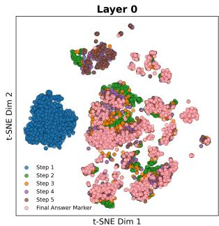

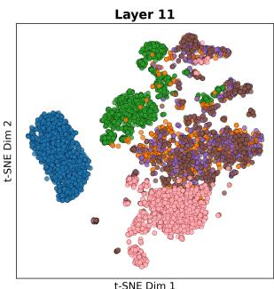

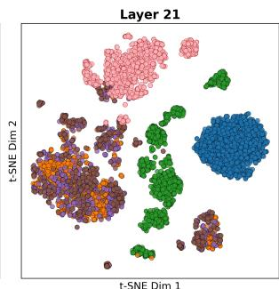

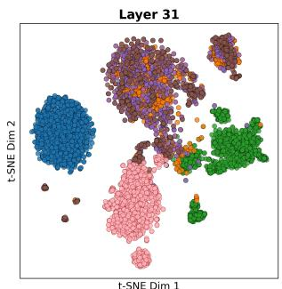

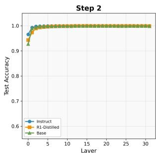  
(a) t-SNE visualization of step-specific activations

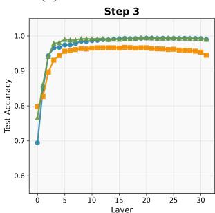

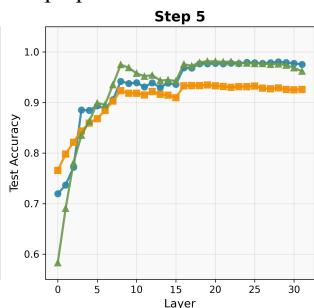

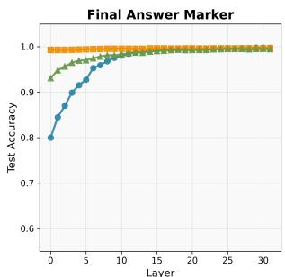  
(b) Linear separability of step-specific activations   
Figure 1: Step-specific representation structure across layers and reasoning steps. (a) t-SNE visualization of activations preceding Step markers (Instruct model, GSM8K test split). Step-specific regions become more separated with layer depth. (b) Layer-wise linear probe accuracy for step identity prediction. $x$ -axis denotes the layer from which activations are extracted, and the $y$ -axis reports test accuracy of a linear classifier trained on these activations as input, with the step number as the label. Early steps are separable from shallow layers; later steps require deeper layers.

via chain-of-thought distillation (Deepseek, 2025).

By holding the dataset, prompting format, and decoding strategy constant, we isolate differences arising from training regimes and internal computation, enabling a controlled comparison of reasoning subspaces and trajectory structure.

# 3.2 Extracting Step-specific Activations

For each question, we extract hidden activations at two classes of decoding timesteps: (i) the token immediately preceding each Step marker (denoted $\mathbf { h } _ { t ( \mathrm { S t e p } \ k ) - 1 } ^ { ( \ell ) } )$ h(ℓ)t(Step k) 1), which captures the model’s in-−ternal state after completing the $k$ -th reasoning step and before transitioning to the next; and (ii) the token immediately preceding the final answer marker $( \mathbf { h } _ { t ( \mathrm { t e r m } ) - 1 } ^ { ( \ell ) } )$ , which corresponds to when −the model has completed reasoning and is ready to emit the final answer. The ordered sequence h(ℓ) $\mathbf { h } _ { t ( \mathrm { S t e p } \ { 1 } ) - 1 } ^ { ( \ell ) }$ , h(ℓ) $\mathbf { h } _ { t ( \mathrm { S t e p } \cdot 2 ) - 1 } ^ { ( \ell ) }$ , h(ℓ) $\mathbf { h } _ { t ( \mathrm { t e r m } ) - 1 } ^ { ( \ell ) }$ thus provides snapshots of the model’s representation trajectory as reasoning unfolds.

# 3.3 Analyzing Step-specific Subspaces

To characterize how step-specific activations are organized in representation space, we use t-SNE for

qualitative visualization and train a binary classifier for each Step $X$ against all other steps, to quantify the linear separability of step-specific activations, testing whether each step occupies a distinct region of representation space.

Step-specific and termination-related activations occupy highly linearly separable regions in representation space. Quantitatively, early steps exhibit linear structure across all layers and training regimes (see Figure 1). Notably, final answer marker and early-step activations are exceptionally distinct: Step 1 has probe accuracy above 0.99 at every layer for all models, and Step 2 reaches this accuracy level by layer 2 (Figure 1b). Steps 3, 4, and 5 can also reach near-ceiling probe accuracy for the Instruct and Base models after substantial depth, with step-specific activations moving into increasingly well-delineated regions as the model processes into deeper layers.

Crucially, the separability is across step numbers. If the model were simply encoding "a step marker is imminent" as an ordinary sentence, all pre-step activations would cluster together regardless of step index. However, in our experiment, every step occupies distinct representation regions sepa-

Table 1: Cross-model transfer of step-specific linear probes. Each entry is the best accuracy across layers; subscripts indicate the peak layer. Step 1 omitted (1.00 for all pairs).   

<table><tr><td rowspan="2">Probe From</td><td rowspan="2">Eval. On</td><td colspan="4">Step</td><td rowspan="2">Final Ans. Marker</td></tr><tr><td>2</td><td>3</td><td>4</td><td>5</td></tr><tr><td rowspan="2">Instruct</td><td>R1-Dist.</td><td>0.99L18</td><td>0.93L19</td><td>0.87L12</td><td>0.91L18</td><td>0.87L23</td></tr><tr><td>Base</td><td>1.00L12</td><td>0.97L08</td><td>0.95L08</td><td>0.93L18</td><td>0.97L21</td></tr><tr><td rowspan="2">R1-Dist.</td><td>Instruct</td><td>1.00L03</td><td>0.92L08</td><td>0.88L07</td><td>0.93L27</td><td>0.98L19</td></tr><tr><td>Base</td><td>1.00L06</td><td>0.94L04</td><td>0.89L30</td><td>0.91L08</td><td>0.96L19</td></tr><tr><td rowspan="2">Base</td><td>Instruct</td><td>1.00L21</td><td>0.98L18</td><td>0.97L18</td><td>0.97L23</td><td>1.00L31</td></tr><tr><td>R1-Dist.</td><td>0.99L12</td><td>0.91L18</td><td>0.90L18</td><td>0.92L17</td><td>0.94L02</td></tr></table>

rate from others, indicating that the model tracks where it is in the reasoning progress. Moreover, because we extract activations at the token immediately before each Step marker, these activations reflect the state upon completing the prior reasoning step—capturing accumulated computation carried forward to subsequent timesteps rather than surface formatting cues. Together with the cross-task transfer results in Section 4.4, these findings suggest that step-specific activations are organized into linearly separable regions of representation space.

Step-specific activations become progressively less entangled with depth. As shown in Figure 1a, step-specific activations transition from heavily intermixed regions at early layers to more distinct regions at deeper layers, particularly for Steps 3, 4, and 5. Quantitatively, for Step 5, linear probe accuracy at layer 0 ranges from 0.58 (Base) to 0.77 (R1-Distill), and exceeds 0.90 only after layer 6. These results indicate that increasing depth progressively disentangles step-specific activations into more stable regions corresponding to different steps, with different training regimes exhibiting distinct rates of this organization.

# 3.4 Training Regimes Reshape Step Geometry

As shown in Figure 1b, step-specific structure is already present in the Base model, while reasoning training accentuates termination-related structure from the earliest layers. Specifically, final answer markers achieve probe accuracy above 0.99 at layer 0 in R1-Distill, compared to 0.80 for Instruct and 0.93 for Base. This “faster convergence” refers to layer-depth convergence—i.e., R1-Distill’s activations are separable into the termination subspace at shallower layers—not to the number of output reasoning steps (see Appendix H for step-count distributions across models). At the same time, R1-Distill exhibits consistently lower separability

Table 2: Response format distribution under minimal freeform prompting on GSM8K (Instruct model). Without explicit formatting instructions, the model spontaneously adopts Step X: formatting in $6 4 . 5 \%$ of responses. Segment counts report per-response means.   

<table><tr><td>Format Category</td><td>Count</td><td>%</td><td>Segments</td></tr><tr><td>Step X:</td><td>4,820</td><td>64.5</td><td>4.6 steps</td></tr><tr><td>\n\nsep. paragraphs</td><td>838</td><td>11.2</td><td>5.6 paragraphs</td></tr><tr><td>\separated lines</td><td>687</td><td>9.2</td><td>7.6 lines</td></tr><tr><td>Single block</td><td>662</td><td>8.9</td><td>7.7 sentences</td></tr><tr><td>Numbered list (1./1))</td><td>467</td><td>6.2</td><td>4.4 items</td></tr></table>

for Steps 3, 4, and 5. This pattern indicates that reasoning training does not uniformly strengthen step-specific structure. It accelerates movement into the termination subspace while leaving some intermediate steps less separable, though still concentrated within coherent regions with probe accuracy consistently above 0.90.

Step-specific regions are largely shared and preserved across training regimes at the level of linear structure. As shown in Table 1, crossmodel transfer of step-specific linear probes consistently achieves accuracy above 0.90 for nearly all model pairs. Notably, layer-averaged transfer accuracies also mostly exceed 0.90 (see Appendix C). The consistently high transfer accuracies indicate that step-specific linear structure is largely shared across training regimes. Therefore, post-training primarily reshapes the depth at which step-specific structure becomes most linearly salient, while preserving a common underlying organization.

# 3.5 Robustness to Prompt Format

The preceding analyses use a fixed-form prompt that explicitly elicits Step markers. To test whether the observed geometry is primarily driven by surface-level formatting, we use a minimal prompt with no formatting constraints.2

Under this setting on GSM8K, the Instruct model spontaneously produces five distinct response formats (Table 2). Notably, the model uses Step X: formatting in $6 4 . 5 \%$ of cases without explicit instruction, suggesting that step-marked reasoning is naturally favored rather than a prompt artifact. For the remaining responses, we extract activations at natural structural boundaries (e.g., paragraph breaks, sentence-ending punctuation, numbered markers).

<table><tr><td>Distance</td><td>Group</td><td>Step 1 → 2</td><td>2nd-last → Last</td><td>Last → Ans. Marker</td></tr><tr><td rowspan="3">Euclidean</td><td>Correct</td><td>170.11</td><td>79.91</td><td>115.01</td></tr><tr><td>Incorrect</td><td>169.83</td><td>75.65</td><td>101.62</td></tr><tr><td>Δ(I-C)</td><td>-0.28</td><td>-4.26†</td><td>-13.39†</td></tr><tr><td rowspan="3">Cosine</td><td>Correct</td><td>0.72</td><td>0.19</td><td>0.35</td></tr><tr><td>Incorrect</td><td>0.71</td><td>0.17</td><td>0.29</td></tr><tr><td>Δ(I-C)</td><td>+0.00</td><td>-0.02†</td><td>-0.06†</td></tr></table>

(a) Between-step activation distances

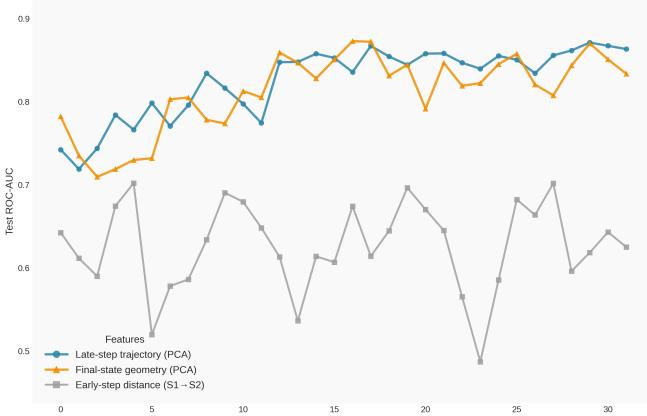  
(b) Mid-reasoning correctness prediction   
Figure 2: Trajectory divergence and mid-reasoning correctness signals (Instruct model, GSM8K). (a) Late between-step activation distances diverge between correct and incorrect trajectories, while early transitions remain similar; † marks transitions where $9 5 \%$ CIs of correct and incorrect distances do not overlap. (b) Late-step trajectory features predict correctness with average $\mathbf { A U C } \approx 0 . 8 3$ (peak 0.87 at layer 29) vs. $\approx 0 . 6 3$ for early-step features. Curves are from a single random seed; see Table 3 for seed-averaged values.

We then apply linear probes trained on fixedform activations to these freeform activations. Despite relatively low fixed-form vs. freeform activation similarity (mean cosine $\approx 0 . 4 1$ , $\mathrm { C K A } \approx 0 . 4 8 $ ), we observe strong transfer: best-layer probe accuracies reach 0.93 (Step 1), 0.84 (Step 2), 0.83 (Step 3), 0.84 (Step 4), 0.88 (Step 5), and 0.92 (Answer). Crucially, restricting to non-Step format categories yields comparably strong results, with best-layer accuracies consistently above 0.84 across all steps (see Appendix E for full results).

As a control, probes trained on randomly shuffled step labels achieve only $0 . 5 9 \pm 0 . 0 4$ average accuracy. These results indicate that the observed step-specific geometry reflects genuine reasoning progress rather than formatting artifacts.

# 4 Correctness in Trajectory Geometry

Having identified task-specific structure in representation space in Section 3, we next examine trajectories temporally by analyzing the paths connecting steps. Here, we group trajectories by finalanswer correctness as a behavioral label.

Concretely, for two steps $a$ and $b$ , we compute distances $d \left( \mathbf { \dot { h } } _ { t ( a ) - 1 } ^ { ( L ) } , \mathbf { h } _ { t ( b ) - 1 } ^ { ( L ) } \right)$ (L) using Euclidean distance to capture the magnitude of movement in representation space, and cosine distance to capture changes in direction. We focus on activations from the final layer, as it reflects the cumulative outcome of computation after all intermediate processing, and because step-specific subspaces are generally most clearly separated at this depth (Section 3).

# 4.1 Trajectory Distance Difference

As shown in Figure 2a, early-step geometry is mostly correctness-invariant. Quantitatively, it exhibits no statistically significant distance difference signal regarding final-answer correctness. The $\Delta ( \mathrm { I } { - } \mathrm { C } )$ values for Step $1 \to 2$ are near zero and fall within $9 5 \% \mathrm { C I }$ under both Euclidean and cosine metrics. This is consistent with the findings in Section 3 that Step 1 and 2 subspaces are highly stable with near-perfect probe accuracies. Together, this indicates that the model traverses a common geometric path in representation space during initial problem processing and early-stage reasoning.

In contrast, late-step trajectory distance differences show correctness-related divergence. For the transition from the second-last step to the last step, incorrect solutions exhibit statistically significant differences, with Euclidean $\Delta ( \mathrm { I { - } C ) = - 4 . 2 6 }$ and cosine $\Delta ( \mathrm { I { - } C ) { = } - 0 . 0 2 }$ . This divergence becomes more pronounced in the final transition from the last step to the answer marker, where the differences increase to $- 1 3 . 3 9$ (Euclidean) and $- 0 . 0 6$ (cosine). Although correct and incorrect trajectories initially follow similar geometric paths and ultimately converge to concentrated step-specific regions, the paths taken to reach the regions become increasingly different as reasoning progresses and deviations accumulate.

# 4.2 Mid-reasoning Correctness Prediction via Trajectory Divergence

Motivated by the observed late-step geometric divergence, we next use trajectory signals to predict

final-answer correctness before answer emission. Concretely, we train an $\ell _ { 2 }$ -regularized logistic regression classifier on activation features extracted from the Instruct model using the GSM8K training split, and evaluate its ability to distinguish incorrect from correct solutions on a held-out test split. Performance is reported in terms of test ROC– AUC.3 We consider a range of feature constructions drawn from different portions of the reasoning trajectory, including early-step geometry (Step 1 and Step 2), late-step trajectory (concatenating the final answer marker activation with the last-step transition with PCA dim $1 { = } 1 2 8$ ), and final-state representations extracted immediately before the answer marker (PCA dim $\scriptstyle 1 = 1 2 8$ ).

Late-step trajectory geometry predicts correctness with average AUC of 0.83 across layers, whereas early-step geometry only achieves 0.63. As shown in Figure 2b, late-step trajectory features are more predictive of final-answer correctness than early-step geometry. Specifically, using late-step trajectory features, we achieve an average AUC of 0.83 across layers, with a peak AUC of 0.87 at layer 29. Using the final answer marker activations alone already yields strong predictive performance, with an average AUC of 0.81. This indicates that the model’s terminal representation encodes substantial information about final-answer correctness, consistent with recent findings on correctness prediction in MMLU-style settings (Liu et al., 2025a).

In contrast, feature sets derived from early-step geometry perform markedly worse. Using only the Step $1 \to 2$ activation difference achieves an average AUC of 0.63, only modestly above chance. Directly concatenating the Step 1 and Step 2 activations yields a lower average AUC of 0.61. Including an additional early step (Step 3) reaches an average AUC of 0.63. These results mirror Figure 2a, where early-step transitions show no statistically significant correctness-related divergence, while late-step geometry exhibits consistent separation between correct and incorrect trajectories.

Notably, the strongest predictors are not raw activations but trajectory-based Step-difference features. This supports the interpretation that correctness is reflected not merely in where the model ends up in representation space, but in how it gets there. Together with the distance-based results in Sec-

Table 3: Correctness predictor comparison. Trajectory features substantially outperform both a step-countonly baseline and logit-level features (entropy, answermarker token rank, top-1 probability) at step boundaries. Values report best-layer AUC averaged over three seeds.   

<table><tr><td>Method</td><td>Best-layer AUC</td></tr><tr><td>Step-count only</td><td>0.649 ± 0.021</td></tr><tr><td>LogiTens (best config)</td><td>0.765 ± 0.027</td></tr><tr><td>Trajectory features (ours)</td><td>0.852 ± 0.039</td></tr></table>

tion 4.1, these findings provide evidence that trajectory divergence provides a concrete mid-reasoning signal for final-answer correctness.

Trajectory features outperform logit-level and length-based baselines. To rule out surface-level confounds, we compare against step-count-only and logit-lens baselines (Table 3). A classifier using only the number of reasoning steps as a feature achieves AUC $0 . 6 4 9 { \pm } 0 . 0 2 1$ , indicating that length carries some signal but falls well below trajectorybased prediction. Logit-lens features at step boundaries (entropy, answer-marker token rank, and top-1 probability) achieve a best AUC of $0 . 7 6 5 \pm 0 . 0 2 7$ . Trajectory features $( 0 . 8 5 2 \pm 0 . 0 3 9 )$ substantially outperform both. Under length-balanced resampling, trajectory features still achieve AUC $0 . 8 4 7 \pm$ 0.006, only $\sim 0 . 0 2$ below the original, confirming that the signal is not driven by length.

# 4.3 Toward Error-targeted Inference-time Interventions

We next explore how this signal can be used to enhance inference-time intervention methods, with the goal of intervening only when an impending failure is detected. This aims to mitigate the overthinking drawback of unconditional interventions, which can unintentionally degrade originally correct reasoning (Ghosal et al., 2025; Wang et al., 2025; Zhao et al., 2025). Here, we evaluate two common classes of inference-time interventions: test-time scaling and activation steering.

Premise. Test-time scaling methods modify generation by inserting tokens directly into the model’s ongoing output stream. When the model is about to generate the final answer marker, we instead inject additional tokens that encourage further checking.4 These injected cues encourage the model to extend

Table 4: Unconditional vs. error-targeted interventions on GSM8K (Instruct model). Values report absolute accuracy change $( \% )$ vs. baseline. Unconditional interventions often degrade performance, while predictor-gated interventions $\left. \lvert \alpha \rvert = 0 . 0 5 \right)$ on only $1 2 \%$ of examples yield additional gains.   

<table><tr><td>Intervention</td><td>Always</td><td>Gated</td><td>Gain vs Always</td></tr><tr><td>Step</td><td>-1.59</td><td>+0.91</td><td>+2.50</td></tr><tr><td>Check</td><td>-11.70</td><td>+0.23</td><td>+11.90</td></tr><tr><td>Wait</td><td>-30.50</td><td>-0.68</td><td>+29.80</td></tr><tr><td>Hmm</td><td>-36.00</td><td>-0.61</td><td>+35.41</td></tr><tr><td>Prolong (Last)</td><td>+0.45</td><td>+0.76</td><td>+0.31</td></tr><tr><td>Prolong (Mid)</td><td>+0.38</td><td>+0.76</td><td>+0.38</td></tr></table>

its reasoning before committing to a final answer (Muennighoff et al., 2025).

Separately, activation steering intervenes on representations by adding previously derived activation directions that guide the model toward different behaviors (Zhang and Nanda, 2024). Rather than using cross-example activation differences, we construct in-sample steering directions by averaging, within each prompt from the training split, the vector difference between Step-preceding and termination-preceding activations:

$$
\mathbf {s} ^ {(\ell)} = \mathbb {E} _ {k} \left[ \mathbf {h} _ {t (\mathrm {t e r m}) - 1} ^ {(\ell)} - \mathbf {h} _ {t (\mathrm {S t e p} k) - 1} ^ {(\ell)} \right].
$$

During decoding on the test split, we intervene additively at the timestep immediately preceding final answer marker by updating the hidden state as h(ℓ)t $\mathbf { h } _ { t } ^ { ( \ell ) } \gets \mathbf { h } _ { t } ^ { ( \ell ) } + \alpha \mathbf { s } ^ { ( \ell ) }$ ← h(ℓ)t + , where $\alpha$ controls the steering strength. We apply these interventions either at LAST, steering the final five layers, or at MID, steering the middle five layers. Subtracting the steering direction (PROLONG; $\alpha < 0$ ) promotes extended reasoning, whereas adding it (SHORTEN; $\alpha > 0$ ) encourages earlier convergence toward termination. In this section, we focus on PROLONG to induce additional reasoning and reflection.

Unconditional test-time scaling is often harmful on GSM8K. As summarized in Table 4, always injecting control tokens into all examples reduces accuracy by as much as $1 1 . 7 \%$ to $3 6 . 0 \%$ . Even comparatively style-native injection such as Step incurs a $1 . 5 9 \%$ drop under unconditional use. These results provide further evidence that testtime scaling frequently perturbs already correct reasoning, introducing substantial collateral damage (Ghosal et al., 2025; Wang et al., 2025).

To mitigate these side effects, we move toward error-targeted interventions that improve both

Table 5: Cross-dataset and cross-format transfer of step probes from fixed-form GSM8K. Best-layer probe accuracy on held-out datasets. Structural geometry transfers robustly across tasks and formats.   

<table><tr><td rowspan="2">Eval. Dataset</td><td colspan="5">Step</td><td rowspan="2">Ans. Marker</td></tr><tr><td>1</td><td>2</td><td>3</td><td>4</td><td>5</td></tr><tr><td>MATH-500</td><td>1.00</td><td>1.00</td><td>0.98</td><td>0.91</td><td>0.85</td><td>0.99</td></tr><tr><td>MMLU</td><td>1.00</td><td>1.00</td><td>0.98</td><td>0.92</td><td>0.89</td><td>0.98</td></tr><tr><td>Freeform GSM8K</td><td>0.93</td><td>0.84</td><td>0.83</td><td>0.84</td><td>0.88</td><td>0.92</td></tr></table>

accuracy and efficiency by selectively intervening only when failure is predicted. Using correctness predictors from Section 4.2, we intervene on just $1 2 . 3 \%$ of examples, converting unconditional accuracy drops into consistent gains of up to $+ 3 5 . 4 \%$ relative to always-on interventions.

The modest net improvements observed across interventions reflect that not all detectable errors are correctable via current inference-time interventions. For example, the Step-injection intervention corrects only 26 of the 90 predictor-flagged incorrect reasoning instances. At the same time, the intervention reverts 14 originally correct solutions (flagged due to predictor imperfections) to incorrect. These opposing effects partially cancel, resulting in small net gains.

Taken together, these findings motivate errortargeted inference-time scaling: late-step trajectory geometry encodes detectable correctness signals that can be used to guide interventions, but fixed, one-shot corrections remain limited in their ability to reliably repair diverse failure modes.

# 4.4 Cross-Task and Cross-Dataset Generalization

To evaluate whether the trajectory framework generalizes beyond GSM8K, we extend our analyses to MATH-500 and the MMLU (validation set, 1,531 questions). Despite substantial differences in task difficulty or domain, GSM8K-trained step probes transfer strongly to both datasets.

Step-specific geometry transfers robustly across tasks and datasets. As shown in Table 5, probes trained on GSM8K achieve best-layer accuracies above 0.85 for all steps on both MATH-500 and MMLU, despite substantially different content: MATH-500 involves more complex mathematical problems, while MMLU spans diverse knowledgeintensive reasoning domains. Notably, although MMLU uses the same Step X: format as GSM8K, activations differ substantially between the two

<table><tr><td>Step Count</td><td>Baseline</td><td>After Interv.</td><td>Fix Rate</td><td>Preserve Rate</td></tr><tr><td>2</td><td>95.96</td><td>95.96+0.00</td><td>50.0</td><td>97.9</td></tr><tr><td>3</td><td>89.71</td><td>89.71+0.00</td><td>18.8</td><td>97.8</td></tr><tr><td>4</td><td>85.89</td><td>84.68-1.20</td><td>27.7</td><td>94.1</td></tr><tr><td>5</td><td>82.13</td><td>82.13+0.00</td><td>16.7</td><td>96.4</td></tr><tr><td>6</td><td>75.44</td><td>83.04+7.60</td><td>33.3</td><td>99.2</td></tr><tr><td>7</td><td>67.69</td><td>75.38+7.69</td><td>28.6</td><td>97.7</td></tr><tr><td>8</td><td>77.42</td><td>74.19-3.23</td><td>14.3</td><td>91.7</td></tr></table>

(a) Trajectory-based steering for correctness

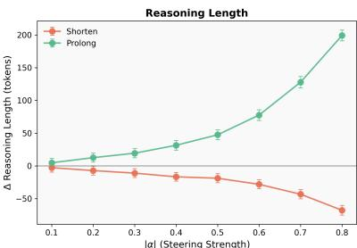  
(b) Reasoning length control via the termination subspace

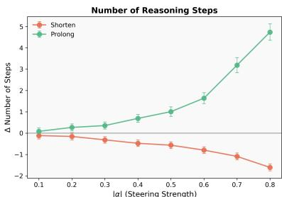  
Figure 3: Trajectory-based control of reasoning behavior. (a) Correctness steering on GSM8K, stratified by original step count; values in $\%$ . (b) Reasoning length control via the termination subspace as a function of steering strength $| \alpha |$ .

(cosine similarity $\approx ~ 0 . 5 4$ , $\mathrm { C K A } \approx 0 . 6 0 \rangle$ ). This further supports the interpretation from Section 3 that step-specific representations capture reasoning progress rather than surface formatting cues. Beyond probe transfer, steering directions also generalize causally: PROLONG (MID) vectors derived from GSM8K improve MATH-500 accuracy from $3 6 . 4 0 \%$ to $3 8 . 2 0 \%$ $( + 1 . 8 0 \% )$ without retuning, providing causal evidence that the identified geometry reflects general properties of mathematical reasoning rather than dataset-specific artifacts.

Correctness prediction is more task-sensitive. A GSM8K-trained predictor achieves AUC 0.87 indistribution; when transferred, performance drops to 0.73 on MATH-500, 0.64 on MMLU, and 0.60 on freeform GSM8K. This suggests a two-level organization: the structural geometry of reasoning trajectories generalizes robustly across tasks, whereas correctness geometry is shaped by taskspecific error modes and solution-path diversity. Practically, the trajectory framework (step detection, boundary extraction, subspace identification) transfers without modification, while correctness predictors need further domain-specific calibration.

# 5 Trajectory-Based Inference-Time Interventions

Motivated by the observations in Section 4.3, we propose trajectory-based interventions, which intervene adaptively based on how the reasoning trajectory evolves during generation. These interventions are effective both at correcting erroneous reasoning and at controlling reasoning length.

# 5.1 Correcting Deviating Reasoning Trajectories

Given the systematic divergence between correct and incorrect trajectories, we evaluate a low-rank

steering strategy that guides the model back toward an ideal reasoning trajectory when the ongoing trajectory deviates beyond certain tolerance.

Methodology. From correct trajectories in the GSM8K training split, we extract activations immediately preceding each Step token and project them into a low-dimensional subspace via PCA. Let $z _ { j } ~ \in ~ \mathbb { R } ^ { d }$ denote the projected activation at step $j$ . The ideal trajectory is the step-wise mean $\mu _ { j } = \mathbb { E } [ z _ { j } ]$ over correct examples, with a dispersion statistic $\sigma _ { j }$ characterizing typical variability of correct reasoning at each step. This defines a step-indexed reference path with tolerance bands.

Using held-out data, we optimize step-specific divergence thresholds that balance sensitivity to incorrect trajectories against false interventions on correct ones. At inference time, immediately before Step, activation is projected into the same subspace and compared against the ideal trajectory. We compute a local deviation $\delta _ { j } = \| z _ { j } - \mu _ { j } \|$ and a cumulative deviation $\begin{array} { r } { D _ { j } = \sum _ { i < j } \delta _ { i } } \end{array}$ . If either $\delta _ { j }$ or $D _ { j }$ exceeds its corresponding threshold, we apply a low-rank steering update that moves the activation toward $\mu _ { j }$ along the dominant principal directions. Because divergence is evaluated at every step, trajectory-based steering can intervene multiple times within a single example, correcting both abrupt deviations and gradual drift.

Trajectory-based interventions are effective, and most effective on problems with longer reasoning chains. On GSM8K questions requiring six reasoning steps, accuracy improves from $7 5 . 4 4 \%$ to $8 3 . 0 4 \%$ $( + 7 . 6 0 \% )$ . Similarly, for sevenstep problems, accuracy increases from $6 7 . 6 9 \%$ to $7 5 . 3 8 \%$ $( + 7 . 6 9 \% )$ ). Notably, these gains are accompanied by high preservation rates $( \geq 9 7 \%$ ), indicating that repeated, low-magnitude interventions

can correct difficult reasoning trajectories without destabilizing previously correct ones.

However, for problems with step count $\leq 5$ , the same method yields near-zero changes. This suggests that additional intervention provides limited benefit when the model already follows short, stable reasoning trajectories, consistent with Section 4, where early-step geometry exhibits minimal divergence between correct and incorrect solutions. Together, these results demonstrate that trajectorybased steering is most effective when applied to long, error-prone reasoning chains. By selectively nudging deviating trajectories back toward an ideal path, the method avoids the collateral damage and delivers robust net gains precisely where reasoning failures are most likely to occur.

# 5.2 Reasoning Length Control

We next use this termination-related subspace to directly and continuously control reasoning length. We adopt the same steering directions and layer configurations as in Section 4, where each direction approximates the local trajectory toward the termination subspace. During decoding, we intervene additively to either push activations toward this direction (SHORTEN), accelerating convergence and reducing reasoning length, or away from it (PROLONG), delaying convergence and extending intermediate computation. The intervention strength is controlled by a coefficient $| \alpha |$ .

Figure 3 shows that for moderate steering strengths $| \alpha | \le 0 . 8 )$ , reasoning length can be adjusted approximately monotonically with minimal impact on task accuracy (around $1 \%$ change for $| \alpha | \leq 0 . 4 )$ . This demonstrates that the terminationrelated subspace can act as a locally smooth control axis for reasoning length. However, as $| \alpha |$ increases beyond this moderate range $( | \alpha | \gtrsim 0 . 8 )$ , we observe behavioral mode collapse: the model enters repetitive loops in which step content is generated repeatedly without substantive progress. Therefore, increases in reasoning length for $| \alpha | \gtrsim$ 0.8 do not reflect extended meaningful computation. Notably, this collapse is rare at small steering strengths $( | \alpha | \leq 0 . 5 )$ , where the loop ratio remains below $1 \%$ and changes in length correspond to genuine extensions or shortening of reasoning.

# 6 Discussion

# 6.1 Conclusion

This work advances a geometric perspective on LLM reasoning by demonstrating that multi-step reasoning unfolds along structured trajectories in representation space. Intermediate reasoning states occupy step-specific regions that become increasingly linearly separable at deeper layers, and this organization is already present in Base models; reasoning distillation primarily reshapes the depth at which convergence occurs rather than introducing new representational structure.

Building on this, we show that late-step geometry provides an actionable signal for predicting final-answer correctness prior to answer emission, enabling more selective, error-targeted inferencetime interventions that mitigate the overthinking associated with unconditional test-time scaling. Beyond correctness, reasoning trajectories can be causally manipulated to control reasoning length by steering activations toward or away from termination-related regions. These results advance the view of reasoning trajectories as a unifying abstraction for interpreting, predicting, and influencing LLM reasoning behavior.

# 6.2 Future Work

Our results suggest several directions for future work. First, trajectory-based analysis may offer a geometric perspective on CoT faithfulness: if a model’s internal step activations diverge substantially from typical step-specific regions despite producing correct-sounding text, this could indicate unfaithful reasoning, complementing existing behavioral tests. Second, a more fine-grained taxonomy of reasoning failures and the identification of error-specific geometric signatures could yield further insights. Third, geometric insights could be incorporated directly into training objectives—for instance, step-level auxiliary losses that regularize hidden-state trajectories toward those observed in correct solutions, leveraging internal signals otherwise ignored by behavior-level supervision. Finally, our analysis operates at the representation level. Bridging trajectory-level observations with circuitlevel interpretability—identifying which attention heads and MLP neurons implement the observed dynamics—remains an important open direction.

# Limitations

This research has several limitations. First, although we observe clear and consistent trajectory structure in GSM8K, MATH-500, and MMLU, it remains an open question whether similar geometric organization arises in other settings, such as open-ended reasoning, multi-hop QA, or program synthesis. Second, while we examine multiple training regimes (Base, Instruct, and reasoningdistilled models), our analysis is restricted to the Llama 3.1 8B family. Although the consistency of trajectory-level phenomena across three substantially different post-training objectives suggests that these structures are not paradigm-specific, we have not verified whether the same geometric organization holds at larger scales or across architecturally distinct model families. Larger models may exhibit qualitatively different trajectory dynamics due to increased capacity or different training distributions, and we consider cross-family and crossscale exploration an important direction for future work. Finally, our trajectory-based interventions rely on estimating an ideal trajectory from correct training examples. While this assumption is empirically supported in our settings, it may break down when correctness is underspecified. Extending this approach to such settings may require richer notions of ideal behavior, or task-conditioned reference trajectories. Still, revealing these trajectorylevel structures offers a concrete lens for rethinking how reasoning unfolds, where errors arise, and how inference-time control might be made more precise. This work serves as one step in that direction.

# Ethical Considerations

This work analyzes internal representations and inference-time interventions in LLMs using standard, publicly available benchmarks. It does not involve human subjects, personal data, or deployment in real-world decision-making contexts. Our study focuses on low-risk arithmetic reasoning tasks. We do not identify any additional ethical concerns beyond those generally associated with interpretability and model analysis research.

# References

Iván Arcuschin, Jett Janiak, Robert Krzyzanowski, Senthooran Rajamanoharan, Neel Nanda, and Arthur Conmy. 2025. Chain-of-thought reasoning in the wild is not always faithful. Preprint, arXiv:2503.08679.   
Karl Cobbe, Vineet Kosaraju, Mohammad Bavarian, Mark Chen, Heewoo Jun, Lukasz Kaiser, Matthias Plappert, Jerry Tworek, Jacob Hilton, Reiichiro Nakano, Christopher Hesse, and John Schulman. 2021. Training verifiers to solve math word problems. arXiv preprint arXiv:2110.14168.   
Deepseek. 2025. Deepseek-r1: Incentivizing reasoning capability in llms via reinforcement learning. Preprint, arXiv:2501.12948.   
Subhabrata Dutta, Joykirat Singh, Soumen Chakrabarti, and Tanmoy Chakraborty. 2024. How to think stepby-step: A mechanistic understanding of chain-ofthought reasoning. Preprint, arXiv:2402.18312.   
Soumya Suvra Ghosal, Souradip Chakraborty, Avinash Reddy, Yifu Lu, Mengdi Wang, Dinesh Manocha, Furong Huang, Mohammad Ghavamzadeh, and Amrit Singh Bedi. 2025. Does thinking more always help? mirage of test-time scaling in reasoning models. Preprint, arXiv:2506.04210.   
Dan Hendrycks, Collin Burns, Saurav Kadavath, Akul Arora, Steven Basart, Eric Tang, Dawn Song, and Jacob Steinhardt. 2021. Measuring mathematical problem solving with the math dataset. In Proceedings of the Neural Information Processing Systems Track on Datasets and Benchmarks, volume 1.   
Tamera Lanham, Anna Chen, Ansh Radhakrishnan, Benoit Steiner, Carson Denison, Danny Hernandez, Dustin Li, Esin Durmus, Evan Hubinger, Jackson Kernion, Kamile Lukoši˙ ut¯ e, Karina Nguyen, Newton˙ Cheng, Nicholas Joseph, Nicholas Schiefer, Oliver Rausch, Robin Larson, Sam McCandlish, Sandipan Kundu, and 11 others. 2023. Measuring faithfulness in chain-of-thought reasoning. Preprint, arXiv:2307.13702.   
Andrew Lee, Lihao Sun, Chris Wendler, Fernanda Vié- gas, and Martin Wattenberg. 2025. The geometry of self-verification in a task-specific reasoning model. Preprint, arXiv:2504.14379.   
Bo Li, Guanzhi Deng, Ronghao Chen, Junrong Yue, Shuo Zhang, Qinghua Zhao, Linqi Song, and Lijie Wen. 2025. Rema: A unified reasoning manifold framework for interpreting large language model. Preprint, arXiv:2509.22518.   
Zhenwen Liang, Ruosen Li, Yujun Zhou, Linfeng Song, Dian Yu, Xinya Du, Haitao Mi, and Dong Yu. 2025. Clue: Non-parametric verification from experience via hidden-state clustering. Preprint, arXiv:2510.01591.

Jiarui Liu, Jivitesh Jain, Mona Diab, and Nishant Subramani. 2025a. Llm microscope: What model internals reveal about answer correctness and context utilization. Preprint, arXiv:2510.04013.   
Ryan Liu, Jiayi Geng, Addison J. Wu, Ilia Sucholutsky, Tania Lombrozo, and Thomas L. Griffiths. 2025b. Mind your step (by step): Chain-of-thought can reduce performance on tasks where thinking makes humans worse. Preprint, arXiv:2410.21333.   
Meta. 2024. The llama 3 herd of models. Preprint, arXiv:2407.21783.   
Niklas Muennighoff, Zitong Yang, Weijia Shi, Xiang Lisa Li, Li Fei-Fei, Hannaneh Hajishirzi, Luke Zettlemoyer, Percy Liang, Emmanuel Candès, and Tatsunori Hashimoto. 2025. s1: Simple test-time scaling. Preprint, arXiv:2501.19393.   
Kiho Park, Yo Joong Choe, and Victor Veitch. 2024. The linear representation hypothesis and the geometry of large language models. In Proceedings of the 41st International Conference on Machine Learning, volume 235 of Proceedings of Machine Learning Research, pages 39643–39666. PMLR.   
Chen Qian, Dongrui Liu, Haochen Wen, Zhen Bai, Yong Liu, and Jing Shao. 2025. Demystifying reasoning dynamics with mutual information: Thinking tokens are information peaks in llm reasoning. Preprint, arXiv:2506.02867.   
Lihao Sun, Lewen Yan, Xiaoya Lu, Andrew Lee, Jie Zhang, and Jing Shao. 2026. Valence-arousal subspace in llms: Circular emotion geometry and multibehavioral control. Preprint, arXiv:2604.03147.   
Alexander Matt Turner, Lisa Thiergart, Gavin Leech, David Udell, Juan J. Vazquez, Ulisse Mini, and Monte MacDiarmid. 2024. Steering language models with activation engineering. Preprint, arXiv:2308.10248.   
Miles Turpin, Julian Michael, Ethan Perez, and Samuel Bowman. 2023. Language models don't always say what they think: Unfaithful explanations in chain-ofthought prompting. In Advances in Neural Information Processing Systems, volume 36, pages 74952– 74965. Curran Associates, Inc.   
Ashish Vaswani, Noam Shazeer, Niki Parmar, Jakob Uszkoreit, Llion Jones, Aidan N Gomez, Ł ukasz Kaiser, and Illia Polosukhin. 2017. Attention is all you need. In Advances in Neural Information Processing Systems, volume 30. Curran Associates, Inc.   
Boshi Wang, Sewon Min, Xiang Deng, Jiaming Shen, You Wu, Luke Zettlemoyer, and Huan Sun. 2023. Towards understanding chain-of-thought prompting: An empirical study of what matters. Preprint, arXiv:2212.10001.   
Chenlong Wang, Yuanning Feng, Dongping Chen, Zhaoyang Chu, Ranjay Krishna, and Tianyi Zhou.

2025. Wait, we don’t need to "wait"! removing thinking tokens improves reasoning efficiency. Preprint, arXiv:2506.08343.   
Jason Wei, Xuezhi Wang, Dale Schuurmans, Maarten Bosma, brian ichter, Fei Xia, Ed Chi, Quoc V Le, and Denny Zhou. 2022. Chain-of-thought prompting elicits reasoning in large language models. In Advances in Neural Information Processing Systems, volume 35, pages 24824–24837. Curran Associates, Inc.   
Anqi Zhang, Yulin Chen, Jane Pan, Chen Zhao, Aurojit Panda, Jinyang Li, and He He. 2025a. Reasoning models know when they’re right: Probing hidden states for self-verification. Preprint, arXiv:2504.05419.   
Fred Zhang and Neel Nanda. 2024. Towards best practices of activation patching in language models: Metrics and methods. Preprint, arXiv:2309.16042.   
Junyu Zhang, Runpei Dong, Han Wang, Xuying Ning, Haoran Geng, Peihao Li, Xialin He, Yutong Bai, Jitendra Malik, Saurabh Gupta, and Huan Zhang. 2025b. Alphaone: Reasoning models thinking slow and fast at test time. Preprint, arXiv:2505.24863.   
James Xu Zhao, Bryan Hooi, and See-Kiong Ng. 2025. Test-time scaling in reasoning models is not effective for knowledge-intensive tasks yet. Preprint, arXiv:2509.06861.   
Yue Zhou, Yada Zhu, Diego Antognini, Yoon Kim, and Yang Zhang. 2024. Paraphrase and solve: Exploring and exploiting the impact of surface form on mathematical reasoning in large language models. Preprint, arXiv:2404.11500.   
Yufa Zhou, Yixiao Wang, Xunjian Yin, Shuyan Zhou, and Anru R. Zhang. 2025a. The geometry of reasoning: Flowing logics in representation space. Preprint, arXiv:2510.09782.   
Zhanke Zhou, Zhaocheng Zhu, Xuan Li, Mikhail Galkin, Xiao Feng, Sanmi Koyejo, Jian Tang, and Bo Han. 2025b. Landscape of thoughts: Visualizing the reasoning process of large language models. Preprint, arXiv:2503.22165.

# A Fixed-form Prompt Setup

Across datasets, we use the following prompt to reliably elicit step-structured reasoning:

You are a helpful assistant that solves problems step by step with each step signified by “Step [step_number]: ”. Always provide your final answer after {final_answer_mark} at the end.

Question: {question}

Please solve this step by step, putting each step after “Step [step_number]: ” and always provide your final answer after {final_answer_mark}.

Solution:

# B Complete t-SNE Visualization

See Figure 4.

# C Complete Linear Probe Results

See Figure 5 for complete within-model results; and Table 6 for averaged cross-model transfer results across layers.

# D Trajectory Distance Difference

See Figure 6 below.

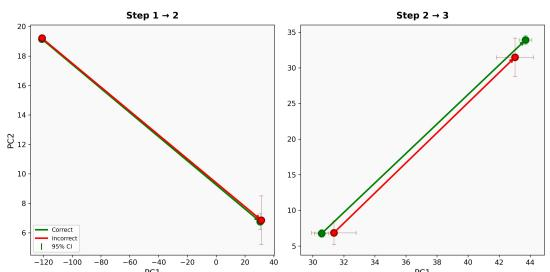

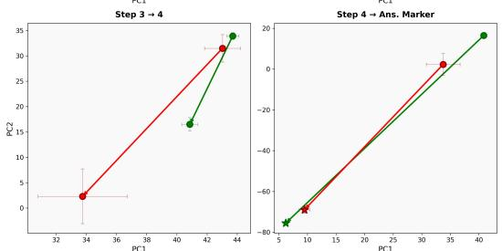  
Figure 6: Between-step activation geometry differs between correct and incorrect reasoning. Results are from the Instruct model on the GSM8K train split with four reasoning steps; similar patterns hold across other step counts. Late reasoning steps illustrate statistically significant geometric divergence for incorrect reasoning.

# E Freeform Generation Details

Table 7 reports the full per-category breakdown of probe transfer from fixed-form to freeform GSM8K activations (Section 3.5). For each format category, the first number reports average probe accuracy across all 32 layers; the number in parentheses reports the best single-layer accuracy and the layer at which it is achieved. Probes were trained on fixedform Step X: activations and evaluated without any retraining.

Across all format categories—including those with no Step markers in the surface text—probes achieve best-layer accuracies consistently above 0.82, with most exceeding 0.85. The “Non-Step X:” aggregate row pools all freeform examples that did not spontaneously adopt Step X: formatting. Its strong performance $( \ge ~ 0 . 8 4$ best-layer accuracy for all steps) confirms that the probes capture reasoning-progress information rather than surfacetoken identity.

# F Experimental Details

Generation. We use deterministic greedy decoding throughout (do_sample=False).

Hidden-state extraction. We employ a two-pass procedure. In Pass 1, we run model.generate() with KV caching to produce the complete output sequence. In Pass 2, we concatenate the prompt and generated tokens and run a single forward pass with output_hidden_states=True and use_cache=False. This yields 33 hiddenstate vectors per token position (one from the embedding layer plus one from each of the 32 transformer layers), each of dimension 4,096. These are the post-residual-add activations between transformer blocks—after both the self-attention and MLP sub-layers have been added to the residual stream, before the subsequent RMSNorm. We index position $t ( { \mathsf { S t e p } } \ k ) - 1$ to obtain the activation immediately preceding each Step marker. Causal masking ensures that the single-pass hidden states are identical to those obtained during autoregressive generation.

Linear probes. We use logistic regression with max_iter=2000 and class_weight=’balanced’, retaining the library defaults for all other parameters $( s \circ 1 v e r = ^ { \prime } 1 \mathsf { b } \mathsf { f g } s ^ { \prime }$ , penalty $= ^ { , } 1 2 ^ { , }$ , $\complement = 1 . 0$ ). For each step label and each layer, we train a binary one-vs-rest classifier using an 80/20 stratified split.

<table><tr><td>Probe From</td><td>Eval. On</td><td>1</td><td>2</td><td>Step 3</td><td>4</td><td>5</td><td>Final Ans. Marker</td></tr><tr><td rowspan="2">Instruct</td><td>Base</td><td>0.9976</td><td>0.9689</td><td>0.9182</td><td>0.8099</td><td>0.8785</td><td>0.8800</td></tr><tr><td>R1-Dist.</td><td>0.9998</td><td>0.9753</td><td>0.8579</td><td>0.7705</td><td>0.8511</td><td>0.7826</td></tr><tr><td rowspan="2">R1-Dist.</td><td>Base</td><td>0.9977</td><td>0.9381</td><td>0.8651</td><td>0.8344</td><td>0.8516</td><td>0.9102</td></tr><tr><td>Instruct</td><td>1.0000</td><td>0.9057</td><td>0.7988</td><td>0.8065</td><td>0.8730</td><td>0.8819</td></tr><tr><td rowspan="2">Base</td><td>Instruct</td><td>1.0000</td><td>0.9900</td><td>0.9063</td><td>0.8714</td><td>0.8794</td><td>0.9197</td></tr><tr><td>R1-Dist.</td><td>0.9936</td><td>0.9495</td><td>0.8237</td><td>0.8590</td><td>0.8883</td><td>0.9050</td></tr></table>

Table 6: Average cross-model transfer accuracy of step-specific linear probes. Each entry reports the average linear-probe accuracy across all layers when a classifier trained on step-specific activations from one model is evaluated on another model. Results are averaged across transfer directions for each probe–evaluation pair. Unlike Table 1, Step 1 is included, showing near-perfect transferability across models.   
Table 7: Per-category freeform probe transfer accuracy. Each cell reports average accuracy across 32 layers, with the best single-layer accuracy and corresponding layer in parentheses. Probes trained on fixed-form Step X: activations transfer to all freeform format categories, including those with no Step markers.   

<table><tr><td>Category</td><td>Step 1</td><td>Step 2</td><td>Step 3</td><td>Step 4</td><td>Step 5</td><td>Answer</td></tr><tr><td rowspan="2">Step X: Non-Step X:</td><td>0.96 (0.98 @ L1)</td><td>0.83 (0.85 @ L19)</td><td>0.81 (0.84 @ L28)</td><td>0.72 (0.83 @ L10)</td><td>0.71 (0.88 @ L30)</td><td>0.86 (0.93 @ L20)</td></tr><tr><td>0.85 (0.86 @ L1)</td><td>0.82 (0.85 @ L18)</td><td>0.79 (0.84 @ L7)</td><td>0.77 (0.85 @ L10)</td><td>0.75 (0.88 @ L25)</td><td>0.86 (0.92 @ L10)</td></tr><tr><td rowspan="2">Numbered list \n\paragraph paragraphs</td><td>0.82 (0.91 @ L1)</td><td>0.83 (0.89 @ L18)</td><td>0.81 (0.83 @ L30)</td><td>0.75 (0.85 @ L10)</td><td>0.73 (0.89 @ L24)</td><td>0.86 (0.95 @ L10)</td></tr><tr><td>0.82 (0.82 @ L1)</td><td>0.75 (0.81 @ L14)</td><td>0.79 (0.83 @ L30)</td><td>0.82 (0.86 @ L10)</td><td>0.81 (0.91 @ L22)</td><td>0.81 (0.96 @ L23)</td></tr><tr><td>\line lines</td><td>0.87 (0.87 @ L0)</td><td>0.82 (0.87 @ L18)</td><td>0.77 (0.86 @ L0)</td><td>0.75 (0.86 @ L10)</td><td>0.79 (0.90 @ L30)</td><td>0.89 (0.94 @ L10)</td></tr><tr><td>Single block</td><td>0.87 (0.88 @ L1)</td><td>0.87 (0.87 @ L18)</td><td>0.81 (0.87 @ L30)</td><td>0.74 (0.85 @ L30)</td><td>0.67 (0.85 @ L31)</td><td>0.87 (0.94 @ L6)</td></tr></table>

Correctness predictors. We implement singlelayer logistic regression (nn.Linear $( d , \enspace 1 ) )$ in PyTorch with binary cross-entropy loss and $\ell _ { 2 }$ regularization via the Adam optimizer’s weight_decay parameter (set to $1 / C )$ . Training uses learning rate 0.01, batch size 32, a maximum of 1,000 epochs, and early stopping with patience 50 on validation loss. The regularization strength $C$ is selected via 5- fold stratified cross-validation (StratifiedKFold) over $C \in \{ 0 . 0 0 1 , 0 . 0 1 , 0 . 1 , 1 . 0 , 1 0 . 0 , 1 0 0 . 0 \}$ Data is split 90/10 (stratified) for final training and evaluation. For feature sets requiring dimensionality reduction, PCA with $n _ { \mathrm { c o m p o n e n t s } } = 1 2 8$ is fit on the training split only.

Activation steering (Prolong/Shorten). Steering directions are computed per-layer as the mean difference between termination-preceding and steppreceding activations on the training split (Section 4.3). During decoding, steering is applied additively at the token position immediately preceding the final answer marker. LAST intervenes on the final 5 layers (layers 27–31); MID intervenes on 5 layers centered at layer 15 (layers 13–17). The coefficient $| \alpha |$ controls the steering magnitude.

Trajectory-based steering. The ideal trajectory is estimated from correct-example activations at the

final layer, projected via PCA $( n _ { \mathrm { c o m p o n e n t s } } = 1 2 8$ , random_state $\scriptstyle : = 4 2$ , fit on training split). The stepwise mean $\mu _ { j }$ and dispersion $\sigma _ { j }$ are computed over correct trajectories in PCA space. Low-rank steering updates use rank $r \ = \ 3 2$ : the correction is $\alpha \cdot \bar { \Delta z _ { j } ^ { ( r ) } } U _ { r }$ , where $U _ { r } \in \mathbb { R } ^ { r \times d }$ contains the top- $\cdot r$ principal components and ∆z(r)j $\Delta z _ { j } ^ { ( r ) }$ is the displacement toward $\mu _ { j }$ in the $r$ -dimensional subspace. Perstep divergence thresholds are optimized on heldout data to balance detection sensitivity against false interventions.

Seed-variance analysis. All generation is deterministic (greedy decoding), so variance arises only from classifier training. We report results over seeds $\in \{ 4 2 , 1 2 3 , 4 5 6 \}$ in Table 8.

# G Computational Overhead of Trajectory Steering

Trajectory-based steering operates only at step boundaries (typically 3–7 per problem), not at every generated token. Table 9 summarizes the perproblem steering cost for rank $r { = } 3 2$ .

The observed $1 . 3 8 \times$ end-to-end wall-clock slowdown $6 . 6 9 \mathrm { s } \  \ 9 . 2 1 \mathrm { s }$ per question) does not arise from the steering operations themselves. In our research prototype, steered gen-

<table><tr><td>Component</td><td>Result</td></tr><tr><td>Linear probes (best-layer acc.)</td><td>≤ ±0.001 across all steps</td></tr><tr><td>Correctness pred. (Final State)</td><td>0.837 ± 0.016 (L29)</td></tr><tr><td>Correctness pred. (Final State PCA)</td><td>0.859 ± 0.023 (L19)</td></tr><tr><td>Correctness pred. (Late Steps PCA)</td><td>0.853 ± 0.038 (L21)</td></tr></table>

Table 8: Seed-variance analysis for key components. Linear probe accuracies are highly stable; correctness predictor AUCs show modest variance consistent with the smaller effective sample size of incorrect examples.   
Table 9: Steering computation cost per problem on a single NVIDIA H200 GPU with Llama-3.1-8B-Instruct. Trajectory steering at step boundaries is approximately $3 2 \times$ cheaper than per-token vector addition. Totals assume ${ \sim } 7$ step boundaries and ${ \sim } 3 { , } 0 0 0$ generated tokens, respectively.   

<table><tr><td>Operation</td><td>Per-call</td><td>Total</td></tr><tr><td>PCA projection + divergence check</td><td>~12.9 μs</td><td>~81 μs</td></tr><tr><td>Low-rank update (r=32)</td><td>~10.8 μs</td><td>~24 μs</td></tr><tr><td>Trajectory steering (combined)</td><td>—</td><td>~105 μs</td></tr><tr><td>Prolong (per-token × all timesteps)</td><td>~1.12 μs</td><td>~3,371 μs</td></tr></table>

eration uses a manual token-by-token loop with output_hidden_states=True, which disables KV caching; the full growing sequence is therefore reprocessed at every token. An optimized implementation preserving KV caching would eliminate this overhead, as the algorithmic cost of trajectory steering is negligible relative to the forward pass.

# H Step-Count Distributions Across Models

Table 10 reports the distribution of reasoning step counts across the three model variants on GSM8K. Step counts differ substantially: Instruct produces shorter reasoning chains (median $K { = } 4$ ) concentrated in 3–5 steps, while Base and R1-Distill produce longer chains (median $K { = } 6$ and $K { = } 5$ , respectively). Despite these differences, cross-model probe transfer accuracy consistently exceeds 0.90 (Table 1), indicating that the step-indexed geometry reflects a consistent representational subspace for reasoning progress that is robust to absolute position in the chain. Within-model trajectory analyses (Section 4.2) rely on last-step and step-transition features defined relative to each example’s own trajectory length, so step-count differences do not confound these results.

Table 10: Reasoning step-count distributions on GSM8K across training regimes. Instruct produces substantially shorter chains than Base and R1-Distill, yet step-specific probes transfer across models with high accuracy, indicating that the geometry is tied to reasoning progress rather than absolute step position.   

<table><tr><td></td><td>Instruct</td><td>Base</td><td>R1-Distill</td></tr><tr><td>Mean K</td><td>4.5</td><td>6.6</td><td>6.9</td></tr><tr><td>Median K</td><td>4</td><td>6</td><td>5</td></tr><tr><td>K ∈ [3,5]</td><td>70.5%</td><td>33.4%</td><td>52.1%</td></tr></table>

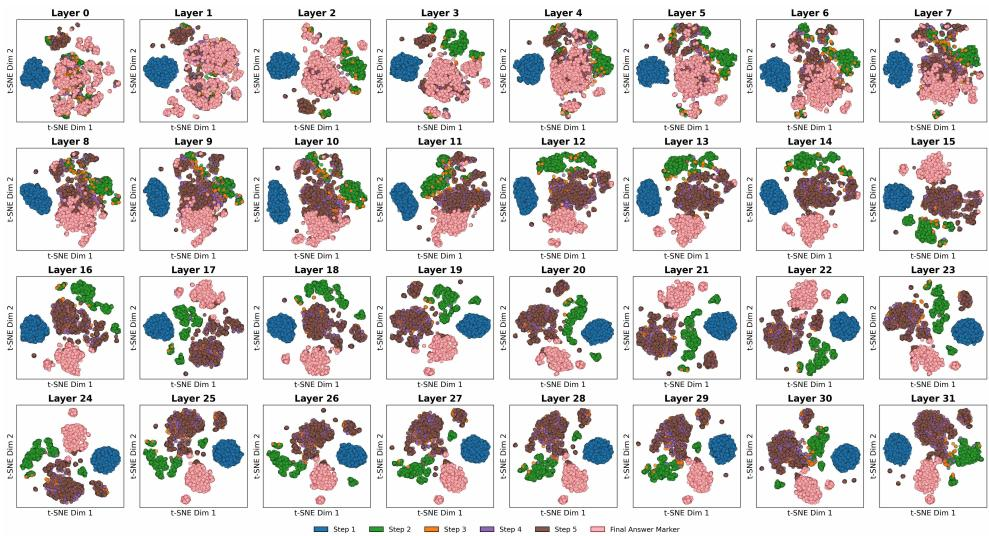  
(a) Instruct

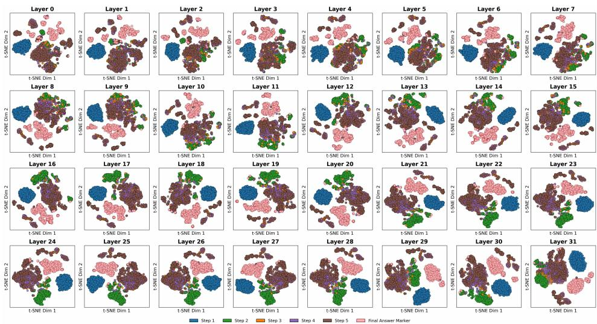  
(b) R1-Distilled

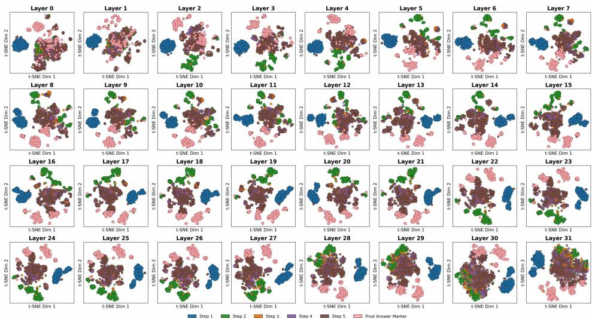  
(c) Base   
Figure 4: Complete t-SNE visualizations of step-aligned hidden states extracted immediately before Step markers across three training regimes on the GSM8K test split. Each point corresponds to a residual-stream activation at a reasoning-step boundary. While all models exhibit step-structured organization, R1-Distilled and Instruct models show earlier and more pronounced separation between steps, whereas the Base model exhibits weaker but still discernible structure.

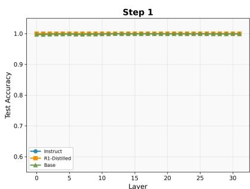

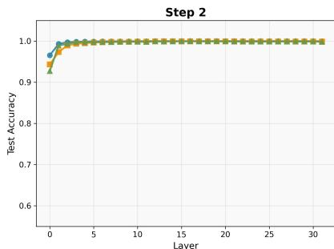

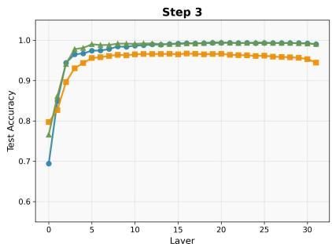

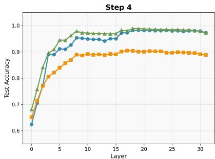

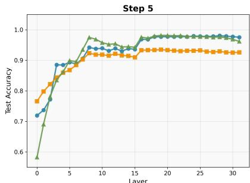

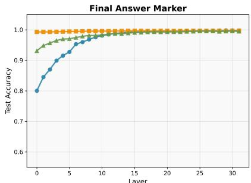  
Figure 5: Layer-wise linear probe accuracy for predicting reasoning step identity. In each sub-figure, the $x$ -axis denotes the layer from which activations are extracted, and the $y$ -axis reports test accuracy of a linear classifier trained on these activations as input, with the reasoning step number (or the final answer marker) as the label. Early steps are linearly separable from shallow layers with near-ceiling accuracy, whereas later steps require deeper layers to become separable. Differences across training regimes indicate that instruction tuning and reasoning distillation shift the linear accessibility of step information.