# Why Do Multilingual Reasoning Gaps Emerge in Reasoning Language Models?

Deokhyung Kang1, Seonjeong Hwang1, Daehui Kim2, Hyounghun $\mathbf { K i m } ^ { 1 , 3 }$ , Gary Geunbae Lee1,3

1Graduate School of Artificial Intelligence, POSTECH 2Agentic AI Lab, KT

3Department of Computer Science and Engineering, POSTECH

{deokhk, seonjeongh, h.kim, gblee}@postech.ac.kr, daehui.kim@kt.com

# Abstract

Reasoning language models (RLMs) achieve strong performance on complex reasoning tasks, yet they still exhibit a multilingual reasoning gap, performing better in high-resource languages than in low-resource ones. While recent efforts have been made to address this gap, its underlying causes remain largely unexplored. In this work, we show that this gap primarily stems from failures in language understanding—specifically, the model’s inability to translate multilingual inputs into the language dominating its reasoning traces (typically English). As identifying understanding failures can enable targeted mitigation of the gap, we evaluate a range of detection methods and find that understanding failures are detectable to a meaningful extent, with supervised approaches performing best. Building on this, we propose Selective Translation, a strategy that incorporates an English translation into the initial reasoning trace when an understanding failure is detected. Experimental results using Qwen3-4B show that Selective Translation substantially bridges the multilingual reasoning gap, achieving near full-translation performance while translating only about $20 \%$ of inputs. Together, our results show that failures in language understanding are the primary driver of the multilingual reasoning gap and can be detected and selectively mitigated, clarifying its origin and suggesting a path toward more equitable multilingual reasoning.

# 1 Introduction

Recent reasoning language models (RLMs), such as OpenAI’s o1 (Jaech et al., 2024) and DeepSeek-R1 (Guo et al., 2025), have achieved remarkable performance on complex reasoning tasks. By generating long reasoning traces (intermediate steps) before producing a final response, they substantially outperform conventional large language models (Muennighoff et al., 2025; Yu et al., 2025).

Question: Kikapu kina machungwa 25 na 1 miongoni mwao limeharibika, 20% hayajaiva, 2 ni chachu na mengine ni mazuri. Machungwa mangapi ni mazuri?

  
Figure 1: Understanding failure in Qwen3-4B: the model shows confusion when interpreting the Swahili input (e.g., “This is confusing. . . ”) and ignores the “1 bad orange” condition, leading to an incorrect answer.

Reasoning Trace: The question is in Swahili, so I try to translate it. "Kikapu kina machungwa 25 na 1 miongoni mwao limeharibika...

Maybe it's about a group of people or animals? $\ldots 2 0 \%$ are injured, 2 are sick, and the rest are healthy…This is confusing. Maybe the problem is mistranslated or I misunderstand it.

Eventually, if total is 25, $2 0 \%$ is 5, plus 2 sick = 7, so $2 5 - 7 = 1 8$ healthy."

Final Response: Machungwa kina 25. $2 0 \%$ ya 25 ni $0.20 \\times $2 5 = 5 5$ machungwa hayajaiva. 2 machungwa ni chachu. Kwa hiyo, machungwa ya mazuri ni: $\$ 25-5-2=185$ . Jibu: $\boxed{18}$

$2 5 = 5 5$ thatareunripe.2orangesarefermented.Therefore，thenumberof goodorangesis:25-5-2=18.Answer:$wboxed(18}$)

Despite these advances, RLMs still exhibit a multilingual reasoning gap, performing much better on queries in high-resource languages (e.g., English) than in low-resource languages (Wang et al., 2025b). While recent studies (Zhao et al., 2025; Bajpai and Chakraborty, 2025; Yoo et al., 2025) have explored various methods to narrow this gap, a systematic understanding of why these gaps arise in RLMs remains unexplored — a key question for developing principled approaches toward equitable multilingual reasoning.

In this work, we investigate this question by framing RLMs’ multilingual reasoning as a threestage process, grounded in observations from prior works (Yong et al., 2025; Qi et al., 2025; Tam et al., 2025). As shown in Figure 1, when given a math problem in Swahili, the model first translates the input meaning into the dominant language of its reasoning trace (English), a stage we refer to as (i) language understanding. It then (ii) reasons within that English-centric trace before (iii) generating the final response back in Swahili. Building

on this framework, we quantify the contribution of failures in each stage to the multilingual reasoning gap through a stage-wise attribution analysis, using stage-specific interventions designed to control for such failures. We evaluate multiple open-source RLMs, including the Qwen3 family (Yang et al., 2025a) and gpt-oss-20b (Agarwal et al., 2025), across 10 languages ranging from high- to low-resource settings. Our analysis reveals a consistent pattern: understanding failures are the dominant source of the multilingual reasoning gap in most cases. This finding suggests that if such failures can be detected, we can prevent them by abstaining from answering or mitigate the gap by translating the input into a high-resource language before reasoning.

Accordingly, we next investigate whether such understanding failures can be detected. We observe that models often leave recognizable signals of misunderstanding within their reasoning traces (Figure 1). Inspired by this, we adapt detection methods originally developed for identifying undesirable behaviors such as hallucination and jailbreak, which similarly arise when the model fails to satisfy its intended objective. Using various detection methods—ranging from LLM-based monitoring (Baker et al., 2025) and self-reflection (Xiong et al., 2024) to token-probability signals (Manakul et al., 2023) and supervised detectors (Azaria and Mitchell, 2023; Chan et al., 2025)—we find that understanding failures are detectable across multiple approaches, with supervised approaches perform ing best.

Finally, we propose Selective Translation, which incorporates an English translation into the initial reasoning trace only when an understanding failure is detected. It efficiently narrows the multilingual reasoning gap, improving average accuracy from 81.1 to 88.0 on the Polymath-Low (Wang et al., 2025b) benchmark with Qwen3-4B (Yang et al., 2025a), closely matching full translation (89.4) while translating only $20 \%$ of inputs. These gains, achieved while intervening on only a small fraction of inputs, demonstrate the reliability of the detector and the promise of understanding failure detection for equitable multilingual reasoning.

We summarize our main contributions as follows: (i) We provide the first systematic analysis of the multilingual reasoning gap in RLMs and show that understanding failures are the dominant source of this gap, providing a basis for developing principled approaches toward equitable multilingual

reasoning. (ii) We systematically evaluate a range of methods for understanding failure detection and show that such failures can be automatically detected. (iii) We demonstrate the effectiveness of understanding failure detection via Selective Translation in efficiently narrowing multilingual reasoning gaps.

# 2 Related Work

Reasoning language models (RLMs). Recent RLMs such as DeepSeek-R1 (Guo et al., 2025) and Qwen3 (Yang et al., 2025a) are trained to produce long chains of thought and achieve strong performance on challenging reasoning tasks (Muennighoff et al., 2025; Jaech et al., 2024). Recently, their multilingual reasoning capabilities have gained increasing attention. Yong et al. (2025) shows that scaling inference compute on an English-centric RLM yields clear multilingual gains, contrary to earlier findings on smaller models (Son et al., 2025). Prior work (Yong et al., 2025; Tam et al., 2025) also finds that RLMs tend to produce reasoning traces dominated by high resource languages, which we refer to as the reasoning language. Park et al. (2025) attributes this to cross-lingual collapse, where GRPO (Shao et al., 2024) training encourages models to revert to English-dominant reasoning traces due to accuracycentric reward signals. In response, several studies have explored controlling the reasoning language via language-forcing prefixes (Yong et al., 2025; Qi et al., 2025; Tam et al., 2025) or languageconsistency rewards (Park et al., 2025). However, these approaches often degrade accuracy or require costly target-language reasoning data, particularly for low-resource languages. Therefore, we focus on a setting where the model reasons in a highresource language (English in our case).

Multilingual reasoning gap. Despite this, RLMs still exhibit a multilingual reasoning gap (Yang et al., 2025a). Recent work has attempted to bridge this gap through approaches such as representation editing (Zhao et al., 2025), tailored prompting (Yoo et al., 2025), and prefix tuning (Bajpai and Chakraborty, 2025). However, the underlying causes of this gap remain largely unexplored. Therefore, we tackle this question by systematically identifying the sources of the multilingual reasoning gap and investigating methods to mitigate them. Appendix G provides an extended discussion on multilingual reasoning and abstention to

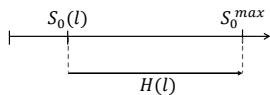  
1. Measure total accuracy gap ??(??)   
3. Decompose gap via residual analysis

$$
\phi_ {R} (l) = H (l) - \phi_ {U} (l) - \phi_ {T} (l)
$$

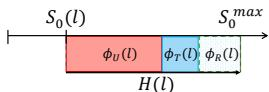  
2. Estimate contributions via interventions

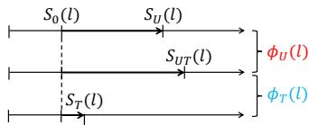

  
Generation Failure   
Reasoning Failure   
Figure 2: Stage-wise attribution of the multilingual reasoning gap. The total gap $H ( l )$ is decomposed into contributions from understanding $( \phi _ { U } )$ , generation $( \phi _ { T } )$ , and reasoning $( \phi _ { R } )$ using targeted interventions followed by residual analysis.

further contextualize our work within the broader literature.

# 3 Why Does the Multilingual Reasoning Gap Emerge?

# 3.1 Multilingual Reasoning Process

To analyze why the multilingual reasoning gap emerges, we draw on prior findings on how RLMs process multilingual inputs. Prior work shows that reasoning traces are typically dominated by highresource languages such as English or Chinese, while final responses tend to align with the input language (Yong et al., 2025; Tam et al., 2025). During the early stages of reasoning, models often begin by internally translating the input into the dominant language of their reasoning traces (Yong et al., 2025). We interpret this translation as the model’s language understanding process, which enables subsequent reasoning to be carried out in the dominant language. Building on this view, we conceptualize multilingual reasoning as a threestage process: (i) understanding the input, (ii) reasoning in the dominant language, and (iii) generating the final response in the input language. We hypothesize that failures may arise at each stage (e.g., input misinterpretation, degraded reasoning despite successful understanding, or generation errors), thereby contributing to the multilingual reasoning gap.

# 3.2 Stage-wise Attribution Analysis

We perform a stage-wise attribution analysis to identify which stages drive the multilingual reasoning gap. We use targeted interventions for the understanding and generation stages and measure how much the gap is reduced when failures at each stage are controlled for. We then attribute the remaining

gap to reasoning stage, as directly controlling reasoning failures is difficult. Figure 2 illustrates the overall process.

Preliminary. Given an input $x = ( x _ { 1 } , \ldots , x _ { n } ) $ an RLM first generates a reasoning trace $r =$ $( r _ { 1 } , \ldots , r _ { k } )$ conditioned on $x$ , and then produces a final response $y = ( y _ { 1 } , \dots , y _ { m } )$ based on both $x$ and $r$ . The reasoning trace $r$ is a long chain of thought that includes intermediate steps and often a candidate final answer (Guo et al., 2025; Chen et al., 2025); in practice, it typically begins with <think> and ends with </think>.

Step 1: Measuring the Total Gap. For language l, let $S _ { 0 } ( l )$ denote the RLM’s accuracy under the Base setting, i.e., the original model evaluated on the input language without any intervention. Let $S _ { 0 } ^ { \mathrm { m a x } } = \operatorname* { m a x } _ { l \in \mathcal { L } } S _ { 0 } ( l )$ be the best performance across all languages. We define the multilingual reasoning gap for language l as:

$$
H (l) = S _ {0} ^ {\max } - S _ {0} (l).
$$

Step 2: Estimating Contributions via Interventions. To attribute the sources of the gap, we introduce two interventions:

(1) Understanding Intervention (U). As described in Section 3.1, during the understanding stage, an RLM translates the meaning of the input $x _ { l }$ into a dominant language within its reasoning trace $r$ . To assess failures in this stage, we introduce the understanding intervention, which provides an explicit translation of $x _ { l }$ via a fixed prefix $\pi ( x _ { \mathrm { d o m } } )$ at the beginning of the reasoning trace:

$\pi ( x _ { d o m } ) = " \mathrm { O k a y } .$ , let’s see. I understand the question as: $\Gamma \{ x _ { d o m } \} ^ { \prime }$ . Let’s solve the problem based on this understanding."

Here, $x _ { \mathrm { d o m } }$ denotes a dataset-provided reference (gold) English translation of $x _ { l }$ . We use the English translation to align with the model’s dominant reasoning language2, and a dataset-provided reference translation to ensure that the intervention is not affected by translation noise. The model then generates $r$ conditioned on $( x \iota , \pi ( x _ { \mathrm { d o m } } ) )$ instead of only $x _ { l }$ . The performance gain quantifies the extent of understanding failures.

(2) Answer Extraction from Reasoning Trace (T). To assess failures in response generation, we

extract the final answer directly from the reasoning trace $r$ instead of the final response $y$ , thereby isolating errors introduced during the generation stage. We apply the same answer extraction logic to both $r$ and $y$ , as detailed in Appendix D.2.

Let $S _ { U } ( l )$ , $S _ { T } ( l )$ , and $S _ { U T } ( l )$ denote the accuracies under w/ U, w/ T, and w/ $\mathbf { U } \mathbf { + } \mathbf { T }$ , respectively. Each intervention explains part of the gap through the performance gain it induces over the Base setting. Because the effects of U and T may interact, we attribute their contributions using a Shapley decomposition (Shorrocks et al., 2013), a principled and order-invariant approach for stage-wise attribution:

$$
\phi_ {U} (l) = \max  \left\{0, \frac {1}{2} \left[ \left(S _ {U} (l) - S _ {0} (l)\right) + \left(S _ {U T} (l) - S _ {T} (l)\right) \right] \right\},
$$

$$
\phi_ {T} (l) = \max \left\{0, \frac {1}{2} \big [ (S _ {T} (l) - S _ {0} (l)) + (S _ {U T} (l) - S _ {U} (l)) \big ] \right\}.
$$

Step 3: Decomposing the Gap via Residual Analysis. After estimating the contributions of understanding and generation, we decompose the remaining gap via residual analysis. Specifically, we attribute the unexplained portion of the gap to reasoning:

$$
\phi_ {R} (l) = H (l) - \phi_ {U} (l) - \phi_ {T} (l) \quad (\geq 0).
$$

To analyze the relative importance of each stage, we normalize these contributions to obtain stagewise shares:

$$
\mathrm {U - s h a r e} (l) = \frac {\phi_ {U} (l)}{H (l)} \quad (\text {U n d e r s t a n d i n g})
$$

$$
\mathrm {R} - \operatorname {s h a r e} (l) = \frac {\phi_ {R} (l)}{H (l)} \quad (\text {R e a s o n i n g})
$$

$$
\mathrm {G} - \operatorname {s h a r e} (l) = \frac {\phi_ {T} (l)}{H (l)} \quad (\text {G e n e r a t i o n})
$$

with U-share $( l ) + { \bf R }$ -share(l) + G-share(l) = 1.

Aggregation Across Languages. To obtain a dataset-level view of stage contributions, we aggregate these shares across languages. Since the magnitude of the gap varies by language, we weight each language by its gap $H ( l )$ (i.e., its headroom), thereby assigning greater weight to languages with larger performance gaps:

$$
\begin{array}{l} \text {W e i g h t e d - S h a r e} _ {\star} = \frac {\sum_ {l \in \mathcal {L}} H (l) \cdot \text {S h a r e} _ {\star} (l)}{\sum_ {l \in \mathcal {L}} H (l)}, \\ \star \in \left\{\mathrm {U}, \mathrm {R}, \mathrm {G} \right\}. \\ \end{array}
$$

Finally, to focus on statistically meaningful differences across languages, we only consider languages whose Base performance is significantly

lower than that of the best-performing language (e.g., English) according to a Welch’s t-test $_ { ( \mathrm { p < 0 . 0 5 } ) }$ (Welch, 1947).

# 3.3 Experimental Settings

Models. We primarily evaluate two recent RLMs from distinct model families: Qwen3-4B (Yang et al., 2025a) and gpt-oss-20b (Agarwal et al., 2025). We select these models as they are publicly available, achieve state-of-the-art performance at a comparable scale, and support multiple languages. To examine generalizability across model scales, we also evaluate Qwen3-1.7B, 8B, and 14B.

Evaluation datasets. We evaluate models on two multilingual reasoning benchmarks: Polymath (Wang et al., 2025b) and MMLU-ProX-Lite (Xuan et al., 2025). Polymath spans mathematical reasoning across different difficulty levels, and we focus on the low, medium, and high levels, ranging from K-12 mathematics to challenging competition problems from AIME (Art of Problem Solving, 2025). For STEM reasoning, we use STEM-related categories from MMLU-ProX-Lite, a subset from MMLU-ProX for efficient evaluation. We evaluate models on a set of typologically diverse languages with varying resource availability, consistently across both benchmarks. Following the taxonomy of Joshi et al. (2020), we group them into:

• High-resource languages: English (en), German (de), Spanish (es), Arabic (ar), Japanese (ja), Korean (ko)   
• Mid-resource languages: Thai (th), Bengali (bn)   
• Low-resource languages: Swahili (sw), Telugu (te)

This yields 125 test samples per language for each difficulty level on Polymath and 257 samples per language on MMLU-ProX-Lite. See Appendix D.1 for detailed dataset descriptions and evaluation prompts.

Evaluation metrics and settings. We report task accuracy averaged over three runs with different random seeds, sampled with temperature $= 0 . 6$ , top- $ { p } = \ 0 . 9 5$ , and top- $k ~ = ~ 2 0$ , and a maximum generation length of 32,768 tokens. Correctness is evaluated using MATH-VERIFY (Kydlícekˇ , 2025) for Polymath and string-based matching for

MMLU-ProX-Lite. Further evaluation details are provided in Appendix D.2.

# 3.4 Results

Understanding intervention significantly improves performance. We first examine how each intervention affects task accuracy. Table 1 reports multilingual benchmark results on Qwen3-4B with and without the proposed interventions. The Understanding Intervention (w/ U) yields consistent and significant improvements, especially in lowresource languages such as Swahili (sw) and Telugu (te). For example, in Polymath-Low, it improves Swahili from $2 9 . 3  8 8 . 0$ . By contrast, the Answer Extraction from Reasoning Trace (w/ T) shows little change from the Base. These results suggest that the multilingual gap in RLMs mainly arises from failures in Understanding. To verify this more systematically, we perform the stagewise attribution analysis (Section 3.2) to quantify the contribution of each stage.

Understanding failures dominate the multilingual reasoning gap, regardless of reasoning difficulty. Figure 3 presents the results of the stagewise attribution analysis on the multilingual reasoning gap. Failures in the understanding stage account for most of the gap, while the generation stage contributes only marginally.3 The languagespecific attribution analysis (Appendix B.2) reveals that this trend is especially pronounced in lowresource languages, while the impact of understanding failures is reduced in high-resource languages. However, since the multilingual reasoning gap is largely driven by low-resource languages, understanding remains the primary bottleneck overall. Moreover, the share of Reasoning remains relatively small and shows no consistent trend across different reasoning difficulty levels (Polymath-Low, Medium, and High).

To further validate this findings, we assess whether reasoning difficulty continues to affect performance once understanding failures are resolved. Specifically, we compute the average Reasoning Performance Ratio—the average ratio of each language’s accuracy to that of the best-performing language under the Base setting—before and after applying the Understanding Intervention (w/ U). As shown in Table 2, this ratio increases to nearly 1.0 across all Polymath splits for both models, demon-

strating that once understanding is resolved, the multilingual reasoning gap collapses regardless of reasoning difficulty.

Multilingual reasoning strongly correlates with translation ability. Having identified understanding failures as the dominant source of multilingual reasoning gaps, we next investigate what affects this process. As defined in Section 3.1, the understanding stage translates the input into the reasoning language (typically English). This implies that understanding, and consequently multilingual reasoning ability, may depend on how well the model translates the input into English. To test this, we measure RLMs’ $\mathsf { x x } \longrightarrow \mathsf { e n }$ translation quality on FLORES-200 (Costa-Jussà et al., 2022) using GEMBA-DA (Kocmi and Federmann, 2023), an LLM-based direct assessment metric with gpt-4.1 (OpenAI, 2025) as the judge. Scores range from 0 (“no meaning preserved”) to 100 (“perfect meaning and grammar”). Figure 4 shows reasoning performance ratio on Polymath-Low versus translation quality across ten languages and five models, revealing a strong correlation $( r = 0 . 9 5 1 )$ ). This result demonstrates that languages more faithfully translated into English also yield stronger reasoning performance, indicating that understanding is a key factor in multilingual reasoning.

# 4 Detecting Understanding Failures

From Section 3, we found that understanding failure is the main source of multilingual reasoning gaps. This raises a key question: can we detect when the model fails to understand the input? To answer this, we define the detection task (Section 4.1), present methods and setups (Section 4.2, 4.3), and report experimental results (Section 4.4).

# 4.1 Task Definition

We formulate understanding failure detection as a binary classification task that operates under the Base setting—i.e., without any interventions. Given the reasoning model’s input and output signals produced in the Base setting for a datapoint, we determine whether the model has failed to understand the input $\left( \mathrm { l a b e l } \ = \ 1 \right)$ ) or has correctly understood it $( { \mathrm { 1 a b e l } } = \emptyset )$ ). Ground-truth labels are defined using the model predictions in Section 3. Specifically, for each language $l$ and dataset $D _ { l }$ , we define two sets: $I _ { \mathrm { B a s e } }$ denotes the indices of datapoints correctly answered by the model under the Base setting, and $I _ { \mathrm { U } }$ denotes those correctly an-

Table 1: Accuracy comparison of methods across languages on Qwen3-4B. Base denotes the original model without intervention, w/ T applies Answer Extraction from Reasoning Trace, w/ U applies Understanding Intervention, and w/ $\mathbf { U } + \mathbf { T }$ applies both. Pairwise comparisons against the Base use Welch’s t-test: blue cells mark statistically significant improvements $( \mathtt { p } < 0 . 0 5 )$ , and green cells indicate notable improvements $( \mathfrak { p } < 0 . 1 )$ . The Average row is bolded. Understanding intervention significantly improves performance, especially for low-resource languages.   

<table><tr><td>Dataset</td><td>Method</td><td>en</td><td>de</td><td>es</td><td>ar</td><td>ja</td><td>ko</td><td>th</td><td>bn</td><td>sw</td><td>te</td><td>Avg</td></tr><tr><td rowspan="4">Polymath-Low</td><td>Base</td><td>96.5</td><td>88.0</td><td>93.9</td><td>89.6</td><td>85.3</td><td>90.7</td><td>85.1</td><td>83.2</td><td>29.3</td><td>69.9</td><td>81.1</td></tr><tr><td>w/ T</td><td>96.0</td><td>87.5</td><td>93.3</td><td>89.3</td><td>85.1</td><td>89.6</td><td>85.1</td><td>82.9</td><td>31.7</td><td>70.9</td><td>81.1</td></tr><tr><td>w/ U</td><td>95.2</td><td>89.6</td><td>94.7</td><td>92.5</td><td>91.5</td><td>93.1</td><td>92.0</td><td>94.4</td><td>88.0</td><td>87.7</td><td>91.9</td></tr><tr><td>w/ U+T</td><td>95.2</td><td>89.6</td><td>94.4</td><td>92.3</td><td>91.2</td><td>92.8</td><td>92.3</td><td>94.4</td><td>90.1</td><td>89.3</td><td>92.2</td></tr><tr><td rowspan="4">Polymath-Medium</td><td>Base</td><td>74.7</td><td>70.9</td><td>72.0</td><td>68.8</td><td>70.9</td><td>70.9</td><td>67.7</td><td>64.8</td><td>45.6</td><td>64.8</td><td>67.1</td></tr><tr><td>w/ T</td><td>75.2</td><td>70.9</td><td>71.7</td><td>69.1</td><td>70.7</td><td>70.9</td><td>67.7</td><td>65.6</td><td>45.9</td><td>65.1</td><td>67.3</td></tr><tr><td>w/ U</td><td>74.7</td><td>72.0</td><td>74.1</td><td>73.3</td><td>75.2</td><td>73.6</td><td>70.4</td><td>68.5</td><td>67.5</td><td>70.9</td><td>72.0</td></tr><tr><td>w/ U+T</td><td>74.7</td><td>72.0</td><td>74.4</td><td>73.3</td><td>75.5</td><td>73.3</td><td>70.4</td><td>70.4</td><td>68.8</td><td>71.2</td><td>72.4</td></tr><tr><td rowspan="4">Polymath-High</td><td>Base</td><td>53.9</td><td>51.2</td><td>48.8</td><td>52.0</td><td>50.1</td><td>52.8</td><td>45.3</td><td>44.8</td><td>28.8</td><td>40.8</td><td>46.9</td></tr><tr><td>w/ T</td><td>54.1</td><td>50.9</td><td>49.6</td><td>52.5</td><td>50.4</td><td>53.6</td><td>45.6</td><td>45.6</td><td>29.3</td><td>40.8</td><td>47.3</td></tr><tr><td>w/ U</td><td>54.9</td><td>51.2</td><td>52.0</td><td>51.7</td><td>52.5</td><td>53.3</td><td>50.9</td><td>49.1</td><td>50.4</td><td>50.1</td><td>51.6</td></tr><tr><td>w/ U+T</td><td>54.9</td><td>51.7</td><td>52.3</td><td>51.7</td><td>52.5</td><td>53.1</td><td>51.5</td><td>49.6</td><td>50.7</td><td>50.1</td><td>51.8</td></tr><tr><td rowspan="4">MMLU-ProX-Lite</td><td>Base</td><td>77.0</td><td>77.8</td><td>76.5</td><td>73.3</td><td>75.0</td><td>74.6</td><td>73.9</td><td>74.6</td><td>53.6</td><td>71.1</td><td>72.7</td></tr><tr><td>w/ T</td><td>76.9</td><td>77.4</td><td>76.5</td><td>73.3</td><td>74.8</td><td>74.4</td><td>73.8</td><td>74.6</td><td>53.4</td><td>71.1</td><td>72.6</td></tr><tr><td>w/ U</td><td>78.5</td><td>77.4</td><td>77.7</td><td>78.0</td><td>78.5</td><td>77.2</td><td>78.1</td><td>78.2</td><td>73.5</td><td>77.2</td><td>77.4</td></tr><tr><td>w/ U+T</td><td>78.1</td><td>77.3</td><td>78.0</td><td>78.0</td><td>78.5</td><td>77.7</td><td>78.2</td><td>78.2</td><td>74.7</td><td>77.4</td><td>77.6</td></tr></table>

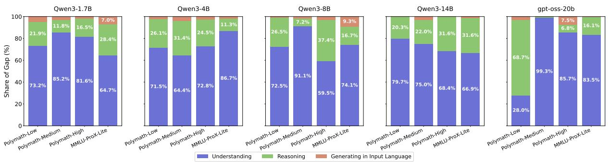  
Figure 3: Weighted shares of Understanding, Reasoning, and Generation in the input language to the overall multilingual reasoning gap. Across models and datasets, failures in Understanding generally dominate the gap.

Table 2: Average reasoning performance ratio (mean $\pm \mathrm { s D }$ ) across Polymath splits of different difficulty (Low, Medium, High).   

<table><tr><td rowspan="2">Dataset</td><td colspan="2">Qwen3-4B</td><td colspan="2">gpt-oss-20b</td></tr><tr><td>Base</td><td>w / U</td><td>Base</td><td>w / U</td></tr><tr><td>Low</td><td>0.82±0.21</td><td>0.95±0.03</td><td>0.91±0.05</td><td>0.94±0.03</td></tr><tr><td>Medium</td><td>0.89±0.11</td><td>0.96±0.04</td><td>0.97±0.04</td><td>0.99±0.02</td></tr><tr><td>High</td><td>0.85±0.14</td><td>0.95±0.02</td><td>0.92±0.05</td><td>0.98±0.03</td></tr></table>

swered under the Understanding Intervention (w/ U). We restrict our attention to the subset $I _ { \mathrm { B a s e } } \cup I _ { \mathrm { U } }$ to exclude datapoints beyond the model’s inherent reasoning capability. Within this subset, we assign labels as follows:

$$
y _ {i} = \left\{ \begin{array}{l l} 1, & \text {i f} i \in I _ {\mathrm {U}} \backslash I _ {\text {B a s e}} \quad (\text {u n d e r s t a n d i n g f a i l u r e}) \\ 0, & \text {i f} i \in I _ {\text {B a s e}} \quad (\text {u n d e r s t o o d}) \end{array} \right.
$$

This formulation isolates errors attributable to understanding by focusing on cases where the model fails under the Base setting but succeeds

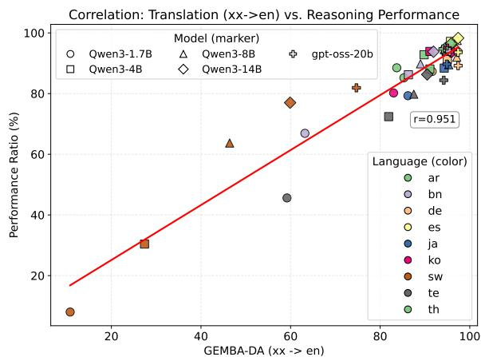  
Figure 4: Scatter plot of Reasoning Performance Ratio on Polymath-Low vs. Translation quality on FLORES-200 (measured by GEMBA-DA in the ${ \sf x } { \sf x }  { \sf e } { \sf n }$ direction). A global linear trend line shows a strong positive Pearson correlation ${ \mathrm { \Delta } r = 0 . 9 5 1 }$ )

once understanding is resolved.

# 4.2 Methods

As shown in Figure 1, models often leave clear cues in their reasoning traces (e.g., “This is confusing. . . ”) when they fail to understand the input, suggesting that such failures produce detectable signals (see Appendix C for more examples). Motivated by these observations, we adapt detection methods for undesirable behaviors such as hallucination and jailbreak to the task of understanding failure detection, as these behaviors also arise from failures to meet the model’s intended objective. We consider three types of approaches.

LLM–based approaches. These methods rely on prompting either external large language models to assess understanding or the reasoning model itself to self-reflect on its own understanding. First, a zero-shot LLM-based detector, based on GPT-4.1-mini, is prompted to judge whether the model correctly understood the input given the reasoning trace, following prior work on behavior monitoring (Baker et al., 2025; Chan et al., 2025). Second, a self-reflection method (Kadavath et al., 2022; Xiong et al., 2024) prompts the reasoning model itself to explicitly reflect on whether it understood the input after producing its reasoning trace.

Token-probability–based approaches. These approaches analyze token-level probabilities over the full reasoning trace to quantify the model’s uncertainty, which we hypothesize may reflect failures in the understanding stage. We hypothesize that when the model fails to correctly interpret the input, this may manifest as lower token-level confidence throughout the reasoning process. Following prior work on hallucination detection (Manakul et al., 2023), we compute two confidence-based signals, the average and minimum per-token confidence, and classify samples as understanding failures when their values fall below a calibrated threshold. We further use the Input negative log-likelihood (NLL) as a proxy for input familiarity and hypothesize that higher NLL may be associated with understanding failures.

Supervised approaches. Supervised detectors are trained to predict understanding failure labels (defined in Section 4.1) from textual or hidden-state features. The first is a fine-tuned mmBERT (Marone et al., 2025) detector, adapted from prior behavioral monitoring work (Chan et al., 2025). It takes the query and its reasoning trace as input. The second is a prober, a two-layer perceptron that takes as input the final-layer hidden state

corresponding to the last token of the reasoning trace, following prior probing methods (Azaria and Mitchell, 2023; Zhang et al., 2025).

Finally, we define a random baseline that predicts “not understood” with probability equal to the proportion of such labels in the calibration data for each language. This serves as a performance floor, quantifying performance achievable using only language-specific label distribution priors.

# 4.3 Experimental Settings

We evaluate understanding detection approaches on Polymath-Low (Wang et al., 2025b) and MMLU-ProX-Lite (Xuan et al., 2025), using the same set of languages as in Section 3.3. For each dataset, we provide the detection methods with detection signals produced by Qwen3-4B and gpt-oss-20b in the Base setting.

Evaluation metrics. Since these models already perform reasonably well in the evaluated languages, over $86 \%$ of the samples are labeled as understood (label ${ } = 0$ ). To properly assess detection methods under class imbalance, we treat not understood (label $= 1$ ) as the positive class and report the following metrics: Balanced accuracy averages the true-positive and true-negative rates, which is informative in imbalanced settings. F1 is the harmonic mean of precision and recall. PR-AUC measures the area under the precision–recall curve, providing a threshold-independent evaluation. Metrics are computed by aggregating samples across languages, and we report the average over three runs.

Calibration data. For Polymath-Low, we use MGSM (Shi et al., 2023) as calibration data, excluding samples already included in Polymath-Low. For MMLU-ProX-Lite, we use the validation split of MMLU-ProX-Lite. This data is used for threshold calibration in token-probability–based approaches and as training data for supervised approaches. Additional implementation details on methods and data statistics are in Appendix E.

# 4.4 Results and Analysis

Supervised approaches achieve the best detection performance. Table 3 reports the performance of understanding failure detection methods. Supervised approaches achieve the highest detection performance and substantially outperform the random baseline, indicating that they capture meaningful signals rather than merely exploiting language-specific label distributions. Some

Table 3: Performance of understanding failure detection methods reported as mean $\pm$ stdev. Best performance across methods is highlighted in bold and the second best is underlined. Supervised approaches achieve the best performance overall. Per-language results are provided in Appendix B.5.   

<table><tr><td rowspan="2">Dataset</td><td rowspan="2">Method</td><td colspan="3">Qwen3-4B</td><td colspan="3">gpt-oss-20b</td></tr><tr><td>Balanced acc ↑</td><td>F1 ↑</td><td>PR-AUC ↑</td><td>Balanced acc ↑</td><td>F1 ↑</td><td>PR-AUC ↑</td></tr><tr><td rowspan="8">Polymath-Low</td><td>Random baseline</td><td>66.2 ± 2.6</td><td>41.0 ± 3.6</td><td>-</td><td>53.4 ± 4.4</td><td>12.0 ± 7.1</td><td>-</td></tr><tr><td>Avg confidence</td><td>77.8 ± 1.9</td><td>50.7 ± 1.1</td><td>54.3 ± 1.9</td><td>70.1 ± 1.1</td><td>24.7 ± 1.6</td><td>18.6 ± 3.5</td></tr><tr><td>Min confidence</td><td>71.4 ± 3.9</td><td>42.4 ± 3.0</td><td>33.6 ± 1.9</td><td>65.3 ± 5.0</td><td>24.4 ± 3.5</td><td>17.1 ± 4.7</td></tr><tr><td>Input NLL</td><td>64.9 ± 0.1</td><td>39.8 ± 0.7</td><td>32.8 ± 1.8</td><td>57.3 ± 2.9</td><td>16.3 ± 2.2</td><td>12.1 ± 1.3</td></tr><tr><td>Self-reflection</td><td>61.6 ± 2.0</td><td>36.7 ± 4.9</td><td>-</td><td>50.7 ± 0.7</td><td>2.6 ± 2.7</td><td>-</td></tr><tr><td>LLM-based detector</td><td>71.7 ± 1.0</td><td>55.7 ± 1.4</td><td>-</td><td>51.9 ± 0.5</td><td>7.8 ± 1.6</td><td>-</td></tr><tr><td>mmBERT detector</td><td>85.2 ± 1.2</td><td>65.9 ± 6.2</td><td>72.6 ± 1.2</td><td>66.2 ± 3.6</td><td>34.8 ± 1.5</td><td>31.7 ± 3.0</td></tr><tr><td>Prober</td><td>85.5 ± 1.3</td><td>63.7 ± 3.2</td><td>75.7 ± 1.5</td><td>75.4 ± 2.4</td><td>34.5 ± 7.7</td><td>30.3 ± 1.7</td></tr><tr><td rowspan="8">MMLU-ProX-Lite</td><td>Random baseline</td><td>55.4 ± 3.5</td><td>20.6 ± 4.5</td><td>-</td><td>50.5 ± 0.1</td><td>10.3 ± 0.9</td><td>-</td></tr><tr><td>Avg confidence</td><td>64.4 ± 5.3</td><td>34.6 ± 6.5</td><td>31.0 ± 2.6</td><td>52.2 ± 1.5</td><td>15.3 ± 1.5</td><td>8.8 ± 1.5</td></tr><tr><td>Min confidence</td><td>67.6 ± 1.0</td><td>33.0 ± 1.8</td><td>24.5 ± 2.2</td><td>63.8 ± 1.5</td><td>21.4 ± 1.5</td><td>16.3 ± 3.1</td></tr><tr><td>Input NLL</td><td>55.0 ± 2.5</td><td>17.8 ± 8.1</td><td>22.2 ± 1.9</td><td>53.9 ± 0.5</td><td>15.3 ± 0.7</td><td>9.6 ± 1.2</td></tr><tr><td>Self-reflection</td><td>59.3 ± 1.1</td><td>29.4 ± 2.6</td><td>-</td><td>53.9 ± 0.4</td><td>14.4 ± 1.3</td><td>-</td></tr><tr><td>LLM-based detector</td><td>55.6 ± 0.4</td><td>20.1 ± 1.0</td><td>-</td><td>51.1 ± 0.3</td><td>4.8 ± 1.2</td><td>-</td></tr><tr><td>mmBERT detector</td><td>59.7 ± 0.3</td><td>30.1 ± 1.3</td><td>35.8 ± 1.7</td><td>61.9 ± 6.0</td><td>25.4 ± 6.0</td><td>24.5 ± 5.2</td></tr><tr><td>Prober</td><td>77.3 ± 1.0</td><td>44.5 ± 3.0</td><td>42.6 ± 1.8</td><td>60.1 ± 1.1</td><td>26.0 ± 3.4</td><td>20.6 ± 3.4</td></tr></table>

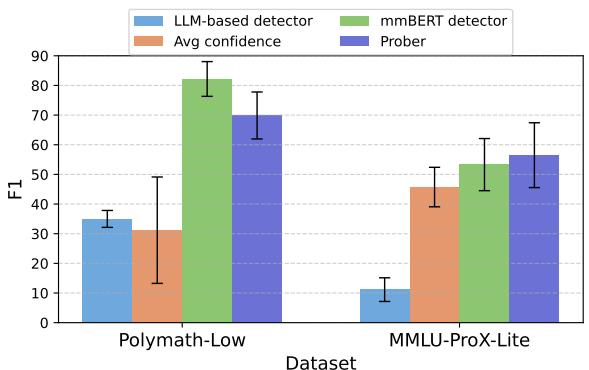  
Figure 5: F1 scores for understanding failure detection on unseen languages (fr, mr, wo) across two benchmarks on Qwen3-4B.

Token-probability–based approaches (Avg, Min confidence) perform moderately but generally fall behind, while Input NLL and self-reflection signals are less effective. The LLM-based detector also shows limited performance, indicating that understanding failure detection remains challenging even for recent LLMs without task-specific supervision.

Generalization to Unseen Languages. We next examine whether supervised approaches can generalize beyond the languages they were trained on. To this end, we use French (fr), Marathi (mr), and Wolof (wo), spanning high-resource (fr) to lowresource (mr, wo) languages. Figure 5 shows results. We observe that both the mmBERT detector and the prober consistently outperform the averageconfidence baseline and the LLM-based detector

across unseen languages. This shows that the superiority of supervised classifiers generalizes beyond training languages, highlighting robustness in multilingual settings.

# 5 Selective Translation

Having established that understanding failures can be reliably detected, we investigate how such detection can be used to address the multilingual reasoning gap. To this end, we propose Selective Translation, a simple yet effective strategy that incorporates an English translation of the input into the initial reasoning trace only when an understanding failure is detected.4 Table 4 presents the results of this approach using the prober as a detector. Selective Translation is particularly effective in lowresource languages, where understanding failures are frequent. By intervening on cases that would otherwise fail, it substantially reduces the multilingual reasoning gap—improving average accuracy from 81.1 to 88.0 on Polymath-Low and from 72.7 to 74.3 on MMLU-ProX-Lite, closely approaching full translation (89.4 and 76.5)—while requiring translation for only about $20 \%$ of inputs on average. These results show that the detector accurately identifies when translation is needed and enables efficient bridging of the multilingual reasoning gap.5

Table 4: Performance of translation strategies with Qwen3-4B. Avg. (Translator usage) reports average accuracy across languages, with the overall translator usage shown in parentheses. For Selective translation, per-language translator usage $( \% )$ is shown below each accuracy score. Appendix B.6 provides results on gpt-oss-20b.   

<table><tr><td></td><td>Method</td><td>en</td><td>de</td><td>es</td><td>ar</td><td>ja</td><td>ko</td><td>th</td><td>bn</td><td>sw</td><td>te</td><td>Avg. (Translator usage)</td></tr><tr><td rowspan="4">Polymath-Low</td><td>Base</td><td>96.5</td><td>88.0</td><td>93.9</td><td>89.6</td><td>85.3</td><td>90.7</td><td>85.1</td><td>83.2</td><td>29.3</td><td>69.9</td><td>81.1 (0.0%)</td></tr><tr><td rowspan="2">Selective translation</td><td>96.3</td><td>88.3</td><td>94.4</td><td>90.4</td><td>86.1</td><td>91.5</td><td>88.3</td><td>86.7</td><td>81.3</td><td>77.1</td><td rowspan="2">88.0 (19.3%)</td></tr><tr><td>(1.6%)</td><td>(3.7%)</td><td>(3.7%)</td><td>(4.8%)</td><td>(13.1%)</td><td>(5.9%)</td><td>(9.6%)</td><td>(26.1%)</td><td>(86.4%)</td><td>(37.9%)</td></tr><tr><td>Full translation</td><td>96.0</td><td>88.3</td><td>93.3</td><td>90.9</td><td>87.5</td><td>92.5</td><td>89.6</td><td>90.4</td><td>85.3</td><td>80.5</td><td>89.4 (100.0%)</td></tr><tr><td rowspan="4">MMLU-ProX-Lite</td><td>Base</td><td>77.0</td><td>77.8</td><td>76.5</td><td>73.3</td><td>75.0</td><td>74.6</td><td>73.9</td><td>74.6</td><td>53.6</td><td>71.1</td><td>72.7 (0.0%)</td></tr><tr><td rowspan="2">Selective translation</td><td>77.3</td><td>76.9</td><td>77.2</td><td>74.1</td><td>75.9</td><td>75.9</td><td>73.9</td><td>74.1</td><td>65.1</td><td>72.8</td><td rowspan="2">74.3 (20.8%)</td></tr><tr><td>(5.2%)</td><td>(10.0%)</td><td>(8.0%)</td><td>(17.9%)</td><td>(19.2%)</td><td>(14.4%)</td><td>(18.4%)</td><td>(27.0%)</td><td>(55.8%)</td><td>(31.6%)</td></tr><tr><td>Full translation</td><td>79.0</td><td>77.8</td><td>78.3</td><td>76.0</td><td>77.8</td><td>77.4</td><td>76.1</td><td>76.4</td><td>71.6</td><td>74.8</td><td>76.5 (100.0%)</td></tr></table>

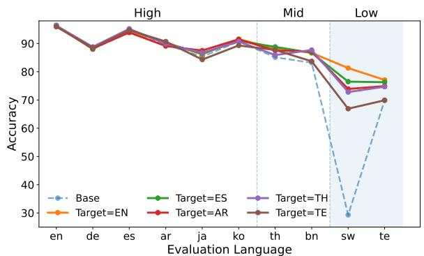  
Figure 6: Accuracy of Selective Translation with different translation target languages across evaluation languages on Polymath-Low with Qwen3-4B.

Selective Translation with Non-English Translation Targets. Prior work has shown that multilingual reasoning can benefit from using non-English target languages (Gao et al., 2025). In our setting, we use English as the default translation target, as reasoning traces in RLMs are strongly Englishcentric. To validate this choice, we evaluate selective translation (ST) with non-English targets (es, ar, th, te). Figure 6 shows that English performs best overall, while performance degrades as the target shifts toward lower-resource languages (e.g., te). This degradation is more pronounced on lowresource evaluation languages (e.g., sw, te), where ST is frequently applied. These results suggest that using lower-resource targets introduces additional understanding failures, supporting our design choice of using English as the default translation target.

Early Detection of Understanding Failures. Finally, we investigate whether understanding failures can be detected early, before the model completes its full reasoning trace. Each detector is trained on reasoning traces truncated to different lengths, and Figure 7 shows how detection perfor-

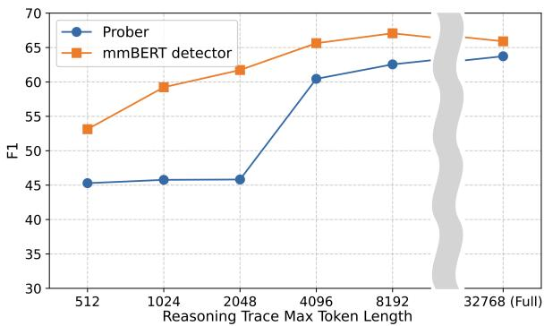  
Figure 7: F1 score of understanding failure detection on Polymath-Low with Qwen3-4B, measured with varying the maximum reasoning trace token length.

mance improves as more tokens become available. Notably, both the mmBERT detector and the prober achieve performance comparable to the full-trace setting with only 4,096 tokens, indicating that reliable detection does not require observing the entire reasoning process. Appendix B.7 further shows that Selective Translation remains effective under this early-detection setting. Together, these results highlight the promise of early detection for improving the efficiency of Selective Translation.

# 6 Conclusion

We presented the first systematic analysis of the multilingual reasoning gap in RLMs and showed that it primarily stems from understanding failures. We further demonstrated that such failures can be detected from behavioral signals and effectively mitigated through Selective Translation, which achieves near–full-translation performance while using translation selectively. Future work could explore integrating detection and mitigation directly into model training.

# Limitations

Our experiments focus on mathematical and STEM reasoning tasks. While we consider problems with

varying difficulty levels and task types within these domains, verifying whether our findings generalize to other domains such as commonsense reasoning would help assess the broader applicability of our findings.

From the language perspective, our study includes ten typologically and resource-wise diverse languages. While this set does not cover all language families, we believe our conclusions capture general multilingual trends. Nevertheless, verifying them on additional and lower-resource languages could further strengthen our claims.

Finally, our analysis centers on scenarios where the model predominantly reasons in English—the dominant internal language observed in most reasoning language models, especially when processing inputs from low-resource languages. This setting is particularly suitable for decomposing multilingual reasoning into distinct stages, as the understanding stage naturally emerges when the model internally translates the input into English before reasoning. In contrast, models that natively reason in other languages (e.g., Russian) may not exhibit a clear understanding stage; however, such cases mostly involve high-resource languages that contribute less to the overall multilingual reasoning gap. Therefore, we focus on the English reasoning setting. Nonetheless, investigating how multilingual reasoning operates in such non-English reasoning models would be a valuable direction for future work.

# Ethical Considerations

In our research, we use datasets such as Polymath (Wang et al., 2025b) and MMLU-ProX-Lite (Xuan et al., 2025), which are licensed under Apache 2.0 and MIT, respectively. The models used in our research—Qwen3 (Yang et al., 2025a) (1.7B/4B/8B/14B) and gpt-oss-20b (Agarwal et al., 2025)—are also licensed under Apache 2.0. All datasets and models were used strictly for research purposes, and no artifacts were utilized beyond the scope of the study. We use ChatGPT and GitHub Copilot for writing and coding assistance.

# Acknowledgments

This research was supported by Culture, Sports and Tourism R&D Program through the Korea Creative Content Agency grant funded by the Ministry of Culture, Sports and Tourism in 2025 (Project Name: Development of an AI-Based

Korean Diagnostic System for Efficient Korean Speaking Learning by Foreigners, Project Number: RS-2025-02413038, Contribution Rate: $45 \%$ ); by the Smart HealthCare for Police Officers Program(www.kipot.or.kr) through the Korea Institutes of Police Technology(KIPoT) funded by the Korean National Police Agency(KNPA, Korea)(No. RS-2022-PT000186, Contribution Rate: $45 \%$ ); and by the Institute of Information & communications Technology Planning & Evaluation (IITP) grant funded by the Korea government(MSIT) (No.RS-2019-II191906, Artificial Intelligence Graduate School Program(POSTECH), Contribution Rate: $10 \%$ ).

# References

Sandhini Agarwal, Lama Ahmad, Jason Ai, Sam Altman, Andy Applebaum, Edwin Arbus, Rahul K Arora, Yu Bai, Bowen Baker, Haiming Bao, and 1 others. 2025. gpt-oss-120b & gpt-oss-20b model card. arXiv preprint arXiv:2508.10925.   
Art of Problem Solving. 2025. Aime problems and solutions. https://artofproblemsolving. com/wiki/index.php/AIME_Problems_and_ Solutions. Accessed: 2025-10-03.   
Amos Azaria and Tom Mitchell. 2023. The internal state of an llm knows when it’s lying. In Findings of the Association for Computational Linguistics: EMNLP 2023, pages 967–976.   
Prasoon Bajpai and Tanmoy Chakraborty. 2025. Multilingual test-time scaling via initial thought transfer. arXiv preprint arXiv:2505.15508.   
Bowen Baker, Joost Huizinga, Leo Gao, Zehao Dou, Melody Y Guan, Aleksander Madry, Wojciech Zaremba, Jakub Pachocki, and David Farhi. 2025. Monitoring reasoning models for misbehavior and the risks of promoting obfuscation. arXiv preprint arXiv:2503.11926.   
Elie Bakouch, Loubna Ben Allal, Anton Lozhkov, Nouamane Tazi, Lewis Tunstall, Carlos Miguel Patiño, Edward Beeching, Aymeric Roucher, Aksel Joonas Reedi, Quentin Gallouédec, Kashif Rasul, Nathan Habib, Clémentine Fourrier, Hynek Kydlicek, Guilherme Penedo, Hugo Larcher, Mathieu Morlon, Vaibhav Srivastav, Joshua Lochner, and 4 others. 2025. SmolLM3: smol, multilingual, long-context reasoner. https://huggingface.co/blog/smollm3.   
Yik Siu Chan, Zheng-Xin Yong, and Stephen H Bach. 2025. Can we predict alignment before models finish thinking? towards monitoring misaligned reasoning models. arXiv preprint arXiv:2507.12428.   
Nuo Chen, Zinan Zheng, Ning Wu, Ming Gong, Dongmei Zhang, and Jia Li. 2024. Breaking language

barriers in multilingual mathematical reasoning: Insights and observations. In Findings of the Association for Computational Linguistics: EMNLP 2024, pages 7001–7016, Miami, Florida, USA. Association for Computational Linguistics.   
Qiguang Chen, Libo Qin, Jinhao Liu, Dengyun Peng, Jiannan Guan, Peng Wang, Mengkang Hu, Yuhang Zhou, Te Gao, and Wanxiang Che. 2025. Towards reasoning era: A survey of long chain-of-thought for reasoning large language models. arXiv preprint arXiv:2503.09567.   
Marta R Costa-Jussà, James Cross, Onur Çelebi, Maha Elbayad, Kenneth Heafield, Kevin Heffernan, Elahe Kalbassi, Janice Lam, Daniel Licht, Jean Maillard, and 1 others. 2022. No language left behind: Scaling human-centered machine translation. arXiv preprint arXiv:2207.04672.   
Shangbin Feng, Weijia Shi, Yike Wang, Wenxuan Ding, Orevaoghene Ahia, Shuyue Stella Li, Vidhisha Balachandran, Sunayana Sitaram, and Yulia Tsvetkov. 2024a. Teaching llms to abstain across languages via multilingual feedback. In Proceedings of the 2024 Conference on Empirical Methods in Natural Language Processing, pages 4125–4150.   
Shangbin Feng, Weijia Shi, Yike Wang, Wenxuan Ding, Vidhisha Balachandran, and Yulia Tsvetkov. 2024b. Don’t hallucinate, abstain: Identifying llm knowledge gaps via multi-llm collaboration. In Proceedings of the 62nd Annual Meeting of the Association for Computational Linguistics (Volume 1: Long Papers), pages 14664–14690.   
Changjiang Gao, Xu Huang, Wenhao Zhu, Shujian Huang, Lei Li, and Fei Yuan. 2025. Could thinking multilingually empower llm reasoning? Preprint, arXiv:2504.11833.   
Leo Gao, Jonathan Tow, Baber Abbasi, Stella Biderman, Sid Black, Anthony DiPofi, Charles Foster, Laurence Golding, Jeffrey Hsu, Alain Le Noac’h, Haonan Li, Kyle McDonell, Niklas Muennighoff, Chris Ociepa, Jason Phang, Laria Reynolds, Hailey Schoelkopf, Aviya Skowron, Lintang Sutawika, and 5 others. 2024. The language model evaluation harness.   
Daya Guo, Dejian Yang, Haowei Zhang, Junxiao Song, Ruoyu Zhang, Runxin Xu, Qihao Zhu, Shirong Ma, Peiyi Wang, Xiao Bi, and 1 others. 2025. Deepseek-r1: Incentivizing reasoning capability in llms via reinforcement learning. arXiv preprint arXiv:2501.12948.   
Dan Hendrycks, Collin Burns, Steven Basart, Andy Zou, Mantas Mazeika, Dawn Song, and Jacob Steinhardt. 2021. Measuring massive multitask language understanding. Proceedings of the International Conference on Learning Representations (ICLR).   
Zixian Huang, Wenhao Zhu, Gong Cheng, Lei Li, and Fei Yuan. 2024. Mindmerger: Efficiently boosting llm reasoning in non-english languages. Advances in

Neural Information Processing Systems, 37:34161– 34187.   
Aaron Hurst, Adam Lerer, Adam P Goucher, Adam Perelman, Aditya Ramesh, Aidan Clark, AJ Ostrow, Akila Welihinda, Alan Hayes, Alec Radford, and 1 others. 2024. Gpt-4o system card. arXiv preprint arXiv:2410.21276.   
Aaron Jaech, Adam Kalai, Adam Lerer, Adam Richardson, Ahmed El-Kishky, Aiden Low, Alec Helyar, Aleksander Madry, Alex Beutel, Alex Carney, and 1 others. 2024. Openai o1 system card. arXiv preprint arXiv:2412.16720.   
Zhengbao Jiang, Jun Araki, Haibo Ding, and Graham Neubig. 2021. How can we know when language models know? on the calibration of language models for question answering. Transactions of the Association for Computational Linguistics, 9:962–977.   
Pratik Joshi, Sebastin Santy, Amar Budhiraja, Kalika Bali, and Monojit Choudhury. 2020. The state and fate of linguistic diversity and inclusion in the NLP world. In Proceedings of the 58th Annual Meeting of the Association for Computational Linguistics.   
Armand Joulin, Edouard Grave, Piotr Bojanowski, Matthijs Douze, Hérve Jégou, and Tomas Mikolov. 2016a. Fasttext.zip: Compressing text classification models. arXiv preprint arXiv:1612.03651.   
Armand Joulin, Edouard Grave, Piotr Bojanowski, and Tomas Mikolov. 2016b. Bag of tricks for efficient text classification. arXiv preprint arXiv:1607.01759.   
Saurav Kadavath, Tom Conerly, Amanda Askell, Tom Henighan, Dawn Drain, Ethan Perez, Nicholas Schiefer, Zac Hatfield-Dodds, Nova DasSarma, Eli Tran-Johnson, and 1 others. 2022. Language models (mostly) know what they know. arXiv preprint arXiv:2207.05221.   
Polina Kirichenko, Mark Ibrahim, Kamalika Chaudhuri, and Samuel J Bell. 2025. Abstentionbench: Reasoning llms fail on unanswerable questions. arXiv preprint arXiv:2506.09038.   
Hyunwoo Ko, Guijin Son, and Dasol Choi. 2025. Understand, solve and translate: Bridging the multilingual mathematical reasoning gap. arXiv preprint arXiv:2501.02448.   
Tom Kocmi and Christian Federmann. 2023. Large language models are state-of-the-art evaluators of translation quality. In Proceedings of the 24th Annual Conference of the European Association for Machine Translation, pages 193–203.   
Hynek Kydlícek. 2025.ˇ Math-verify: Math verification library. Software available at https://github. com/huggingface/math-verify.   
Chaoqun Liu, Wenxuan Zhang, Yiran Zhao, Anh Tuan Luu, and Lidong Bing. 2025. Is translation all you need? a study on solving multilingual tasks with

large language models. In Proceedings of the 2025 Conference of the Nations of the Americas Chapter of the Association for Computational Linguistics: Human Language Technologies (Volume 1: Long Papers), pages 9594–9614, Albuquerque, New Mexico. Association for Computational Linguistics.   
Ilya Loshchilov and Frank Hutter. 2019. Decoupled weight decay regularization. In International Conference on Learning Representations.   
Potsawee Manakul, Adian Liusie, and Mark Gales. 2023. SelfCheckGPT: Zero-resource black-box hallucination detection for generative large language models. In Proceedings of the 2023 Conference on Empirical Methods in Natural Language Processing, pages 9004–9017, Singapore. Association for Computational Linguistics.   
Marc Marone, Orion Weller, William Fleshman, Eugene Yang, Dawn Lawrie, and Benjamin Van Durme. 2025. mmbert: A modern multilingual encoder with annealed language learning. arXiv preprint arXiv:2509.06888.   
Niklas Muennighoff, Zitong Yang, Weijia Shi, Xiang Lisa Li, Li Fei-Fei, Hannaneh Hajishirzi, Luke Zettlemoyer, Percy Liang, Emmanuel Candès, and Tatsunori Hashimoto. 2025. s1: Simple test-time scaling. Preprint, arXiv:2501.19393.   
OpenAI. 2025. Gpt-4.1. https://platform.openai. com/docs/models/gpt-4.1.   
Cheonbok Park, Jeonghoon Kim, Joosung Lee, Sanghwan Bae, Jaegul Choo, and Kang Min Yoo. 2025. Cross-lingual collapse: How language-centric foundation models shape reasoning in large language models. arXiv preprint arXiv:2506.05850.   
Long Phan, Alice Gatti, Ziwen Han, Nathaniel Li, Josephina Hu, Hugh Zhang, Chen Bo Calvin Zhang, Mohamed Shaaban, John Ling, Sean Shi, and 1 others. 2025. Humanity’s last exam. arXiv preprint arXiv:2501.14249.   
Jirui Qi, Shan Chen, Zidi Xiong, Raquel Fernández, Danielle S Bitterman, and Arianna Bisazza. 2025. When models reason in your language: Controlling thinking trace language comes at the cost of accuracy. arXiv preprint arXiv:2505.22888.   
Libo Qin, Qiguang Chen, Fuxuan Wei, Shijue Huang, and Wanxiang Che. 2023. Cross-lingual prompting: Improving zero-shot chain-of-thought reasoning across languages. In Proceedings of the 2023 Conference on Empirical Methods in Natural Language Processing, pages 2695–2709, Singapore. Association for Computational Linguistics.   
Zhihong Shao, Peiyi Wang, Qihao Zhu, Runxin Xu, Junxiao Song, Xiao Bi, Haowei Zhang, Mingchuan Zhang, YK Li, Yang Wu, and 1 others. 2024. Deepseekmath: Pushing the limits of mathematical reasoning in open language models. arXiv preprint arXiv:2402.03300.

Shuaijie She, Wei Zou, Shujian Huang, Wenhao Zhu, Xiang Liu, Xiang Geng, and Jiajun Chen. 2024. MAPO: Advancing multilingual reasoning through multilingual-alignment-as-preference optimization. In Proceedings of the 62nd Annual Meeting of the Association for Computational Linguistics (Volume 1: Long Papers), pages 10015–10027, Bangkok, Thailand. Association for Computational Linguistics.   
Freda Shi, Mirac Suzgun, Markus Freitag, Xuezhi Wang, Suraj Srivats, Soroush Vosoughi, Hyung Won Chung, Yi Tay, Sebastian Ruder, Denny Zhou, and 1 others. 2023. Language models are multilingual chain-ofthought reasoners. In The Eleventh International Conference on Learning Representations.   
Anthony F Shorrocks and 1 others. 2013. Decomposition procedures for distributional analysis: a unified framework based on the shapley value. Journal of Economic Inequality, 11(1):99–126.   
Guijin Son, Jiwoo Hong, Hyunwoo Ko, and James Thorne. 2025. Linguistic generalizability of test-time scaling in mathematical reasoning. In Proceedings of the 63rd Annual Meeting of the Association for Computational Linguistics (Volume 1: Long Papers), pages 14333–14368, Vienna, Austria. Association for Computational Linguistics.   
Zhi Rui Tam, Cheng-Kuang Wu, Yu Ying Chiu, Chieh-Yen Lin, Yun-Nung Chen, and Hung-yi Lee. 2025. Language matters: How do multilingual input and reasoning paths affect large reasoning models? arXiv preprint arXiv:2505.17407.   
Christian Tomani, Kamalika Chaudhuri, Ivan Evtimov, Daniel Cremers, and Mark Ibrahim. 2024. Uncertainty-based abstention in llms improves safety and reduces hallucinations. arXiv preprint arXiv:2404.10960.   
Mingyang Wang, Lukas Lange, Heike Adel, Yunpu Ma, Jannik Strötgen, and Hinrich Schütze. 2025a. Language mixing in reasoning language models: Patterns, impact, and internal causes. arXiv preprint arXiv:2505.14815.   
Yiming Wang, Pei Zhang, Jialong Tang, Haoran Wei, Baosong Yang, Rui Wang, Chenshu Sun, Feitong Sun, Jiran Zhang, Junxuan Wu, Qiqian Cang, Yichang Zhang, Fei Huang, Junyang Lin, Fei Huang, and Jingren Zhou. 2025b. Polymath: Evaluating mathematical reasoning in multilingual contexts. arXiv preprint arXiv:2504.18428.   
Yubo Wang, Xueguang Ma, Ge Zhang, Yuansheng Ni, Abhranil Chandra, Shiguang Guo, Weiming Ren, Aaran Arulraj, Xuan He, Ziyan Jiang, and 1 others. 2024. Mmlu-pro: A more robust and challenging multi-task language understanding benchmark. Advances in Neural Information Processing Systems, 37:95266–95290.   
Bernard L Welch. 1947. The generalization of ‘student’s’problem when several different population varlances are involved. Biometrika, 34(1-2):28–35.

Bingbing Wen, Jihan Yao, Shangbin Feng, Chenjun Xu, Yulia Tsvetkov, Bill Howe, and Lucy Lu Wang. 2025. Know your limits: A survey of abstention in large language models. Transactions of the Association for Computational Linguistics, 13:529–556.   
Miao Xiong, Zhiyuan Hu, Xinyang Lu, YIFEI LI, Jie Fu, Junxian He, and Bryan Hooi. 2024. Can LLMs express their uncertainty? an empirical evaluation of confidence elicitation in LLMs. In The Twelfth International Conference on Learning Representations.   
Weihao Xuan, Rui Yang, Heli Qi, Qingcheng Zeng, Yunze Xiao, Aosong Feng, Dairui Liu, Yun Xing, Junjue Wang, Fan Gao, Jinghui Lu, Yuang Jiang, Huitao Li, Xin Li, Kunyu Yu, Ruihai Dong, Shangding Gu, Yuekang Li, Xiaofei Xie, and 13 others. 2025. Mmlu-prox: A multilingual benchmark for advanced large language model evaluation. Preprint, arXiv:2503.10497.   
An Yang, Anfeng Li, Baosong Yang, Beichen Zhang, Binyuan Hui, Bo Zheng, Bowen Yu, Chang Gao, Chengen Huang, Chenxu Lv, and 1 others. 2025a. Qwen3 technical report. arXiv preprint arXiv:2505.09388.   
Wen Yang, Junhong Wu, Chen Wang, Chengqing Zong, and Jiajun Zhang. 2025b. Language imbalance driven rewarding for multilingual self-improving. In The Thirteenth International Conference on Learning Representations.   
Zheng-Xin Yong, M Farid Adilazuarda, Jonibek Mansurov, Ruochen Zhang, Niklas Muennighoff, Carsten Eickhoff, Genta Indra Winata, Julia Kreutzer, Stephen H Bach, and Alham Fikri Aji. 2025. Crosslingual reasoning through test-time scaling. arXiv preprint arXiv:2505.05408.   
Haneul Yoo, Jiho Jin, Kyunghyun Cho, and Alice Oh. 2025. Code-switching in-context learning for crosslingual transfer of large language models. arXiv preprint arXiv:2510.05678.   
Dongkeun Yoon, Joel Jang, Sungdong Kim, Seungone Kim, Sheikh Shafayat, and Minjoon Seo. 2024. Lang-Bridge: Multilingual reasoning without multilingual supervision. In Proceedings of the 62nd Annual Meeting of the Association for Computational Linguistics (Volume 1: Long Papers), pages 7502–7522, Bangkok, Thailand. Association for Computational Linguistics.   
Qiying Yu, Zheng Zhang, Ruofei Zhu, Yufeng Yuan, Xiaochen Zuo, Yu Yue, Weinan Dai, Tiantian Fan, Gaohong Liu, Lingjun Liu, and 1 others. 2025. Dapo: An open-source llm reinforcement learning system at scale. arXiv preprint arXiv:2503.14476.   
Anqi Zhang, Yulin Chen, Jane Pan, Chen Zhao, Aurojit Panda, Jinyang Li, and He He. 2025. Reasoning models know when they’re right: Probing hidden states for self-verification. arXiv preprint arXiv:2504.05419.

Yidan Zhang, Yu Wan, Boyi Deng, Baosong Yang, Haoran Wei, Fei Huang, Bowen Yu, Junyang Lin, and Jingren Zhou. 2024. P-mmeval: A parallel multilingual multitask benchmark for consistent evaluation of llms. arXiv preprint arXiv:2411.09116.   
Weixiang Zhao, Jiahe Guo, Yang Deng, Tongtong Wu, Wenxuan Zhang, Yulin Hu, Xingyu Sui, Yanyan Zhao, Wanxiang Che, Bing Qin, and 1 others. 2025. When less language is more: Language-reasoning disentanglement makes llms better multilingual reasoners. arXiv preprint arXiv:2505.15257.   
Wenhao Zhu, Shujian Huang, Fei Yuan, Shuaijie She, Jiajun Chen, and Alexandra Birch. 2024. Question translation training for better multilingual reasoning. In Findings of the Association for Computational Linguistics: ACL 2024, pages 8411–8423, Bangkok, Thailand. Association for Computational Linguistics.

# A Language Distributions

# A.1 Computing Language Distributions

We estimate the language composition of reasoning traces and final responses by aggregating sentencelevel language identification results from the fast-Text (Joulin et al., 2016b,a) language identification model. Given a text sample (either a reasoning trace or a final response), we first use regular expressions to remove LaTeX expressions, code blocks, and formula-like spans (e.g., $\$ .23$ , \begin{equation}...\end{equation}, or backtick code), ensuring that only natural-language segments remain for reliable detection. The cleaned text is then segmented into sentences based on punctuation, and those shorter than 10 characters are discarded to maintain reliable predictions from the fastText model. Each valid sentence is subsequently classified by the fastText language identification model (lid.176.ftz). Finally, we compute the overall language distribution of a text $t$ for all detected languages l as:

$$
P (l) = \frac {\text {# o f s e n t e n c e s p r e d i c t e d a s} l}{\text {t o t a l n u m b e r o f v a l i d s e n t e n c e s i n} t},
$$

resulting in a normalized distribution that captures the relative prevalence of each language.

# A.2 Results

We evaluate five large reasoning models—Qwen3- 1.7B, Qwen3-4B, Qwen3-8B, Qwen3-14B, and gpt-oss-20b—across four datasets: Polymath-Low, Polymath-Medium, Polymath-High, and MMLU-ProX-Lite. For each model, we visualize the language distribution of reasoning traces and final responses, including the corresponding variants obtained under the Understanding Intervention. Figures 11–15 present the results. Across all settings, reasoning traces are consistently dominated by English, whereas final responses tend to be produced in the input language. While the proportion of the input language in final responses varies across languages and datasets, a substantial portion of responses are still generated in the input language. This tendency remains largely unchanged after applying the Understanding Intervention.

While reasoning traces remain English-dominant across all settings, the proportion of final responses in the input language is higher in Polymath-Low and MMLU-ProX-Lite, but relatively lower in Polymath-Medium and Polymath-High. We hypothesize that this pattern arises from two factors:

increased reasoning difficulty and the higher density of mathematical expressions in the more challenging splits. The first factor concerns reasoning difficulty. Wang et al. (2025a) shows that as task difficulty increases, reasoning language models rely more on the Latin script in their internal reasoning representations. This increased reliance on Latin-based internal reasoning—presumably English—may influence the language distribution of final responses. The second factor relates to the density of mathematical expressions. After removing LaTeX and numerical expressions, the share of pure natural language content is $8 8 . 1 3 \%$ for Low, $4 6 . 2 9 \%$ for Medium, and $6 0 . 6 9 \%$ for High, indicating that the latter two splits are more expressionheavy. Although we mitigate such effects in our language distribution measurement using regularexpression filtering, equations and variable-like expressions occasionally appear in plain text, leading to potential false detections as English due to alphabetic variable names. Future work may explore why such language shifts occur in final responses.

# B Additional Evaluation Results

# B.1 Intervention results on other models

Table 5, 6 extends the analysis in Table 1 to additional reasoning language models, including Qwen3-1.7B, Qwen3-8B, Qwen3-14B, and gptoss-20b. Across all models, the Understanding Intervention (w/ U) consistently yields notable accuracy gains over the Base model, particularly in low-resource languages. In contrast, the Answer Extraction from Reasoning Trace (w/ T) method shows minimal impact, with performance remaining close to the Base setting.6

# B.2 Language-specific Stage-wise Attribution Analysis

Figures 16, 17, 18, 19, and 20 present the languagespecific stage-wise attribution analysis results for Qwen3-1.7B, Qwen3-4B, Qwen3-8B, Qwen3-14B, and gpt-oss-20b, respectively. Each figure breaks down the multilingual reasoning gap into contributions from Understanding, Reasoning, and Generating in Input Language for each language. Across

Qwen3-1.7B   

<table><tr><td>Dataset</td><td>Method</td><td>en</td><td>de</td><td>es</td><td>ar</td><td>ja</td><td>ko</td><td>th</td><td>bn</td><td>sw</td><td>te</td><td>Avg</td></tr><tr><td rowspan="4">Polymath-Low</td><td>Base</td><td>90.1</td><td>78.7</td><td>85.6</td><td>79.7</td><td>71.5</td><td>72.3</td><td>76.8</td><td>60.3</td><td>7.2</td><td>41.1</td><td>66.3</td></tr><tr><td>w/ T</td><td>90.1</td><td>78.1</td><td>85.6</td><td>78.1</td><td>70.9</td><td>70.1</td><td>76.3</td><td>60.8</td><td>8.3</td><td>42.7</td><td>66.1</td></tr><tr><td>w/ U</td><td>90.7</td><td>82.4</td><td>87.5</td><td>84.8</td><td>81.1</td><td>85.1</td><td>85.3</td><td>83.5</td><td>67.7</td><td>78.1</td><td>82.6</td></tr><tr><td>w/ U+T</td><td>90.1</td><td>82.7</td><td>87.5</td><td>84.0</td><td>81.3</td><td>84.8</td><td>84.8</td><td>85.6</td><td>79.5</td><td>83.7</td><td>84.4</td></tr><tr><td rowspan="4">Polymath-Medium</td><td>Base</td><td>55.7</td><td>54.9</td><td>56.8</td><td>53.3</td><td>57.6</td><td>50.7</td><td>48.8</td><td>47.2</td><td>32.3</td><td>40.3</td><td>49.8</td></tr><tr><td>w/ T</td><td>56.3</td><td>54.4</td><td>57.3</td><td>53.6</td><td>56.8</td><td>51.5</td><td>49.3</td><td>48.8</td><td>32.0</td><td>40.8</td><td>50.1</td></tr><tr><td>w/ U</td><td>58.7</td><td>53.6</td><td>55.7</td><td>55.2</td><td>57.1</td><td>54.4</td><td>56.5</td><td>55.2</td><td>55.5</td><td>57.9</td><td>56.0</td></tr><tr><td>w/ U+T</td><td>59.5</td><td>53.9</td><td>55.7</td><td>55.5</td><td>56.5</td><td>55.2</td><td>56.5</td><td>54.9</td><td>55.5</td><td>58.1</td><td>56.1</td></tr><tr><td rowspan="4">Polymath-High</td><td>Base</td><td>33.3</td><td>32.8</td><td>32.5</td><td>29.6</td><td>33.3</td><td>30.9</td><td>28.8</td><td>22.4</td><td>14.4</td><td>21.3</td><td>27.9</td></tr><tr><td>w/ T</td><td>34.1</td><td>32.0</td><td>32.8</td><td>28.8</td><td>33.6</td><td>31.5</td><td>29.1</td><td>22.4</td><td>14.4</td><td>22.1</td><td>28.1</td></tr><tr><td>w/ U</td><td>33.1</td><td>33.3</td><td>36.3</td><td>34.1</td><td>32.0</td><td>33.1</td><td>32.0</td><td>31.7</td><td>28.8</td><td>31.7</td><td>32.6</td></tr><tr><td>w/ U+T</td><td>33.1</td><td>33.1</td><td>35.5</td><td>34.4</td><td>31.7</td><td>32.5</td><td>32.0</td><td>32.5</td><td>28.8</td><td>31.7</td><td>32.5</td></tr><tr><td rowspan="4">MMLU-ProX-Lite</td><td>Base</td><td>67.6</td><td>63.2</td><td>65.6</td><td>56.4</td><td>61.0</td><td>57.1</td><td>59.4</td><td>52.4</td><td>31.8</td><td>52.5</td><td>56.7</td></tr><tr><td>w/ T</td><td>67.2</td><td>62.8</td><td>65.2</td><td>57.2</td><td>60.6</td><td>57.5</td><td>60.3</td><td>53.3</td><td>32.2</td><td>53.3</td><td>57.0</td></tr><tr><td>w/ U</td><td>64.9</td><td>65.2</td><td>64.6</td><td>63.8</td><td>63.9</td><td>64.9</td><td>63.2</td><td>63.2</td><td>52.4</td><td>62.3</td><td>62.8</td></tr><tr><td>w/ U+T</td><td>65.0</td><td>65.1</td><td>64.6</td><td>63.8</td><td>64.1</td><td>64.5</td><td>63.4</td><td>63.8</td><td>60.2</td><td>64.2</td><td>63.9</td></tr></table>

Qwen3-8B   

<table><tr><td>Dataset</td><td>Method</td><td>en</td><td>de</td><td>es</td><td>ar</td><td>ja</td><td>ko</td><td>th</td><td>bn</td><td>sw</td><td>te</td><td>Avg</td></tr><tr><td rowspan="4">Polymath-Low</td><td>Base</td><td>96.3</td><td>88.5</td><td>93.9</td><td>90.9</td><td>86.1</td><td>90.4</td><td>90.7</td><td>86.4</td><td>61.3</td><td>76.8</td><td>86.1</td></tr><tr><td>w/ T</td><td>96.3</td><td>88.5</td><td>94.1</td><td>90.9</td><td>85.9</td><td>90.7</td><td>90.7</td><td>87.5</td><td>62.1</td><td>76.5</td><td>86.3</td></tr><tr><td>w/ U</td><td>96.5</td><td>89.3</td><td>96.3</td><td>94.4</td><td>90.9</td><td>94.4</td><td>94.4</td><td>95.5</td><td>93.3</td><td>93.1</td><td>93.8</td></tr><tr><td>w/ U+T</td><td>96.3</td><td>89.3</td><td>96.0</td><td>93.3</td><td>90.9</td><td>93.9</td><td>94.4</td><td>94.7</td><td>94.1</td><td>92.0</td><td>93.5</td></tr><tr><td rowspan="4">Polymath-Medium</td><td>Base</td><td>72.5</td><td>74.4</td><td>73.9</td><td>70.4</td><td>72.5</td><td>71.5</td><td>70.7</td><td>68.3</td><td>54.4</td><td>65.3</td><td>69.4</td></tr><tr><td>w/ T</td><td>73.6</td><td>74.1</td><td>74.7</td><td>70.4</td><td>72.5</td><td>72.5</td><td>70.1</td><td>68.3</td><td>54.7</td><td>66.4</td><td>69.7</td></tr><tr><td>w/ U</td><td>74.7</td><td>72.5</td><td>72.8</td><td>72.5</td><td>74.7</td><td>73.9</td><td>72.8</td><td>74.4</td><td>71.7</td><td>74.9</td><td>73.5</td></tr><tr><td>w/ U+T</td><td>73.9</td><td>72.3</td><td>72.3</td><td>73.1</td><td>74.1</td><td>74.1</td><td>72.5</td><td>74.1</td><td>72.0</td><td>74.4</td><td>73.3</td></tr><tr><td rowspan="4">Polymath-High</td><td>Base</td><td>54.4</td><td>54.1</td><td>54.4</td><td>52.8</td><td>57.1</td><td>54.7</td><td>51.5</td><td>50.1</td><td>38.1</td><td>45.9</td><td>51.3</td></tr><tr><td>w/ T</td><td>55.5</td><td>54.4</td><td>54.4</td><td>51.7</td><td>56.8</td><td>54.4</td><td>51.5</td><td>51.5</td><td>37.9</td><td>45.9</td><td>51.4</td></tr><tr><td>w/ U</td><td>53.9</td><td>56.3</td><td>51.7</td><td>54.4</td><td>53.6</td><td>54.9</td><td>52.8</td><td>52.0</td><td>54.4</td><td>51.2</td><td>53.5</td></tr><tr><td>w/ U+T</td><td>54.1</td><td>56.3</td><td>51.7</td><td>54.1</td><td>53.9</td><td>55.5</td><td>53.3</td><td>52.0</td><td>54.4</td><td>52.3</td><td>53.8</td></tr><tr><td rowspan="4">MMLU-ProX-Lite</td><td>Base</td><td>82.9</td><td>79.5</td><td>80.8</td><td>79.5</td><td>79.1</td><td>78.3</td><td>79.4</td><td>77.0</td><td>58.5</td><td>76.0</td><td>77.1</td></tr><tr><td>w/ T</td><td>82.4</td><td>79.6</td><td>81.6</td><td>79.5</td><td>79.9</td><td>78.6</td><td>79.8</td><td>77.3</td><td>61.5</td><td>76.5</td><td>77.7</td></tr><tr><td>w/ U</td><td>82.2</td><td>81.1</td><td>80.5</td><td>82.0</td><td>81.7</td><td>81.3</td><td>81.6</td><td>80.5</td><td>79.0</td><td>79.9</td><td>81.0</td></tr><tr><td>w/ U+T</td><td>82.0</td><td>80.9</td><td>80.7</td><td>81.7</td><td>82.4</td><td>81.5</td><td>82.1</td><td>80.3</td><td>81.7</td><td>80.5</td><td>81.4</td></tr></table>

Table 5: Accuracy comparison of methods across languages on additional models (Qwen3-1.7B, Qwen3-8B). Base denotes the original model without intervention, w/ T applies Answer Extraction from Reasoning Trace, w/ U applies Understanding Intervention, and w/ $\mathbf { U } + \mathbf { T }$ applies both. Pairwise comparisons against the Base use Welch’s t-test: blue cells mark statistically significant improvements $( \mathtt { p } < 0 . 0 5 ) $ ), and green cells indicate notable improvements $( \mathtt { p } < 0 . 1 )$ . The Average row is bolded. Consistent with Qwen3-4B (Table 1), understanding intervention yields substantial gains, particularly for low-resource languages.

all models, Understanding failures consistently emerge as the primary source of the gap. However, their relative dominance varies with language resource level. The effect is particularly pronounced in low-resource languages such as Swahili (sw) and Telugu (te), whereas in high-resource languages, where models already achieve strong Base performance, the influence of Understanding becomes relatively smaller.

# B.3 Extending Attribution Analysis to Additional Models

To further examine the generality of our findings, we extend the attribution analysis in Section 3.2 to additional open-source reasoning language models: DeepSeek-R1-Distill-Llama-8B (Guo et al., 2025) and SmolLM3-3B (Bakouch et al., 2025). Figure 9 shows the headroom-weighted average share attributed to the understanding stage across datasets. Across models and datasets, understanding failures

Qwen3-14B   

<table><tr><td>Dataset</td><td>Method</td><td>en</td><td>de</td><td>es</td><td>ar</td><td>ja</td><td>ko</td><td>th</td><td>bn</td><td>sw</td><td>te</td><td>Avg</td></tr><tr><td rowspan="4">Polymath-Low</td><td>Base</td><td>95.2</td><td>89.6</td><td>93.6</td><td>90.4</td><td>89.3</td><td>89.3</td><td>91.7</td><td>89.3</td><td>73.3</td><td>82.1</td><td>88.4</td></tr><tr><td>w/ T</td><td>95.5</td><td>87.2</td><td>93.3</td><td>89.9</td><td>89.3</td><td>87.2</td><td>89.9</td><td>88.8</td><td>72.3</td><td>81.6</td><td>87.5</td></tr><tr><td>w/ U</td><td>95.7</td><td>92.3</td><td>95.5</td><td>93.9</td><td>91.5</td><td>93.3</td><td>95.2</td><td>94.7</td><td>92.0</td><td>94.1</td><td>93.8</td></tr><tr><td>w/ U+T</td><td>95.7</td><td>92.8</td><td>95.7</td><td>92.3</td><td>90.4</td><td>92.3</td><td>94.1</td><td>93.3</td><td>91.5</td><td>94.4</td><td>93.3</td></tr><tr><td rowspan="4">Polymath-Medium</td><td>Base</td><td>76.0</td><td>72.8</td><td>78.1</td><td>73.6</td><td>76.0</td><td>74.7</td><td>72.0</td><td>69.1</td><td>62.9</td><td>70.1</td><td>72.5</td></tr><tr><td>w/ T</td><td>76.5</td><td>73.9</td><td>78.7</td><td>73.6</td><td>76.0</td><td>75.7</td><td>72.0</td><td>69.1</td><td>63.2</td><td>70.9</td><td>73.0</td></tr><tr><td>w/ U</td><td>77.3</td><td>77.6</td><td>77.9</td><td>73.9</td><td>76.5</td><td>75.2</td><td>76.0</td><td>77.9</td><td>76.3</td><td>76.8</td><td>76.5</td></tr><tr><td>w/ U+T</td><td>77.3</td><td>77.1</td><td>77.3</td><td>73.9</td><td>76.5</td><td>75.5</td><td>76.0</td><td>76.8</td><td>75.5</td><td>78.9</td><td>76.5</td></tr><tr><td rowspan="4">Polymath-High</td><td>Base</td><td>60.3</td><td>60.0</td><td>59.5</td><td>58.4</td><td>58.7</td><td>56.5</td><td>55.5</td><td>56.0</td><td>45.1</td><td>51.7</td><td>56.2</td></tr><tr><td>w/ T</td><td>59.2</td><td>58.9</td><td>58.7</td><td>57.9</td><td>57.6</td><td>55.2</td><td>53.3</td><td>54.7</td><td>43.7</td><td>50.9</td><td>55.0</td></tr><tr><td>w/ U</td><td>60.3</td><td>57.3</td><td>59.5</td><td>57.6</td><td>61.1</td><td>58.1</td><td>57.3</td><td>58.1</td><td>58.4</td><td>55.2</td><td>58.3</td></tr><tr><td>w/ U+T</td><td>60.0</td><td>56.5</td><td>59.5</td><td>56.8</td><td>59.7</td><td>58.4</td><td>57.1</td><td>56.8</td><td>57.6</td><td>54.1</td><td>57.7</td></tr><tr><td rowspan="4">MMLU-ProX-Lite</td><td>Base</td><td>82.9</td><td>80.8</td><td>80.8</td><td>81.2</td><td>80.9</td><td>80.5</td><td>79.2</td><td>81.1</td><td>69.0</td><td>79.9</td><td>79.6</td></tr><tr><td>w/ T</td><td>83.7</td><td>81.3</td><td>80.5</td><td>81.5</td><td>81.1</td><td>80.3</td><td>79.4</td><td>80.9</td><td>69.1</td><td>79.8</td><td>79.8</td></tr><tr><td>w/ U</td><td>83.1</td><td>82.0</td><td>81.5</td><td>83.3</td><td>80.7</td><td>82.5</td><td>81.3</td><td>81.5</td><td>81.5</td><td>80.5</td><td>81.8</td></tr><tr><td>w/ U+T</td><td>83.7</td><td>82.0</td><td>81.5</td><td>83.3</td><td>80.8</td><td>82.4</td><td>81.2</td><td>81.2</td><td>81.5</td><td>80.8</td><td>81.8</td></tr></table>

gpt-oss-20b   

<table><tr><td>Dataset</td><td>Method</td><td>en</td><td>de</td><td>es</td><td>ar</td><td>ja</td><td>ko</td><td>th</td><td>bn</td><td>sw</td><td>te</td><td>Avg</td></tr><tr><td rowspan="4">Polymath-Low</td><td>Base</td><td>96.0</td><td>85.6</td><td>89.9</td><td>90.9</td><td>86.1</td><td>91.2</td><td>90.4</td><td>90.1</td><td>78.7</td><td>81.1</td><td>88.0</td></tr><tr><td>w/ T</td><td>95.7</td><td>86.7</td><td>92.0</td><td>91.7</td><td>86.4</td><td>90.7</td><td>90.7</td><td>90.7</td><td>80.0</td><td>81.1</td><td>88.6</td></tr><tr><td>w/ U</td><td>95.7</td><td>84.5</td><td>92.3</td><td>91.2</td><td>87.5</td><td>92.5</td><td>89.3</td><td>92.3</td><td>88.8</td><td>89.6</td><td>90.4</td></tr><tr><td>w/ U+T</td><td>91.7</td><td>83.7</td><td>91.7</td><td>92.3</td><td>87.2</td><td>92.0</td><td>88.8</td><td>91.2</td><td>89.1</td><td>87.7</td><td>89.5</td></tr><tr><td rowspan="4">Polymath-Medium</td><td>Base</td><td>67.7</td><td>65.1</td><td>68.5</td><td>63.7</td><td>65.3</td><td>67.2</td><td>66.9</td><td>66.9</td><td>58.9</td><td>65.3</td><td>65.6</td></tr><tr><td>w/ T</td><td>61.9</td><td>60.8</td><td>58.7</td><td>58.1</td><td>62.9</td><td>63.7</td><td>61.3</td><td>61.3</td><td>52.3</td><td>61.6</td><td>60.3</td></tr><tr><td>w/ U</td><td>66.1</td><td>66.1</td><td>66.4</td><td>66.7</td><td>68.5</td><td>69.1</td><td>65.6</td><td>65.6</td><td>64.0</td><td>68.3</td><td>66.6</td></tr><tr><td>w/ U+T</td><td>69.6</td><td>68.8</td><td>67.7</td><td>68.3</td><td>69.9</td><td>72.3</td><td>65.3</td><td>68.0</td><td>66.1</td><td>69.6</td><td>68.6</td></tr><tr><td rowspan="4">Polymath-High</td><td>Base</td><td>58.1</td><td>57.3</td><td>54.7</td><td>52.8</td><td>51.5</td><td>53.9</td><td>53.1</td><td>54.1</td><td>47.5</td><td>56.3</td><td>53.9</td></tr><tr><td>w/ T</td><td>54.4</td><td>52.0</td><td>53.6</td><td>50.9</td><td>52.5</td><td>52.5</td><td>51.2</td><td>54.1</td><td>47.2</td><td>51.5</td><td>52.0</td></tr><tr><td>w/ U</td><td>57.1</td><td>57.1</td><td>56.8</td><td>53.9</td><td>56.8</td><td>58.9</td><td>58.9</td><td>57.3</td><td>54.9</td><td>60.0</td><td>57.2</td></tr><tr><td>w/ U+T</td><td>58.1</td><td>59.5</td><td>59.2</td><td>56.0</td><td>57.3</td><td>61.3</td><td>60.8</td><td>59.2</td><td>57.1</td><td>60.3</td><td>58.9</td></tr><tr><td rowspan="4">MMLU-ProX-Lite</td><td>Base</td><td>77.4</td><td>77.8</td><td>77.3</td><td>74.1</td><td>77.4</td><td>73.9</td><td>74.6</td><td>75.6</td><td>66.9</td><td>77.0</td><td>75.2</td></tr><tr><td>w/ T</td><td>77.3</td><td>77.7</td><td>77.3</td><td>74.1</td><td>77.6</td><td>74.1</td><td>74.4</td><td>75.6</td><td>66.9</td><td>77.2</td><td>75.2</td></tr><tr><td>w/ U</td><td>78.6</td><td>77.0</td><td>79.0</td><td>78.3</td><td>77.3</td><td>77.2</td><td>76.4</td><td>77.4</td><td>77.0</td><td>76.8</td><td>77.5</td></tr><tr><td>w/ U+T</td><td>78.1</td><td>76.8</td><td>78.3</td><td>77.7</td><td>76.7</td><td>76.9</td><td>75.5</td><td>76.9</td><td>77.2</td><td>75.7</td><td>77.0</td></tr></table>

Table 6: Accuracy comparison of methods across languages on Qwen3-14B, and gpt-oss-20b. Base denotes the original model without intervention, w/ T applies Answer Extraction from Reasoning Trace, w/ U applies Understanding Intervention, and w/ $\mathbf { U } + \mathbf { T }$ applies both. Pairwise comparisons against the Base use Welch’s t-test: blue cells mark statistically significant improvements $( \mathtt { p } < 0 . 0 5 )$ , and green cells indicate notable improvements $( \mathsf { p } < 0 . 1 )$ . The Average row is bolded. Consistent with Qwen3-4B (Table 1), understanding intervention yields substantial gains, particularly for low-resource languages.

consistently account for a substantial portion of the multilingual reasoning gap, showing that our findings generalize across diverse open-source RLM families.

# B.4 Robustness to Understanding Prefix Variants

We evaluate the robustness of our stage-wise attribution analysis to the phrasing of the understanding intervention by repeating the analysis with alternative prefixes using Qwen3-4B. The alternative

understanding prefix variants are listed below.

# Understanding Prefix Variants

# Prefix-1

$\pi ( x _ { \mathrm { d o m } } ) = { } ^ { \mathfrak { a } } 0 \kappa a \gamma$ , I understand the question as: $\{ x _ { \mathrm { d o m } } \} ^ { \prime }$ . I will solve the problem based on this understanding.”

# Prefix-2

$\begin{array} { l l l } { { \pi ( x _ { \mathrm { d o m } } ) } } & { { = } } & { { { } ^ { \cdots } 0 { \ k a y } } } \end{array}$ , my understanding of the question in English is: $\{ x _ { \mathrm { d o m } } \} ^ { \prime }$ . I will proceed using this interpretation.”

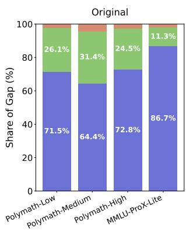

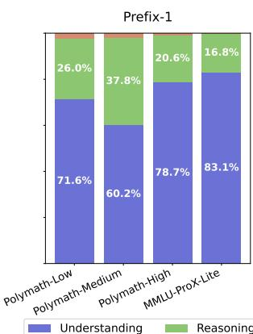

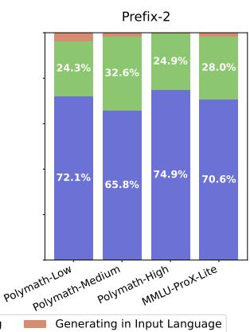

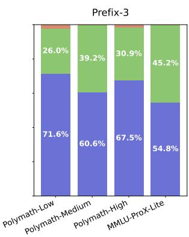

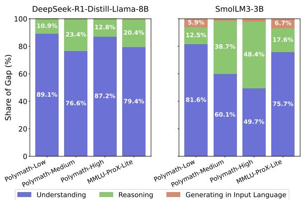  
Figure 8: Weighted shares of Understanding, Reasoning, and Generation in the input language to the overall multilingual reasoning gap on Qwen3-4B. Across different prefix variants, failures in Understanding dominate the gap.   
Figure 9: Weighted shares of Understanding, Reasoning, and Generation in the input language to the overall multilingual reasoning gap across additional models.

Prefix-3 $\pi ( x _ { \mathrm { d o m } } ) \ =$ “English meaning of the question: $\because \{ x _ { \mathrm { d o m } } \} ^ { \prime }$ . I’ll solve the problem based on this understanding.”

The original setting uses the same fixed prefix as in the main text. As shown in Figure 8, understanding failure consistently accounts for the largest share of the multilingual reasoning gap across all prefixes, demonstrating that our conclusion generalizes beyond a specific understanding prefix.

# B.5 Language-specific results on Understanding Failure Detection

Table 7 and Table 8 report the F1 scores of each detection method across languages for Qwen3-4B and gpt-oss-20b, respectively. Overall, supervised approaches such as the mmBERT detector and the Prober generally outperform other baselines, while the Avg-Confidence method surpasses them on a few individual languages. Table 9 presents results

on unseen languages for Qwen3-4B, where similar trends are observed.7 These per-language breakdowns indicate that supervised approaches are not biased toward specific languages but instead exhibit robust performance across diverse languages.

# B.6 Selective Translation Results on gpt-oss-20b

Table 10 presents the Selective Translation results on gpt-oss-20b. In Polymath-Low, Selective Translation is highly effective, outperforming both the Base model $( 8 8 . 0 \% )$ and Full Translation $( 8 7 . 9 \% )$ while requiring translation for only $1 6 . 7 \%$ of the inputs. While performance improves for specific languages such as Swahili, the overall impact on average accuracy is minimal on MMLU-ProX-Lite. We attribute this to the relatively narrow initial gap between the base ceiling language (English) and other languages. Consequently, the detector triggers translation for only $7 . 2 \%$ of the inputs, resulting in a minimal impact on the average score. Nevertheless, these results demonstrate that Selective Translation acts as an adaptive strategy, invoking translation only when necessary and generalizing to larger model scales.

# B.7 Selective translation with Early Detection

Table 11 presents the results of applying early detection to Selective Translation on Polymath-low on Qwen3-4B. Here, the detector is implemented using the Prober model, which takes the last hidden state (from the residual stream of the last layer of the model) of the reasoning trace as input and observes only a prefix of the trace—up

Polymath-Low   

<table><tr><td>Method</td><td>de</td><td>es</td><td>ar</td><td>ja</td><td>ko</td><td>th</td><td>bn</td><td>sw</td><td>te</td></tr><tr><td>Random baseline</td><td>16.7 ± 28.9</td><td>0.0 ± 0.0</td><td>5.6 ± 9.6</td><td>3.2 ± 5.5</td><td>0.0 ± 0.0</td><td>9.4 ± 9.1</td><td>11.3 ± 10.5</td><td>68.0 ± 2.4</td><td>15.5 ± 5.6</td></tr><tr><td>Avg confidence</td><td>32.2 ± 20.7</td><td>16.5 ± 5.3</td><td>24.7 ± 8.0</td><td>32.9 ± 11.2</td><td>10.4 ± 11.7</td><td>41.1 ± 5.7</td><td>43.2 ± 3.8</td><td>79.5 ± 2.6</td><td>64.5 ± 2.5</td></tr><tr><td>Min Confidence</td><td>25.0 ± 13.8</td><td>20.4 ± 7.1</td><td>28.7 ± 11.6</td><td>25.1 ± 16.3</td><td>14.3 ± 10.2</td><td>35.1 ± 7.3</td><td>36.7 ± 5.3</td><td>71.4 ± 6.0</td><td>52.7 ± 2.4</td></tr><tr><td>Input NLL</td><td>0.0 ± 0.0</td><td>0.0 ± 0.0</td><td>0.0 ± 0.0</td><td>9.2 ± 3.7</td><td>0.0 ± 0.0</td><td>0.0 ± 0.0</td><td>0.0 ± 0.0</td><td>69.5 ± 0.6</td><td>0.0 ± 0.0</td></tr><tr><td>Self-reflection</td><td>22.9 ± 20.6</td><td>50.0 ± 16.7</td><td>7.4 ± 12.8</td><td>15.6 ± 14.5</td><td>0.0 ± 0.0</td><td>14.7 ± 1.2</td><td>28.4 ± 14.5</td><td>45.3 ± 4.4</td><td>42.7 ± 9.1</td></tr><tr><td>LLM-based detector</td><td>0.0 ± 0.0</td><td>33.3 ± 33.3</td><td>28.8 ± 18.4</td><td>5.1 ± 8.9</td><td>11.1 ± 19.2</td><td>25.6 ± 11.6</td><td>25.2 ± 3.8</td><td>77.5 ± 1.5</td><td>34.1 ± 12.8</td></tr><tr><td>mmBERT detector</td><td>10.3 ± 17.8</td><td>52.8 ± 21.0</td><td>36.0 ± 17.4</td><td>49.8 ± 12.0</td><td>37.7 ± 8.2</td><td>51.1 ± 7.4</td><td>45.9 ± 0.8</td><td>82.7 ± 1.1</td><td>67.4 ± 8.9</td></tr><tr><td>Prober</td><td>36.2 ± 19.6</td><td>57.8 ± 21.8</td><td>40.8 ± 4.9</td><td>40.1 ± 13.7</td><td>20.6 ± 18.0</td><td>51.0 ± 15.2</td><td>40.6 ± 2.7</td><td>81.7 ± 1.6</td><td>61.8 ± 7.5</td></tr></table>

MMLU-ProX-Lite   
Table 7: Per-language performance of understanding failure detection methods on Qwen3-4B. F1 values are reported as mean $\pm$ stdev, and the best performance for each language is highlighted in bold.   

<table><tr><td>Method</td><td>de</td><td>es</td><td>ar</td><td>ja</td><td>ko</td><td>th</td><td>bn</td><td>sw</td><td>te</td></tr><tr><td>Random baseline</td><td>7.1 ± 7.8</td><td>2.3 ± 4.0</td><td>14.1 ± 9.2</td><td>13.5 ± 8.4</td><td>5.7 ± 9.9</td><td>13.9 ± 10.2</td><td>13.1 ± 6.9</td><td>29.4 ± 2.4</td><td>13.2 ± 5.5</td></tr><tr><td>Avg confidence</td><td>15.2 ± 7.0</td><td>30.1 ± 8.1</td><td>34.6 ± 8.0</td><td>19.4 ± 1.6</td><td>30.2 ± 20.6</td><td>39.7 ± 14.3</td><td>23.0 ± 15.2</td><td>48.5 ± 5.9</td><td>38.4 ± 7.3</td></tr><tr><td>Min Confidence</td><td>25.6 ± 9.2</td><td>22.0 ± 5.9</td><td>32.7 ± 5.5</td><td>28.4 ± 7.0</td><td>32.3 ± 2.4</td><td>28.0 ± 4.2</td><td>32.6 ± 1.8</td><td>46.6 ± 8.3</td><td>35.9 ± 3.6</td></tr><tr><td>Input NLL</td><td>0.0 ± 0.0</td><td>0.0 ± 0.0</td><td>0.0 ± 0.0</td><td>0.0 ± 0.0</td><td>2.5 ± 4.3</td><td>0.0 ± 0.0</td><td>0.0 ± 0.0</td><td>42.4 ± 13.0</td><td>0.0 ± 0.0</td></tr><tr><td>Self-reflection</td><td>12.0 ± 12.5</td><td>18.2 ± 5.9</td><td>31.9 ± 4.9</td><td>17.0 ± 9.4</td><td>32.6 ± 11.8</td><td>32.8 ± 7.5</td><td>29.3 ± 9.0</td><td>32.6 ± 6.4</td><td>29.7 ± 8.1</td></tr><tr><td>LLM-based detector</td><td>4.2 ± 7.2</td><td>7.4 ± 12.8</td><td>2.8 ± 4.8</td><td>6.3 ± 11.0</td><td>2.8 ± 4.8</td><td>0.0 ± 0.0</td><td>6.3 ± 5.5</td><td>43.3 ± 1.5</td><td>12.0 ± 5.3</td></tr><tr><td>mmBERT detector</td><td>4.4 ± 7.7</td><td>9.8 ± 9.2</td><td>16.2 ± 7.6</td><td>11.5 ± 12.6</td><td>10.2 ± 10.3</td><td>16.2 ± 15.0</td><td>11.0 ± 9.7</td><td>52.8 ± 0.8</td><td>21.7 ± 3.0</td></tr><tr><td>Prober</td><td>34.6 ± 10.8</td><td>39.2 ± 15.4</td><td>46.8 ± 1.1</td><td>41.3 ± 10.6</td><td>45.1 ± 4.6</td><td>35.9 ± 8.6</td><td>36.6 ± 7.5</td><td>56.5 ± 3.4</td><td>40.7 ± 7.8</td></tr></table>

Polymath-Low   

<table><tr><td>Method</td><td>de</td><td>es</td><td>ar</td><td>ja</td><td>ko</td><td>th</td><td>bn</td><td>sw</td><td>te</td></tr><tr><td>Random baseline</td><td>0.0 ± 0.0</td><td>7.4 ± 12.8</td><td>0.0 ± 0.0</td><td>14.8 ± 25.7</td><td>4.4 ± 7.7</td><td>8.3 ± 14.4</td><td>10.3 ± 9.0</td><td>16.9 ± 1.0</td><td>5.8 ± 10.0</td></tr><tr><td>Avg confidence</td><td>14.6 ± 9.8</td><td>20.1 ± 1.9</td><td>19.0 ± 8.8</td><td>14.4 ± 1.4</td><td>16.2 ± 4.5</td><td>19.4 ± 6.2</td><td>23.5 ± 9.3</td><td>42.9 ± 5.1</td><td>47.8 ± 3.8</td></tr><tr><td>Min Confidence</td><td>6.7 ± 11.5</td><td>31.8 ± 8.0</td><td>15.8 ± 15.4</td><td>15.9 ± 3.0</td><td>21.7 ± 18.8</td><td>6.4 ± 5.7</td><td>30.0 ± 12.6</td><td>27.6 ± 8.8</td><td>44.0 ± 0.5</td></tr><tr><td>Input NLL</td><td>4.5 ± 4.3</td><td>10.5 ± 2.5</td><td>16.7 ± 3.3</td><td>0.0 ± 0.0</td><td>11.1 ± 19.2</td><td>0.0 ± 0.0</td><td>0.0 ± 0.0</td><td>28.3 ± 3.0</td><td>0.0 ± 0.0</td></tr><tr><td>Self-reflection</td><td>0.0 ± 0.0</td><td>0.0 ± 0.0</td><td>0.0 ± 0.0</td><td>0.0 ± 0.0</td><td>0.0 ± 0.0</td><td>0.0 ± 0.0</td><td>15.7 ± 13.7</td><td>0.0 ± 0.0</td><td>6.1 ± 10.5</td></tr><tr><td>LLM-based detector</td><td>0.0 ± 0.0</td><td>9.5 ± 16.5</td><td>29.1 ± 9.6</td><td>0.0 ± 0.0</td><td>0.0 ± 0.0</td><td>0.0 ± 0.0</td><td>6.7 ± 11.5</td><td>12.7 ± 9.0</td><td>0.0 ± 0.0</td></tr><tr><td>mmBERT detector</td><td>16.7 ± 28.9</td><td>54.5 ± 31.0</td><td>7.8 ± 13.6</td><td>29.3 ± 28.6</td><td>16.3 ± 18.5</td><td>26.5 ± 28.8</td><td>43.5 ± 6.3</td><td>34.6 ± 13.3</td><td>38.8 ± 13.1</td></tr><tr><td>Prober</td><td>16.9 ± 18.3</td><td>46.9 ± 13.6</td><td>19.5 ± 14.0</td><td>24.2 ± 4.8</td><td>26.7 ± 17.7</td><td>24.9 ± 7.5</td><td>37.0 ± 13.0</td><td>35.4 ± 5.4</td><td>52.4 ± 15.7</td></tr></table>

MMLU-Prox-Lite   

<table><tr><td>Method</td><td>de</td><td>es</td><td>ar</td><td>ja</td><td>ko</td><td>th</td><td>bn</td><td>sw</td><td>te</td></tr><tr><td>Random baseline</td><td>3.9 ± 6.8</td><td>3.5 ± 3.0</td><td>6.9 ± 7.6</td><td>1.9 ± 3.2</td><td>7.7 ± 1.7</td><td>8.5 ± 7.8</td><td>3.4 ± 5.9</td><td>17.0 ± 2.8</td><td>4.7 ± 4.1</td></tr><tr><td>Avg confidence</td><td>9.7 ± 1.3</td><td>13.7 ± 2.6</td><td>15.9 ± 6.1</td><td>11.9 ± 2.2</td><td>15.4 ± 3.0</td><td>14.6 ± 1.7</td><td>13.0 ± 2.4</td><td>33.5 ± 4.0</td><td>10.8 ± 2.9</td></tr><tr><td>Min Confidence</td><td>13.2 ± 3.4</td><td>18.3 ± 3.8</td><td>19.8 ± 8.6</td><td>17.0 ± 1.6</td><td>18.7 ± 3.5</td><td>20.3 ± 3.2</td><td>22.0 ± 4.9</td><td>36.8 ± 6.3</td><td>17.9 ± 3.7</td></tr><tr><td>Input NLL</td><td>4.1 ± 7.1</td><td>6.2 ± 5.5</td><td>17.2 ± 10.3</td><td>0.0 ± 0.0</td><td>10.6 ± 10.1</td><td>17.8 ± 1.3</td><td>10.3 ± 4.8</td><td>30.2 ± 2.7</td><td>8.6 ± 7.7</td></tr><tr><td>Self-reflection</td><td>6.1 ± 10.5</td><td>15.4 ± 8.4</td><td>10.8 ± 9.6</td><td>18.4 ± 16.0</td><td>14.0 ± 4.8</td><td>8.4 ± 7.3</td><td>10.5 ± 9.7</td><td>11.0 ± 7.9</td><td>28.7 ± 11.5</td></tr><tr><td>LLM-based detector</td><td>0.0 ± 0.0</td><td>0.0 ± 0.0</td><td>8.5 ± 9.1</td><td>0.0 ± 0.0</td><td>0.0 ± 0.0</td><td>3.9 ± 6.8</td><td>5.6 ± 9.6</td><td>12.7 ± 2.1</td><td>0.0 ± 0.0</td></tr><tr><td>mmBERT detector</td><td>10.6 ± 9.7</td><td>28.4 ± 2.3</td><td>23.6 ± 25.1</td><td>22.7 ± 6.0</td><td>24.3 ± 12.3</td><td>21.8 ± 10.3</td><td>23.4 ± 10.3</td><td>36.1 ± 2.8</td><td>11.8 ± 10.2</td></tr><tr><td>Prober</td><td>15.6 ± 14.5</td><td>21.7 ± 6.1</td><td>22.4 ± 2.8</td><td>23.8 ± 3.9</td><td>20.7 ± 6.3</td><td>29.3 ± 3.2</td><td>32.9 ± 9.9</td><td>36.9 ± 11.3</td><td>9.5 ± 9.5</td></tr></table>

Table 8: Per-language performance of understanding failure detection methods on gpt-oss-20b. F1 values are reported as mean $\pm$ stdev, and the best performance for each language is highlighted in bold.   
Table 9: Per-language performance of understanding failure detection methods on unseen languages (fr, mr, wo) on Qwen3-4B. F1 values are reported as mean $\pm$ stdev, and the best performance for each language is highlighted in bold.   

<table><tr><td colspan="4">Polymath-Low</td></tr><tr><td>Method</td><td>fr</td><td>mr</td><td>wo</td></tr><tr><td>Avg confidence</td><td>17.9 ± 15.6</td><td>0.0 ± 0.0</td><td>33.5 ± 19.2</td></tr><tr><td>LLM-based detector</td><td>0.0 ± 0.0</td><td>15.3 ± 6.0</td><td>40.4 ± 3.6</td></tr><tr><td>mmBERT detector</td><td>26.2 ± 25.0</td><td>38.7 ± 16.3</td><td>86.1 ± 5.3</td></tr><tr><td>Prober</td><td>9.5 ± 16.5</td><td>25.0 ± 25.0</td><td>76.8 ± 13.2</td></tr><tr><td colspan="4">MMLU-ProX-Lite</td></tr><tr><td>Method</td><td>fr</td><td>mr</td><td>wo</td></tr><tr><td>Avg confidence</td><td>31.3 ± 9.6</td><td>37.3 ± 7.8</td><td>51.9 ± 5.0</td></tr><tr><td>LLM-based detector</td><td>4.7 ± 8.2</td><td>4.9 ± 4.2</td><td>13.5 ± 5.0</td></tr><tr><td>mmBERT detector</td><td>4.8 ± 8.2</td><td>15.6 ± 6.7</td><td>63.6 ± 8.8</td></tr><tr><td>Prober</td><td>44.2 ± 16.0</td><td>35.2 ± 11.1</td><td>70.5 ± 5.8</td></tr></table>

<table><tr><td></td><td>Method</td><td>en</td><td>de</td><td>es</td><td>ar</td><td>ja</td><td>ko</td><td>th</td><td>bn</td><td>sw</td><td>te</td><td>Avg. (Translator usage)</td></tr><tr><td rowspan="4">Polymath-Low</td><td>Base</td><td>96.0</td><td>85.6</td><td>89.9</td><td>90.9</td><td>86.1</td><td>91.2</td><td>90.4</td><td>90.1</td><td>78.7</td><td>81.1</td><td>88.0 (0.0%)</td></tr><tr><td rowspan="2">Selective translation</td><td>96.8</td><td>85.9</td><td>91.5</td><td>90.4</td><td>85.9</td><td>90.9</td><td>90.9</td><td>88.5</td><td>84.8</td><td>83.5</td><td rowspan="2">88.9 (16.7%)</td></tr><tr><td>(6.1%)</td><td>(8.5%)</td><td>(11.2%)</td><td>(16.3%)</td><td>(9.6%)</td><td>(12.8%)</td><td>(12.3%)</td><td>(21.1%)</td><td>(50.4%)</td><td>(18.7%)</td></tr><tr><td>Full translation</td><td>93.9</td><td>84.5</td><td>88.3</td><td>90.4</td><td>86.4</td><td>88.5</td><td>87.7</td><td>86.9</td><td>86.4</td><td>85.6</td><td>87.9 (100.0%)</td></tr><tr><td rowspan="4">MMLU-ProX-Lite</td><td>Base</td><td>77.4</td><td>77.8</td><td>77.3</td><td>74.1</td><td>77.4</td><td>73.9</td><td>74.6</td><td>75.6</td><td>66.9</td><td>77.0</td><td>75.2 (0.0%)</td></tr><tr><td rowspan="2">Selective translation</td><td>76.7</td><td>77.0</td><td>77.4</td><td>74.6</td><td>76.0</td><td>74.1</td><td>75.0</td><td>75.5</td><td>68.9</td><td>76.1</td><td rowspan="2">75.1 (7.2%)</td></tr><tr><td>(3.6%)</td><td>(5.4%)</td><td>(4.7%)</td><td>(7.1%)</td><td>(7.9%)</td><td>(8.2%)</td><td>(7.3%)</td><td>(6.4%)</td><td>(17.8%)</td><td>(3.9%)</td></tr><tr><td>Full translation</td><td>78.2</td><td>77.7</td><td>78.6</td><td>77.8</td><td>76.0</td><td>76.3</td><td>75.7</td><td>76.1</td><td>74.4</td><td>76.9</td><td>76.8 (100.0%)</td></tr></table>

Table 10: Performance of translation strategies with gpt-oss-20b. Avg. (Translator usage) reports average accuracy across languages, with the overall translator usage shown in parentheses. For Selective translation, per-language translator usage $( \% )$ is shown below each accuracy score.   
Table 11: Selective Translation with Early-detection on Polymath-Low with Qwen3-4B. For each cutoff length (512, 1024, . . . , full), we allow the detector to read signals from only the first $N$ tokens of its own reasoning trace before deciding whether to translate. Each cell shows accuracy (top) and per-language translator usage $( \% )$ below. Avg. (Translator usage) reports overall average accuracy across languages, with overall translator usage in parentheses.   

<table><tr><td></td><td>Method</td><td>en</td><td>de</td><td>es</td><td>ar</td><td>ja</td><td>ko</td><td>th</td><td>bn</td><td>sw</td><td>te</td><td>Avg. (Translator usage)</td></tr><tr><td rowspan="14">Polymath-Low</td><td>Base</td><td>96.5</td><td>88.0</td><td>93.9</td><td>89.6</td><td>85.3</td><td>90.7</td><td>85.1</td><td>83.2</td><td>29.3</td><td>69.9</td><td>81.1 (0.0%)</td></tr><tr><td rowspan="2">Selective translation (512)</td><td>96.5</td><td>88.3</td><td>93.6</td><td>89.9</td><td>85.6</td><td>91.2</td><td>85.6</td><td>84.3</td><td>76.5</td><td>73.3</td><td rowspan="2">86.5 (19.6%)</td></tr><tr><td>(4.0%)</td><td>(4.5%)</td><td>(2.7%)</td><td>(3.7%)</td><td>(11.5%)</td><td>(3.2%)</td><td>(7.7%)</td><td>(21.9%)</td><td>(77.9%)</td><td>(28.3%)</td></tr><tr><td rowspan="2">Selective translation (1024)</td><td>96.3</td><td>88.5</td><td>94.1</td><td>89.9</td><td>85.6</td><td>91.2</td><td>86.4</td><td>84.0</td><td>78.7</td><td>74.7</td><td rowspan="2">86.9 (15.5%)</td></tr><tr><td>(5.6%)</td><td>(2.7%)</td><td>(3.7%)</td><td>(2.7%)</td><td>(5.9%)</td><td>(2.1%)</td><td>(6.9%)</td><td>(20.0%)</td><td>(78.7%)</td><td>(26.7%)</td></tr><tr><td rowspan="2">Selective translation (2048)</td><td>96.5</td><td>88.3</td><td>94.7</td><td>90.1</td><td>86.1</td><td>90.9</td><td>86.7</td><td>85.9</td><td>79.5</td><td>77.1</td><td rowspan="2">87.6 (25.6%)</td></tr><tr><td>(4.3%)</td><td>(2.4%)</td><td>(1.6%)</td><td>(2.9%)</td><td>(5.3%)</td><td>(2.9%)</td><td>(7.2%)</td><td>(17.6%)</td><td>(85.9%)</td><td>(34.7%)</td></tr><tr><td rowspan="2">Selective translation (4096)</td><td>96.5</td><td>88.3</td><td>94.7</td><td>90.1</td><td>86.4</td><td>90.9</td><td>87.2</td><td>86.9</td><td>76.3</td><td>76.0</td><td rowspan="2">87.3 (21.5%)</td></tr><tr><td>(2.1%)</td><td>(0.8%)</td><td>(1.1%)</td><td>(1.3%)</td><td>(4.3%)</td><td>(0.8%)</td><td>(7.5%)</td><td>(12.3%)</td><td>(69.1%)</td><td>(17.9%)</td></tr><tr><td rowspan="2">Selective translation (8192)</td><td>96.3</td><td>88.8</td><td>94.9</td><td>90.4</td><td>85.9</td><td>91.5</td><td>87.5</td><td>86.1</td><td>78.1</td><td>76.3</td><td rowspan="2">87.6 (23.0%)</td></tr><tr><td>(5.3%)</td><td>(2.7%)</td><td>(2.7%)</td><td>(4.0%)</td><td>(6.1%)</td><td>(5.1%)</td><td>(8.5%)</td><td>(13.1%)</td><td>(73.9%)</td><td>(21.1%)</td></tr><tr><td rowspan="2">Selective translation (full)</td><td>96.3</td><td>88.3</td><td>94.4</td><td>90.4</td><td>86.1</td><td>91.5</td><td>88.3</td><td>86.7</td><td>81.3</td><td>77.1</td><td rowspan="2">88.0 (19.3%)</td></tr><tr><td>(1.6%)</td><td>(3.7%)</td><td>(3.7%)</td><td>(4.8%)</td><td>(13.1%)</td><td>(5.9%)</td><td>(9.6%)</td><td>(26.1%)</td><td>(86.4%)</td><td>(37.9%)</td></tr><tr><td>Full translation</td><td>96.0</td><td>88.3</td><td>93.3</td><td>90.9</td><td>87.5</td><td>92.5</td><td>89.6</td><td>90.4</td><td>85.3</td><td>80.5</td><td>89.4 (100.0%)</td></tr></table>

to $N$ tokens—before deciding whether translation is needed. The full reasoning trace extends up to 32,768 tokens. Remarkably, using only 2,048 tokens of the reasoning trace yields performance nearly identical to the full-trace setting (87.6 vs. 88.0 average accuracy). This trend persists across longer cutoffs, indicating that signals of misunderstanding are already detectable within the early stages of reasoning.

These results demonstrate that Selective Translation remains highly effective even under early detection, suggesting that it does not need to wait until the model completes its entire reasoning trace. Instead, the decision can be accurately made using only the initial hidden states from the beginning, making the method substantially more efficient while maintaining comparable accuracy to the full-trace version.

# B.8 Latency and Detector Overhead of Selective Translation

We analyze the efficiency of Selective Translation (ST), focusing on the overhead introduced by the understanding failure detector. Specifically, we measure the latency of the prober used in our

method. On an RTX 6000 Ada GPU, the prober adds less than 0.01 seconds per question on average across both MMLU-ProX-Lite and Polymath, showing that the detector itself introduces negligible overhead.

We further report the average per-question latency of Base and Selective Translation in Table 12, using Qwen3-4B as the reasoning language model (RLM) on an RTX 6000 Ada GPU. While ST incurs additional latency, this increase is primarily due to re-running inference on queries where understanding failures are detected. Importantly, this overhead is not fixed and is expected to decrease as the RLM becomes more multilingual and triggers translation less frequently.

# C Examples of Understanding Failures in Reasoning Language Models

In this section, we present examples showing how understanding failures manifest in the reasoning traces of reasoning language models. At the beginning of reasoning, the model attempts to reinterpret the given question into the dominant language of its reasoning trace (in this case, English). This pro-

Table 12: End-to-end latency and token usage for Base and Selective Translation (ST) using Qwen3-4B.   

<table><tr><td colspan="4">Polymath-Low</td></tr><tr><td>Method</td><td>Latency (s)</td><td>Input tokens</td><td>Output tokens</td></tr><tr><td>Base</td><td>2.45</td><td>168.6</td><td>2588.1</td></tr><tr><td>ST</td><td>3.30</td><td>224.4</td><td>3184.5</td></tr><tr><td colspan="4">MMLU-ProX-Lite</td></tr><tr><td>Method</td><td>Latency (s)</td><td>Input tokens</td><td>Output tokens</td></tr><tr><td>Base</td><td>9.27</td><td>403.3</td><td>5489.1</td></tr><tr><td>ST</td><td>13.1</td><td>558.5</td><td>7187.5</td></tr></table>

cess may occur implicitly or be explicitly verbalized (e.g., “It’s in Swahili. Let’s translate.”). During this understanding stage, models sometimes exhibit uncertainty—repeating translation multiple times, or explicitly expressing confusion (e.g., “This is confusing.”). We highlight in red the parts of the reasoning traces where such uncertainty is particularly evident, and present each example along with a brief observation. We collected several representative cases across different models and tasks to illustrate these behaviors. The examples are shown below.

# [Korean / Polymath-Low] Qwen3-1.7B — Understanding Failure

Question: 양초는타는동안매시간마다2센티미터씩녹습니다. 양초가오후1시부터오후5시까지타면몇센티미터가짧아질까요?

(Translated: A candle melts by 2 centimeters every hour that it burns. How many centimeters shorter will a candle be after burning from 1:00 PM to 5:00 PM?)

Reasoning Trace (excerpt): <think>Okay, let’s see. The problem is about a matchstick (yangchu) that burns for a certain period, and each minute it gets shorter by 2 centimeters. We need to find out how much it shortens from 1 PM to 5 PM. Hmm. First, I need to figure out how many minutes are there between 1 PM and 5 PM. Let me think. From 1 PM to 5 PM is 4 hours. Since there are 60 minutes in an hour, 4 hours would be $4 ^ { * } 6 0 = 2 4 0$ minutes. Wait, but is that right? Let me check again. 1 PM to 2 PM is 60 minutes, 2 PM to 3 PM is another 60, 3 PM to 4 PM, and 4 PM to 5 PM. So yeah, that’s 4 hours, which is 240 minutes. So the total time is 240 minutes. Now, the problem says that each minute, the yangchu shortens by 2 centimeters. So if it’s burning for 240 minutes, then the total shortening would be 2 centimeters per minute multiplied by 240 minutes. Let me calculate that: $2 ~ ^ { * }$ $2 4 0 = 4 8 0$ centimeters. Wait, but that seems like a lot. Is that possible? Wait, but maybe I need to check if the question is asking for the total shortening or something else. The question says, "몇센티미터가짧아질까 요?" which translates to "how many centimeters will be shortened?" So it’s asking for the total shortening. So if each minute it shortens $2 \mathrm { \ c m }$ , over 240 minutes,

it’s $2 ^ { * } 2 4 0 { = } 4 8 0 \ \mathrm { c m }$ . But that seems like a very large number. Is there a possibility that I’m misunderstanding the question?...

Observation: The model misinterprets the unit “per hour” as “per minute,” repeatedly expresses uncertainty, and questions its own understanding, indicating an understanding failure.

# [Swahili / Polymath-Medium] Qwen3-4B Understanding Failure

Question: Uwakilishi wa desimali wa $m / n$ , ambapo $m$ na $n$ ni nambari chanya ambazo hazina kipengele cha pamoja isipokuwa 1 na $m < n$ , una tarakimu 2, 5 na 1 zinazofuatana katika mpangilio huo. Tafuta thamani ndogo kabisa ya $n$ ambayo hili linawezekana.

(Translated: The decimal representation of $m / n$ , where m and n are relatively prime positive integers and $m \ : < \ : n$ , contains the digits 2, 5, and 1 consecutively, and in that order. Find the smallest value of n for which this is possible.)

Reasoning Trace (excerpt): <think> Okay, so I need to find the smallest possible value of n such that the decimal expansion of $\mathrm { m } / \mathrm { n }$ has a repeating cycle of length 2, 5, or 1. Wait, the problem says "tarakimu 2, 5 na 1 zinazofuatana katika mpangilio huo." Hmm, maybe that means the decimal has a period of 2, 5, or 1? Or maybe the decimal expansion has periods of 2, 5, and 1? But that doesn’t make much sense. Wait, maybe it’s saying that the decimal expansion has a period of 2, 5, or 1? But periods are usually the length of the repeating part. So if the decimal has a period of 1, 2, or 5, then n must be such that the decimal expansion of $\mathrm { m } / \mathrm { n }$ has a period that is one of those numbers. But the question says "tarakimu 2, 5 na 1 zinazofuatana katika mpangilio huo." Maybe it’s saying that the decimal expansion has periods 2, 5, and 1? But that seems conflicting. Wait, maybe the original problem is in Swahili, and the translation is a bit off. Let me try to parse it again. "Uwakilishi wa desimali wa $\mathrm { m } / \mathrm { n }$ , ambapo m na n ni nambari chanya ambazo hazina kipengele cha pamoja isipokuwa 1 na m < n, una tarakimu 2, 5 na 1 zinazofuatana katika mpangilio huo. Tafuta thamani ndogo kabisa ya n ambayo hili linawezekana." So, the decimal expansion of $\mathrm { m } / \mathrm { n }$ , where m and n are coprime integers with $\mathbf { m } < \mathbf { n }$ , has periods 2, 5, and 1 in the given context. Wait, maybe "tarakimu" is "periods" and "zinazofuatana katika mpangilio huo" is "occur in this expansion"

Observation: The model repeatedly attempts to reinterpret the Swahili condition, and incorrectly treats “the digits 2, 5, and 1 consecutively” as a statement about repeating period length (e.g., “a period of 2, 5, or 1”), indicating an understanding failure and sustained uncertainty about the problem statement.

# [Swahili / MMLU-ProX-Lite] gpt-oss-20b Understanding Failure

Question: Katika nafasi $x _ { 0 } =$ kitengo 1 kwenye skrini, kazi ya mawimbi ya kwanta kwa boriti ya elektroni ina thamani $+ 1$ kitengo, na katika kipindi cha $\Delta \mathbf { x }$ na karibu na $x _ { 0 } = 1$ kuna miale 100 kwa dakika. Je, ni nini nguvu ya miale katika $x _ { 0 } = 2$ , 3, na 4 vitengo ambapo i ina thamani +4, +2, na -2 vitengo, mtawalia?

(Translated: At the position $x _ { 0 } = \textit { I }$ unit on a screen, the wave function for an electron beam has the value $+ l$ unit, and in an interval $\Delta x$ and around $x _ { 0 } = l$ there are observed 100 light flashes per minute. What is the intensity of flashes at $x _ { 0 } = 2$ , 3, and 4 units where it has the values $+ 4 ,$ , $^ { + 2 }$ , and -2 units, respectively?)

Reasoning Trace (excerpt): We need to parse the question. It’s in Swahili. Let’s translate: "Yafuatayo ni maswali ya chaguo-nyingi (yenye majibu) kuhusu fizikia. Fikiria hatua kwa hatua kisha malizia jibu lako kwa ’Jibu ni (X)’ ambapo X ni herufi ya chaguo sahihi. Swali: Katika nafasi $x _ { 0 } =$ kitengo 1 kwenye skrini, kazi ya mawimbi ya kwanta kwa boriti ya elektroni ina thamani $+ 1$ kitengo, na katika kipindi cha $\Delta \mathbf { x }$ na karibu na $x _ { 0 } = 1$ kuna miale 100 kwa dakika. Je, ni nini nguvu ya miale katika $x _ { 0 } = 2$ , 3, na 4 vitengo ambapo i ina thamani $^ { + 4 }$ , $+ 2$ , na -2 vitengo, mtawalia? This is confusing: "kazi ya mawimbi ya kwanta kwa boriti ya elektroni ina thamani $+ 1$ kitengo" maybe refers to potential energy? "miale 100 kwa dakika" maybe "force"? Actually "miale" maybe "current"? Wait "miale" maybe "ampere"? Might be "current" in physics? Let’s parse: "kazi ya mawimbi ya kwanta" maybe "work done by the wave" ??? "boriti ya elektroni" is "electron’s potential"? Hmm. We might need to interpret the physics concept...

Observation: The model struggles to ground physical concepts expressed in Swahili, repeatedly expressing uncertainty about key terms (e.g., miale, kazi ya mawimbi ya kwanta) and speculating multiple conflicting meanings (“current,” “energy,” “intensity”). It even explicitly verbalizes its confusion (e.g., “This is confusing”), illustrating a clear instance of understanding failure.

# D Further Details on Multilingual Reasoning Gap Analysis

# D.1 Dataset Details

Polymath Polymath (Wang et al., 2025b) is a multilingual mathematical reasoning benchmark covering 18 languages and four difficulty levels—low, medium, high, and top. The four levels are organized as follows:

• Low: Covers K–12 mathematics such as math word problems. Includes 125 multilingual samples from MGSM (Shi et al., 2023) and four additional languages from P-MMeval (Zhang et al., 2024).   
• Medium: Consists of exam-style problems from college mathematics, China’s Gaokao, and postgraduate entrance exams, along with entry-level competition questions from AMC and CNMO provincial contests, all collected from official sources.   
• High: Focuses on mid- to high-difficulty competition problems, primarily from AIME and CNMO.

• Top: Comprises Top Olympiad problems from IMO, IMO Shortlist, and national contests such as USAMO, CMO, and Putnam, as well as 25 research-level problems from HLE (Phan et al., 2025).

After collecting original problems from diverse public sources, each problem was translated into 18 languages using GPT-4o (Hurst et al., 2024) and subsequently refined by language experts with mathematical expertise, ensuring the precise translation of mathematical terminology. This process resulted in high-quality, consistent problems across all languages, with 125 problems per language at each difficulty level.

In this study, we focus on the low, medium, and high levels because (1) these three levels sufficiently capture performance trends across different reasoning difficulties, and (2) the top-level problems, which involve Olympiad and frontier mathematics, are too challenging for the evaluated reasoning models, leading to uniformly low accuracy that prevents statistically meaningful multilingual gap analysis. We use the official Polymath evaluation template for all experiments. The prompt template is shown below:

# Polymath Evaluation Prompt Template

# Prompt format: Question in language $\textsf { L + }$ Instruction prompt in language L

The instruction prompt varies by language. For English, the instruction is “Note: Please put the final answer in the \boxed{}.”. For other languages, the instruction prompt is a translation of the English version, and all languagespecific instructions are available in the official Polymath repository 8

MMLU-ProX-Lite MMLU-ProX (Xuan et al., 2025) is a multilingual benchmark extending the reasoning-focused English benchmark MMLU-Pro (Wang et al., 2024) to 29 typologically diverse languages, enabling cross-linguistic comparison of reasoning ability with fully parallel question sets. Each language version of the full benchmark contains 11,829 multiple-choice questions covering 57 subjects, with each question providing up to 10 answer options. A Lite version (MMLU-ProX-Lite) was released alongside the full benchmark, consisting of 658 uniformly sampled ques-

tions per language while maintaining balanced subject coverage and reasoning difficulty. In this study, we adopt MMLU-ProX-Lite for efficient experiments and restrict evaluation to five STEMrelated subjects—math, physics, chemistry, computer science, and engineering—to focus on reasoning-intensive domains rather than factual recall. After applying this filtering, the resulting subset contains 257 samples per language.

We adopt the official MMLU-ProX-Lite evaluation template implemented in the lm-evaluation-harness (Gao et al., 2024) for all experiments. Each prompt consists of (i) a short instruction introducing the subject, (ii) the question body, and (iii) a list of options labeled from A to J. The model is instructed to reason step by step and to conclude with a language-specific closing phrase indicating the selected option; for English, this takes the form "the answer is $( \mathsf { X } ) ^ { \prime \prime }$ (where X denotes the correct letter), while other languages use the corresponding translation. All instructional phrases and subject names are likewise translated into the target language to ensure semantic consistency and fairness in multilingual reasoning evaluation. The English prompt format is shown below:

# MMLU-ProX-Lite Evaluation Prompt Template

Prompt format (English example): The following are multiple choice questions (with answers) about subject. Think step by step and then finish your answer with "the answer is (X)" where X is the correct letter choice.

Question: {question}

Options:

(A) {option 1}   
(B) {option 2}

(J) {option 10}

Answer: Let’s think step by step.

# D.2 Evaluation Details

Answer Extraction. We first perform rule-based answer extraction based on regular expressions. For Polymath, the final answer is identified from the expression enclosed in \boxed{}, while for MMLU-ProX-Lite, it is extracted from the language-specific closing phrase (e.g., r"answer

is $? ( [ A - - J ] ) ? ^ { \prime \prime } )$ by selecting the last matching string. However, since models do not always follow the specified output format and the final answers often appear in diverse forms, we use Qwen2.5-7B-Instruct to parse and extract the final answer when regular-expression matching fails. The prompts used for answer extraction are shown below.

# Polymath Answer Extraction Prompt

You are an answer extractor.

Inputs:

- Question: {question}   
- Reasoning trace: {reasoning_trace}

Task:

1) Read the Question and determine the expected final answer type.   
- Possible types include: Numeric scalar, Comparison/Ordering among variables, Set/List, Interval/Inequality, Coordinate/- Tuple, Algebraic expression, or Multiplechoice letter.   
- Decide the most appropriate type for THIS Question.   
2) Carefully scan the Reasoning trace and identify the final/conclusive answer consistent with the expected type.   
- Prefer the final/most conclusive statement (e.g., “Therefore. . . ”, “Thus. . . ”, “Final answer. . . ”, or the last decisive equation).   
- If multiple candidates appear, choose the last one that is self-consistent.   
- Ignore exploratory or contradicted intermediate guesses.   
3) Output EXACTLY in the format: \boxed{FINAL_ANSWER}

Formatting rules:

- Put ONLY the final answer inside \boxed{} (no units, words, or explanations).   
- Do not include any explanation or extra symbols outside \boxed{}.   
- If no conclusive final answer is present in the trace, choose the last consistent candidate stated as final; if still impossible, output \boxed{NO_ANSWER}.

Output:

# MMLU-ProX-Lite Answer Extraction Prompt

You are an answer extractor.

You will be provided with the following inputs:

- Multiple-choice options (corresponding to the Question)   
- A reasoning trace that shows the step-bystep thought process

Task:

1) Carefully scan the Reasoning trace and identify the final multiple-choice option answer.   
- Valid answers are only single capital letters from [A-J].   
- If the final answer in the Reasoning trace is given as option text instead of a letter, use the provided multiple-choice options to map it to the corresponding letter from [A-J].   
- Prefer the final/most conclusive statement (e.g., "Therefore...", "Thus...", "Final answer...", or the last decisive choice).   
- If multiple candidates appear, choose the last consistent one.   
- Ignore exploratory or contradicted intermediate guesses.

2) Output EXACTLY in the format:

Answer: X

Formatting rules:

- Replace X with the chosen letter from [A-J].   
- Do not include any explanation, units, or extra text.

Now, the inputs are given below.

Inputs:

- Multiple-choice options (corresponding to the Question): {options_block}   
- Reasoning trace: {reasoning_trace}

Output:

Answer Verification. We evaluate the correctness of extracted answers using MATH-VERIFY (Kydlícekˇ , 2025), a robust mathematical expression evaluation system developed for evaluating Large Language Model outputs in mathematical tasks. For MMLU-ProX-Lite, correctness is evaluated by comparing the extracted and ground-

truth answers—both in option format—using caseinsensitive exact string matching.

# E Further Details on Understanding Failure Detection

# E.1 Dataset statistics

Table 13 summarizes the number of samples used for calibration and evaluation in our experiments. For methods requiring threshold calibration or supervised training, we use MGSM (filtered) as the calibration data for Polymath-Low experiments and the validation split of MMLU-ProX-Lite for MMLU-ProX-Lite experiments, ensuring that the calibration data remains in-distribution with respect to the evaluation set. For Polymath-Low, 125 MGSM samples per language are used as evaluation data, and we exclude these from the calibration set; MGSM (filtered) thus refers to the remainder of the MGSM dataset after this exclusion. For MMLU-ProX-Lite, we restrict the validation split to STEM-related subjects, consistent with the composition of the test split.

# E.2 Implementation details

LLM-based detector. We employ GPT-4.1-mini (OpenAI, 2025) as an LLMbased detector due to its strong multilingual understanding ability and cost-effectiveness. On the Multilingual MMLU9 benchmark, GPT-4.1- mini demonstrates strong multilingual performance with an accuracy of $7 8 . 5 \%$ , closely approaching GPT-4o (Hurst et al., 2024) $( 8 1 . 4 \% )$ while being significantly more cost-effective. We prompt the detector with the original input and the reasoning model’s reasoning trace at the base setting to output a binary judgment on whether the model has understood the problem, along with a brief explanation. We then parse the structured JSON output into a binary label for downstream evaluation. The prompt provided to the detector is shown below:

Table 13: Number of samples used for calibration and evaluation across datasets and random seeds. MGSM (filtered) denotes the MGSM calibration set after excluding the 125 samples per language used in Polymath-Low evaluation.   

<table><tr><td>Model</td><td>Seed</td><td>MGSM (filtered)</td><td>MMLU-ProX-Lite (validation)</td><td>Polymath-Low</td><td>MMLU-ProX-Lite (test)</td></tr><tr><td rowspan="3">Qwen3-4B</td><td>32</td><td>1184</td><td>516</td><td>1166</td><td>2091</td></tr><tr><td>42</td><td>1189</td><td>520</td><td>1163</td><td>2097</td></tr><tr><td>52</td><td>1187</td><td>514</td><td>1170</td><td>2094</td></tr><tr><td rowspan="3">gpt-oss-20b</td><td>32</td><td>1168</td><td>590</td><td>1191</td><td>2112</td></tr><tr><td>42</td><td>1173</td><td>582</td><td>1183</td><td>2083</td></tr><tr><td>52</td><td>1173</td><td>585</td><td>1184</td><td>2106</td></tr></table>

# Prompt for LLM-based detector

You are given a problem (question and possibly options) and a model’s reasoning trace. Your task is to decide whether the model correctly understood the problem.

Do not solve the problem yourself.

Return the output strictly in the following JSON format, with no extra text.

The "Reason" field should be one or two sentences.

{ "understood": true/false, "Reason": "<one or two sentences explanation of why you judged it this way>" }

Problem: {problem text}

Reasoning Trace: {reasoning trace}

mmBERT detector. We also train a lightweight text-based classifier based on mmBERT (Marone et al., 2025), a state-of-the-art multilingual encoder trained on over 3T tokens across more than 1,800 languages. We adopt the mmBERT-base variant for its strong multilingual classification performance and parameter efficiency (307M). We aggregate samples from all languages and split the combined dataset into training and validation sets with a 9:1 ratio. Each training instance consists of the original input(problem statement) concatenated with the reasoning model’s reasoning trace at the base setting, separated by the special [SEP] token. Labels are assigned as 1 when the base model’s final answer is incorrect (not understood) and 0 otherwise.

We fine-tune the model for 30 epochs with a batch size of 8 and a learning rate of $3 \times 1 0 ^ { - 5 }$ using supervised fine-tuning. To address label imbalance, we adopt a weighted cross-entropy loss where class weights are set inversely proportional

to class frequencies. Concretely, for a dataset $\{ ( x _ { i } , y _ { i } ) \} _ { i = 1 } ^ { N }$ with $n _ { 1 }$ positive and $n _ { 0 }$ negative samples ${ \mathrm { \Delta } N } = n _ { 0 } + n _ { 1 } { \mathrm { \Delta } }$ , the class weights are defined as:

$$
w _ {1} = \frac {N}{2 n _ {1}}, w _ {0} = \frac {N}{2 n _ {0}}
$$

This inverse-frequency weighting ensures that both classes contribute equally to the loss regardless of their original proportions. The resulting objective is:

$$
\mathcal {L} = - \frac {1}{N} \sum_ {i = 1} ^ {N} \left[ w _ {1} y _ {i} \log \hat {p} _ {i} + w _ {0} (1 - y _ {i}) \log (1 - \hat {p} _ {i}) \right]
$$

where $y _ { i } \in \{ 0 , 1 \}$ is the ground-truth label and $\hat { p } _ { i } ~ = ~ p _ { \theta } ( y _ { i } ~ = 1 ~ | ~ x _ { i } )$ is the model’s predicted probability for the positive class. We minimize this loss using the AdamW optimizer (Loshchilov and Hutter, 2019). During training, we evaluate the model on the validation set after each epoch and select the checkpoint that achieves the highest F1 score. To prevent overfitting, we use early stopping with a patience of five epochs, stopping training when the validation F1 score fails to improve within this period. All experiments were run on a single A100-80GB GPU, with total training time of about one hour.

Token-probability–based approaches. Given an input prompt $\boldsymbol { x } = ( x _ { 1 } , \dots , x _ { L _ { p } } )$ and a reasoning trace $\boldsymbol { r } = \left( r _ { 1 } , \ldots , r _ { L r } \right)$ , let $p _ { \theta }$ denote the language model’s conditional probability distribution over the next token given the previous tokens. The log-probability of the ground-truth next token $y _ { t }$ at position $t$ is then defined as:

$$
\ell_ {t} = \log p _ {\theta} \left(y _ {t} \mid y _ {<   t}\right)
$$

We define the token confidence $c _ { t }$ at each step as the negative log-probability averaged over the

top- $K$ most probable tokens (default $K = 2 0$ ):

$$
c _ {t} = - \frac {1}{K} \sum_ {k = 1} ^ {K} \log p _ {\theta} (w _ {k} ^ {(t)} \mid y _ {<   t})
$$

where w(t)k $w _ { k } ^ { ( t ) }$ denotes the $k$ -th most likely token predicted at position $t$ . Higher $c _ { t }$ values indicate a more peaked next-token distribution and thus higher certainty, whereas smaller $c _ { t }$ values indicate a more uniform distribution and lower certainty. Based on these token confidences, we consider two detection methods:

• Average Confidence Method. Computes the mean token confidence across all reasoning tokens:

$$
\text {a v g} _ {-} \text {c o n f i d e n c e} = \frac {1}{L _ {r}} \sum_ {t = L _ {p} + 1} ^ {L _ {p} + L _ {r}} c _ {t}
$$

• Minimum Confidence Method. Takes the minimum token confidence across the reasoning trace:

$$
\min  _ {\text {confidence}} = \min  _ {t \in \left[ L _ {p} + 1, L _ {p} + L _ {r} \right]} c _ {t}
$$

Both methods estimate how confidently the model generates its reasoning steps. Smaller values indicate lower confidence, which we hypothesize to be associated with a higher likelihood of understanding failure.

Finally, we define the input negative loglikelihood, which measures how familiar the model is with the input prompt. It is computed as the mean negative log-probability over all input tokens:

$$
\mathrm {I n p u t \_ N L L} = - \frac {1}{L _ {p}} \sum_ {t = 1} ^ {L _ {p}} \log p _ {\theta} (x _ {t} \mid x _ {<   t})
$$

A higher input negative log-likelihood suggests that the model assigns lower likelihood to the input sequence itself, which we hypothesize to indicate potential difficulty in understanding the input language or phrasing.

For evaluation, we determine the decision threshold for each signal using the value that maximizes the F1 score on the calibration dataset. Figure 10 visualizes the distributions of these three signals for understood $( \mathrm { l a b e l } = 0 )$ ) and not-understood (label $=$ 1) samples. As hypothesized, average confidence and minimum confidence tend to be lower for notunderstood samples, indicating their usefulness as understanding-failure signals. In contrast, input negative log-likelihood shows no clear correlation with the labels.

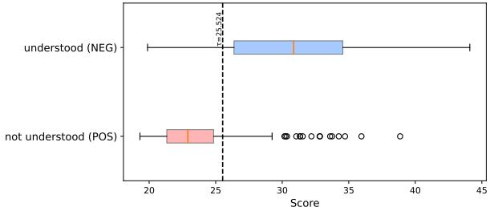  
Overall Average Confidence BA=0.796 (TPR=0.79, TNR=0.80)   
(a) Average token confidence.

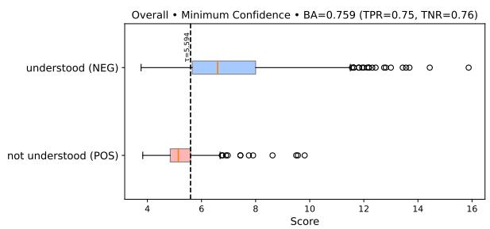

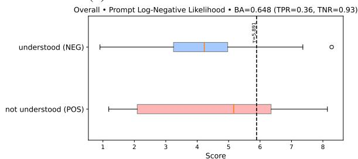  
(b) Minimum token confidence.   
(c) Input negative log-likelihood.   
Figure 10: Distributions of three tokenprobability–based signals — average confidence, minimum confidence, and input negative log-likelihood — measured by Qwen3-4B on the Polymath-Low dataset. Each box plot illustrates how these signals differ between the understood (label $\mathit { \Theta } = \mathit { \Theta } 0$ ) and not understood (label $= 1$ ) classes, and the vertical line indicates the threshold derived from the calibration dataset.

Hidden-state–based prober. We additionally explore a hidden-state–based approach that trains a lightweight classifier (“prober”) on the internal representations of the reasoning model to detect understanding failures. For each sample, we extract the final-layer hidden state of the last token from the model’s reasoning trace under the Base setting. These hidden representations, paired with binary labels (1 for “not understood” and 0 otherwise), constitute the training data for the prober. We aggregate samples across all languages and split the dataset into training and development sets with a 9:1 ratio. The prober is trained to minimize the

weighted binary cross-entropy loss (Eq. E.2) using the AdamW optimizer (Loshchilov and Hutter, 2019):

$$
\mathcal {L} = - \frac {1}{N} \sum_ {i = 1} ^ {N} \left[ w _ {1} y _ {i} \log \hat {p} _ {i} + w _ {0} (1 - y _ {i}) \log (1 - \hat {p} _ {i}) \right]
$$

where $y _ { i } \in \{ 0 , 1 \}$ is the ground-truth label, $\hat { p } _ { i } =$ $p _ { \theta } ( y _ { i } = 1 \mid h _ { i } )$ is the prober’s predicted probability of a sample being not understood, and $h _ { i }$ denotes the hidden representation of the $i$ -th sample.

We perform a grid search over learning rates $\{ 1 0 ^ { - 3 } , 1 0 ^ { - 4 } , 1 0 ^ { - 5 } \}$ and hidden layer sizes $\{ 0 , 3 2 , 1 2 8 , 5 1 2 , d / 2 , d \}$ , where $d$ is the dimensionality of the original hidden state and 0 corresponds to a linear probe. Training is conducted with a batch size of 16 for up to 50 epochs, with early stopping using a patience of five epochs, terminating training if the validation F1 score does not improve within this window. We select the checkpoint that achieves the highest F1 score on the development set for evaluation. The training was conducted on a single RTX 3090 GPU and completed in under one hour in total.

Self-reflection. We further evaluate the selfreflection method, where the reasoning model is prompted to assess whether it has understood the input. For each sample, we reuse the original input and reasoning trace. Then, we remove the endof-thinking token (e.g., </think>) and append a fixed instruction for self-reflection, which allows the model to continue from its prior reasoning and generate a binary self-assessment. Generation is performed using greedy decoding. The instruction for self-reflection is shown below.

# Instruction for self-reflection

Wait, before proceeding, I will reflect on my prior reasoning to assess my overall understanding of the problem. I will respond with <Understandability>: YES or NO (YES if I’m fully confident that I understood the problem correctly, NO otherwise). <Understandability>:

# F Further Details on Selective Translation

Translation. We use GPT-4.1 for translation in all experiments. The prompt used for translating Polymath is shown below:

# Instruction for Polymath

Translate the following mathematical question enclosed within <instruction> and </instruction> into English. The text may contain mathematical notation and LaTeX formatting. You must strictly preserve:

- All LaTeX math and commands EXACTLY as written, including inline math $\$ 4$ , display math $$...$$, \(...\), \[...\], and any $\mathtt { \backslash b e g i n \{ \dots \} . . . \backslash e n d \{ \dots \cdot . . \} }$ environments.   
- All mathematical symbols, variables, numbers, operators, and equation labels.

Provide only the translated instruction without any additional explanation.

Wrap the translated output with <translated> and </translated> tags.

<instruction>{instruction}</instruction>

For MMLU-ProX-Lite, each instance is represented as a JSON object containing a question and multiple-choice options (option_0, option_1, ...). We first construct a payload that includes the question and all available options (0–9). The translator model is then instructed to translate values in this JSON—while preserving the keys, structure, and mathematical content—into English. The prompt used for translating MMLU-ProX-Lite is shown below:

# Instruction for MMLU-ProX-Lite

You are a professional scientific translator.

# TASK

- Translate ONLY the string **values** in the given JSON object into English.   
- Do not change the JSON keys, structure, or order.   
Preserve all numbers, mathematical expressions, symbols, and units exactly.   
- Return ONLY the translated JSON object.

INPUT: {payload}

Selective translation. After translation, the translated input is provided to the reasoning model via the understanding intervention (Section 3.2), where

it corresponds to $x _ { \mathrm { d o m } }$ . We adopt this approach to preserve multilingual consistency, ensuring that the final response remains in the same language as the input. Understanding intervention allows the model to reason without understanding failures while keeping the final response in the input language. We also experimented with a simpler variant that, instead of applying the understanding intervention, directly feeds the translated input to the model along with an additional instruction, “Respond in X,” where X is the input language, but it underperformed in our preliminary experiments. Therefore, we use the understanding-intervention formulation as the default setting for selective translation.

# G More Related Work

To complement the discussion in the main text, this section extends our related work section to include works on multilingual reasoning in conventional large language models and recent advances in multilingual abstention, further positioning our work within the broader literature of multilingual reasoning and abstention.

Multilingual Reasoning. LLMs have made significant advances in multilingual reasoning, but performance gaps remain between high-resource and low-resource languages (Shi et al., 2023). To bridge this gap, Qin et al. (2023) exploited crosslingual prompting to leverage strong reasoning abilities in English, while other works (Chen et al., 2024; Zhu et al., 2024; Ko et al., 2025) improved multilingual reasoning by fine-tuning on data generated through translations. She et al. (2024) and Yang et al. (2025b) exploited the inherent performance imbalance between high- and low-resource languages to construct preference datasets and applied preference optimization. Some prior works introduced external components to boost multilingual reasoning. Yoon et al. (2024) and Huang et al. (2024) merged LLMs with external multilingual models to enhance language understanding, and Shi et al. (2023) and Liu et al. (2025) translated questions posed in low-resource languages into high-resource languages to bypass challenges in language understanding. Among recent works, Ko et al. (2025) report a similar finding that the performance gap in multilingual reasoning largely stems from models’ difficulty in comprehending non-English inputs, rather than their reasoning ability. However, their study focuses on conventional

LLMs and is limited to Korean, whereas we analyze recent reasoning language models across diverse languages. We further show that such comprehension failures can be automatically detected and selectively mitigated through Selective Translation.

Abstention in multilingual setting. Abstention enables language models to refuse to answer when uncertain or inappropriate, reducing errors and hallucinations (Tomani et al., 2024; Wen et al., 2025; Kirichenko et al., 2025). Approaches include tokenlevel confidence estimation (Jiang et al., 2021), selfreflection (Kadavath et al., 2022), probing (Azaria and Mitchell, 2023), and multi-agent collaboration (Feng et al., 2024b), though most have focused on monolingual or English-centric settings. Recently, Feng et al. (2024a) presented the first study of multilingual abstention, proposing multilingual feedback to address cross-lingual knowledge disparities. However, their focus is on identifying whether the model possesses sufficient knowledge in that language. In contrast, our work targets detecting understanding failures, and leverages the results to trigger selective translation.

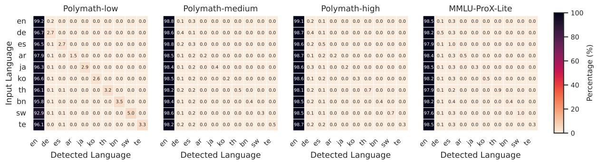  
Language Distribution in Reasoning Trace

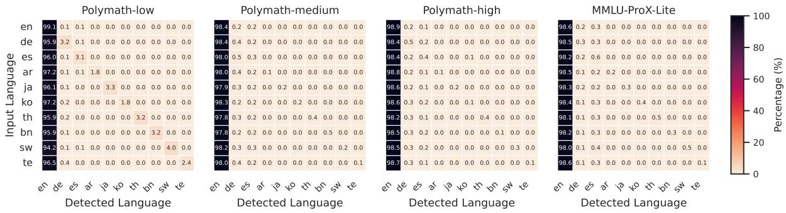  
Language Distribution in Reasoning Trace (w/ Understanding Intervention)

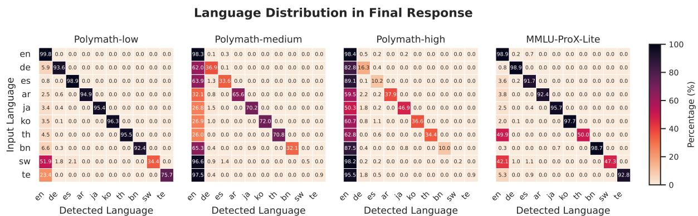

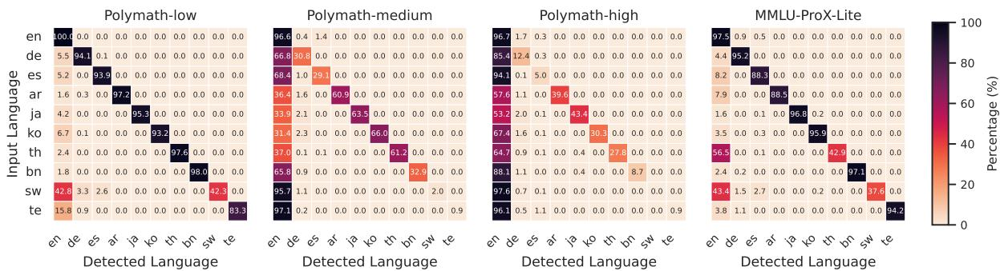  
Language Distribution in Final Response (w/ Understanding Intervention)   
Figure 11: Language distributions of reasoning traces and final responses for Qwen3-4B across Polymath (low/medium/high) and MMLU-ProX-Lite datasets, with and without the understanding intervention.

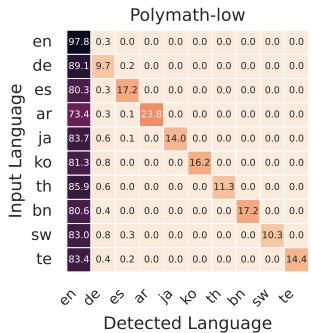  
Language Distribution in Reasoning Trace

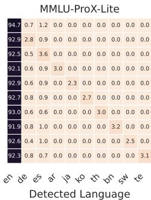

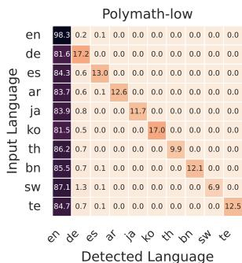  
Language Distribution in Reasoning Trace (w/ Understanding Intervention)

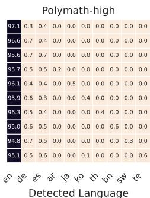

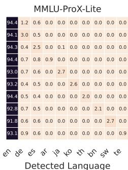

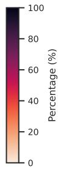

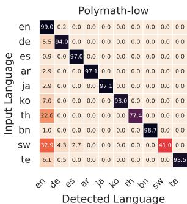  
Language Distribution in Final Response

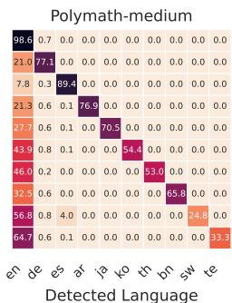

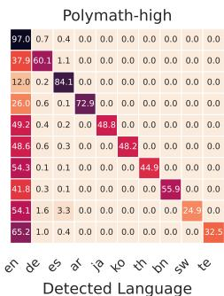

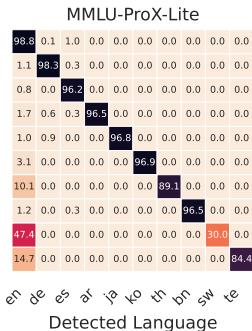

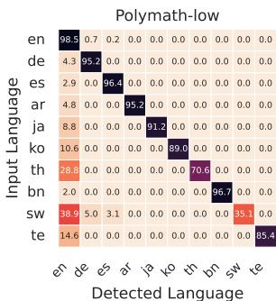  
Language Distribution in Final Response (w/ Understanding Intervention)

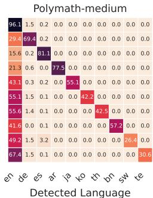

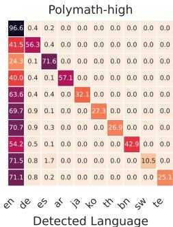

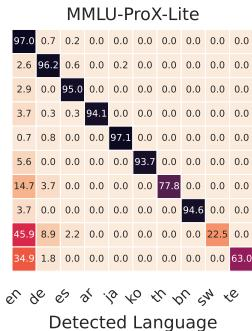

  
Figure 12: Language distributions of reasoning traces and final responses for gpt-oss-20b across Polymath (low/medium/high) and MMLU-ProX-Lite datasets, with and without the understanding intervention.

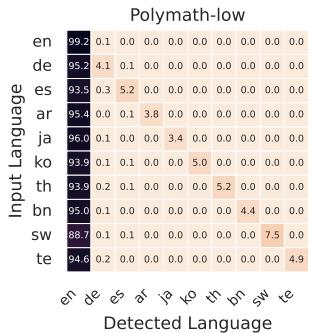  
Language Distribution in Reasoning Trace

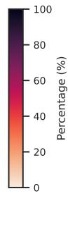

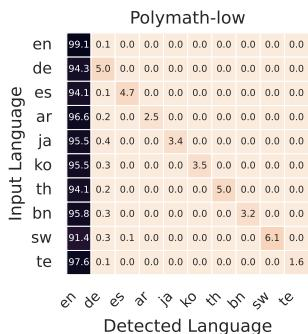  
Language Distribution in Reasoning Trace (w/ Understanding Intervention)

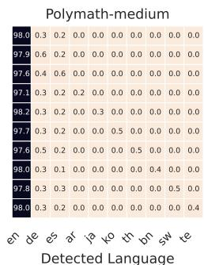

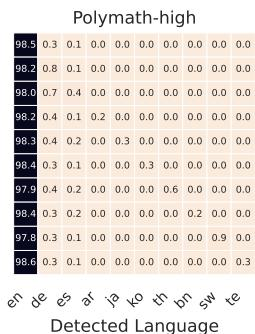

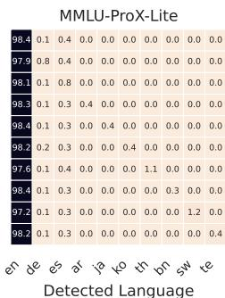

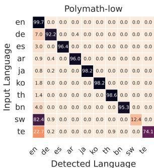  
Language Distribution in Final Response

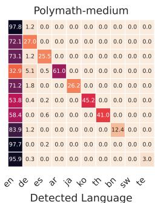

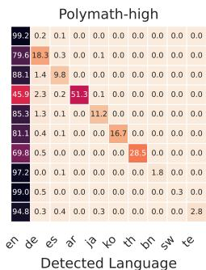

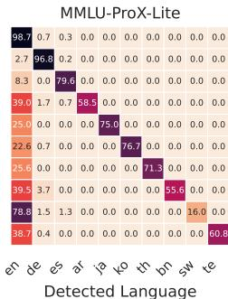

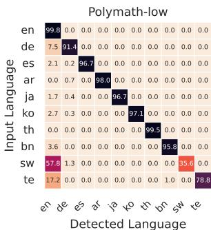  
Language Distribution in Final Response (w/ Understanding Intervention)

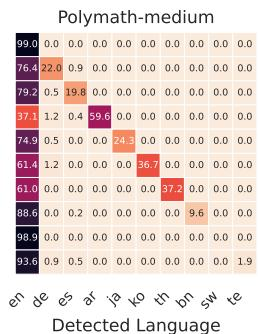

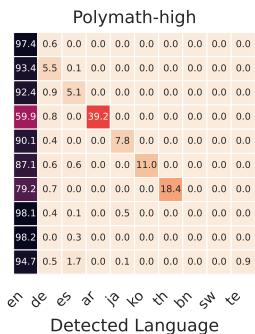

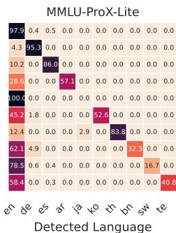

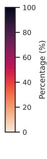  
Figure 13: Language distributions of reasoning traces and final responses for Qwen3-1.7B across Polymath (low/medium/high) and MMLU-ProX-Lite datasets, with and without the understanding intervention.

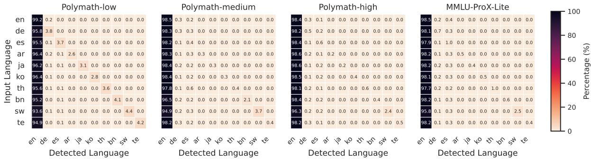  
Language Distribution in Reasoning Trace   
Language Distribution in Reasoning Trace (w/ Understanding Intervention)

  
Language Distribution in Final Response (w/ Understanding Intervention)

  
Figure 14: Language distributions of reasoning traces and final responses for Qwen3-8B across Polymath (low/medium/high) and MMLU-ProX-Lite datasets, with and without the understanding intervention.

  
Language Distribution in Reasoning Trace

  
Language Distribution in Reasoning Trace (w/ Understanding Intervention)

  
Language Distribution in Final Response

  
Language Distribution in Final Response (w/ Understanding Intervention)

  
Figure 15: Language distributions of reasoning traces and final responses for Qwen3-14B across Polymath (low/medium/high) and MMLU-ProX-Lite datasets, with and without the understanding intervention.

  
Figure 16: Language-specific Stage-wise Attribution Analysis for Qwen3-1.7B.

  
Figure 17: Language-specific Stage-wise Attribution Analysis for Qwen3-4B.

  
Figure 18: Language-specific Stage-wise Attribution Analysis for Qwen3-8B.

  
Figure 19: Language-specific Stage-wise Attribution Analysis for Qwen3-14B.

  
Figure 20: Language-specific Stage-wise Attribution Analysis for gpt-oss-20b.