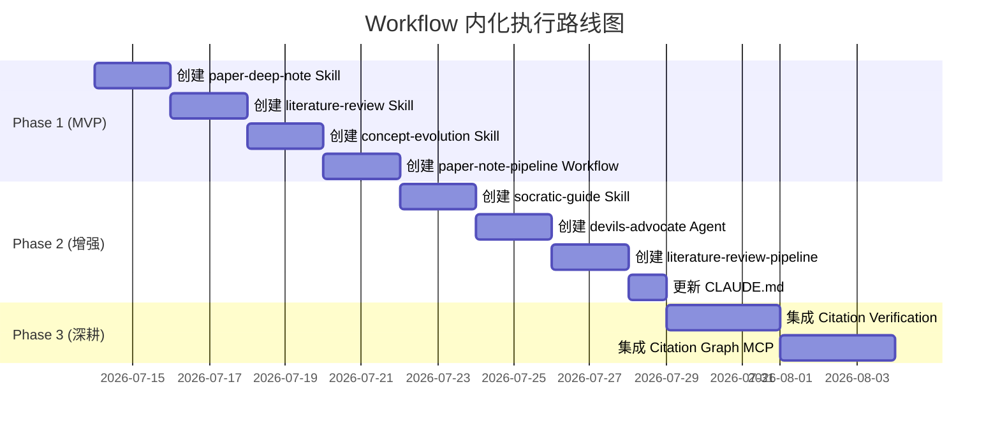

# Workflow 内化计划：从调研文档到可执行工作流

> 设计目标：将 `workflow/` 目录下收集的 LLM Workflow 方法论转化为日常可执行的 Claude Code 技能（Skills）、Agent 定义和 Multica 工作流编排。

---

## 一、现状分析

### 已有的调研资产

| 分类 | 调研来源 | 核心产出 |
|------|---------|---------|
| `paper-understanding/` | academic-skills, PaperNoteWorkflow, PaperSpine | 单篇论文精读方法、三阶段文件契约、12 阶段写作编排 |
| `literature-review/` | ARS (37k⭐), AcademicForge, Research Gap Finder | 13-Agent 深度研究团队架构、8 种操作模式、10 阶段流水线 |
| `concept-evolution/` | Scholar-mcp, Semantic Scholar MCP, CGSum | 引用图分析、概念谱系构建、演进追踪工作流 |
| `pipeline-orchestration/` | ARS Academic Pipeline, PaperSpine | 10/12 阶段编排框架、强制完整性关卡、断点续跑 |

### 当前可执行能力（已有）

- Multica Skills: 8 个平台维护型 skills（autopilots、agents、squads 等）
- 无学术研究相关的 runnable skills
- 无专门的 Agent 定义
- CLAUDE.md 仅作为配置指令存在

### 差距总结

```
调研资产（know-what）→ 可执行工作流（know-how）
         ↓                    ↓
   workflow/*.md       .claude/skills/ + .claude/agents/ + Multica Workflows
         ↓                    ↓
   手动的、概念性的     自动化的、可重复执行的
```

---

## 二、设计原则

### 1. 渐进式内化

不宜一次性将全部 13 个 ARS Agent 搬过来。核心哲学是 **Pick what you need, when you need it**：

```
Phase 1 (MVP): 论文理解 → 文献综述 → 概念演进 → Pipeline
Phase 2 (增强): Socratic 模式 → 对抗验证 → 引用验证
Phase 3 (深耕): 元分析 → 偏倚评估 → 文献监控
```

### 2. 与现有生态对齐

- **Skills**: 封装单一步骤或小流程（如"精读一篇论文"）
- **Agents**: 封装专业角色（如"research_question_agent"）
- **Multica Workflows**: 编排多步骤/多 Agent 流程（使用 `workflow` 工具）
- **CLAUD.md**: 存储长期记忆和配置

### 3. 文件契约

```
.claude/
├── skills/
│   ├── academic-paper-deep-note/     ← 单篇论文精读 Skill
│   ├── academic-literature-review/   ← 文献综述 Skill
│   └── academic-concept-evolution/   ← 概念演进追踪 Skill
├── agents/
│   ├── research-question-agent/      ← 研究问题精炼师
│   ├── bibliography-agent/           ← 文献搜索策展人
│   └── devils-advocate-agent/        ← 对抗挑战者
└── workflows/
    ├── paper-note-workflow.md        ← Multica Workflow 脚本
    └── literature-review-pipeline.md ← Multica Workflow 脚本
```

---

## 三、Phase 1: MVP 可执行工作流

### 3.1 Skill: `academic-paper-deep-note`

**对应**: `paper-understanding/README.md` → 单篇论文精读

**定位**: 接收论文 PDF/URL，输出结构化的中文精读卡

**触发词**: "精读这篇论文", "帮我理解这篇论文", "/deep-note"

**工作流**:

```
用户: 提供论文 PDF/URL
  ↓
Step 1: 判断输入证据级别（全文/局部/摘要/标题）
Step 2: 输出精读卡
  - 研究问题与动机
  - 方法与创新
  - 实验设置、数据集、指标
  - 优势与局限
  - 复现难点
  - 对当前研究的启发
Step 3: 按 CLAUDE.md 规范存储到对应目录
```

**产出**: 结构化总结卡片存入 `./summaries/{topic}/`，更新 INDEX.md

---

### 3.2 Skill: `academic-literature-review`

**对应**: `literature-review/README.md` → 文献综述

**定位**: 多论文综合对比，输出研究全景

**触发词**: "做文献综述", "调研这个领域", "/lit-review"

**模式**（简版 ARS 模式）:

| 模式 | 用途 | 输出 |
|------|------|------|
| quick | 快速领域概览 | 研究简报 (500-1500 字) |
| full | 完整文献综述 | 注释书目 + 综合报告 |
| compare | 论文对比 | WHY/HOW/WHAT 三路扫描 |

**工作流**:

```
用户: 输入主题/论文列表
  ↓
Quick/FULL → 选择模式
  ↓
Phase 1: 文献搜索
  - 多源论文检索
  - 标注开放获取状态
  - APA 格式注释书目
  ↓
Phase 2: 综合
  - 主题综合
  - 矛盾识别
  - Gap 分析
  ↓
Phase 3: 输出
  - 综述报告
  - 关键引用链
  - 研究空白
```

---

### 3.3 Skill: `academic-concept-evolution`

**对应**: `concept-evolution/README.md` → 概念演进追踪

**定位**: 追踪某个学术概念的提出/演进/变体分析

**触发词**: "追踪这个概念", "这个概念是怎么演进的", "/concept-evolve"

**工作流**:

```
用户: 输入概念名称（如 "Flash Attention"）
  ↓
Phase 1: 概念发现
  - 提取概念的定义和形式化描述
  - 识别提出论文
  ↓
Phase 2: 引用链追溯
  - 沿引用链追踪演进路径
  - 标注范式转换点
  ↓
Phase 3: 变体对比
  - 不同变体的异同
  - 性能和适用场景对比
  ↓
Phase 4: 输出
  - 概念演进时间线（Mermaid）
  - 对比表格
  - 关键论文引用链
```

---

### 3.4 Multica Workflow: `paper-note-pipeline`

**对应**: `pipeline-orchestration/README.md` → Pipeline 编排

**定位**: 将 paper-understanding 和 literature-review 组合成端到端流水线

**工作流脚本** (Workflow 工具):

```javascript
export const meta = {
  name: 'paper-note-pipeline',
  description: '端到端论文精读流水线：从输入到总结归档',
  phases: [
    { title: 'Read', detail: '并行精读多篇论文' },
    { title: 'Summarize', detail: '生成结构化总结' },
    { title: 'Archive', detail: '归档到知识库' },
  ],
}

// Phase 1: 并行精读（每篇论文独立 agent）
phase('Read')
const papers = await parallel(args.papers.map(p => () =>
  agent(`精读论文: ${p.title}\nPDF: ${p.path}\n\n${PAPER_DEEP_NOTE_PROMPT}`, {
    schema: PAPER_NOTE_SCHEMA,
    phase: 'Read',
  })
))

// Phase 2: 综合总结
phase('Summarize')
const synthesis = await agent(
  `综合以下 ${papers.length} 篇论文的精读结果:\n${papers.filter(Boolean).map(JSON.stringify).join('\n---\n')}\n\n${SYNTHESIS_PROMPT}`,
  { schema: SYNTHESIS_SCHEMA, phase: 'Summarize' }
)

// Phase 3: 归档
phase('Archive')
const archiveResult = await agent(
  `将以下总结归档到知识库:\n${JSON.stringify(synthesis)}\n\n${ARCHIVE_PROMPT}`,
  { schema: ARCHIVE_SCHEMA, phase: 'Archive' }
)

return synthesis
```

---

## 四、Phase 2: 增强能力

### 4.1 Skill: `academic-socratic-guide`

**对应**: ARS Socratic Mentor Agent

**定位**: 苏格拉底式引导研究，不直接给答案

**触发词**: "帮我理清这个问题", "引导我做研究", "/socratic"

**流程**: 5 层提问模型（概念澄清 → 假设形成 → 证据评估 → 综合 → 反思）

---

### 4.2 Agent: `devils-advocate`

**对应**: ARS Devil's Advocate Agent（3 检查点协议）

**定位**: 对研究发现进行对抗性验证

**触发条件**: 在 literature-review 和 paper-note 完成后自动调用

**核心协议**:

- 反驳评分 1-5
- 评分 >= 4 才允许让步
- 禁止连续让步
- 让步率 > 50% 时暂停自查

---

### 4.3 Multica Workflow: `literature-review-pipeline`

整合 ARS 的 10 阶段流水线和 PaperSpine 的 12 阶段编排：

| 阶段 | 内容 | 检查点 | 可跳过 |
|------|------|--------|--------|
| 1. SCOPING | RQ+方法设计 | DA CP1 | 否 |
| 2. SEARCH | 文献搜索 | — | 否 |
| 3. VERIFY | 来源验证 | — | 否 |
| 4. SYNTHESIS | 综合+对比 | DA CP2 | 否 |
| 5. COMPOSE | 报告撰写 | Integrity | 否 |
| 6. REVIEW | 评审 | DA CP3 | 否 |
| 7. REVISE | 修订 (最多2轮) | — | 是 |
| 8. FINALIZE | 输出 | — | 否 |

---

## 五、Phase 3: 深耕能力

| 能力 | 来源 | 优先级 | 说明 |
|------|------|--------|------|
| Meta Analysis Skill | ARS meta_analysis_agent | Low | 仅在系统综述场景需要 |
| RoB Assessment Skill | ARS risk_of_bias_agent | Low | 系统综述偏倚评估 |
| Citation Verification Agent | ARS source_verification_agent | Medium | 集成 Semantic Scholar/OpenAlex/Crossref 三索引验证 |
| Monitoring Agent | ARS monitoring_agent | Low | 后续文献监控（撤回检测） |
| Citation Graph MCP | Scholar-mcp | Medium | 引用图分析 MCP 集成 |
| Cross-paper Tension | ARS v3.9.2+ | Medium | 跨论文矛盾自动检测 |

---

## 六、CLAUDE.md 更新方案

将以下内容纳入 CLAUDE.md，使日常对话自动加载这些工作流记忆：

```markdown
# 可用学术工作流

## Skills
- /deep-note — 单篇论文精读
- /lit-review — 文献综述（quick/full/compare 模式）
- /concept-evolve — 概念演进追踪
- /socratic — 苏格拉底式研究引导

## Agents
- devils-advocate — 研究发现对抗验证
- bibliography — 文献搜索与策展

## Workflows
- paper-note-pipeline — 端到端论文精读流水线
- literature-review-pipeline — 文献综述全流程
```

---

## 七、执行路线图



### 优先级排序标准

1. **使用频率**: 用户日常操作越频繁的越优先（精读 > 综述 > 概念演进）
2. **自动化收益**: 手工做越痛苦的越优先
3. **依赖关系**: 基础能力先于增强能力
4. **验证闭环**: 每个 Phase 完成后可立即验证使用

---

## 八、验证标准

### Phase 1 验收

- [ ] 输入论文 URL 后，deep-note skill 自动输出结构化精读卡
- [ ] 输入研究主题后，lit-review skill 输出带引用链的文献综述
- [ ] 输入概念名称后，concept-evolve skill 输出演进时间线和对比表
- [ ] paper-note-pipeline workflow 可一次处理多篇论文

### Phase 2 验收

- [ ] socratic-guide 进行 5 层逐步引导，不直接给答案
- [ ] devils-advocate 在精读/综述完成后自动触发对抗验证
- [ ] literature-review-pipeline 覆盖 8 个阶段

### Phase 3 验收

- [ ] 引用验证自动检查 Semantic Scholar + OpenAlex + Crossref
- [ ] 引用图集成，支持交互式探索
- [ ] 跨论文矛盾检测

---

## 九、风险与缓解

| 风险 | 影响 | 概率 | 缓解 |
|------|------|------|------|
| Skills 过大超过 context 限制 | 无法加载 | 中 | 每个 Skill 只聚焦一个流程，大流程拆成多步 |
| Workflow 工具限制 | Agent 数受限 | 低 | 用 pipeline() 代替 parallel() 减少并发数 |
| 用户需求变化 | 优先级需要调整 | 高 | 保持模块化设计，先做最通用的 |
| ARS System Prompt 过于复杂 | 不适合精简场景 | 中 | 按需裁剪，保留核心约束 |

---

> **下一步**: 从 Phase 1 开始，依次创建对应的 Skill，并在每次完成后验证可用性。